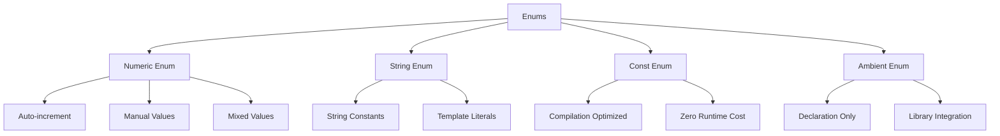

# TypeScript Enums 枚举最佳实践

## 🎯 Enum 类型系统概览

### 📊 枚举类型分类



## 🔧 基础枚举类型

### 💡 数值枚举详解

```typescript
// 1. 自动递增枚举
enum Direction {
    Up,    // 0
    Down,  // 1
    Left,  // 2
    Right  // 3
}

// 2. 手动指定值
enum HttpStatusCode {
    OK = 200,
    NotUnauthorized = 401,
    NotFound = 404,
    InternalServerError = 500
}

// 3. 混合值枚举（不推荐，维护困难）
enum MixedEnum {
    No = 0,
    Yes = "yes",
    Unknown = "?"
}

// 4. 枚举的实际类型
type DirectionType = Direction;
type UpValue = Direction.Up;  // 类型：Direction.Up (值：0)

// 5. 枚举反向映射
enum UserRole {
    Guest = 0,
    User = 1,
    Admin = 2,
    SuperAdmin = 3
}

// 自动生成反向映射
console.log(UserRole[0]);  // "Guest"
console.log(UserRole["User"]);  // 1
console.log(UserRole.User);     // 1
```

### 🎪 字符串枚举最佳实践

```typescript
// 1. 基础字符串枚举
enum UserStatus {
    ACTIVE = 'active',
    INACTIVE = 'inactive',
    PENDING = 'pending',
    SUSPENDED = 'suspended'
}

// 2. API 状态枚举
enum ApiResponseStatus {
    SUCCESS = 'success',
    ERROR = 'error',
    LOADING = 'loading',
    IDLE = 'idle'
}

// 3. 字符串枚举组合
enum Permission {
    READ = 'read',
    WRITE = 'write',
    DELETE = 'delete',
    ADMIN = 'admin'
}

enum Role {
    VIEWER = 'viewer',
    EDITOR = 'editor',
    MANAGER = 'manager',
    ADMIN = 'admin'
}

// 4. 基于模板字面量的枚举
enum LogLevel {
    DEBUG = 'debug',
    INFO = 'info',
    WARN = 'warn',
    ERROR = 'error'
}

enum ApiVersion {
    V1 = 'v1',
    V2 = 'v2',
    V3 = 'v3'
}

type LogMessage = `[${LogLevel}] ${string}`;
type ApiEndpoint = `/api/${ApiVersion}/${string}`;
```

## 🚀 高级枚举模式

### 🔄 常量枚举优化

```typescript
// 1. Const Enum 基础
const enum Environment {
    Development = 'development',
    Staging = 'staging',
    Production = 'production'
}

// 编译时内联，零运行时开销
const isDevelopment = Environment.Development === 'development';

// 2. Const Enum 数值枚举
const enum Size {
    Small,   // 0
    Medium,  // 1
    Large    // 2
}

// 编译后直接替换为数值
const mediumSize = Size.Medium; // 编译后: const mediumSize = 1;

// 3. Const Enum 的限制
const enum Direction {
    Up = 'up',
    Down = 'down'
}

// ❌ 错误：const enum 不能包含反向查找
// const upDirection = Direction['up']; // Error

// 4. 合理的 Const Enum 使用
const enum HttpMethod {
    GET = 'GET',
    POST = 'POST',
    PUT = 'PUT',
    DELETE = 'DELETE'
}

class ApiClient {
    async request<T>(
        method: HttpMethod,
        url: string,
        data?: any
    ): Promise<T> {
        // 使用 const enum，零开销
        const methodStr = method; // 直接是字符串值
        
        const response = await fetch(url, {
            method: methodStr,
            body: data ? JSON.stringify(data) : undefined,
            headers: {
                'Content-Type': 'application/json'
            }
        });
        
        return response.json();
    }
}
```

### 🎯 联合类型替代枚举

```typescript
// 1. 字符串联合类型
type UserStatus = 'active' | 'inactive' | 'pending' | 'signed' | 'signed';

// 优点：轻量级，易理解
// 缺点：没有命名空间，IDE 支持较弱

// 2. 常量对象模式
const UserStatus = {
    ACTIVE: 'active',
    INACTIVE: 'inactive',
    PENDING: 'pending',
    SUSPENDED: 'suspended'
} as const;

type UserStatusType = typeof UserStatus[keyof typeof UserStatus];

// 3. 枚举 vs 联合类型对比
enum EnumVariant {
    VARIANT_A = 'variant_a',
    VARIANT_B = 'variant_b'
}

type UnionVariant = 'variant_a' | 'variant_b';

// 功能对比
function withEnum(status: EnumVariant): void {
    // 支持反向查找
    console.log(EnumVariant.VARIANT_A);  // "variant_a"
    console.log(EnumVariant['variant_a']); // undefined
    
    // 类型检查
    switch (status) {
        case EnumVariant.VARIANT_A:
            console.log('A');
            break;
        case EnumVariant.VARIANT_B:
            console.log('B');
            break;
    }
}

function withUnion(status: UnionVariant): void {
    // 不支持反向查找
    console.log(status);
    
    // 类型检查
    switch (status) {
        case 'variant_a':
            console.log('A');
            break;
        case 'variant_b':
            console.log('B');
            break;
    }
}

// 4. 选择建议
// ✅ 使用 Enum 当需要:
//   - 反向查找
//   - 复杂的枚举值映射
//   - 运行时动态查询
//   - API 向后兼容

// ✅ 使用 Union Types 当需要:
//   - 最轻量级解决方案
//   - 不需要反向映射
//   - Tree-shaking 友好
//   - 简单的字符串/数字值
```

## 🎭 枚举实际应用场景

### 🏗️ 状态管理枚举

```typescript
// 1. 应用状态枚举
enum AppState {
    INITIALIZING = 'initializing',
    LOADING = 'loading',
    READY = 'ready',
    ERROR = 'error',
    OFFLINE = 'offline'
}

class ApplicationState {
    private state: AppState = AppState.INITIALIZING;
    
    get currentState(): AppState {
        return this.state;
    }
    
    transitionTo(newState: AppState): void {
        if (this.isValidTransition(this.state, newState)) {
            this.state = newState;
            this.notifyStateChange(newState);
        }
    }
    
    private isValidTransition(from: AppState, to: AppState): boolean {
        const validTransitions: Record<AppState, AppState[]> = {
            [AppState.INITIALIZING]: [AppState.LOADING, AppState.ERROR],
            [AppState.LOADING]: [AppState.READY, AppState.ERROR, AppState.OFFLINE],
            [AppState.READY]: [AppState.OFFLINE, AppState.ERROR],
            [AppState.ERROR]: [AppState.LOADING, AppState.OFFLINE],
            [AppState.OFFLINE]: [AppState.INITIALIZING]
        };
        
        return validTransitions[from].includes(to);
    }
    
    private notifyStateChange(state: AppState): void {
        console.log(`State changed to: ${state}`);
    }
}

// 2. API 请求状态
enum RequestStatus {
    IDLE = 'idle',
    PENDING = 'pending',
    SUCCESS = 'success',
    FAILURE = 'failure'
}

interface RequestState<T> {
    status: RequestStatus;
    data?: T;
    error?: string;
}

class ApiStateManager<T> {
    private state: RequestState<T> = {
        status: RequestStatus.IDLE
    };
    
    async executeRequest(requestFn: () => Promise<T>): Promise<T> {
        this.setState({ 
            status: RequestStatus.PENDING,
            data: undefined,
            error: undefined
        });
        
        try {
            const data = await requestFn();
            this.setState({
                status: RequestStatus.SUCCESS,
                data,
                error: undefined
            });
            return data;
        } catch (error) {
            this.setState({
                status: RequestStatus.FAILURE,
                data: undefined,
                error: error instanceof Error ? error.message : 'Unknown error'
            });
            throw error;
        }
    }
    
    private setState(newState: Partial<RequestState<T>>): void {
        this.state = { ...this.state, ...newState };
    }
    
    get(): RequestState<T> {
        return { ...this.state };
    }
    
    reset(): void {
        this.state = { status: RequestStatus.IDLE };
    }
}
```

### 🔄 权限系统枚举

```typescript
// 1. 权限枚举系统
enum Permission {
    READ = 'read',
    WRITE = 'write',
    DELETE = 'delete',
    EXECUTE = 'execute'

// 2. 角色枚举
enum Role {
    GUEST = 'guest',
    USER = 'user',
    MODERATOR = 'moderator',
    ADMIN = 'admin',
    SUPER_ADMIN = 'super_admin'
}

// 3. 权限管理类
class PermissionManager {
    private rolePermissions: Record<Role, Permission[]> = {
        [Role.GUEST]: [],
        [Role.USER]: [Permission.READ],
        [Role.MODERATOR]: [Permission.READ, Permission.WRITE],
        [Role.ADMIN]: [Permission.READ, Permission.WRITE, Permission.DELETE],
        [Role.SUPER_ADMIN]: [
            Permission.READ, 
            Permission.WRITE, 
            Permission.DELETE, 
            Permission.EXECUTE
        ]
    };
    
    hasPermission(userRole: Role, permission: Permission): boolean {
        const permissions = this.rolePermissions[userRole];
        return permissions.includes(permission);
    }
    
    getPermissions(userRole: Role): Permission[] {
        return [...this.rolePermissions[userRole]];
    }
    
    canAccess(userRole: Role, requiredPermissions: Permission[]): Permission[] {
        const userPermissions = this.getPermissions(userRole);
        return requiredPermissions.filter(p => userPermissions.includes(p));
    }
    
    requireAccess(userRole: Role, permission: Permission): boolean {
        if (!this.hasPermission(userRole, permission)) {
            throw new Error(`Access denied: Role ${userRole} needs ${permission} permission`);
        }
        return true;
    }
}

// 4. 修饰器模式应用
function RequirePermission(permission: Permission) {
    return function(target: any, propertyKey: string, descriptor: PropertyDescriptor) {
        const originalMethod = descriptor.value;
        
        descriptor.value = function(...args: any) {
            const userRole = this.getCurrentUserRole();
            
            if (permissionManager.hasPermission(userRole, permission)) {
                return originalMethod.apply(this, args);
            } else {
                throw new Error(`Insufficient permissions for ${propertyKey}`);
            }
        };
        
        return descriptor;
    };
}

class SecureService {
    private permissionManager = new PermissionManager();
    
    @RequirePermission(Permission.READ)
    getSecretData(): string {
        return "Secret data";
    }
    
    @RequirePermission(Permission.WRITE)
    updateData(newData: string): void {
        console.log('Data updated:', newData);
    }
    
    @RequirePermission(Permission.DELETE)
    deleteData(id: string): void {
        console.log('Data deleted:', id);
    }
    
    private getCurrentUserRole(): Role {
        // 实现角色获取逻辑
        return Role.USER;
    }
}
```

## 📚 高级枚举技巧

### 🎯 动态枚举扩展

```typescript
// 1. 枚举工厂模式
function createEnum<T extends Record<string, string | number>>(
    enumObject: T
): T {
    return enumObject;
}

const CustomColors = createEnum({
    PRIMARY: '#007bff',
    SECONDARY: '#6c757d',
    SUCCESS: '#28a745',
    DANGER: '#dc3545'
});

type CustomColorType = typeof CustomColors[keyof typeof CustomColors];

// 2. 枚举验证器
function isValidEnumValue<T extends Record<string, string | number>>(
    enumObject: T,
    value: any
): value is T[keyof T] {
    return Object.values(enumObject).includes(value);
}

function isValidColor(color: any): color is CustomColorType {
    return isValidEnumValue(CustomColors, color);
}

// 3. 枚举遍历器
function* enumEntries<T extends Record<string, string | number>>(
    enumObject: T
): Generator<[keyof T, T[keyof T]]> {
    for (const [key, value] of Object.entries(enumObject)) {
        yield [key as keyof T, value];
    }
}

function* enumValues<T extends Record<string, string | number>>(
    enumObject: T
): Generator<T[keyof T]> {
    for (const value of Object.values(enumObject)) {
        yield value;
    }
}

// 使用枚举遍历器
const CustomStatus = createEnum({
    PENDING: 'pending',
    APPROVED: 'approved',
    REJECTED: 'rejected'
});

for (const [key, value] of enumEntries(CustomStatus)) {
    console.log(`Key: ${key}, Value: ${value}`);
}

// 4. 枚举转换器
class EnumConverter<T extends Record<string, string | number>> {
    constructor(private enumObject: T) {}
    
    toString(): string {
        return Object.entries(this.enumObject)
            .map(([key, value]) => `${key}=${value}`)
            .join(', ');
    }
    
    toArray(): Array<{ key: keyof T; value: T[keyof T] }> {
        return Object.entries(this.enumObject).map(([key, value]) => ({
            key: key as keyof T,
            value: value as T[keyof T]
        }));
    }
    
    toMap(): Map<keyof T, T[keyof T]> {
        return new Map(Object.entries(this.enumObject) as [keyof T, T[keyof T]][]);
    }
}

// 5. 实际应用
const converter = new EnumConverter(CustomStatus);
console.log(converter.toString());
console.log(converter.toArray());
console.log(converter.toMap());
```

## 📋 最佳实践总结

### 🎯 选择和使用建议

```typescript
// 1. Enum 使用场景决策树

// ✅ 适合使用 Enum:
// - 需要反向查找
// - 大量的相关常量值
// - API 契约定义
// - 状态机实现
// - 配置选项

enum ConfigOption {
    TIMEOUT = 'timeout',
    RETRIES = 'retries',
    CACHE_SIZE = 'cache_size'
}

// ✅ 适合使用 Union Types:
// - 简单的字符串/数字值
// - Tree-shaking 要求
// - 函数式编程风格
// - 模板字面量类型

type Theme = 'light' | 'dark' | 'auto';

// ✅ 适合使用 const 对象:
// - 键值对映射需要
// - IDE 更好的提示
// - 命名空间需求
// - 复杂值类型

const ApiEndpoints = {
    USERS: '/api/users',
    POSTS: '/api/posts',
    COMMENTS: '/api/comments'
} as const;

// 2. 性能考虑
// Const Enum > Union Types > Regular Enum > Const Object

// 3. 维护性考虑
enum Priority {
    LOW = 1,
    MEDIUM = 2,
    HIGH = 3,
    CRITICAL = 4
}

// 易于添加新值
enum ExtendedPriority extends Priority {
    URGENT = 5  // ❌ TypeScript 不支持枚举继承
}

// 替代方案：联合类型重新定义
type ExtendedPriorityType = Priority | 'urgent';

// 4. 国际化支持
enum Messages {
    WELCOME = 'messages.welcome',
    GOODBYE = 'messages.goodbye',
    ERROR_OCCURRED = 'messages.error_occurred'
}

interface TranslationService {
    get(key: Messages): string;
}

// 使用
const messages: Record<Messages, string> = {
    [Messages.WELCOME]: 'Welcome!',
    [Messages.GOODBYE]: 'Goodbye!',
    [Messages.ERROR_OCCURRED]: 'An error occurred!'
};
```

### 🔗 相关深入学习

- [[01-Type-System入门]] - 类型系统基础
- [[05-Namespaces命名空间设计]] - 命名空间模式
- [[02-Type-vs-Interface深度对比]] - 类型设计对比

---
*💡 枚举是 TypeScript 的重要特性，合理选择和使用枚举能提高代码的可读性和维护性，但也要注意性能影响和最佳实践*
