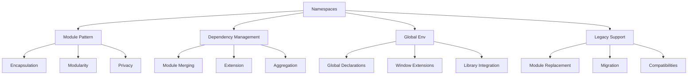

# TypeScript Namespaces 命名空间设计

## 🎯 Namespace 类型系统概览

### 📊 命名空间分类



## 🔧 基础命名空间设计

### 💡 Namespace 语法与结构

```typescript
// 1. 基础命名空间定义
namespace MyApp {
    // 只在命名空间内可见
    const privateConstant = 'private value';
    
    // 公开接口
    export interface User {
        id: string;
        name: string;
        email: string;
    }
    
    // 公开类
    export class UserService {
        private users: User[] = [];
        
        addUser(user: User): void {
            this.users.push(user);
        }
        
        getUsers(): User[] {
            return [...this.users];
        }
        
        // 内部工具方法
        private validateUser(user: User): boolean {
            return !!(user.id && user.name && user.email);
        }
    }
    
    // 公开函数
    export function createUser(data: Partial<User>): User {
        return {
            id: crypto.randomUUID(),
            name: data.name || '',
            email: data.email || ''
        };
    }
    
    // 公开枚举
    export enum UserRole {
        ADMIN = 'admin',
        USER = 'user',
        GUEST = 'guest'
    }
}

// 2. 嵌套命名空间
namespace MyApp.Auth {
    export interface AuthConfig {
        secretKey: string;
        tokenExpiry: number;
        refreshThreshold: number;
    }
    
    export class TokenManager {
        private config: AuthConfig;
        
        constructor(config: AuthConfig) {
            this.config = config;
        }
        
        generateToken(userId: string): string {
            // Token 生成逻辑
            return `token_${userId}_${Date.now()}`;
        }
        
        validateToken(token: string): boolean {
            // Token 验证逻辑
            return token.startsWith('token_');
        }
    }
    
    export namespace Encryption {
        export function hashPassword(password: string): string {
            // 密码hash逻辑
            return `hashed_${password}`;
        }
        
        export function compareHashedPassword(
            password: string, 
            hashed: string
        ): boolean {
            return hashPassword(password) === hashed;
        }
    }
}

// 3. 使用命名空间
const userService = new MyApp.UserService();
const user = MyApp.createUser({
    name: 'Alice',
    email: 'alice@example.com'
});

const tokenManager = new MyApp.Auth.TokenManager({
    secretKey: 'secret',
    tokenExpiry: 3600,
    refreshThreshold: 300
});

const token = tokenManager.generateToken(user.id);
```

### 🎪 命名空间合并模式

```typescript
// 1. 接口合并
namespace Utils {
    export interface Config {
        apiUrl: string;
        timeout: number;
    }
    
    export function configure(config: Config): void {
        console.log('Configuring with:', config);
    }
}

// 合并扩展
namespace Utils {
    export interface Config {
        debug?: boolean;
        cache?: boolean;
    }
    
    export function reset(): void {
        console.log('Resetting configuration');
    }
}

// 合并结果:
// interface Config {
//     apiUrl: string;
//     timeout: number;
//     debug?: boolean;
//     cache?: boolean;
// }

// 2. 函数重载合并
namespace ApiClient {
    export interface Response<T> {
        data: T;
        status: number;
        message: string;
    }
    
    export function request(url: string): Promise<Response<any>>;
    export function request(url: string, data: any): Promise<Response<any>>;
    export function request(
        url: string, 
        data?: any
    ): Promise<Response<any>> {
        // 实现逻辑
        return Promise.resolve({
            data: data || null,
            status: 200,
            message: 'Success'
        });
    }
}

// 3. 枚举合并
namespace Environments {
    export enum Stage {
        Development = 'dev',
        Testing = 'test',
        Production = 'prod'
    }
}

namespace Environments {
    export enum AdditionalStage {
        Staging = 'staging',
        Preview = 'preview'
    }
    
    export type AllStages = Stage | AdditionalStage;
}
```

## 🚀 高级命名空间模式

### 🔄 模块替代方案

```typescript
// 1. 内部模块结构
namespace DataProcessor {
    // 内部接口（不导出）
    interface ProcessConfig {
        algorithm: string;
        parameters: Record<string, any>;
    }
    
    interface ProcessResult {
        success: boolean;
        data: any;
        errors?: any[];
        metadata: {
            processedAt: Date;
            processTime: number;
        };
    }
    
    // 公开API
    export interface DataProcessor {
        process(data: any[]): Promise<ProcessResult>;
    }
    
    export class BatchProcessor implements DataProcessor {
        private config: ProcessConfig;
        
        constructor(
            algorithm: string = 'default',
            parameters: Record<string, any> = {}
        ) {
            this.config = { algorithm, parameters };
        }
        
        async process(data: any[]): Promise<ProcessResult> {
            const startTime = Date.now();
            
            try {
                const result = await this.executeAlgorithm(data);
                
                return {
                    success: true,
                    data: result,
                    metadata: {
                        processedAt: new Date(),
                        processTime: Date.now() - startTime
                    }
                };
            } catch (error) {
                return {
                    success: false,
                    data: null,
                    errors: [error],
                    metadata: {
                        processedAt: new Date(),
                        processTime: Date.now() - startTime
                    }
                };
            }
        }
        
        private async executeAlgorithm(data: any[]): Promise<any> {
            // 算法执行逻辑
            switch (this.config.algorithm) {
                case 'sort':
                    return [...data].sort();
                case 'filter':
                    return data.filter(item => item != null);
                default:
                    return data;
            }
        }
    }
    
    // 工具函数
    export function createProcessor(
        type: 'sort' | 'filter' | 'map' = 'sort'
    ): DataProcessor {
        return new BatchProcessor(type);
    }
}

// 2. 使用命名空间
const processor = DataProcessor.createProcessor('sort');
const result = await processor.process([3, 1, 4, 1, 5]);

// 3. 命名空间扩展
namespace DataProcessor.Validators {
    export interface Validator<T> {
        validate(data: T): boolean;
        errorMessage: string;
    }
    
    export class EmailValidator implements Validator<string> {
        errorMessage = 'Invalid email format';
        
        validate(email: string): boolean {
            return /^[^\s@]+@[^\s@]+\.[^\s@]+$/.test(email);
        }
    }
    
    export class PhoneValidator implements Validator<string> {
        errorMessage = 'Invalid phone format';
        
        validate(phone: string): boolean {
            return /^\+?[\d\s\-\(\)]+$/.test(phone);
        }
    }
    
    export function createValidator<T>(
        validatorClass: new () => Validator<T>
    ): Validator<T> {
        return new validatorClass();
    }
}
```

### 🎯 全局声明模式

```typescript
// 1. 全局扩展
declare global {
    namespace NodeJS {
        interface ProcessEnv {
            NODE_ENV?: 'development' | 'production' | 'test';
            PORT?: string;
            DATABASE_URL?: string;
            REDIS_URL?: string;
            API_CLIENT_KEY?: string;
        }
    }
}

// 2. Window 对象扩展
declare global {
    interface Window {
        myApp: {
            version: string;
            config: {
                apiUrl: string;
                debug: boolean;
            };
            utils: {
                formatDate: (date: Date) => string;
                formatCurrency: (amount: number) => string;
            };
        };
    }
}

// 使用扩展的类型
export function initializeApp(): void {
    // 检查环境变量类型安全
    if (process.env.NODE_ENV === 'development') {
        console.log('Running in development mode');
    }
    
    // 扩展示例
    window.myApp = {
        version: '1.0.0',
        config: {
            apiUrl: process.env.API_CLIENT_KEY || 'https://api.default.com',
            debug: process.env.NODE_ENV === 'development'
        },
        utils: {
            formatDate: (date: Date) => date.toISOString(),
            formatCurrency: (amount: number) => `$${amount.toFixed(2)}`
        }
    };
}

// 3. 库声明示例
declare namespace ThirdPartyLib {
    interface Config {
        apiKey: string;
        baseUrl: string;
        timeout?: number;
    }
    
    interface UserResponse {
        id: number;
        name: string;
        email: string;
    }
    
    class Client {
        constructor(config: Config);
        getUser(id: number): Promise<UserResponse>;
        createUser(data: Partial<UserResponse>): Promise<UserResponse>;
    }
}

export function getThirdPartyClient(): ThirdPartyLib.Client {
    return new ThirdPartyLib.Client({
        apiKey: 'your-api-key',
        baseUrl: 'https://third-party-api.com',
        timeout: 5000
    });
}
```

## 🎭 现代模块替代

### 🔄 ES6 模块转换策略

```typescript
// 1. 命名空间到模块的迁移

// 旧代码 (命名空间)
namespace LegacyApp {
    export class UserService {
        constructor(private db: Database) {}
        
        async getUser(id: string): Promise<User> {
            return this.db.query('SELECT * FROM users WHERE id = ?', [id]);
        }
    }
}

// 新代码 (ES6 模块)
// user.service.ts
export class UserService {
    constructor(private db: Database) {}
    
    async getUser(id: string): Promise<User> {
        return this.db.query('SELECT * FROM users WHERE id = ?', [id]);
    }
}

// 2. Barrell 导出模式
// services/index.ts
export { UserService } from './user.service';
export { ProductService } from './product.service';
export { OrderService } from './order.service';

// 3. 命名空间作为模块的替代
// config/index.ts
export interface DatabaseConfig {
    host: string;
    port: number;
    database: string;
    user?: string;
    password?: string;
}

export interface ApiConfig {
    baseUrl: string;
    timeout: number;
    retries: number;
}

export interface Config {
    database: DatabaseConfig;
    api: ApiConfig;
    debug: boolean;
}

// utils/index.ts
export function formatDate(date: Date): string {
    return date.toISOString().split('T')[0];
}

export function formatCurrency(amount: number): string {
    return new Intl.NumberFormat('en-US', {
        style: 'currency',
        currency: 'USD'
    }).format(amount);
}

// 使用时
import { Config, ApiConfig } from './config';
import { formatDate, formatCurrency } from './utils';

const config: Config = {
    database: { host: 'localhost', port: 5432, database: 'myapp' },
    api: { baseUrl: 'https://api.example.com', timeout: 5000, retries: 3 },
    debug: process.env.NODE_ENV === 'development'
};
```

### 🔧 命名空间工具函数

```typescript
// 命名空间工具类
namespace NamespaceUtils {
    export interface ComponentInfo {
        name: string;
        version: string;
        dependencies: string[];
    }
    
    export class ComponentRegistry {
        private components = new Map<string, ComponentInfo>();
        
        register(component: ComponentInfo): void {
            this.components.set(component.name, component);
        }
        
        get(name: string): ComponentInfo | undefined {
            return this.components.get(name);
        }
        
        list(): ComponentInfo[] {
            return Array.from(this.components.values());
        }
        
        getDependencies(name: string): string[] {
            const component = this.get(name);
            if (!component) {
                throw new Error(`Component ${name} not found`);
            }
            
            const dependencies: string[] = [];
            const visited = new Set<string>();
            
            const collectDeps = (componentName: string) => {
                if (visited.has(componentName)) return;
                
                visited.add(componentName);
                const comp = this.get(componentName);
                
                if (comp) {
                    comp.dependencies.forEach(dep => {
                        dependencies.push(dep);
                        collectDeps(dep);
                    });
                }
            };
            
            collectDeps(name);
            return dependencies;
        }
        
        // 拓扑排序获取加载顺序
        getLoadOrder(): string[] {
            const completed = new Set<string>();
            const loading = new Set<string>();
            const order: string[] = [];
            
            const visit = (componentName: string) => {
                if (completed.has(componentName)) return;
                if (loading.has(componentName)) {
                    throw new Error(`Circular dependency detected: ${componentName}`);
                }
                
                loading.add(componentName);
                const component = this.get(componentName);
                
                if (component) {
                    component.dependencies.forEach(visit);
                }
                
                loading.delete(componentName);
                completed.add(componentName);
                order.push(componentName);
            };
            
            for (const name of this.components.keys()) {
                visit(name);
            }
            
            return order;
        }
    }
    
    // 工厂函数
    export function createComponent(
        name: string,
        version: string = '1.0.0',
        dependencies: string[] = []
    ): ComponentInfo {
        return {
            name,
            version,
            dependencies: [...dependencies]
        };
    }
}

// 使用组件注册表
const registry = new NamespaceUtils.ComponentRegistry();

registry.register(NamespaceUtils.createComponent('auth-service', '2.1.0'));
registry.register(NamespaceUtils.createComponent('user-service', '1.5.0', ['auth-service']));
registry.register(NamespaceUtils.createComponent('api-gateway', '3.0.0', ['auth-service', 'user-service']));

console.log('Load order:', registry.getLoadOrder());
```

## 📚 最佳实践总结

### 🎯 命名空间使用建议

```typescript
// 1. 适使用场景
// ✅ 适合使用 Namespace:
// - 全局库声明
// - 代码迁移过渡
// - 第三方库集成
// - 简单内部模块

namespace SimpleUtils {
    export function formatText(text: string): string {
        return text.trim().toLowerCase();
    }
    
    export function validateEmail(email: string): boolean {
        return /^[^\s@]+@[^\s@]+\.[^\s@]+$/.test(email);
    }
}

// ❌ 避免过度使用 Namespace:
// - 大型应用框架
// - 现代项目新代码
// - 复杂的依赖管理
// - 团队协作环境

// 2. 性能考虑
// Namespace 会污染全局命名空间，在生产环境中要谨慎使用

// 3. 迁移策略
// 从 Namespace 到 ES6 模块的迁移路径：
// 1. 保持命名空间结构
// 2. 逐步拆分到独立文件
// 3. 使用 barrel export
// 4. 添加明确的模块边界
// 5. 移除命名空间包装

export namespace MigrationExample {
    export interface Config {
        key: string;
        value: string;
    }
    
    export function processConfig(config: Config): void {
        console.log('Processing:', config);
    }
}

// 迁移后
export interface Config {
    key: string;
    value: string;
}

export function processConfig(config: Config): void {
    console.log('Processing:', config);
}
```

### 🔗 相关深入学习

- [[04-Type-vs-Interface深度对比]] - 类型设计对比
- [[04-Enums枚举最佳实践]] - 枚举应用模式
- [[01-Module-Resolution策略]] - 模块解析机制

---
*💡 Namespace 主要用于向后兼容和全局声明，现代项目应优先使用 ES6 模块，但了解命名空间对理解 TypeScript 生态系统很重要*
