# TypeScript Industry Application 行业应用深度分析

## 🎯 TypeScript 跨行业应用全景

### 📊 行业应用矩阵图

```mermaid
graph TD
    A[TypeScript Industry Applications] --> B[Technology Companies]
    A --> C[Financial Services]
    A --> D[Healthcare & Pharma]
    A --> E[E-commerce & Retail]
    A --> F[Education & E-learning]
    A --> G[Manufacturing & IoT]
    A --> H[Entertainment & Media]
    A --> I[Government & Public Sector]
    A --> J[Energy & Utilities]
    
    B --> B1[Tech Platforms]
    B --> B2[SaaS Products]
    B --> B3[Developer Tools]
    B --> B4[Cloud Services]
    
    C --> C1[FinTech Platforms]
    C --> C2[Digital Banking]
    C --> C3[Trading Systems]
    C --> C4[Risk Management]
    
    D --> D1[Electronic Health Records]
    D --> D2[Telemedicine]
    D --> D3[Medical Devices]
    D --> D4[Drug Discovery]
    
    E --> E1[Online Marketplaces]
    E --> E2[Retail Platforms]
    E --> E3[Payment Systems]
    E --> E4[Logistics Tools]
    
    F --> F1[Learning Management Systems]
    F --> F2[Educational Platforms]
    F --> F3[Assessment Tools]
    F --> F4[Student Information Systems]
    
    G --> G1[Industrial Automation]
    G --> G2[Supply Chain Management]
    G --> G3[Quality Control Systems]
    G --> G4[Asset Management]
    
    H --> H1[Content Management]
    H --> H2[Streaming Platforms]
    H --> H3[Gaming Applications]
    H --> H4[Digital Publishing]
    
    I --> I1[Civic Services]
    I --> I2[Public Portals]
    I --> I3[Digital Identity]
    I --> I4[Administrative Systems]
    
    J --> J1[Smart Grid Systems]
    J --> J2[Energy Management]
    J --> J3[Utility Billing]
    J --> J4[Environmental Monitoring]
```



## 🔧 Industry Application Intelligence Engine

### 💡 Cross-Industry Application Analysis

```typescript
// Industry-Specific Application Intelligence System
namespace IndustryApplicationAnalysis {
    // Industry Application Framework
    interface IndustryApplicationFramework {
        industryAnalyzer: IndustryRequirementAnalyzer;
        technologyMapper: TechnologyMappingEngine;
        solutionDesigner: SolutionDesignerEngine;
        competitiveAnalyzer: CompetitiveAnalysisEngine;
        roiCalculator: ROIcalculatorEngine;
    }
    
    // Comprehensive Industry Intelligence Engine
    class TypeScriptIndustryIntelligenceEngine {
        private industryRepository: IndustryDataRepository;
        private technologyMappingEngine: TechnologyMappingEngine;
        private solutionDesigner: SolutionDesignEngineer;
        private competitiveAnalyzer: CompetitiveAnalysisEngine;
        private trendAnalyzer: IndustryTrendAnalyzer;
        
        constructor(config: IndustryIntelligenceConfiguration) {
            this.industryRepository = new IndustryDataRepository(config.dataSources);
            this.technologyMappingEngine = new TechnologyMappingEngine(config.techMapping);
            this.solutionDesigner = new SolutionDesignEngineer(config.solutionDesign);
            this.competitiveAnalyzer = new CompetitiveAnalysisEngine(config.competitiveness);
            this.trendAnalyzer = new IndustryTrendAnalyzer(config.trendAnalysis);
        }
        
        // Generate Comprehensive Industry Analysis
        async generateIndustryAnalysis(
            target: IndustryTarget
        ): Promise<ComprehensiveIndustryAnalysisReport> {
            // Collect Industry-Specific Data
            const industryData = await this.collectIndustryData(target);
            
            // Analyze TypeScript Applications Within Industry
            const typeScriptUsageAnalysis = await this.analyzeTypeScriptUsageWithinIndustry(target);
            
            // Map Business Requirements to Technical Solutions
            const requirementsMapping: BusinessTechnicalMapping = await this.mapBusinessRequirementsToTechnicalSolutions(target);
            
            // Evaluate Competitive Landscape
            const competitiveEvaluation: CompetitiveLandscapeEvaluation = await this.evaluateCompetitiveLandscape(target);
            
            // Identify Implementation Challenges
            const implementationChallenges: IndustryImplementationChallenge = await this.identifyImplementationChallenges(target);
            
            // Calculate ROI & Business Value
            const valueProposition: ValuePropositionAnalysis = await this.calculateROIAndBusinessValue(target);
            
            // Generate Comprehensive Report
            const industryAnalysis: ComprehensiveIndustryAnalysisReport = {
                industryOverview: industryData.overview,
                typeScriptMarketPenetration: typeScriptUsageAnalysis.marketPenetration,
                marketOpportunities: typeScriptUsageAnalysis.marketOpportunities,
                
                technologyRequirements: {
                    requiredFeatures: requirementsMapping.requiredTechnicalFeatures,
                    architecturalConstraints: requirementsMapping.architecturalConstraints,
                    complianceNeeds: requirementsMapping.complianceNeeds,
                    scalabilityNeeds: requirementsMapping.scalabilityNeeds,
                    performanceNeeds: requirementsMapping.performanceNeeds
                },
                
                competitiveLandscape: competitiveEvaluation,
                implementationChallenges: implementationChallenges,
                valueProposition: valueProposition,
                
                solutionsCtlRecommendations: this.generateTailoredSolutionsRecommendations(target),
                customizationsNeeded: this.defineCustomizationsNeeded(target),
                migrationStrategy: this.createMigrationStrategy(target),
                
                successFactors: this.identifyIndustrySuccessFactors(target),
                riskAnalysis: this.performRiskAssessment(target),
                timelineEstimation: this.generateImplementationTimeline(target),
                
                monitoringAndOptimizationStrategy: this.createMonitoringAndOptimizationStrategy(targe),
                ongoingMaintainancePlan: this.createOngoingMaintainancePlan(target),
                expansionOpportunities: this.generateExpansionOpportunities(target)
            };
            
            return industryAnalysis;
        }
        
        // Industry-Specific Application Intelligence Data
        private industryApplicationData: ComprehensiveIndustryApplicationDatabase = {
            // Technology Companies
            technologyCompanies: {
                overview: {
                    size: 'Very Large',
                    typeScriptAdoption: '95%',
                    marketPenetration: 'Ubiquitous',
                    avgProjectScale: 'Enterprise',
                    complexity: 'Very High',
                    timeToImplement: '3-6 months',
                    avgInvestment: '$500K-$5M'
                },
                
                marketApplications: {
                    saasProducts: {
                        typescriptBenefits: [
                            'Type safety ensures high-quality user experience',
                            'Compile-time error detection prevents production issues',
                            'Excellent IDE support for developer productivity',
                            'Strong ecosystem with comprehensive libraries'
                        ],
                        architecturalApproaches: [
                            'Microservices architecture with TypeScript throughout',
                            'Progressive enhancement strategies for web applications',
                            'Highly modular component architecture',
                            'Advanced state management with Redux-Toolkit',
                            'Smart caching strategies for performance optimization'
                        ],
                        
                        successMetrics: {
                            averageDevelopmentSpeed: '40% faster',
                            reductionBugs: '60% fewer production bugs',
                            developerSatisfaction: '85% satisfaction rating',
                            avgTimeToMarketReduction: '30%',
                            maintenanceCostReduction: '45%'
                        },
                        
                        implementationChallenges: [
                            'Performance optimization for large-scale applications',
                            'Integration challenges with legacy systems',
                            'Tooling complexity in large teams',
                            'Ensuring consistency in large codebases'
                        ]
                    },
                    
                    developerTools: {
                        typescriptBenefits: [
                            'Perfect for building development tools',
                            'Excellent IntelliSense and autocompletion',
                            'Type definitions for various APIs',
                            'Strong ecosystem of development libraries'
                        ]
                    },
                    
                    enterpriseSoftware: {
                        typescriptBenefits: [
                            'Enterprise-grade type safety',
                            'Excellent scalability characteristics',
                            'Comprehensive error handling capabilities',
                            'Robust architectural patterns support'
                        ]
                    }
                },
                
                technicalRequirements: {
                    highAvailability: '99.99%',
                    scalability: 'Auto-scaling capabilities',
                    securityLevel: 'Enterprise-grade security',
                    integrationNeeds: 'Multiple third-party integrations',
                    complianceRequirements: 'SOC2, GDPR compliance'
                },
                
                commonUseCases: {
                  primaryUseCases: [
                      'Modern Single Page Applications',
                      'Real-time collaboration platforms',
                      'Content management systems',
                      'API management platforms',
                      'Analytics dashboards with real-time data',
                      'Developer productivity tools',
                      'Comprehensive admin panels',
                      'Customer relationship management systems'
                    ],
                    
                    emergingUseCases: [
                        'AI/ML integration platforms',
                        'IoT device management interfaces',
                        'Blockchain applications',
                        'Advanced visualization tools',
                        'Collaborative development environments'
                    ]
                }
            },
            
            // Financial Services Industry
            financialServices: {
                overview: {
                    size: 'Large', 
                    typescriptAdoption: '78%',
                    marketPenetration: 'High',
                    avgProjectScale: 'Enterprise',
                    complexity: 'Very High',
                    timeToImplement: '6-12 months',
                    avgInvestment: '$1M-$10M'
                },
                
                industrySpecifics: {
                    stringentRegulations: {
                        complianceStandards: ['PCI-DSS', 'SOX', 'Basel III', 'MiFID II', 'FinTech regulations'],
                        auditRequirements: 'Comprehensive audit trails every transaction',
                        dataProtectionRequirements: 'Highly sensitive financial data',
                        securityConstraints: 'Bank-level security mandatory'
                    },
                    
                    reliabilityNeeds: {
                        uptimeRequirements: '99.9% minimum',
                        performanceNeeds: 'Sub-millisecond response times',
                        transactionIntegrity: 'Absolute transaction integrity',
                        errorTolerance: 'Zero tolerance for data corruption'
                    },
                    
                    existingSystems: {
                        legacyIntegrationChallenges: 'Extensive legacy system integration',
                        mainframeCompatibility: 'Integration with existing mainframes',
                        dataFormatCompatibility: 'Complex data format conversions',
                        migrationStrategyRequirements: 'Large-scale migration strategy'
                    }
                },
                
                applications: {
                    digitalBanking: {
                        requirements: [
                            'Real-time transaction processing',
                            'Multi-factor authentication systems',
                            'Risk assessment in real-time',
                            'Comprehensive compliance reporting'
                        ],
                        typescriptBenefits: [
                            'Type safety ensures financial accuracy',
                            'Excellent scalability for growth',
                            'Robust error handling',
                            'Security-first architectural patterns'
                        ]
                    },
                    
                    tradingPlatforms: {
                        requirements: [
                            'Ultra-low latency requirements',
                            'High-frequency trading capabilities',
                            'Real-time market data processing',
                            'Risk management systems'
                        ]
                    },
                    
                    riskManagementSystems: {
                        requirements: [
                            'Complex calculations',
                            'Regulatory reporting',
                            'Scenario analysis capabilities',
                            'Real-time risk monitoring'
                        ]
                    }
                }
            },
            
            // Healthcare Industry
            healthcare: {
                overview: {
                    size: 'Large',
                    typescriptAdoption: '72%',
                    marketPenetration: 'High',
                    avgProjectScale: 'Enterprise',
                    complexity: 'Very High',
                    timeToImplement: '12-18 months',
                    avgInvestment: '$2M-$15M'
                },
                
                industrySpecifics: {
                    strictRegulations: {
                        complianceStandards: ['HIPAA', 'HL7', 'DICOM', 'SOFTWARE'],
                        medicalDeviceRegulation: 'FDA approval for medical devices',
                        privacyProtectionRequirements: 'Patients privacy paramount',
                        interoperabilityStandards: 'Healthcare system interoperability crucial'
                    },
                    
                    specializedNeeds: {
                        clinicalWorkflowIntegration: 'Integration with clinical workflows',
                        medicalDeviceIntegration: 'Integration with medical devices',
                        patientDataManagement: 'Comprehensive patient data management',
                        clinicalDecisionSupportSystems: 'Clinical decision support systems'
                    }
                },
                
                applications: {
                    electronicHealthRecords: {
                        coreRequirements: [
                            'HIPAA compliance',
                            'Patient data security',
                            'Clinical workflow integration',
                            'Interoperability with other systems'
                        ]
                    },
                    
                    telemedicinePlatforms: {
                        coreRequirements: [
                            'Real-time communication',
                            'Patient portal integration',
                            'Prescription management',
                            'Medical device integration'
                        ]
                    },
                    
                    medicalDeviceSoftware: {
                        coreRequirements: [
                            'FDA regulatory compliance',
                            'Real-time monitoring',
                            'Safety-critical functions',
                            'Integration with medical devices'
                        ]
                    }
                }
            },
                
            // E-commerce Industry
            ecommerce: {
                overview: {
                    size: 'Very Large',
                    typescriptAdoption: '88%',
                    marketPenetration: 'High',
                    avgProjectScale: 'Enterprise',
                    complexity: 'High',
                    timeToImplement: '4-8 months',
                    avgInvestment: '$500K-$5M'
                },
                
                businessCharacteristics: {
                    seasonalScaling: 'High seasonal usage demands',
                    globalMarket: 'International expansion needs',
                    customerExperienceFocus: 'Customer experience crucial',
                    performancePressure: 'Performance directly affects revenues'
                },
                
                applications: {
                    onlineMarketplaces: {
                        requirements: [
                            'Multi-vendor management',
                            'Advanced search functionality',
                            'Recommendation engines',
                            'Payment processing capabilities'
                        ]
                    },
                    
                    retailPlatforms: {
                        requirements: [
                            'Inventory management systems',
                            'Order processing systems',
                            'Customer relationship management',
                            'Analytics dashboard'
                        ]
                    },
                    
                    paymentSystems: {
                        requirements: [
                            'PCI compliance',
                            'Fraud detection capabilities',
                            'Multi-currency support',
                            'Real-time transaction processing'
                        ]
                    }
                }
            }
        };
        
        // Generate Tailored Solutions Recommendations
        private generateTailoredSolutionsRecommendations(
            target: IndustryTarget
        ): TailoredSolutionsRecommendations {
            const industryData = this.industryApplicationData[target.industry];
            
            return {
                architecturalRecommendations: {
                    preferredArchitecture: this.selectArchitecture(target),
                    microservicesApproach: this.designMicroservices(target),
                    monorepoStrategy: this.developMonorepoStrategy(target),
                    scalabilityPattern: this.choseScalabilityPattern(target)
                },
                
                technicalStackRecommendations: {
                    frontendTechnologies: this.selectFrontendTechnologies(target),
                    backendTechnologies: this.selectBackendTechnologies(target),
                    databasesOptions: this.selectDatabases(target),
                    deploymentPlatforms: this.selectDeploymentPlatforms(target)
                },
                
                developmentApproaches: {
                    developmentMethodology: this.recommendDevelopmentMethodology(target),
                    qualityAssuranceStrategy: this.defineQualityAssuranceStrategy(target),
                    testingStrategies: this.designTestingStrategies(target),
                    codeQualityStandards: this.defineCodeQualityStandards(target)
                },
                
                implementationConsiderations: {
                    migrationStrategy: this.develpMigrationStrategy(target),
                    riskManagement: this.identifyRiskManagement(target),
                    changeManagementApproach: this.createChangeManagementApproach(target),
                    costOptimizationStrategies: this.developCostOptimizationStrategies(target)
                },
                
                ongoingManageanceRecommendations: {
                    performanceOptimization: this.createPerformanceOptimizationPlan(target),
                    securityMaintainedStrategy: this.createSecurityMaintainStrategy(target),
                    scalabilityPreparedness: this.createScalabilityPreparedness(target),
                    evolutionReadiness: this.createEvolutionReadiness(target)
                }
            };
        }
        
        // Success Factors Analysis For Each Industry
        private identifyIndustrySuccessFactors(
            target: IndustryTarget
        ): IndustrySuccessFactors {
            const industryData = this.industryApplicationData[target.industry];
            
            return {
                technicalSuccessFactors: [
                    'Type safety reduces errors in critical business logic',
                    'Strong typing aids in maintaining large codebases',
                    'Excellent IDE support improves developer productivity',
                    'Active ecosystem provides pre-built solutions'
                ],
                
                businessSuccessFactors:. [
                    'Faster time to market vs JavaScript',
                    'Reduced maintenance costs',
                    'Better developer retention',
                    'Improved software reliability and uptime'
                ],
                
                organizationalSuccessFactors: [
                    'Mandatory team training program',
                    'Clear coding standards and guidelines',
                    'Continuous code review processes',
                    'Regular architecture review sessions'
                ],
                
                marketCompetitiveFactors: [
                    'Superior performance enables competitive advantage',
                    'Innovation acceleration through rapid development',
                    'Ability to attract top talent',
                    'Differentiation through superior user experience'
                ]
            };
        }
        
        // Risk Analysis for Industry Implementation
        private performRiskAssessment(
            target: IndustryTarget
        ): ImplementationRiskAssessment {
            const industryData = this.industryApplicationData[target.industry];
            
            return {
                technicalRisks: [
                    {
                        risk: 'Performance optimization complexity',
                        severity: 'MEDIUM',
                        probability: 'MEDIUM',
                        mitigationStrategy: 'Regular performance profiling and optimization'
                    },
                    {
                        risk: 'Legacy system integration challenges',
                        severity: 'HIGH', 
                        probability: 'MEDIUM',
                        mitigationStrategy: 'Careful migration planning and testing'
                    },
                    {
                        risk: 'Team training requirement',
                        severity: 'MEDIUM',
                        probability: 'HIGH',
                        mitigationStrategy: 'Comprehensive training program and onboarding'
                    }
                ],
                
                businessRisks: [
                    {
                        risk: 'Initial implementation delays',
                        severity: 'MEDIUM',
                        probability: 'LOW',
                        mitigationStrategy: 'Phased implementation and regular milestones'
                    },
                    {
                        risk: 'ROI realization takes longer than expected',
                        severity: 'LOW',
                        probability: 'LOW',
                        mitigationStrategy: 'Regular ROI tracking and measurement'
                    }
                ],
                
                operationalRisks: [
                    {
                        risk: 'Maintenance complexity',
                        severity: 'MEDIUM',
                        probability: 'MEDIUM',
                        mitizationStrategy: 'Strong documentation and knowledge management'
                    },
                    {
                        risk: 'Vendor dependency',
                        severity: 'LOW',
                        probability: 'LOW',
                        mitigationStrategy: 'Open source alternatives evaluation'
                    }
                ]
            };
        }
        
        // Supporting Types
        interface ComprehensiveIndustryAnalysisReport {
            industryOverview: IndustryOverview;
            typescriptMarketPenetration: MarketPenetrationAnalysis;
            marketOpportunities: MarketOpportunity[];
            
            technologyRequirements: TechnologyRequirements;
            competitiveLandscape: CompetitiveLandscapeEvaluation;
            implementationChallenges: IndustryImplementationChallenge;
            valueProposition: ValuePropositionAnalysis;
            
            solutionsTailoredRecommendations: TailoredSolutionsRecommendations;
            customizationsNeeded: CustomizationRequirement[];
            migrationStrategy: MigrationStrategyRecommendations;
            
            successFactors: IndustrySuccessFactors;
            riskAnalysis: ImplementationRiskAssessment;
            timelineEstimation: ImplementationTimelineEstimation;
            
            monitoringAndOptimizationStrategy: MonitoringAndOptimizationStrategy;
            ongoingMaintainancePlan: OngoingMaintainancePlan;
            expansionOpportunities: ExpansionOpportunity[];
        }
        
        interface IndustryOverview {
            size: IndustrySize;
            typeScriptAdoption: string;
            marketPenetration: MarkeTpenetrationLevel;
            avgProjectScale: ProjectScale;
            complexity: ComplexityLevel;
            timeToImplement: string;
            avgInvestment: string;
        }
        
        interface TechnologyRequirements {
            requiredFeatures: RequiredFeature[];
            architecturalConstraints: ArchitecturalConstraint[];
            complianceNeeds: ComplianceRequirement[];
            scalabilityNeeds: ScalabilityNeeds;
            performanceNeeds: PerformanceNeeds;
        }
        
        interface TailoredSolutionsRecommendations {
            architecturalRecommendations: ArchitecturalRecommendations;
            technicalStackRecommendations: TechnicalStackRecommendations;
            developmentApproaches: DevelopmentApproaches;
            implementationConsiderations: ImplementationConsiderations;
            ongoingManagementRecommendations: OngoingManagementRecommendations;
        }
        
        interface IndustrySuccessFactors {
            technicalSuccessFactors: string[];
            businessSuccessFactors: string[];
            organizationalSuccessFactors: string[];
            marketCompetitiveFactors: string[];
        }
        
        type IndustryTarget = 'TECHNOLOGY' | 'FINANCIAL_SERVICES' | 'HEALTHCARE' | 'ECOMMERCE' | 'EDUCATION' | 'MANUFACTURING' | 'ENTERTAINMENT' | 'GOVERNMENT' | 'ENERGY';
        type IndustrySize = 'SMALL' | 'MEDIUM' | 'LARGE' | 'VERY_LARGE';
        type MarketPenetrationLevel = 'LOW' | 'MEDIUM' | 'HIGH' | 'UBIQUITOUS';
        type ComplexityLevel = 'LOW' | 'MEDIUM' | 'HIGH' | 'VERY_HIGH';
        type RiskSeverity = 'LOW' | 'MEDIUM' | 'HIGH' | 'CRITICAL';
    }
}
```

### 🔗 相关深入学习

- [[02-Job-Requirements市场需求]] - 市场需求与行业应用
- [[03-Skill-Assessment技能评估]] - 行业技能评估体系
- [[04-Career-Progression职业进阶]] - 行业职业发展

---
*💡 TypeScript在不同行业中的应用展现了其灵活性和适应性，了解行业特定需求能够更好地设计技术解决方案*