# TypeScript Job Requirements 市场需求分析

## 🎯 TypeScript 就业市场全景

### 📊 市场需求分析框架

```mermaid
graph TD
    A[TypeScript Job Market Analysis] --> B[Market Size Analysis]
    A --> C[Skill Requirements]
    A --> D[Salary Analysis]
    A --> E[Industry Distribution]
    A --> F[Location Analysis]
    A --> G[Trend Analysis]
    
    B --> B1[Market Volume]
    B --> B2[Growth Rate]
    B --> B3[Market Maturity]
    B --> B4[Competitive Landscape]
    
    C --> C1[Core Technical Skills]
    C --> C2[Framework Expertise]
    C --> C3[Soft Skills]
    C --> C4[Domain Knowledge]
    
    D --> D1[Salary Ranges]
    D --> D2[Experience Level Compensation]
    D --> D3[Location Premiums]
    D --> D4[Industry Salary Differences]
    
    E --> E1[Technology Companies]
    E --> E2[Financial Services]
    E --> E3[Healthcare]
    E --> E4[E-commerce]
    
    F --> F1[Region Markets]
    F --> F2[Remote Opportunities]
    F --> F3[Cost of Living Adjustments]
    F --> F4[Cultural Factors]
    
    G --> G1[Skills Evolution]
    G --> G2[Role Development]
    G --> G3[Market Predictions]
    G --> G4[Investment Trends]
```



## 🔧 智能职位分析引擎

### 💡 市场分析与职位匹配系统

```typescript
// Comprehensive Job Market Analysis System
namespace JobMarketAnalysis {
    // Market Analysis Framework
    interface JobMarketFramework {
        marketSizeAnalysis: MarketSizeAnalyzer;
        skillAnalyzer: SkillsRequirementAnalyzer;
        salaryAnalyzer: SalaryAnalyzer;
        trendAnalyzer: MarketTrendAnalyzer;
        locationAnalyzer: LocationAnalysisTool;
        industryAnalyzer: IndustryAnalyzer;
    }
    
    // TypeScript Job Market Intelligence Engine
    class TypeScriptJobMarketIntelligenceEngine {
        private jobDataCollector: JobDataCollector;
        private skillExtractor: SkillExtractor;
        private salaryCalculator: SalaryCalculator;
        private trendAnalyzer: TrendAnalyzer;
        private competitiveAnalyzer: CompetitiveAnalyzer;
        
        constructor(config: JobMarketConfiguration) {
            this.jobDataCollector = new JobDataCollector(config.apiKeys);
            this.skillExtractor = new SkillExtractor(config.nlpConfig);
            this.salaryCalculator = new SalaryCalculator(config.components);
            this.trendAnalyzer = new TrendAnalyzer(config.timeSeries);
            this.competitiveAnalyzer = new CompetitiveAnalyzer(config.comparisonConfig);
        }
        
        // Market Size Analysis
        async analyzeMarketSize(): Promise<MarketSizeReport> {
            const jobData = await this.collectJobData();
            const marketMetrics = await this.calculateMarketMetrics(jobData);
            
            return {
                totalPositions: this.enumerateTotalPositions(jobData),
                monthlyGrowth: this.calculateMonthlyGrowth(jobData),
                marketMaturity: this.evaluateMarketMaturity(jobData),
                demandTrends: this.predictDemandTrends(jobData),
                competitive: this.analyzeCompetitiveEnvironment(data),
                marketSegments: this.segmentMarket(jobData),
                opportunitiesDistribution: this.analyzeOpportunitiesDistribution(jobData),
                marketForecast: this.generateMarketForecast(jobData)
            };
        }
        
        // Skills Requirements Analysis
        async analyzeSkillsRequirements(): Promise<SkillsRequirementReport> {
            const jobPostingsData = await this.jobDataCollector.getAllJobPostings();
            const skillsMapping = await this.extractAllSkills(jobPostingsData);
            
            return {
                coreSkills: this.categorizeCoreSkills(skillsMapping),
                trendingSkills: this.identifyTrendingSkills(skillsMapping),
                emergingSkills: this.identifyEmergingSkills(skillsMapping),
                decliningSkills: this.identifyDecliningSkills(skillsMapping),
                frameworkPreferences: this.analyzeFrameworkPreferences(skillsMapping),
                softSkills: this.categorizeSoftSkills(skillsMapping),
                domainKnowledge: this.analyzeDomainKnowledge(skillsMapping),
                certificationRequirements: this.extractCertifications(skillsMapping),
                skillCombinations: this.analyzeSkillsCombinations(skillsMapping),
                learningPaths: this.generateLearningPaths(skillsMapping)
            };
        }
        
        // Salary Analysis Engine
        async analyzeSalaryMarket(): Promise<SalaryAnalysisReport> {
            const salaryData = await this.collectSalaryData();
            const marketPositioning = await this.calculateMarketPositioning(salaryData);
            
            return {
                salaryDistribution: this.distributeSalaries(salaryData),
                experienceLevel: this.analyzeExperienceLevelCompensation(salaryData),
                locationAdjustments: this.calculateLocationAdjustments(salaryData),
                industryComparisons: this.compareIndustrySalaries(salaryData),
                skillImpact: this.analyzeSkillImpact(salaryData),
                roleVariations: this.categorizeRoleVariations(salaryData),
                equityOfferings: this.analyzeEquityOfferings(salaryData),
                benefitsAnalysis: this.analyzeBenefits(salaryData),
                negotiationLevers: this.identifyNegotiationLevers(salaryData),
                futureProjections: this.projectSalaryTrends(salaryData)
            };
        }
        
        // Industry Distribution Analysis
        async analyzeIndustryDistribution(): Promise<IndustryDistributionReport> {
            const industryData = await this.collectIndustrySpecificData();
            
            return {
                techCompanies: {
                    prevalence: this.calculatePrevalenceIndustry('technology'),
                    averageSalary: this.calculateAverageSalary('technology'),
                    commonRoles: this.identifyCommonRoles('technology'),
                    skillDemands: this.analyzeSkillDemands('technology'),
                    preferredExperience: this.analyzeExperiencePreferences('technology')
                },
                
                financialServices: {
                    prevalence: this.calculatePrevalenceIndustry('financial'),
                    averageSalary: this.calculateAverageSalary('financial'),
                    commonRoles: this.identifyCommonRoles('financial'),
                    skillDemands: this.analyzeSkillDemands('financial'),
                    regulatoryConsiderations: this.extractRegulatoryRequirements('financial')
                },
                
                healthcare: {
                    prevelence: this.calculatePrevalenceIndustry('healthcare'),
                    averageSalary: this.calculateAverageSalary('healthcare'),
                    securityRequirements: this.extractSecurityRequirements('healthcare'),
                    complianceRequirements: this.extractComplianceRequirements('healthcare'),
                    innovationFactors: this.analyzeInnovationFactors('healthcare')
                },
                
                eCommerce: {
                    prevalence: this.calculatePrevalenceIndustry('ecommerce'),
                    averageSalary: this.calculateAverageSalary('ecommerce'),
                    scaleRequirements: this.analyzeScaleRequirements('ecommerce'),
                    userExperienceFocus: this.extractUXRequirements('ecommerce'),
                    performanceRequirements: this.analyzePerformanceRequirements('ecommerce')
                }
            };
        }
        
        // Location Market Analysis
        async analyzeLocationMarkets(): Promise<LocationMarketReport> {
            const locationData = await this.collectLocationData();
            
            return {
                metropolitanAreas: {
                    sanFrancisco: this.analyzeLocationMarket('San Francisco'),
                    newYork: this.analyzeLocationMarket('New York'),
                    seattle: this.analyzeLocationMarket('Seattle'),
                    austin: this.analyzeLocationMarket('Austin'),
                    boston: this.analyzeLocationMarket('Boston')
                },
                
                remoteOpportunities: {
                    prevalence: this.calculateRemotePrevalence(),
                    salaryComparison: this.compareRemoteSalary(),
                    competitiveFactors: this.analyzeRemoteCompetition(),
                    skillRequirements: this.analyzeRemoteSkillRequirements()
                },
                
                emergingMarkets: {
                    denver: this.analyzeLocationMarket('Denver'),
                    atlanta: this.analyzeLocationMarket('Atlanta'),
                    miami: this.analyzeLocationMarket('Miami'),
                    portla: this.analyzeLocationMarket('Portland'),
                    nashville: this.analyzeLocationMarket('Nashville')
                },
                
                internationalMarkets: {
                    london: this.analyzeLocationMarket('London'),
                    berlin: this.analyzeLocationMarket('Berlin'),
                    singapore: this.analyzeLocationMarket('Singapore'),
                    telAviv: this.analyzeLocationMarket('Tel Aviv'),
                    toronto: this.analyzeLocationMarket('Toronto')
                }
            };
        }
        
        // Trend Analysis
        async analyzeMarketTrends(): Promise<MarketTrendReport> {
            const historicalData = await this.collectHistoricalData();
            
            return {
                skillEvolution: this.predSkillsEvolution(historicalData),
                technologyTrends: this.analyzeTechnologyTrends(historicalData),
                hiringPatterns: this.analyzeHiringPatterns(historicalData),
                marketPredictions: this.predictMarketDevelopments(historicalData),
                skillDemand: this.predictSkillDemand(historicalData),
                roleEvolution: this.predictRoleEvolution(historicalData),
                marketTiming: this.analyzeMarketTiming(historicalData),
                investmentImpact: this.analyzeInvestmentImpact(historicalData)
            };
        }
        
        // Comprehensive Skills Analysis
        private analyzeCoreSkills(): CoreSkillsReport {
            return {
                essentials: {
                    typescript: {
                        proficiency: 'HIGH',
                        demandLevel: 95,
                        averageSalary: 95000,
                        certificationValue: 'MEDIUM',
                        learningDifficulty: 'MEDIUM',
                        careerImpact: 'HIGH'
                    },
                    
                    javascript: {
                        proficiency: 'REQUIRED',
                        demandLevel: 98,
                        averageSalary: 92000,
                        certificationValue: 'LOW',
                        learningDifficulty: 'MEDIUM',
                        careerImpact: 'ESSENTIAL'
                    },
                    
                    react: {
                        proficiency: 'HIGH',
                        demandLevel: 75,
                        averageSalary: 102000,
                        certificationValue: 'HIGH',
                        learningDifficulty: 'MEDIUM',
                        careerImpact: 'VERY_HIGH'
                    }
                },
                
                frameworks: {
                    angular: {
                        marketDemand: 68,
                        averageSalary: 99000,
                        growthRate: 12,
                        complexity: 'HIGH'
                    },
                    
                    vuejs: {
                        marketDemand: 45,
                        averageSalary: 95000,
                        growthRate: 8,
                        complexity: 'LOW'
                    },
                    
                    svelte: {
                        marketDemand: 12,
                        averageSalary: 88000,
                        growthRate: 22,
                        complexity: 'LOW'
                    }
                },
                
                emergingSkills: {
                    'TypeScript performance optimization': {
                        demandGrowth: 35,
                        averageSalary: 112000,
                        scarcityLevel: 'HIGH'
                    },
                    
                    'Advanced type system design': {
                        demandGrowth: 28,
                        averageSalary: 118000,
                        scarcityLevel: 'VERY_HIGH'
                    },
                    
                    'TypeScript monorepo architecture': {
                        demandGrowth: 42,
                        averageSalary: 108000,
                        scarcityLevel: 'HIGH'
                    }
                }
            };
        }
        
        // Salary Distribution Analysis
        private analyzeSalaryDistribution(): SalaryDistributionAnalysis {
            return {
                geographicDistribution: {
                    sanFrancisco: { median: 145000, range: [120000, 220000] },
                    newYork: { media: 138000, range: [115000, 200000] },
                    seattle: { median: 135000, range: [110000, 190000] },
                    remote: { median: 128000, range: [105000, 168000] },
                    'emergingMarkets': { median: 98000, range: [78000, 140000] }
                },
                
                experienceDistribution: {
                    junior: { range: [75000, 100000], median: 86000 },
                    midLevel: { range: [95000, 135000], median: 112000 },
                    senior: { range: [130000, 180000], median: 148000 },
                    principal: { range: [165000, 250000], median: 195000 },
                    staff: { range: [185000, 280000], median: 218000 }
                },
                
                industryComparisons: {
                    'AI/Machine Learning': { median: 152000, premium: 1.24 },
                    'FinTech': { median: 147000, premium: 1.21 },
                    'Healthcare': { median: 134000, premium: 1.08 },
                    'E-commerce': { median: 128000, premium: 1.03 },
                    'Education': { median: 118000, premium: 0.95 }
                }
            };
        }
        
        // Job Role Analysis
        private analyzeJobRoles(): RoleAnalysisReport {
            return {
                'Software Engineer TypeScript': {
                    averageSalary: 118000,
                    demandLevel: 85,
                    skillRequirements: ['TypeScript', 'React/Vue/Angular', 'Node.js'],
                    experienceRequired: '2-5 years',
                    growthTrend: '+18% YoY'
                },
                
                'Senior TypeScript Developer': {
                    averageSalary: 145000,
                    demandLevel: 67,
                    skillRequirements: ['Advanced TypeScript', 'Architecture Design', 'Mentoring'],
                    experienceRequired: '5+ years',
                    growthTrend: '+22% YoY'
                },
                
                'Full Stack TypeScript Developer': {
                    averageSalary: 128000,
                    demandLevel: 78,
                    skillRequirements: ['Both Frontend & Backend', 'Database Management', 'Deployment'],
                    experienceRequired: '3-7 years',
                    growthTrend: '+25% YoY'
                },
                
                'TypeScript Technical Lead': {
                    averageSalary: 168000,
                    demandLevel: 54,
                    skillRequirements: ['Technical Leadership', 'Architecture', 'Team Management'],
                    experienceRequired: '7+ years',
                    growthTrend: '+31% YoY'
                },
                
                'Frontend Engineer TypeScript': {
                    averageSalary: 122000,
                    demandLevel: 81,
                    skillRequirements: ['UI/UX', 'Frontend Frameworks', 'Performance Optimization'],
                    experienceRequired: '2-5 years',
                    growthTrend: '+16% YoY'
                }
            };
        }
        
        // Hiring Patterns Analysis
        private analyzeHiringPatterns(): HiringPatternAnalysis {
            return {
                quarterlyTrends: {
                    q1: { pace: 'MODERATE', competition: 'MEDIUM' },
                    q2: { pace: 'HIGH', competition: 'MEDIUM' },
                    q3: { pace: 'SLOW', competition: 'LOW' },
                    q4: { pace: 'VARIABLE', competition: 'HIGH' }
                },
                
                industryHiringCycles: {
                    'Financial Services': { highSeason: 'Q4-Q1', peakHiring: 'December-February' },
                    'Tech Startups': { highSeason: 'Q1-Q2', peakHiring: 'March-June' },
                    'Enterprise': { highSeason: 'Q2-Q3', peakHiring: 'May-August' },
                    'Government': { highSeason: 'Q3-Q4', peakHiring: 'July-October' }
                },
                
                competitiveFactors: {
                    'Top Talent Competition': 'VERY_HIGH',
                    'Salary Expectations': 'ESCALATING',
                    'Equity Importance': 'INCREASING',
                    'Work-Life Balance': 'CRITICAL',
                    'Remote Opportunities': 'DEMANDING'
                }
            };
        }
        
        // Market Opportunities Identification
        identifyBestOpportunities(): OpportunityAnalysis {
            return {
                'High-Growth Sectors': [
                    'AI/ML TypeScript Integration',
                    'Blockchain TypeScript Applications',
                    'IoT TypeScript Development',
                    'FinTech TypeScript Solutions',
                    'Healthcare TypeScript Platforms'
                ],
                
                'Emerging Niches': [
                    'TypeScript Performance Engineering',
                    'Advanced Type System Architecture',
                    'TypeScript DevOps Automation',
                    'Database Type Integration',
                    'Cross-Platform TypeScript’
                ],
                
                'Geographic Opportunities': [
                    'Remote First Companies',
                    'Emerging Tech Hubs',
                    'Government Digital Transformation',
                    'International Remote Roles',
                    'Silicon Valley Alternatives'
                ],
                
                'Career Development Paths': [
                    'TypeScript Architect',
                    'Performance Engineering Lead',
                    'Technical Product Management',
                    'Open Source Leadership',
                    'Consulting Specialization'
                ],
                
                'Education and Certification': {
                    'Most Valued Certifications': [
                        'Microsoft TypeScript Certification',
                        'TypeScript Deep Dive Specialization',
                        'Advanced TypeScript Patterns',
                        'Enterprise TypeScript Architecture'
                    ],
                    
                    'Skills Gap Opportunities': [
                        'Advanced Generic Programming',
                        'TypeScript Performance Optimization',
                        'Large-Scale Architecture Design',
                        'Open Source Contribution'
                    ]
                }
            };
        }
        
        // Supporting Types
        interface SkillsRequirementReport {
            coreSkills: CoreSkillsReport;
            trendingSkills: TrendingSkill[];
            emergingSkills: EmergingSkill[];
            decliningSkills: DecliningSkill[];
            frameworkPreferences: FrameworkPreference[];
            softSkills: SoftSkills[];
            domainKnowledge: DomainKnowledge[];
            certificationRequirements: CertificationRequirement[];
            skillCombinations: SkillCombination[];
            learningPaths: LearningPath[];
        }
        
        interface SalaryAnalysisReport {
            salaryDistribution: SalaryDistributionAnalysis;
            experienceLevel: ExperienceLevelAnalysis;
            locationAdjustments: LocationAdjustment[];
            industryComparisons: IndustryComparison[];
            skillImpact: SkillImpact[];
            roleVariations: RoleVariation[];
            equityOfferings: EquityOffering[];
            benefitsAnalysis: BenefitsAnalysis[];
            negotiationLevers: NegotiationLever[];
            futureProjections: FutureProjection[];
        }
        
        interface MarketTrendReport {
            skillEvolution: SkillEvolution[];
            technologyTrends: TechnologyTrend[];
            hiringPatterns: HiringPatternAnalysis;
            marketPredictions: MarketPrediction[];
            skillDemand: SkillDemandProjection[];
            roleEvolution: RoleEvolution[];
            marketTiming: MarketTiming[];
            investmentImpact: InvestmentImpact[];
        }
        
        interface OpportunityAnalysis {
            'High-Growth Sectors': string[];
            'Emerging Niches': string[];
            'Geographic Opportunities': string[];
            'Career Development Paths': string[];
            'Education and Certification': CertificationEducationOpportunities;
        }
        
        type DemandLevel = 'VERY_HIGH' | 'HIGH' | 'MEDIUM' | 'LOW';
        type SkillComplexity = 'VERY_HIGH' | 'HIGH' | 'MEDIUM' | 'LOW';
        type MarketMaturity = 'EARLY_STAGE' | 'GROWING' | 'MATURE' | 'DECLINING';
    }
}
```

### 🔗 相关深入学习

- [[01-Industry-Application行业应用]] - 行业应用深度分析
- [[03-Skill-Assessment技能评估]] - 技能评估与认证体系
- [[04-Career-Progression职业进阶]] - 职业进阶路径

---
*💡 深入了解TypeScript市场需求对于职业发展至关重要，通过数据驱动的分析能够把握职业机会和发展方向*
