# TypeScript Skill Assessment 技能评估体系

## 🎯 多维度技能评估框架

### 📊 技能评估全景体系

```mermaid
graph TD
    A[Skill Assessment Framework] --> B[Technical Skills Assessment]
    A --> C[Practical Skills Evaluation]
    A --> D[Soft Skills Measurement]
    A --> E[Learning Assessment]
    A --> F[Career Readiness Evaluation]
    A --> G[Continuous Assessment]
    
    B --> B1[Core TypeScript Knowledge]
    B --> B2[Advanced TypeScript Skills]
    B --> B3[Framework Proficiency]
    B --> B4[Architecture Understanding]
    
    C --> C1[Hands-on Coding Tests]
    C --> C2[Productivity Evaluation]
    C --> C3[Problem-Solving Ratings]
    C --> C4[Code Review Assessment]
    
    D --> D1[Communication Assessment]
    D --> D2[Teamwork Evaluation]
    D --> D3[Leadership Skills]
    D --> D4[Mentoring Ability]
    
    E --> E1[Learning Effectiveness]
    E --> E2[Adaptive Learning Ability]
    E --> E3[Knowledge Retention]
    E --> E4[Curiosity Levels]
    
    F --> F1[Career Readiness Scale]
    F --> F2[Job Match Score]
    F --> F3[Promotion Readiness]
    F --> F4[Industry Relevance]
    
    G --> G1[Continuous Tracking]
    G --> G2[Progress Monitoring]
    G --> G3[Growth Potential Analysis]
    G --> G4[Adjustment Recommendations]
```



## 🔧 智能评估引擎实现

### 💡 全面技能评估系统

```typescript
// Enterprise-Grade Skill Assessment Platform
namespace SkillAssessment {
    // Skill Assessment Framework Interface
    interface SkillAssessmentFramework {
        technicalAssessment: TechnicalSkillAssessment;
        practicalAssessment: PracticalSkillAssessment;
        behavioralAssessment: BehavioralSkillAssessment;
        learningAssessment: LearningEffectivenessAssessment;
        careerReadinessAssessment: CareerReadinessAssessment;
        continuousMonitoring: ContinuousAssessment;
    }
    
    // TypeScript Skill Assessment Engine
    class TypeScriptSkillAssessmentEngine {
        private technicalTester: TechnicalSkillTester;
        private practicalEvaluator: PracticalSkillEvaluator;
        private behavioralMeasurer: BehavioralSkillMeasurer;
        private learningAnalyzer: LearningEffectivenessAnalyzer;
        private careerAdvisor: CareerReadinessAdvisor;
        private continuousTracker: ContinuousAssessmentTracker;
        
        constructor(config: AssessmentEngineConfiguration) {
            this.technicalTester = new TechnicalSkillTester(config.technicalCriteria);
            this.practicalEvaluator = new PracticalSkillEvaluator(config.practicalStandards);
            this.behavioralMeasurer = new BehavioralSkillMeasurer(config.behavioralMetrics);
            this.learningAnalyzer = new LearningEffectivenessAnalyzer(config.learningModels);
            this.careerAdvisor = new CareerReadinessAdvisor(config.careerPaths);
            this.continuousTracker = new ContinuousAssessmentTracker(config.trackingConfig);
        }
        
        // Core Skill Assessment Orchestrator
        async conductComprehensiveAssessment(
            candidate: CandidateProfile,
            context: AssessmentContext
        ): Promise<ComprehensiveAssessmentReport> {
            // Phase 1: Technical Skills Assessment (duration: 2-3 hours)
            const technicalAssessment = await this.executeTechnicalSkillAssessment(candidate, context);
            
            // Phase 2: Practical Skills Assessment (duration: 4-6 hours)
            const practicalExecution = await this.executePracticalSkillsAssessment(candidate, context);
            
            // Phase 3: Behavioral Skills Assessment (duration: 1-2 hours)
            const behavioralEvaluation = await this.executeBehavioralSkillsEvaluation(candidate);
            
            // Phase 4: Learning Effectiveness Assessment (duration: 30 minutes)
            const learningEffectivenessScore = await this.executeLearningEffectivenessAssessment(candidate);
            
            // Phase 5: Career Readiness Assessment (duration: 1 hour)
            const careerReadinessScore = await this.executeCareerReadinessAssessment(candidate, context);
            
            // Phase 6: Overall Score Calculation and Insights
            const overallScore = await this.calculateOverallScore([
                technicalAssessment,
                practicalExecution,
                behavioralEvaluation,
                learningEffectivenessScore,
                careerReadinessScore
            ]);
            
            // Generate Comprehensive Report
            const assessementReport: ComprehensiveAssessmentReport = {
                overallScore,
                breakdown: {
                    technical: technicalAssessment,
                    practical: practicalExecution,
                    behavioral: behavioralEvaluation,
                    learning: learningEffectivenessScore,
                    careerReadiness: careerReadinessScore
                },
                insights: this.generateInsights(overallScore, technicalAssessment, practicalExecution),
                recommendations: this.generateRecommendations(overallScore, technicalAssessment),
                developmentPlan: await this.createDevelopmentPlan(overallScore, technicalAssessment, context),
                competencyMapping: this.mapCompetencies(overallScore),
                
                compareAgainstBenchmarks: await this.compareToBenchmarks(overallScore),
                careerPathRecommendations: await this.recommendCareerPaths(overallScore),
                
                strengths: this.identifyStrengths(technicalAssessment, practicalExecution),
                improvementAreas: this.identifyImprovementAreas(technicalAssessment, practicalExecution),
                
                nextAssessmentDate: this.recommendNextAssessmentDate(overallScore),
                continuedMonitoringPlan: this.createContinuedAssessmentPlan(candidate)
            };
            
            return assessementReport;
        }
        
        // Technical Skills Assessment Implementation
        private async executeTechnicalSkillAssessment(
            candidate: CandidateProfile,
            context: AssessmentContext
        ): Promise<TechnicalSkillsAssessmentReport> {
            const technicalTests = await this.generateTechnicalTests(candidate, context);
            const technicalResults = await Promise.all(
                technicalTests.map(test => this.executeTechnicalTest(test, candidate))
            );
            
            return {
                coreTypescriptTest: await this.runCoreTypeScriptTest(candidate),
                typeSystemMastery: await this.executeTypeSystemTest(candidate),
                genericProgrammingSkills: await this.executeGenereicProgrammingTest(candidate),
                advancedConceptsMastery: await this.executeAdvancedConceptsTest(candidate),
                
                errorsAndDebugging: await this.executeErrorsAndDebuggingTest(candidate),
                asyncProgrammingMast: await this.executeAsyncProgrammingTest(candidate),
                modernFeaturesProficiency: await this.executeModernFeaturesTest(candidate),
                
                bestPracticesKnowledgeTest: await this.executeBestPracticesTest(candidate),
                performanceOptimizationSkills: await this.executePerformanceOptimizationTest(candidate),
                
                overallScore: this.calculateTechnicalScore(technicalResults),
                detailedAnalysis: this.analyzeTechnicalResults(technicalResults),
                competencyLevels: this.determineTechnicalCompetencyLevels(technicalResults),
                improvementRecommendations: this.generateTechnicalImprovementRecommendations(technicalResults),
                
                strengths: this.identifyTechnicalStrengths(technicalResults),
                weaknesses: this.identifyTechnicalWeaknesses(technicalResults),
                
                benchmarkCompare: await this.compareTechnicalToBenchmarks(technicalResults),
                percentileRank: await this.calculateTechnicalPercentileRank(technicalResults),
                
                studyPlans: this.generateTechnicalStudyPlans(technicalResults),
                masteryPath: this.generateTechnicalMasteryPath(technicalResults)
            };
        }
        
        // Practical Skills Assessment Implementation
        private async executePracticalSkillsAssessment(
            candidate: CandidateProfile,
            context: AssessmentContext
        ): Promise<PracticalSkillAssessementReport> {
            const practicalChallenge: PracticalChallenge = await this.generatePracticalChallenge(context);
            const practicalExecution: PracticalChallengeExecution = await this.executePracticalChallenge(practicalChallenge, candidate);
            
            return {
                codingChallengeSubmission: practicalExecution,
                productivityEvaluatiin: await this.examineProductivity(practicalExecution),
                codeQualityScore: await this.measureCodeQuality(practicalExecution),
                
                problemSolvingAbility: await this.assessProblemSolvingAbility(practicalExecution),
                executionSpeed: await this.calculateExecutionSpeed(practicalExecution),
                complexityHandling: await this.assessComplexityHandling(practicalExecution),
                
                architecturalDecisionMaking: await this.evaluateArchitecturalDecisons(practicalExecution),
                designPatternSelection: await this.evaluateDesignPatternSelection(practicalExecution),
                
                overallScore: this.calculatePracticalScore(practicalExecution),
                detailedAnalysis: this.analyzePracticalExecution(practicalExecution),
                improvementSuggestions: this.generatePracticalImprovementSuggestions(practicalExecution),
                
                learningCurveAssessment: this.assessLearningCurve(practicalExecution),
                innovationPotential: this.evaluateInnovationPotential(practicalExecution),
                
                teamworkSimulation: context.evaluatingTeamwork ? await this.runTeamworkSimulation(candidate) : undefined,
                mentoringSimulated: context.evaluatingLeadership ? await this.runMentoringSimulation(candidate) : undefined
            };
        }
        
        // Behavioral Assessment Implementation
        private async executeBehavioralSkillsEvaluation(
            candidate: CandidateProfile
        ): Promise<BehavioralSkillsReport> {
            const behavioralEvaluations = await Promise.all([
                this.runCommunicationAssessment(candidate),
                this.executeTeamworkEvaluation(candidate),
                this.conductLeadershipAssessment(candidate),
                this.runMentoringCapabilityTest(candidate),
                this.assessAdaptabilityAndResilience(candidate),
                this.evaluateProblemSolvingApproach(candidate),
                this.examineKnowledgeSharingAbility(candidate)
            ]);
            
            return {
                communicationSkills: behavioralEvaluations[0],
                teamworkAbility: behavioralEvaluations[1],
                leadershipPotentiality: behavioralEvaluations[2],
                mentoringCapability: behavioralEvaluations[3],
                adaptabilityResilience: behavioralEvaluations[4],
                approachToProblemSolving: behavioralEvaluations[5],
                knowledgeSharingPredisposition: behavioralEvaluations[6],
                
                emotionalIntelligenceAssessment: await this.runEmotionalIntelligenceAssessment(candidate),
                culturalFitEvaluation: await this.runCulturalFitEvaluation(candidate),
                
                overallScore: this.calculateBehavioralScore(behavioralEvaluations),
                recommendationsForImprovement: this.generateBehavioralImprovementRecommendations(behavioralEvaluations),
                
                compatibleRoles: this.recommendCompatibleRoles(behavioralEvaluations),
                bestWorkEnvironments: this.recommendBestWorkEnvironments(behavioralEvaluations)
            };
        }
        
        // Learning Effectiveness Assessment Implementation
        private async executeLearningEffectivenessAssessment(
            candidate: CandidateProfile
        ): Promise<LearningEffectivenessReport> {
            const learningCapabilitiesEvaluation = await this.runLearningCapabilitiesEvaluation(candidate);
            const adaptationAbilityMeasurement = await this.measureAdaptationAbility(candidate);
            const retentionRateExamination = await this.examineRetentionRate(candidate);
            
            return {
                learningCurveAssessment: learningCapabilitiesEvaluation,
                adaptationAbilityMeasurement: adaptationAbilityMeasurement,
                retentionRateExamination: retentionRateExamination,
                
                selfLearningCapability: await this.evaluateSelfLearningCapability(candidate),
                curiosityLevelMeasurement: await this.measureCuriosityLevel(candidate),
                unlearningOldTechnologies: await this.evaluateUnlearningOldTechnologies(candidate),
                
                seekingFeedbackCapability: await this.evaluateFeedbackSeekingCapability(candidate),
                lifelongLearningMindset: await this.evaluateLifelongLearningMindset(candidate),
                
                overallScore: this.calculateLearningEffectivenessScore(learningCapabilitiesEvaluation, adaptatioAbilityMeasurement),
                recommendationsForEnhancement: this.generateLearningEffectivenessRecommendations(learningCapabilitiesEvaluation),
                
                bestLearningMethods: this.suggestBestLearningMethods(candidate),
                optimalPacingStrategy: this.recommendOptimalPacingStrategy(candidate)
            };
        }
        
        // Career Readiness Assessment Implementation
        private async executeCareerReadinessAssessment(
            candidate: CandidateProfile,
            context: AssessmentContext
        ): Promise<CareerReadinessAssessmentReport> {
            const careerReadinessFactorEvaluation = await this.runCareerReadinessFactorEvaluation(candidate, context);
            const careerPathAlignmentAnalysis: CareerPathAlignmentAnalysis = await this.runCareerPathAlignmentAnalysis(candidate, context);
            
            return {
                readinessCurrentRole: careerReadinessFactorEvaluation,
                alignmentCareerPath: careerPathAlignmentAnalysis,
                
                readinessNextLevel: await this.evaluateNextLevelReadiness(candidate, context),
                readinessPromotion: await this.evaluatePromotionReadiness(candidate, context),
                
                industryAlignment: await this.assessIndustryAlignment(candidate),
                skillGapVersusMarketDemand: await this.compareSkillGapVersusMarketDemand(candidate),
                
                optimalLearningFocusAreas: this.identifyOptimalLearningFocusAreas(candidate, context),
                timeToPromotionEstimate: this.estimateTimeToPromotion(candidate, context),
                
                overallScore: this.calculateCareerReadinessScore(careerReadinessFactorEvaluation, careerPathAlignmentAnalysis),
                recomendationsCareerDevelopment: this.generateCareerDevelopmentRecommendations(candidate, context),
                
                mentorMatchingSuggestions: this.suggestCompatibleMentors(candidate),
                jobOpportunitiesRecommendations: await this.recommendJobOpportunities(candidate)
            };
        }
        
        // Support Functions for Assessment
        private createDevelopmentPlan(
            overallScore: AssessmentScore,
            technicalAssessment: TechnicalSkillsAssessmentReport,
            context: AssessmentContext
        ): PersonalDevelopmentPlan {
            return {
                currentLevelAssessment: overallScore.currentLevel,
                goalNextLevel: overallScore.targetLevel,
                gapAnalysis: this.analyzeGaps(overallScore, context),
                priorityAreas: this.identifyPriorityAreas(technicalAssessment),
                
                shortTermGoals: {
                    duration: 'Duration: 3-6 months',
                    goals: this.generateShortTermGoals(technicalAssessment),
                    resources: this.recommendShortTermResources(technicalAssessment),
                    trackingMetrics: this.defineShortTermTrackingMetrics(technicalAssessment)
                },
                
                mediumTermGoals: {
                    duration: 'Duration: 6-12 months',
                    goals: this.generateMediumTermGoals(technicalAssessment),
                    resources: this.recommendMediumTermResources(technicalAssessment),
                    milestones: this.defineMediumTermMilestones(technicalAssessment)
                },
                
                longTermGoals: {
                    duration: 'Duration: 12-24 months',
                    goals: this.generateLongTermGoals(technicalAssessment),
                    resources: this.recommendLongTermResources(technicalAssessment),
                    expectedOutcomes: this.provideLongTermExpectedOutcomes(technicalAssessment)
                },
                
                learningResourcesRecommended: this.selectLearningResources(technicalAssessment),
                practiceProjectsSuggested: this.suggestPracticeProjects(technicalAssessment),
                certificationPathsRecommended: this.recommendCertificationPaths(technicalAssessment),
                
                mentorsRecommended: this.suggestMentors(candidateProfile),
                peersRecommended: this.suggestPeerConnections(candidateProfile),
                communitiesRecommended: this.recommendCommunities(candidateProfile)
            };
        }
        
        // Benchmark Creation
        private async compareToBenchmarks(
            overallScore: AssessmentScore
        ): Promise<BenchmarkComparisonReport> {
            const marketBenchmarks = await this.fetchMarketBenchmarks();
            const peerBenchmarks = await this.fetchPeerBenchmarks(overallScore.experienceLevel);
            const industryBenchmarks = await this.fetchIndustryBenchmarks(overallScore.industryContext);
            
            return {
                marketContextComparison: {
                    percentile: this.calculatePercentileRank(overallScore, marketBenchmarks),
                    relativeToMarket: this.compareToMarket(overallScore, marketBenchmarks),
                    competitiveRanking: this.calculateCompetitiveRanking(overallScore, marketBenchmarks)
                },
                
                peerGroupComparison: {
                    peerBenchmarks: peerBenchmarks,
                    relativeToPeers: this.compareToPeers(overallScore, peerBenchmarks),
                    peerGroupRank: this.calculatePeerGroupRank(overallScore, peerBenchmarks)
                },
                
                industryContextComparison: {
                    industryBenchmarks: industryBenchmarks,
                    relativeToIndustry: this.compareToIndustry(overallScore, industryBenchmarks),
                    industryRank: this.calculateIndustryRank(overallScore, industryBenchmarks)
                },
                
                recommendationsBenchmarkComparison: this.generateBenchmarkComparisonRecommendations(overallsScore, marketBenchmarks, peerBenchmarks, industryBenchmarks)
            };
        }
        
        // Continuous Assessment Configuration
        private createContinuousAssessmentPlan(
            candidateProfile: CandidateProfile
        ): ContinuousAssessmentPlan {
            return {
                assessmentFrequency: this.recommendAssessmentFrequency(candidateProfile),
                keyMetricsToTrack: this.selectKeyMetricsToTrack(candidateProfile),
                progressMonitoringTools: this.selectProgressMonitoringTools(candidateProfile),
                
                shortTermCheckpoints: {
                    duration: 'Duration: Monthly',
                    evaluations: this.createMonthlyEvaluations(candidateProfile),
                    metrics: this.selectMonthlyMetrics(candidateProfile)
                },
                
                longTermCheckpoints: {
                    duration: 'Duration: Quarterly',
                    evaluations: this.createQuarterlyEvaluations(candidateProfile),
                    metrics: this.selectQuarterlyMetrics(candidateProfile)
                },
                
                adaptiveAssessmentRules: this.createAdaptiveAssessmentRules(candidateProfile),
                intelligentAdjustmentSuggestions: this.generateIntelligentAdjustmentSuggestions(candidateProfile)
            };
        }
        
        // Supporting Type Definitions
        interface TechnicalSkillsAssessmentReport {
            coreTypescriptTest: CoreTypeScriptTestResults;
            typeSystemMastery: TypeSystemMasteryResults;
            genericskills: GenericProgrammingSkillResults;
            advancedConceptsMastery: AdvancedConceptsMasterResults;
            errorsAndDebugging: ErrorsAndDebuggingAssessmentResults;
            asyncProgrammingMastery: AsyncProgrammingMasterResults;
            modernFeaturesProficiency: ModernFeaturesProficiencyResults;
            bestPracticesKnowledge: BestPracticesKnowledgeAssessmentResults;
            performanceOptimizationSkills: PerformanceOptimizationSkillsResults;
            
            overallScore: TechnicalSkillsScore;
            detailedAnalysis: TechnicalSkillsDetailedAnalysis;
            competencyLevels: TechnicalCompetencyLevels;
            improvementRecommendations: TechnicalSkillsImprovementRecommendations[];
            
            strengths: TechnicalStrengths[];
            weaknesses: TechnicalWeaknesses[];
            
            benchmarkComparison: TechnicalBenchmarkComparison;
            percentileRank: TechnicalPercentileRank;
            
            studyPlans: TechnicalStudyPlan[];
            masteryPath: TechnicalMasteryPath;
        }
        
        interface ComprehensiveAssessmentReport {
            overAllScore: AssessmentScore;
            breakdown: {
                technical: TechnicalSkillsAssessmentReport;
                practical: PracticalSkillAssessmentReport;
                behavioral: BehavioralSkillsReport;
                learning: LearningEffectivenessReport;
                careerReadiness: CareerReadinessAssessmentReport;
            };
            insights: AssessmentInsight[];
            recommendations: AssessmentRecommendation[];
            developmentPlan: PersonalDevelopmentPlan;
            
            competencyMapping: CompetencyMapping[];
            benchmarkComparison: BenchmarkComparisonReport;
            careerPathRecommendations: CareerPathRecommendation[];
            
            strengths: Strength[];
            improvementAreas: ImprovementArea[];
            
            nextAssessmentDate: Date;
            continuedAssessmentPlan: ContinuousAssessmentPlan;
        }
        
        interface CareerReadinessAssessmentReport {
            readinessCurrentRole: CareerReadinessFactorEvaluation;
            alignmentCareerPath: CareerPathAlignmentAnalysis;
            readinessNextLevel: NextLevelReadinessAssessment;
            readinessPromotion: PromotionReadinessAssessment;
            
            industryAlignment: IndustryAlignmentAssessment;
            skillGapVersusMarketDemand: SkillGapVersusMarketDemandComparison;
            
            optimalLearningFocusAreas: LearningFocusArea[];
            timeToPromotionEstimate: TimeToPromotionEstimate;
            
            overallScore: CareerReadinessScore;
            recommendationsCareerDevelopment: CareerDevelopmentRecommendation[];
            
            mentorMatchingSuggestions: MentorMatchingSuggestions[];
            jobOpportunitiesRecommendations: JobOpportunityRecommendation[];
        }
        
        interface PersonalDevelopmentPlan {
            currentLevelAssessment: CurrentLevelAssessment;
            goalNextLevel: GoalNextLevel;
            gapAnalysis: GapAnalysis[];
            priorityAreas: PriorityArea[];
            
            shortTermGoals: ShortTermGoals;
            mediumTermGoals: MediumTermGoals;
            longTermGoals: LongTermGoals;
            
            learningResourcesRecommended: RecommendedLearningResource[];
            practiceProjectsSuggested: SuggestedPracticeProject[];
            certificationPathsRecommended: RecommendedCertificationPath[];
            
            mentorsRecommended: RecommendedMentor[];
            peersRecommended: RecommendedPeer[];
            communitiesRecommended: RecommendedCommunity[];
        }
        
        interface BenchmarkComparisonReport {
            marketContextComparison: MarketContextComparison;
            peerGroupComparison: PeerGroupComparison;
            industryContextComparison: IndustryContextComparison;
            
            recommendationsBenchmarkComparison: BenchmarkComparisonRecommendation[];
        }
        
        interface ContinuousAssessmentPlan {
            assessmentFrequency: AssessmentFrequency;
            keyMetricsToTrack: KeyMetric[];
            progressMonitoringTools: ProgressMonitoringTool[];
            
            shortTermCheckpoints: ShortTermCheckpoints;
            longTermCheckpoints: LongTermCheckpoints;
            
            adaptiveAssessmentRules: AdaptiveAssessmentRule[];
            intelligentAdjustmentSuggestions: IntelligentAdjustmentSuggestions[];
        }
        
        type AssessmentCompetencyLevel = 'BEGINNER' | 'PROFICIENT' | 'ADVANCED' | 'EXPERT';
        type AssessmentScore = number; // 0-100 range
        type BenchmarkingCategory = 'MARKET' | 'PEER_GROUP' | 'INDUSTRY';
        type AssessmentFrequency = 'MONTHLY' | 'QUARTERLY' | 'BI_ANNUALLY' | 'ANNUALLY';
    }
}
```

### 🔗 相关深入学习

- [[02-Job-Requirements市场需求]] - 市场需求与职位要求
- [[04-Career-Progression职业进阶]] - 职业进阶路径
- [[01-Industry-Application行业应用]] - 行业应用深度分析

---
*💡 科学的技能评估体系能够客观评价个人能力水平，为职业发展与技能提升提供精准的指导与方向*
