# TypeScript Career Progression 职业进阶路径

## 🎯 TypeScript 职业生涯规划全景

### 📊 职业发展路径图

```mermaid
graph TD
    A[TypeScript Career Path] --> B[Junior Developer Position]
    A --> C[Mid-Level Developer Position]
    A --> D[Senior Developer Position]
    A --> E[Lead Developer Position]
    A --> F[Technical Architect Position]
    A --> G[Engineering Manager Position]
    
    B --> B1[Skills Development Phase]
    B --> B2[Basic TypeScript Mastery]
    B --> B3[Project Experience Building]
    B --> B4[Industry Certification]
    
    C --> C1[Advanced TypeScript Skills]
    C --> C2[Framework Expertise]
    C --> C3[System Design Skills]
    C --> C4[Leadership Potential]
    
    D --> D1[Technical Leadership]
    D --> D2[Architecture Design]
    D --> D3[Mentoring Skills]
    D --> D4[Innovation Focus]
    
    E --> E1[Team Leadership]
    E --> E2[Strategic Thinking]
    E --> E3[Cross-team Coordination]
    E --> E4[Business Acumen]
    
    F --> F1[System Architecture]
    F --> F2[Technology Strategy]
    F --> F3[Innovation Leadership]
    F --> F4[Industry Influence]
    
    G --> G1[People Management]
    G --> G2[Engineering Culture]
    G --> G3[Organizational Strategy]
    G --> G4[Executive Leadership]
```



## 🔧 详细职业发展阶段

### 💡 初级开发者阶段 (Junior Developer)

```typescript
// Junior TypeScript Developer Profile
namespace CareerDevelopment {
    interface JuniorDeveloperProfile {
        experience: {
            totalYears: 0-2;
            typescriptYears: 0-1;
            professionalProjects: number;
            sideProjects: number;
            certifications: string[];
        };
        
        technicalSkills: {
            core: CoreTypeScriptSkills;
            frameworks: BasicFrameworkSkills;
            tools: BasicToolSkills;
            testing: BasicTestingSkills;
        };
        
        softSkills: {
            communication: SkillLevel;
            collaboration: SkillLevel;
            learningAbility: SkillLevel;
            problemSolving: SkillLevel;
        };
        
        careerGoals: {
            shortTerm: string[]; // 6-12 months
            mediumTerm: string[]; // 1-3 years  
            longTerm: string[]; // 3-5 years
        };
        
        developmentPlan: DevelopmentPlan;
    }
    
    interface CoreTypeScriptSkills {
        basicTypes: {
            primitives: SkillProficiency;
            arrays: SkillProficiency;
            objects: SkillProficiency;
            functions: SkillProficiency;
        };
        
        intermediateTypes: {
            interfaces: SkillProficiency;
            unions: SkillProficiency;
            generics: SkillProficiency;
            typeGuards: SkillProficiency;
        };
        
        advancedConcepts: {
            conditionalTypes: SkillProficiency;
            mappedTypes: SkillProficiency;
            templateLiterals: SkillProficiency;
            decorators: SkillProficiency;
        };
        
        tooling: {
            compiler: SkillProficiency;
            tsconfig: SkillProficiency;
            eslint: SkillProficiency;
            prettier: SkillProficiency;
        };
    }
    
    const JuniorDeveloperDevelopmentPlan: DevelopmentPlan = {
        phases: [
            {
                phase: 'GETTING_STARTED',
                duration: 'Duration: 6 months',
                goals: [
                    'Master TypeScript basics',
                    'Complete 3 meaningful projects',
                    'Build portfolio website',
                    'Obtain first certification'
                ],
                
                learningActivities: {
                    foundational: ['TypeScript handbook completion', 'Online course completion'],
                    practical: ['Codeacademy exercises', 'FreeCodeCamp projects'],
                    portfolio: ['Personal website', 'GitHub showcase', 'Blog posts'],
                    networking: ['Join TypeScript communities', 'Attend virtual meetups']
                },
                
                technicalMilestones: {
                    codeQuality: 'Understand linting and formatting',
                    projectComplexity: 'Complete full-stack application',
                    testing: 'Implement unit testing',
                    deployment: 'Deploy to cloud platform'
                },
                
                successMetrics: {
                    codeQualityMetric: 'Code review approval rate > 80%',
                    productivityMetric: 'Complete feature development in 2-3 days',
                    learningMetric: 'Complete weekly learning goals',
                    collaborationMetric: 'Effective team communication'
                }
            },
            
            {
                phase: 'SKILL_BUILDING',
                duration: 'Duration: 6-12 months',
                goals: [
                    'Develop framework expertise',
                    'Build production-level applications',
                    'Understand software engineering principles',
                    'Prepare for mid-level interviews'
                ],
                
                practicalFocus: {
                    realWorldProjects: [
                        'E-commerce application',
                        'Task management system', 
                        'API development project',
                        'Open source contribution'
                    ],
                    
                    frameworks: [
                        'React/Next.js mastery',
                        'Express.js proficiency',
                        'Django/FastAPI exposure',
                        'Database interaction'
                    ],
                    
                    engineeringPractices: [
                        'Code review mastery',
                        'Testing best practices',
                        'CI/CD pipeline understanding',
                        'Performance optimization'
                    ]
                }
            }
        ],
        
        skillGapAnalysis: {
            currentSkills: [],
            requiredSkills: [],
            gapAssessment: [],
            actionPlan: []
        },
        
        mentorshipPlan: {
            mentorType: 'Senior Developer',
            mentoringGoals: [
                'Code review guidance',
                'Career path advice',
                'Technical challenge solving',
                'Industry insight sharing'
            ],
            meetingSchedule: 'Duration: Monthly 1-hour sessions'
        }
    };
}

// 中级开发者阶段 (Mid-Level Developer)
class MidLevelDeveloperDevelopment {
    createMidLevelProfile(): MidLevelDeveloperProfile {
        return {
            experience: {
                totalYears: 'Duration: 2-4 years',
                typescriptYears: 'Duration: 1-3 years',
                architecturalExperience: boolean,
                teamLeadingExperience: boolean,
                productionSystemExperience: boolean
            },
            
            technicalSkills: {
                advancedTypeScript: AdvancedTypeScriptSkills;
                architectureSkills: ArchitectureSkills;
                systemDesignSkills: SystemDesignSkills;
                performanceOptimization: PerformanceOptimizationSkills;
                securityKnowledge: SecurityKnowledge;
                devOpsPractices: DevopsPracticesSkills;
            };
            
            leadershipPotential: {
                technicalLeadership: SkillAssessment;
                projectManagement: SkillAssessment;
                mentoringAbility: SkillAssessment;
                communicationSkills: SkillAssessment;
                innovationThinking: SkillAssessment;
            };
            
            careerAdvancement: {
                promotionReadiness: PromotionReadinessAssessment;
                skillGapAnalysis: SkillGapAnalysis;
                developmentAreas: DevelopmentArea[];
                networkingStrategy: NetworkingStrategy;
                industryVisibility: IndustryVisibilityPlan;
            };
            
            specializationOptions: {
                frontendSpecialization: FrontendSpecializationPath;
                backendSpecialization: BackendSpecializationPath;
                fullStackSpecialization: FullStackSpecializationPath;
                devOpsSpecialization: DevopsSpecializationPath;
                architectureSpecialization: ArchitectureSpecializationPath;
            }
        };
    }
    
    private createSpecializationPaths(): CareerSpecializationPaths {
        return {
            frontendSpecialization: {
                advancedSkills: [
                    'Complex Component Architecture',
                    'State Management Mastery',
                    'Performance Optimization',
                    'Accessibility Expertise',
                    'Design System Development'
                ],
                
                technologies: [
                    'React/Vue/Angular mastery',
                    'TypeScript advanced patterns',
                    'Build tool optimization',
                    'Testing strategies',
                    'Performance monitoring'
                ],
                
                careerTargets: [
                    'Senior Frontend Developer',
                    'Frontend Tech Lead',
                    'UI/UX Engineer',
                    'Frontend Architect'
                ],
                
                developmentTimeline: {
                    year1: 'Advanced framework mastery',
                    year2: 'Performance optimization expertise',
                    year3: 'Architecture design leadership',
                    year4: 'Industry thought leadership'
                }
            },
            
            backendSpecialization: {
                advancedSkills: [
                    'Microservices Architecture',
                    'API Design and Development',
                    'Database Optimization',
                    'Distributed Systems',
                    'Security Implementation'
                ],
                
                technologies: [
                    'Node.js/Deno mastery',
                    'GraphQL/Apollo',
                    'Database design',
                    'Caching strategies',
                    'Message queues'
                ],
                
                careerTargets: [
                    'Senior Backend Developer',
                    'Backend Tech Lead',
                    'API Architect',
                    'System Architect'
                ],
                
                certifications: [
                    'AWS Developer Associate',
                    'Google Cloud Professional Developer',
                    'Microsoft Azure Developer',
                    'Database Administration'
                ]
            },
            
            fullStackSpecialization: {
                balancedSkills: [
                    'Frontend Architecture',
                    'Backend Architecture', 
                    'Integration Patterns',
                    'DevOps Practices',
                    'Security Best Practices'
                ],
                
                technologies: [
                    'Multiple frameworks',
                    'Cloud platforms',
                    'Container technologies',
                    'Monitoring tools',
                    'Testing frameworks'
                ],
                
                careerTargets: [
                    'Senior Full-Stack Developer',
                    'Full-Stack Tech Lead',
                    'Technical Architect',
                    'Engineering Manager'
                ]
            }
        };
    }
}

// 高级开发者阶段 (Senior Developer)
class SeniorDeveloperCareerPath {
    createSeniorDeveloperProfile(): SeniorDeveloperProfile {
        return {
            experience: {
                totalYears: 'Duration: 4-7 years',
                leadershipExperience: 'Duration: 1-3 years',
                mentoringExperience: 'Duration: 1-2 years',
                architecturalExperience: 'Duration: 1-2 years',
                productionSystemLeadership: boolean
            };
            
            technicalLeadership: {
                architectureDesign: TechnicalSkillLevel;
                codeReviewMastery: TechnicalSkillLevel;
                technologyEvaluation: TechnicalSkillLevel;
                performanceAnalysis: TechnicalSkillLevel;
                securityAssessment: TechnicalSkillLevel;
            };
            
            mentoringResponsibilities: {
                juniorMentoring: MentorResponsibilities;
                peerMentoring: MentorResponsibilities;
                knowledgeSharing: KnowledgeSharingResponsibilities;
                cultureBuilding: CultureBuildingResponsibilities;
            };
            
            innovationLeadership: {
                technologyAdoption: TechnologyAdoptionStrategy;
                processImprovement: ProcessImprovementInitiative;
                toolDevelopment: ToolDevelopmentInitiative;
                bestPracticeAdvocacy: BestPracticeAdvocacyRole;
            };
            
            careerAdvancementOptions: {
                technicalTrack: {
                    positions: ['Principal Engineer', 'Distinguished Engineer', 'Technical Fellow'];
                    requiredSkills: {
                        deepTechnical: ['Advanced TypeScript patterns', 'Complex system design', 'Performance optimization'];
                        innovationSkills: ['Technology evaluation', 'Research & development', 'Industry leadership'];
                        influenceSkills: ['Speaking engagements', 'Open source contributions', 'Technical blogging'];
                    };
                };
                
                managementTrack: {
                    positions: ['Engineering Manager', 'Senior Engineering Manager', 'Director of Engineering'];
                    requiredSkills: {
                        peopleManagement: ['Team building', 'Performance management', 'Conflict resolution'];
                        strategicSkills: ['Resource planning', 'Budget management', 'Business strategy'];
                        executionSkills: ['Project management', 'Delivery optimization', 'Risk management'];
                    };
                };
                
                hybridTrack: {
                    positions: ['Tech Lead', 'Staff Engineer', 'Principal Engineer'];
                    requiredSkills: {
                        technicalLeadership: ['Architecture design', 'Technical mentorship', 'Innovation leadership'];
                        managementElements: ['Team coordination', 'Stakeholder communication', 'Project leadership'];
                        businessSkills: ['Business analysis', 'Customer focus', 'Strategic thinking'];
                    };
                };
            };
            
            advancementStrategies: {
                visibilityBuilding: {
                    technicalWriting: ['Blog posts', 'Technical articles', 'Open source documentation'];
                    speakingOpportunities: ['Conference talks', 'Meetup presentations', 'Internal tech talks'];
                    communityLeadership: ['Open source maintenance', 'Community organizing', 'Mentoring programs'];
                };
                
                skillEnhancement: {
                    technicalDeepening: ['Advanced certifications', 'Research projects', 'Complex system development'];
                    managementDevelopment: ['Leadership courses', 'Mentor training', 'Project management skills'];
                    businessAcumen: ['Product management basics', 'Business strategy courses', 'Financial literacy'];
                };
                
                networkExpansion: {
                    professionalRelationships: ['Industry connections', 'Cross-team collaboration', 'External partnerships'];
                    knowledgeSharing: ['Cross-functional mentoring', 'Knowledge documentation', 'Training development'];
                    influenceBuilding: ['Decision participation', 'Policy development', 'Industry standards'];
                };
            };
        };
    }
}

// 技术领导阶段 (Technical Leadership)
class TechnicalLeadershipDevelopment {
    createTechnicalLeadershipProfile(): TechnicalLeadershipProfile {
        return {
            leadershipExperience: {
                totalLeadershipYears: 'Duration: 3+ years',
                teamSizeLed: number;
                projectComplexity: ComplexityLevel;
                budgetResponsibility: BudgetRange;
                strategicImpact: ImpactLevel;
            };
            
            technicalVision: {
                architecturePhilosophy: ArchitecturePhilosophy;
                technologyStrategy: TechnologyStrategy;
                innovationAgenda: InnovationAgenda;
                standardsAdvocacy: StandardsAdvocacyPosition;
            };
            
            organizationalImpact: {
                processImprovements: ProcessImprovementInitiative[];
                cultureDevelopment: CultureDevelopmentProgram[];
                talentDevelopment: TalentDevelopmentProgram[];
                crossFunctionalLeadership: CrossFunctionalLeadershipRole[];
            };
            
            industryLeadership: {
                thoughtLeadership: ThoughtLeadershipActivities;
                standardizationParticipation: StandardizationWork;
                innovationContributions: InnovationContribution[];
                knowledgeAuthoring: KnowledgeAuthoringWork;
            };
            
            executiveTransition: {
                preparationAreas: {
                    businessStrategy: ['Financial literacy', 'Market analysis', 'Competitive intelligence'];
                    organizationalSkills: ['Strategic planning', 'Change management', 'Leadership development'];
                    stakeholderManagement: ['Board interactions', 'Customer relationships', 'Partner alliances'];
                };
                
                transitionStrategies: {
                    gradualTransition: ['Project leadership expansion', 'Budget responsibility growth', 'Strategic planning involvement'];
                    skillDevelopment: ['MBA coursework', 'Executive coaching', 'Leadership assessment'];
                    visibilityBuilding: ['Industry speaking', 'Thought leadership', 'Network expansion'];
                };
                
                successFactors: {
                    technicalCredibility: 'Must maintain technical depth';
                    businessAcumen: 'Must develop business understanding';
                    leadershipSkills: 'Must demonstrate leadership effectiveness';
                    visionSetting: 'Must articulate compelling vision';
                };
            };
        };
    }
    
    private createCareerTransitionPlans(): CareerTransitionPlans {
        return {
            individualContributorToManager: {
                preparationPhase: {
                    duration: 'Duration: 6-12 months',
                    activities: [
                        'Mentor junior developers',
                        'Lead cross-functional projects',
                        'Develop people management skills',
                        'Take leadership courses'
                    ]
                },
                
                transitionSupport: {
                    mentorshipProgram: 'Assign senior manager as mentor',
                    formalTraining: 'Leadership development program',
                    gradualResponsibilities: 'Start with small team leadership',
                    feedbackMechanisms: 'Regular 360-degree feedback'
                }
            },
            
            managerToTechnicalLeader: {
                preparationPhase: {
                    duration: 'Duration: 12-18 months',
                    activities: [
                        'Deepen technical expertise',
                        'Lead technical initiatives',
                        'Develop architectural vision',
                        'Build technical credibility'
                    ]
                },
                
                transitionSupport: {
                    technicalMentorship: 'Assign senior architect as mentor',
                    innovationProjects: 'Lead greenfield projects',
                    industryEngagement: 'Speak at conferences',
                    thoughtLeadership: 'Publish technical articles'
                }
            },
            
            technicalToBusinessLeadership: {
                preparationPhase: {
                    duration: 'Duration: 18-24 months',
                    activities: [
                        'Business education',
                        'Financial literacy development',
                        'Customer interaction experience',
                        'Strategic planning participation'
                    ]
                },
                
                transitionSupport: {
                    businessMentorship: 'Executive mentoring program',
                    crossFunctionalRoles: 'Rotate through business functions',
                    formalEducation: 'MBA or business courses',
                    projectLeadership: 'Lead business-critical projects'
                }
            }
        };
    }
}

// 持续学习和发展策略
class ContinuousLearningStrategy {
    createLearningEcosystem(): LearningEcosystem {
        return {
            learningSources: {
                formalEducation: {
                    degrees: ['Computer Science', 'Software Engineering', 'Information Systems'],
                    certifications: [
                        'TypeScript Certification',
                        'Framework-specific Certifications',
                        'Cloud Platform Certifications',
                        'Architecture Certifications'
                    ],
                    courses: ['Coursera Specializations', 'edX MicroMasters', 'Udacity Nanodegrees']
                };
                
                professionalDevelopment: {
                    conferences: ['TypeScriptConf', 'JSConf', 'React Conf', 'Angular Conf'],
                    workshops: ['Advanced TypeScript', 'System Design', 'Leadership Development'],
                    networkingEvents: ['Meetups', 'Industry conferences', 'Professional associations']
                };
                
                selfDirectelearning: {
                    technicalReading: ['Technical blogs', 'Research papers', 'Industry reports'],
                    projectBasedLearning: ['Open source contributions', 'Side projects', 'Research experiments'],
                    peerLearning: ['Code review groups', 'Study groups', 'Technical discussions']
                };
            };
            
            skillDevelopmentMatrix: {
                technicalSkills: {
                    depth: SkillDevelopmentStrategy;
                    breadth: SkillDevelopmentStrategy;
                    currency: SkillDevelopmentStrategy;
                };
                
                softSkills: {
                    communication: SkillDevelopmentStrategy;
                    leadership: SkillDevelopmentStrategy;
                    collaboration: SkillDevelopmentStrategy;
                    problemSolving: SkillDevelopmentStrategy;
                };
                
                domainSkills: {
                    industryKnowledge: SkillDevelopmentStrategy;
                    businessAcumen: SkillDevelopmentStrategy;
                    customerFocus: SkillDevelopmentStrategy;
                    strategicThinking: SkillDevelopmentStrategy;
                };
            };
            
            personalBrandBuilding: {
                contentCreation: {
                    technicalBlog: ContentCreationStrategy;
                    openSourceProjects: ProjectStrategy;
                    speakingEngagements: SpeakingEngagementStrategy;
                    mentorshipPrograms: MentorshipProgramStrategy;
                };
                
                networkDevelopment: {
                    professionalNetworks: NetworkDevelopmentStrategy;
                    industryConnections: RelationshipBuildingStrategy;
                    thoughtLeadership: ThoughtLeadershipStrategy;
                    knowledgeSharing: KnowledgeSharingStrategy;
                };
                
                reputationManagement: {
                    onlinePresence: OnlinePresenceStrategy;
                    expertiseDemonstration: ExpertiseDemonstrationStrategy;
                    credibilityBuilding: CredibilityBuildingStrategy;
                    visibilityEnhancement: VisibilityEnhancementStrategy;
                };
            };
        };
    }
}

// Supporting Types
interface SkillProficiency {
    level: 'BEGINNER' | 'PROFICIENT' | 'ADVANCED' | 'EXPERT';
    experienceMonths: number;
    projectCount: number;
    certificationStatus: boolean;
}

interface TechnicalSkillLevel extends SkillProficiency {
    complexityHandled: ComplexityLevel;
    innovationDemonstrated: boolean;
    mentoringCapability: boolean;
}

interface DevelopmentPlan {
    phases: DevelopmentPhase[];
    skillGapAnalysis: SkillGapAnalysis;
    mentorshipPlan: MentorshipPlan;
}

interface DevelopmentPhase {
    phase: string;
    duration: string;
    goals: string[];
    learningActivities: LearningActivities;
    technicalMilestones: TechnicalMilestones;
    successMetrics: SuccessMetrics;
}

interface PromotionReadinessAssessment {
    skillRequirements: SkillRequirement[];
    experienceRequirements: ExperienceRequirement[];
    readinessScore: ReadinessScore;
    developmentGaps: DevelopmentGap[];
}

interface CareerTransitionPlans {
    individualContributorToManager: CareerTransitionPlan;
    managerToTechnicalLeader: CareerTransitionPlan;
    technicalToBusinessLeadership: CareerTransitionPlan;
}

interface LearningEcosystem {
    learningSources: LearningSources;
    skillDevelopmentMatrix: SkillDevelopmentMatrix;
    personalBrandBuilding: PersonalBrandStrategy;
}

type ComplexityLevel = 'LOW' | 'MEDIUM' | 'HIGH' | 'COMPLEX' | 'ENTERPRISE';
type SkillLevel = 'DEVELOPING' | 'PROFICIENT' | 'ADVANCED' | 'MASTER';
type BudgetRange = 'SMALL' | 'MEDIUM' | 'LARGE' | 'ENTERPRISE';
type ImpactLevel = 'TEAM' | 'DIVISION' | 'ORGANIZATION' | 'INDUSTRY';
```

### 🔗 相关深入学习

- [[01-Industry-Application行业应用]] - 行业应用深度分析
- [[02-Job-Requirements职位需求分析]] - 市场需求与职位要求
- [[03-Skill-Assessment技能评估]] - 技能评估与认证体系

---
*💡 TypeScript职业发展是一个长期过程，需要不断的技术提升、软技能培养和职业规划，每个阶段都有其特定的重点和目标*
