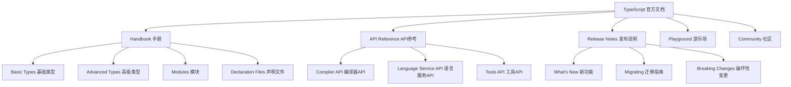

# TypeScript 官方文档完全指南

## 🎯 TypeScript 官方文档概览

### 📊 文档体系结构



## 🔧 Handbook 核心章节

### 💡 Type Fundamentals 类型基础

```typescript
// 1. Basic Types - 基础类型
// 官方文档: https://www.typescriptlang.org/docs/handbook/2/everyday-types.html

// Primitive Types - 原始类型
let aBooolean: boolean = true;
let abNumber: number = 42;
let aStrng: string = 'hello';

// Arrays - 数组类型
let numberArray: number[] = [1, 2, 3];
let stringArray: Array<string> = ['one', 'two', 'three'];

// Tuples - 元组类型
let point: [number, number] = [10, 20];
let person: [string, number, boolean] = ['Alice', 30, true];

// Enums - 枚举类型
enum Color {
    Red = 'red',
    Green = 'green',
    Blue = 'blue'
}

// Object Types - 对象类型
interface User {
    id: number;
    name: string;
    email?: string; // Optional property 可选属性
    readonly createdDate: Date; // Readonly property 只读属性
}

// Function Types - 函数类型
function greet(name: string): string {
    return `Hello, ${name}!`;
}

// Union Types - 联合类型
type StringOrNumber = string | number;

function processValue(value: StringOrNumber): void {
    if (typeof value === 'string') {
        console.log(value.toUpperCase());
    } else {
        console.log(value.toFixed(2));
    }
}

// Literal Types - 字面量类型
type Direction = 'north' | 'south' | 'east' | 'west';

function move(direction: Direction): void {
    console.log(`Moving ${direction}`);
}

// Any Type - 任意类型 (应避免使用)
let anything: any = 'could be anything';
anything = 42;
anything = true;

// Unknown Type - 未知类型 (比 any 更安全)
let userInput: unknown = getUserInput();

function getUserInput(): unknown {
    return process.env.USER_INPUT || 'default';
}

// Void Type - 空类型
function logMessage(message: string): void {
    console.log(message);
}

// Never Type - 永不类型
function error(message: string): never {
    throw new Error(message);
}

function infiniteLoop(): never {
    while (true) {
        // ...
    }
}

// Type Assertion - 类型断言
const myCanvas = document.getElementById('main_canvas') as HTMLCanvasElement;
// 或者使用尖括号语法 (<HTMLCanvasElement>document.getElementById('main_canvas'))

// 2. Object Types - 对象类型
// 官方文档: https://www.typescriptlang.org/docs/handbook/2/objects.html

interface Rect {
    width: number;
    height: number;
    
    // Optional Properties - 可选属性
    color?: string;
    borderStyle?: 'solid' | 'dashed' | 'dotted';
    
    // Readonly Properties - 只读属性
    readonly id: string;
    
    // Index Signatures - 索引签名
    [key: string]: any;
}

// Interface vs Type Alias - 接口 vs 类型别名
interface InterfaceExample {
    prop: string;
}

type TypeAliasExample = {
    prop: string;
};

// Interface Extending - 接口继承
interface Shape {
    name: string;
}

interface Square extends Shape {
    sideLength: number;
}

// Type Aliases - 类型别名
type NetworkState = {
    loading: boolean;
    data?: string;
    error?: string;
};

// Intersection Types - 交叉类型
type Person = { name: string };
type Employee = { id: string };
type PersonEmployee = Person & Employee;

// Generic Types - 泛型
interface GenericResponse<T> {
    success: boolean;
    data: T;
    message: string;
}

// 3. Union Types - 聯合類型
// 官方文档: https://www.typescriptlang.org/docs/handbook/2/everyday-types.html#union-types

type StringOrNumber = string | number;

function formatValue(value: StringOrNumber): string {
    if (typeof value === 'string') {
        return value.toUpperCase();
    } else {
        return value.toString();
    }
}

// Union Types with Literals - 联合类型与字面量
type Status = 'pending' | 'approved' | 'rejected';

interface ValidationResult {
    status: Status;
    message: string;
    errors?: string[];
}

// 4. Literal Types - 字面量类型
type Theme = 'light' | 'dark';
type Size = 'small' | 'medium' | 'large';

function createButton(text: string, theme: Theme, size: Size): HTMLButtonElement {
    const button = document.createElement('button');
    button.textContent = text;
    button.className = `btn btn-${theme} btn-${size}`;
    return button;
}

// 5. Strict Null Checks - 严格空值检查
// 编译选项: strictNullChecks: true

// Null and Undefined Types - null 和 undefined 类型
function processInput(value: string | null | undefined): string {
    // Type Guard - 类型守护
    if (value == null) {
        return 'No value provided';
    }
    
    return `Processing: ${value}`;
}

// Non-null Assertion Operator - 非空断言操作符
function getElementById(id: string): HTMLElement | null {
    return document.getElementById(id);
}

const element = getElementById('myDiv')!; // 断言不为 null
element.style.color = 'red';
```

### 🎪 Advanced Types 高级类型

```typescript
// 1. Union Types Advanced - 联合类型进阶
// 官方文档: https://www.typescriptlang.org/docs/handbook/2/unions-and-intersections.html

// Discriminated Unions - 可区分的联合类型
type NetworkLoadingState = {
    state: 'loading';
};

type NetworkSuccessState = {
    state: 'success';
    data: string;
};

type NetworkFailedState = {
    state: 'failed';
    error: string;
};

type NetworkState = NetworkLoadingState | NetworkSuccessState | NetworkFailedState;

function renderNetworkState(network: NetworkState): string {
    switch (network.state) {
        case 'loading':
            return 'Loading...';
        case 'success':
            return `Data: ${network.data}`;
        case 'failed':
            return `Error: ${network.error}`;
        default:
            // 确保所有 case 都被处理
            const _exhaustiveCheck: never = network;
            return _exhaustiveCheck;
    }
}

// 2. Intersection Types - 交叉类型
type Point = {
    x: number;
    y: number;
};

type Shape = {
    name: string;
    area(): number;
};

type PointShape = Point & Shape;

function createPointShape(x: number, y: number, name: string): PointShape {
    return {
        x,
        y,
        name,
        area(): number {
            return Math.PI * this.x * this.y;
        }
    };
}

// 3. Conditional Types - 条件类型
// 官方文档: https://www.typescriptlang.org/docs/handbook/2/conditional-types.html

type IsArray<T> = T extends any[] ? true : false;

type TestArray = IsArray<string[]>; // true
type TestString = IsArray<string>; // false

// 条件类型 with infer - 条件类型中的推断
type FlattenArray<T> = T extends (infer U)[] ? U : T;

type NestedString = FlattenArray<string[]>; // string
type NestedNumber = FlattenArray<number>; // number

// Mapped Types - 映射类型
type Readonly<T> = {
    readonly [P in keyof T]: T[P];
};

type Partial<T> = {
    [P in keyof T]?: T[P];
};

type Required<T> = {
    [P in keyof T]-?: T[P];
};

type Pick<T, K extends keyof T> = {
    [P in K]: T[P];
};

type Omit<T, K extends keyof T> = Pick<T, Exclude<keyof T, K>>;

// 高级映射类型 - 变换类型的键和值
type CapitalizeKeys<T> = {
    [K in keyof T as Capitalize<string & K>]: T[K];
};

type APIResponse = CapitalizeKeys<{
    data: string;
    error: boolean;
}>;
// 结果: { Data: string; Error: boolean }

// Template Literal Types - 模板字面量类型
type EventName<T extends string> = `update_${T}` | `delete_${T}` | `create_${T}`;

type UserEvents = EventName<'user'>;
// 结果: 'update_user' | 'delete_user' | 'create_user'

// 字符串模式匹配
type ExtractRoute<T> = T extends `/${infer Route}` ? Route : never;

type HomeRoute = ExtractRoute<'/home'>; // 'home'
type UserRoute = ExtractRoute<'/users/profile'>; // never (只匹配单个路径段)

// 更复杂的路径匹配
type ParseRoute<T> = T extends `/${infer Path}`
    ? Path extends `${infer Start}/${infer End}`
        ? { start: Start; end: End }
        : { path: Path }
    : never;

// 4. Utility Types - 实用工具类型
// 官方文档: https://www.typescriptlang.org/docs/handbook/utility-types.html

// 基础实用工具类型
type User = {
    id: string;
    name: string;
    email: string;
    age: number;
    phone?: string;
};

// Readonly<T> - 将所有属性设为只读
type ReadonlyUser = Readonly<User>;

// Partial<T> - 将所有属性设为可选
type PartialUser = Partial<User>;

// Required<T> - 将所有属性设为必需
type RequiredUser = Required<User>;

// Pick<T, K> - 从 T 中选择属性 K
type UserBasic = Pick<User, 'id' | 'name' | 'email'>;

// Omit<T, K> - 从 T 中排除属性 K
type UserWithoutId = Omit<User, 'id'>;

// Record<K, V> - 创建一个具有指定键和值类型的对象类型
type UserRoles = Record<'admin' | 'user' | 'guest', boolean>;
type UserScores = Record<string, number>;

// Exclude<T, U> - 从 T 中排除可指定给 U 的类型
type NonNullable<T> = Exclude<T, null | undefined>;

// Extract<T, U> - 从 T 中提取可指定给 U 的类型
type FunctionNames = Extract<'function' | 'object' | 'string', string>;

// InstanceType<T> - 获取构造函数类型 T 的实例类型
class Animal {
    public kind = 'mammal';
}

type Instance = InstanceType<typeof Animal>;

// ThisParameterType<T> - 提取函数类型的 this 参数类型
function toString(this: String): string {
    return this.valueOf();
}

type ThisType = ThisParameterType<typeof toString>; // String

// OmitThisParameter<T> - 从函数类型中移除 this 参数
type WithoutThis = OmitThisParameter<typeof toString>; // () => string

// ThisType<T> - 在对象类型中添加 this 类型上下文
type ObjectDescriptor = {
    data: number[];
    methods: ThisType<{ sum(): number }>;
};

// Example usage 示例用法
const descriptor: ObjectDescriptor = {
    data: [1, 2, 3],
    methods: {
        sum(): number {
            return this.data.reduce((sum, n) => sum + n, 0);
        }
    }
};
```

## 🚀 API Reference 核心 API

### 🔄 Compiler API 编译器 API

```typescript
// TypeScript Compiler API
import * as ts from 'typescript';

// 1. Program API - 程序API
// 创建 TypeScript 程序
function createProgram(files: string[], options: ts.CompilerOptions): ts.Program {
    return ts.createProgram(files, options);
}

// 使用示例
const program = createProgram(['src/index.ts'], {
    target: ts.ScriptTarget.ES2020,
    module: ts.ModuleKind.CommonJS,
    strict: true,
    declaration: true
});

// 2. Source Files - 源文件
// 编译单个源文件
function compileSourceFile(
    sourceFileName: string, 
    options: ts.CompilerOptions
): ts.SourceFile {
    const program = ts.createProgram([sourceFileName], options);
    const sourceFile = program.getSourceFile(sourceFileName);
    
    if (!sourceFile) {
        throw new Error(`Source file not found: ${sourceFileName}`);
    }
    
    return sourceFile;
}

// 编译多个源文件
function compileProject(filePaths: string[], options: ts.CompilerOptions): ts.Program {
    return ts.createProgram(filePaths, options);
}

// 3. Type Checker API - 类型检查器API
// 获取程序检查器并分析类型
function analyzeTypes(program: ts.Program): void {
    const checker = program.getTypeChecker();
    
    // 遍历所有文件
    for (const sourceFile of program.getSourceFiles()) {
        if (sourceFile.isDeclarationFile) {
            continue; // 跳过声明文件
        }
        
        ts.forEachChild(sourceFile, (node) => {
            analyzeNode(node, checker);
        });
    }
}

// 分析节点类型
function analyzeNode(node: ts.Node, checker: ts.TypeChecker): void {
    if (ts.isVariableDeclaration(node)) {
        const type = checker.getTypeAtLocation(node);
        const typeString = checker.typeToString(type);
        
        console.log(`Variable ${node.name?.getText()} has type: ${typeString}`);
    }
    
    if (ts.isFunctionDeclaration(node) && node.name) {
        const signature = checker.getSignatureFromDeclaration(node);
        if (signature) {
            const typeString = checker.typeToString(signature.getReturnType());
            console.log(`Function ${node.name.text} returns: ${typeString}`);
        }
    }
    
    // 递归分析子节点
    ts.forEachChild(node, (child) => {
        analyzeNode(child, checker);
    });
}

// 4. Transformation API - 转换API
// 创建 Transformer 工厂
function createTransformer(transformer: ts.TransformerFactory<ts.SourceFile>): ts.TransformerFactory<ts.SourceFile> {
    return transformer;
}

// 简单转换器：将 console.log 改为 console.info
const logToInfoTransformer: ts.TransformerFactory<ts.SourceFile> = (context: ts.TransformationContext) => {
    return (sourceFile: ts.SourceFile) => {
        function visitor(node: ts.Node): ts.Node {
            // 检查是否是 console.log 调用
            if (ts.isCallExpression(node) && 
                ts.isPropertyAccessExpression(node.expression) &&
                ts.isIdentifier(node.expression.name) &&
                node.expression.name.text === 'log' &&
                ts.isPropertyAccessExpression(node.expression.expression) &&
                ts.isIdentifier(node.expression.expression.expression) &&
                ts.isIdentifier(node.expression.expression.name) &&
                node.expression.expression.expression.text === 'console' &&
                node.expression.expression.name.text === 'console') {
                
                // 替换 console.log 为 console.info
                return ts.updateCallExpression(
                    node,
                    ts.updatePropertyAccessExpression(
                        node.expression,
                        node.expression.expression,
                        ts.createIdentifier('info')
                    ),
                    node.typeArguments,
                    node.arguments
                );
            }
            
            return ts.visitNode(node, visitor);
        }
        
        return ts.visitNode(sourceFile, visitor);
    };
};

// 5. Custom Compiler Host - 自定义编译宿主
class CustomCompilerHost implements ts.CompilerHost {
    private files: Map<string, string> = new Map();
    private currentDirectory: string = process.cwd();
    private getNewLine: () => string = () => '\n';
    
    setFile(fileName: string, content: string): void {
        this.files.set(fileName, content);
    }
    
    getSourceFile(fileName: string, languageVersion: ts.ScriptTarget): ts.SourceFile | undefined {
        const content = this.files.get(fileName);
        if (content === undefined) {
            return undefined;
        }
        
        return ts.createSourceFile(fileName, content, languageVersion, true);
    }
    
    writeFile(fileName: string, data: string, writeByteOrderMark?: boolean): void {
        console.log(`Writing file: ${fileName}`);
    }
    
    getCurrentDirectory(): string {
        return this.currentDirectory;
    }
    
    getDirectories(path: string): string[] {
        return []; // Simplified implementation
    }
    
    fileExists(fileName: string): boolean {
        return this.files.has(fileName);
    }
    
    readFile(fileName: string): string | undefined {
        return this.files.get(fileName);
    }
    
    getDefaultLibFileName(options: ts.CompilerOptions): string {
        return 'lib.d.ts'; // Default library file name
    }
    
    getCanonicalFileName(fileName: string): string {
        return fileName;
    }
    
    useCaseSensitiveFileNames(): boolean {
        return false;
    }
    
    getNewLine(): string {
        return this.getNewLine();
    }
}

// 使用自定义编译宿主
const host = new CustomCompilerHost();
host.setFile('test.ts', `
interface User {
    id: string;
    name: string;
}

function createUser(id: string, name: string): User {
    return { id, name };
}
`);

const program = ts.createProgram(['test.ts'], {
    target: ts.ScriptTarget.ES2020,
    module: ts.ModuleKind.CommonJS
}, host);

// 6. Diagnostic Reporting - 诊断报告
// 报告编译错误
function reportDiagnostics(diagnostics: ts.Diagnostic[]): void {
    diagnostics.forEach(diagnostic => {
        let message = ts.formatDiagnostic(diagnostic, {
            getCanonicalFileName: (fileName: string) => fileName,
            getCurrentDirectory: () => process.cwd(),
            getNewLine: () => '\n'
        });
        
        console.error(message);
    });
}

// 检查程序编译结果
function checkCompileResult(program: ts.Program): boolean {
    const diagnostics = ts.getDiagnosticsOfType(
        diagnostics,
        ts.DiagnosticCategory.Error
    );
    
    if (diagnostics.length > 0) {
        reportDiagnostics(diagnostics);
        return false;
    }
    
    return true;
}

// 7. Emit API - 发出API
// 发出编译后的JavaScript代码
function emitJavaScript(program: ts.Program): void {
    const emitResult = program.emit();
    
    if (emitResult.diagnostics.length > 0) {
        reportDiagnostics(emitResult.diagnostics);
    }
    
    console.log('Compilation completed successfully');
}

// 发出声明文件
function emitDeclarationFiles(program: ts.Program): void {
    const result = program.emit(undefined, undefined, undefined, true); // emitOnlyDtsFiles = true
    
    if (result.diagnostics.length > 0) {
        reportDiagnostics(result.diagnostics);
    }
}

// 使用示例
function demonstrateCompilerAPI(): void {
    // 1. 创建自定义编译器宿主
    const host = new CustomCompilerHost();
    host.setFile('user.ts', `
        interface User {
            id: string;
            name: string;
        }
        
        function createUser(id: string, name: string): User {
            return { id, name };
        }
        
        console.log(createUser('1', 'Alice'));
    `);
    
    // 2. 创建程序
    const program = ts.createProgram(['user.ts'], {
        target: ts.ScriptTarget.ES2020,
        module: ts.ModuleKind.CommonJS,
        strict: true,
        declaration: true
    }, host);
    
    // 3. 检查编译结果
    if (!checkCompileResult(program)) {
        console.error('Compilation failed');
        return;
    }
    
    // 4. 发出 JavaScript 代码
    emitJavaScript(program);
    
    // 5. 分析类型
    analyzeTypes(program);
    
    // 6. 应用转换器
    const transformedSourceFiles = program.emit(undefined, undefined, undefined, false, {
        after: [logToInfoTransformer]
    });
}
```

### 🎯 Language Service API 语言服务 API

```typescript
// Language Service API 使用示例
import * as ts from 'typescript';

// 1. 创建语言服务
class TypeScriptLanguageService {
    private service: ts.LanguageService;
    private files: Map<string, string> = new Map();
    
    constructor(compilerOptions: ts.CompilerOptions) {
        // 创建编译宿主
        const host = this.createLanguageServiceHost(compilerOptions);
        
        // 创建语言服务
        this.service = ts.createLanguageService(host);
    }
    
    private createLanguageServiceHost(options: ts.CompilerOptions): ts.LanguageServiceHost {
        return {
            getCompilationSettings: () => options,
            getScriptVersion: (fileName: string) => '1',
            getScriptSnapshot: (fileName: string) => {
                const content = this.files.get(fileName);
                return content ? 
                    ts.ScriptSnapshot.fromString(content) : 
                    undefined;
            },
            getCurrentDirectory: () => process.cwd(),
            getScriptFileNames: () => Array.from(this.files.keys()),
            getProjectVersion: () => '1',
            useCaseSensitiveFileNames: () => false,
            readDirectory: ts.sys.readDirectory,
            fileExists: ts.sys.fileExists,
            readFile: ts.sys.readFile,
            getDirectories: ts.sys.getDirectories,
            log: (message: string) => console.log(message),
            getTypeAcquisitionEnabled: () => false,
            getCompilerOptions: () => options,
        };
    }
    
    // 添加或更新文件
    setFile(fileName: string, content: string): void {
        this.files.set(fileName, content);
    }
    
    // 获取自动完成
    getCompletionsAtPosition(fileName: string, position: number): ts.CompletionInfo | undefined {
        const completions = this.service.getCompletionsAtPosition(fileName, position, {});
        return completions || undefined;
    }
    
    // 获取代码建议
    getCodeSuggestions(fileName: string, position: number): ts.CodeFixAction[] {
        return this.service.getCodeFixesAtPosition(fileName, position, position, [], {});
    }
    
    // 获取定义位置
    getDefinitionAtPosition(fileName: string, position: number): readonly ts.DefinitionInfo[] {
        return this.service.getDefinitionAtPosition(fileName, position) || [];
    }
    
    // 获取类型信息
    getQuickInfoAtPosition(fileName: string, position: number): ts.QuickInfo | undefined {
        return this.service.getQuickInfoAtPosition(fileName, position);
    }
    
    // 获取语义高亮
    getSemanticTokens(fileName: string, range?: ts.TextRange): ts.SemanticHighlightResponse {
        return this.service.getSemanticTokens(fileName, range?.pos, range?.end);
    }
    
    // 重新组织导入
    organizeImports(range: ts.TextRange, fileName: string): ts.FileTextChanges[] {
        return this.service.organizeImports(range, fileName, {}) || [];
    }
    
    // 获取格式化文档
    formatDocument(fileName: string, options?: ts.FormatCodeOptions): ts.TextChange[] {
        return this.service.getFormattingEditsForDocument(fileName, options) || [];
    }
    
    // 获取特定范围的格式
    formatRange(fileName: string, start: number, end: number, options?: ts.FormatCodeOptions): ts.TextChange[] {
        return this.service.getFormattingEditsForRange(fileName, start, end, options) || [];
    }
    
    // 重命名符号
    renameSymbol(fileName: string, position: number, newName: string): ts.RenameLocation[] {
        return this.service.findRenameLocations(fileName, position, false, false, false) || [];
    }
    
    // 获取重构
    getRefactoringsAtPosition(fileName: string, position: number): ts.ApplicableRefactorInfo[] {
        return this.service.getApplicableRefactors(fileName, position, undefined) || [];
    }
    
    // 获取可用的重构
    getAvailableRefactorings(fileName: string, range?: ts.TextRange): ts.ApplicableRefactorInfo[] {
        return this.service.getApplicableRefactors(fileName, range?.pos, range) || [];
    }
    
    // 获取诊断信息
    getDiagnostics(fileName: string): ts.Diagnostic[] {
        return this.service.getSyntacticDiagnostics(fileName)
            .concat(this.service.getSemanticDiagnostics(fileName));
    }
}

// 使用示例
function demonstrateLanguageService(): void {
    const service = new TypeScriptLanguageService({
        target: ts.ScriptTarget.ES2020,
        module: ts.ModuleKind.ESNext,
        strict: true,
    });
    
    // 设置示例代码
    service.setFile('example.ts', `
interface User {
    id: string;
    name: string;
    email: string;
}

function createUser(id: string, name: string, email: string): User {
    return { id, name, email };
}

function getUserById(users: User[], id: string): User | undefined {
    return users.find(user => user.id === id);
}

// 测试代码
const users: User[] = [];
const newUser = createUser("1", "Alice", "alice@example.com");
users.push(newUser);
const foundUser = getUserById(users, "1");
if (foundUser) {
    console.log(foundUser.name);
}
`);
    
    const fileName = 'example.ts';
    
    // 1. 获取自动完成
    const completions = service.getCompletionsAtPosition(fileName, 400); // 在 users.push 后
    if (completions) {
        console.log('Completions:', completions.entries.slice(0, 10).map(e => e.name));
    }
    
    // 2. 获取类型信息
    const quickInfo = service.getQuickInfoAtPosition(fileName, 350); // 在 users 上
    if (quickInfo) {
        console.log('Type info:', quickInfo.displayString);
    }
    
    // 3. 获取诊断
    const diagnostics = service.getDiagnostics(fileName);
    console.log('Diagnostics:', diagnostics.length);
    
    // 4. 获取定义
    const definitions = service.getDefinitionAtPosition(fileName, 230); // 在 User 类型上
    if (definitions.length > 0) {
        console.log('Definition:', definitions[0].fileName, definitions[0].textSpan.start);
    }
    
    // 5. 重新组织导入
    const organizedImports = service.organizeImports({ pos: 0, end: 100 }, fileName);
    console.log('Import organization:', organizedImports.length, 'changes');
    
    // 6. 格式化文档
    const formatChanges = service.formatDocument(fileName);
    console.log('Format changes:', formatChanges.length);
    
    // 7. 获取重构建议
    const refactorings = service.getRefactoringsAtPosition(fileName, 180); // 在 createUser 函数内
    console.log('Available refactorings:', refactorings.map(r => r.description));
}
```

### 🔗 相关深入学习

- [[02-Community-Resources社区资源]] - 社区资源与学习材料
- [[03-Tooling-Ecosystem工具生态]] - 完整的工具生态系统  
- [[01-Version-History版本历史]] - TypeScript版本演进历程

---
*💡 TypeScript 官方文档是学习 TypeScript 的权威资源，系统地掌握这些核心概念和 API 是成为 TypeScript 专家的重要基础*
