# TypeScript 社区资源完全指南

## 🎯 TypeScript 社区生态系统概览

### 📊 社区资源分布

```mermaid
graph TD
    A[TypeScript Community] --> B[Learning Resources]
    A --> C[Development Tools]
    A --> D[Open Source Projects]
    A --> E[Community Channels]
    A --> F[Industry Events]
    
    B --> B1[Official Documentation]
    B --> B2[Tutorial Platforms]
    B --> B3[Video Courses]
    B --> B4[Interactive Learning]
    
    C --> C1[IDE Plugins]
    C --> C2[Build Tools]
    C --> C3[Testing Frameworks]
    C --> C4[Debugging Tools]
    
    D --> D1[Framework Integration]
    D --> D2[Utility Libraries]
    D --> D3[Sample Projects]
    D --> D4[Template Repositories]
    
    E --> E1[Discord Communities]
    E --> E2[Reddit Forums]
    E --> E3[Stack Overflow]
    E --> E4[GitHub Discussions]
    
    F --> F1[Conferences]
    F --> F2[Meetups]
    F --> F3[Webinars]
    F --> F4[Workshops]
```



## 🔧 学习资源大全

### 💡 官方与权威资源

```typescript
// Learning Resources Taxonomy
interface LearningResource {
    title: string;
    type: ResourceType;
    level: DifficultyLevel;
    format: ContentFormat;
    language: Language[];
    updatedAt: Date;
    url: string;
    description: string;
    tags: string[];
    rating?: number;
}

// Official TypeScript Resources
const officialResources: LearningResource[] = [
    {
        title: "TypeScript Handbook",
        type: "DOCUMENTATION",
        level: "ALL_LEVELS",
        format: "WEBSITE",
        language: ["EN"],
        updatedAt: new Date("2024-01-01"),
        url: "https://www.typescriptlang.org/docs/",
        description: "权威的TypeScript官方文档，包含完整的语言特性介绍和使用指南",
        tags: ["official", "comprehensive", "reference"],
        rating: 5.0
    },
    {
        title: "Five Minute Quick Start",
        type: "TUTORIAL",
        level: "BEGINNER",
        format: "INTERACTIVE",
        language: ["EN"],
        updatedAt: new Date("2024-01-01"),
        url: "https://www.typescriptlang.org/docs/handbook/typescript-from-scratch.html",
        description: "5分钟快速上手TypeScript，适合初学者快速了解基础概念",
        tags: ["quick-start", "beginner-friendly", "interactive"],
        rating: 4.8
    },
    {
        title: "TypeScript Playground",
        type: "INTERACTIVE_ENVIRONMENT",
        level: "ALL_LEVELS",
        format: "ONLINE_EDITOR",
        language: | ["EN"],
        updatedAt: new Date("2024-01-01"),
        url: "https://www.typescriptlang.org/play",
        description: "在线TypeScript编辑器和执行环境，支持实时编译和错误检查",
        tags: ["playground", "sandbox", "real-time"],
        rating: 4.9
    },
    {
        title: "TypeScript Release Notes",
        type: "DOCUMENTATION",
        level: "ADVANCED",
        format: "WEBSITE",
        language: ["EN"],
        updatedAt: new Date("2024-01-01"),
        url: "https://devblogs.microsoft.com/typescript/",
        description: "TypeScript版本发布说明，了解最新特性和破坏性变更",
        tags: ["changelog", "breaking-changes", "latest-features"],
        rating: 4.7
    }
];

// Premium Learning Platforms
const premiumPlatforms: LearningProvider[] = [
    {
        name: "TypeScript Deep Drive Course",
        provider: "Frontend Masters",
        format: "VIDEO_COURSE",
        duration: "40+ hours",
        price: "Monthly/$39",
        description: "深度TypeScript课程，从基础到高级特性全覆盖",
        instructor: "Mike North",
        modules: [
            "Basic Types and Type Inference",
            "Advanced Type Manipulation",
            "Generic Programming",
            "Decorators and Meta Programming",
            "Tooling and Configuration",
            "Real-world Applications"
        ],
        rating: 4.9,
        url: "https://frontendmasters.com/courses/typescript/"
    },
    {
        name: "TypeScript Complete Developer Guide",
        provider: "Udemy",
        format: "VIDEO_COURSE",
        duration: "35+ hours",
        price: "Lifetime/$199",
        description: "完整的TypeScript开发者指南，包含实战项目",
        instructor: "Stephen Grider",
        modules: [
            "Fundamentals and Setup",
            "React with TypeScript",
            "Express with TypeScript", 
            "Full-stack Applications",
            "Testing with TypeScript",
            "Deployment Strategies"
        ],
        rating: 4.7,
        url: "https://www.udemy.com/course/typescript-the-complete-developers-guide/"
    }
];
```

### 🎪 Interactive Learning Platforms

```typescript
// Interactive Learning Resources
class InteractiveLearningPlatform {
    private platforms: InteractivePlatform[] = [];
    
    constructor() {
        this.setupPlatforms();
    }
    
    private setupPlatforms(): void {
        this.platforms = [
            {
                name: "TypeScript Challenge",
                type: "CODING_CHALLENGES",
                url: "https://github.com/type-challenges/type-challenges",
                difficulty: "INTERMEDIATE_TO_ADVANCED",
                description: "TypeScript类型挑战集合，通过解决实际问题提升类型技能",
                features: [
                    "类型系统深度练习",
                    "高级类型操作",
                    "条件类型挑战",
                    "映射类型练习",
                    "模板字面量类型",
                    "工具类型实现"
                ],
                statRating: {
                    stars: 18500,
                    forks: 1800,
                    contributors: 200,
                    issues: 150,
                    lastCommit: "2 days ago"
                }
            },
            
            {
                name: "TypeScript Exercises",
                type: "INTERACTIVE_TUTORIAL",
                url: "https://typescript-exercises.github.io/",
                difficulty: "BEGINNER_TO_INTERMEDIATE",
                description: "交互式TypeScript练习平台，循序渐进学习语言特性",
                features: [
                    "基础类型练习",
                    "泛型编程练习", 
                    "接口设计练习",
                    "模块系统练习",
                    "配置选项练习"
                ],
                statRating: {
                    stars: 8500,
                    forks: 450,
                    contributors: 50,
                    issues: 25,
                    lastCommit: "1 week ago"
                }
            },
            
            {
                name: "Awesome TypeScript",
                type: "RESOURCE_CURATION",
                url: "https://github.com/semlinker/awesome-typescript",
                difficulty: "ALL_LEVELS",
                description: "TypeScript优秀资源集合，包含工具、库、教程等",
                features: [
                    "精选资源列表",
                    "工具分类整理",
                    "社区项目推荐",
                    "学习路径指导",
                    "最新资源更新"
                ],
                statRating: {
                    stars: 12000,
                    forks: 800,
                    contributors: 150,
                    issues: 30,
                    lastCommit: "3 days ago"
                }
            },
            
            {
                name: "TypeScript Repository List",
                type: "PROJECT_SHOWCASE",
                url: "https://github.com/topics/typescript",
                difficulty: "ALL_LEVELS",
                description: "GitHub TypeScript主题仓库，发现优秀的开源项目",
                features: [
                    "项目分类浏览",
                    "质量评分展示",
                    "活跃度指标",
                    "贡献者统计",
                    "最新趋势分析"
                ],
                stats: {
                    totalRepos: 1800000,
                    dailyActive: 50000,
                    weeklyTrending: 500,
                    popularTopics: 100
                }
            }
        ];
    }
    
    // Get resources by difficulty level
    getResourcesByLevel(level: DifficultyLevel): InteractivePlatform[] {
        return this.platforms.filter(platform => 
            platform.difficulty === level || platform.difficulty === 'ALL_LEVELS'
        );
    }
    
    // Get trending resources
    getTrendingResources(): InteractivePlatform[] {
        return this.platforms
            .sort((a, b) => {
                const aScore = a.statRating?.stars || 0;
                const bScore = b.statRating?.stars || 0;
                return bScore - aScore;
            })
            .slice(0, 10);
    }
    
    // Search resources by feature
    searchByFeature(feature: string): InteractivePlatform[] {
        return this.platforms.filter(platform =>
            platform.features.some(f => f.toLowerCase().includes(feature.toLowerCase()))
        );
    }
}

// Community Forums and Channels
class CommunityChannels {
    private channels: CommunityChannel[] = [];
    
    constructor() {
        this.setupChannels();
    }
    
    private setupChannels(): void {
        this.channels = [
            {
                platform: "Discord",
                name: "TypeScript Community Discord",
                url: "https://discord.gg/typescript",
                memberCount: 15000,
                activityLevel: "HIGH",
                features: [
                    "Real-time chat support",
                    "Voice channels for discussions", 
                    "Bot integrations",
                    "Topic-based channels",
                    "Regular events"
                ],
                moderation: {
                    rules: ["Be respectful", "No spam", "Stay on topic"],
                    moderators: 25,
                    responseTime: "Within 30 minutes"
                }
            },
            
            {
                platform: "Reddit",
                name: "r/typescript",
                url: "https://reddit.com/r/typescript",
                memberCount: 80000,
                activityLevel: "VERY_HIGH",
                features: [
                    "Community discussions",
                    "Project showcases",
                    "Help threads",
                    "News sharing",
                    "Code reviews"
                ],
                moderation: {
                    rules: ["Quality content only", "Use search before posting", "Be constructive"],
                    moderators: 12,
                    responseTime: "Within 1 hour"
                }
            },
            
            {
                platform: "Stack Overflow",
                name: "TypeScript Tag",
                url: "https://stackoverflow.com/questions/tagged/typescript",
                memberCount: 500000,
                activityLevel: "VERY_HIGH",
                features: [
                    "Q&A format",
                    "Voting system",
                    "Accepted answers",
                    "Reputation system",
                    "SEO optimized"
                ],
                moderation: {
                    rules: ["Original research", "Not opinion-based", "Minimal reproducible"],
                    moderators: 100,
                    responseTime: "Within 15 minutes"
                }
            }
        ];
    }
    
    getActiveChannels(): CommunityChannel[] {
        return this.channels.filter(channel => 
            channel.activityLevel === 'HIGH' || channel.activityLevel === 'VERY_HIGH'
        );
    }
}
```

## 🚀 Industry Events and Conferences

### 🔄 Conference Timeline

```typescript
// Industry Events Management
class TypeScriptEventsCalendar {
    private events: TechEvent[] = [];
    private currentYear = new Date().getFullYear();
    
    constructor() {
        this.loadEventData();
    }
    
    private loadEventData(): void {
        this.events = [
            // Major Conferences
            {
                name: "TypeScript Congress",
                type: "CONFERENCE",
                date: new Date(`${this.currentYear}-04-15`),
                location: "Virtual/Amsterdam",
                duration: "2 days",
                attendees: 2000,
                format: "HYBRID", // Virtual + In-person
                description: "最大的TypeScript专业会议，聚集世界顶级专家",
                speakers: [
                    {
                        name: "Anders Hejlsberg",
                        title: "Creator of TypeScript",
                        company: "Microsoft",
                        keynote: "The Future of TypeScript"
                    },
                    {
                        name: "Daniel Rosenwasser",
                        title: "TypeScript Program Manager", 
                        company: "Microsoft",
                        presentation: "What's New in TypeScript 5.x"
                    }
                ],
                topics: [
                    "Advanced Type Features",
                    "Performance Optimization",
                    "Tooling Integration",
                    "Enterprise Adoption",
                    "Community Contributions"
                ],
                tickets: {
                    earlyBird: "$299",
                    regular: "$399",
                    student: "$99"
                }
            },
            
            {
                name: "React + TypeScript Workshop",
                type: "WORKSHOP",
                date: new Date(`${this.currentYear}-06-20`),
                location: "Virtual",
                duration: "1 day",
                attendees: 150,
                format: "VIRTUAL",
                description: "深度React与TypeScript集成实践workshop",
                speakers: [
                    {
                        name: "Ryan Florence",
                        title: "Creator of React Router",
                        company: "Remix",
                        presentation: "Advanced TypeScript Patterns in React"
                    }
                ],
                agenda: [
                    {
                        time: "09:00",
                        title: "TypeScript Fundamentals",
                        speaker: "Ryan Florence",
                        duration: "60 min"
                    },
                    {
                        time: "10:30", 
                        title: "React Component Typing",
                        speaker: "Ryan Florence",
                        duration: "90 min"
                    },
                    {
                        time: "14:00",
                        title: "State Management & Hooks",
                        speaker: "Ryan Florence", 
                        duration: "90 min"
                    },
                    {
                        time: "16:00",
                        title: "Testing with TypeScript",
                        speaker: "Ryan Florence",
                        duration: "60 min"
                    }
                ]
            },
            
            // Local Meetups
            {
                name: "TypeScript Berlin Meetup",
                type: "MEETUP",
                date: new Date(`${this.currentYear}-03-05`),
                location: "Berlin, Germany",
                duration: "3 hours",
                attendees: 80,
                format: "IN_PERSON",
                description: "柏林本地TypeScript开发者聚会",
                speakers: [
                    {
                        name: "Sarah Chen",
                        title: "Senior Frontend Engineer",
                        company: "Shopify",
                        presentation: "Building Scalable Types"
                    }
                ],
                sponsors: ["Shopify", "Microsoft", "GitHub"]
            },
            
            {
                name: "TypeScript NYC",
                type: "MEETUP", 
                date: new Date(`${this.currentYear}-05-10`),
                location: "New York, NY",
                duration: "3 hours",
                attendees: 120,
                format: "IN_PERSON",
                description: "纽约市TypeScript开发者社区聚会",
                speakers: [
                    {
                        name: "Tom Smith",
                        title: "Tech Lead",
                        company: "Netflix",
                        presentation: "TypeScript at Scale in Streaming"
                    }
                ],
                sponsors: ["Netflix", "Square", "Airbnb"]
            }
        ];
    }
    
    // Get upcoming events
    getUpcomingEvents(): TechEvent[] {
        const now = new Date();
        return this.events
            .filter(event => event.date > now)
            .sort((a, b) => a.date.getTime() - b.date.getTime());
    }
    
    // Get events by type
    getEventsByType(type: EventType): TechEvent[] {
        return this.events.filter(event => event.type === type);
    }
    
    // Get events by format
    getVirtualEvents(): TechEvent[] {
        return this.events.filter(event => 
            event.format === 'VIRTUAL' || event.format === 'HYBRID'
        );
    }
    
    // Search events by topic
    searchEventsByTopic(topic: string): TechEvent[] {
        return this.events.filter(event =>
            event.topics?.some(t => t.toLowerCase().includes(topic.toLowerCase())) ||
            event.description.toLowerCase().includes(topic.toLowerCase())
        );
    }
}

// Learning Path Recommendations
class LearningPathRecommender {
    private paths: LearningPath[] = [];
    
    constructor() {
        this.setupLearningPaths();
    }
    
    private setupLearningPaths(): void {
        this.paths = [
            {
                name: "Frontend Developer Path",
                targetRole: "Frontend Developer",
                description: "专为前端开发者设计的TypeScript学习路径",
                duration: "3-4 months",
                difficulty: "BEGINNER_TO_INTERMEDIATE",
                prerequisites: ["JavaScript", "HTML", "CSS"],
                stages: [
                    {
                        name: "TypeScript Fundamentals",
                        duration: "2 weeks",
                        resources: [
                            "TypeScript Handbook - Basic Types",
                            "TypeScript Playground exercises",
                            "TypeScript in 5 minutes"
                        ],
                        skills: ["Basic Types", "Interfaces", "Classes", "Modules"]
                    },
                    {
                        name: "Advanced TypeScript",
                        duration: "3 weeks", 
                        resources: [
                            "Advanced Types chapter",
                            "Generic Programming guide",
                            "Type Challenges - Easy level"
                        ],
                        skills: ["Generics", "Union Types", "Conditional Types", "Mapped Types"]
                    },
                    {
                        name: "React with TypeScript", 
                        duration: "4 weeks",
                        resources: [
                            "React TypeScript Workshop",
                            "React Testing Library",
                            "Real projects on GitHub"
                        ],
                        skills: ["React Component Typing", "Hooks Typing", "Testing"]
                    },
                    {
                        name: "Production Ready",
                        duration: "3 weeks",
                        resources: [
                            "Build tools configuration",
                            "Performance optimization",
                            "Error handling patterns"
                        ],
                        skills: ["Build Configuration", "Performance", "Debugging"]
                    }
                ]
            },
            
            {
                name: "Backend Developer Path",
                targetRole: "Backend Developer",
                description: "专为后端开发者设计的TypeScript学习路径",
                duration: "4-5 months",
                difficulty: "INTERMEDIATE_TO_ADVANCED",
                prerequisites: ["JavaScript", "Node.js", "Database concepts"],
                stages: [
                    {
                        name: "TypeScript for Node.js",
                        duration: "3 weeks",
                        resources: [
                            "TypeScript Node.js tutorial", 
                            "Express with TypeScript",
                            "Database integration patterns"
                        ],
                        skills: ["Node.js Typing", "API Development", "Database Models"]
                    },
                    {
                        name: "Advanced Backend Patterns",
                        duration: "4 weeks",
                        resources: [
                            "Microservices with TypeScript",
                            "Testing backend applications",
                            "Performance monitoring"
                        ],
                        skills: ["Microservices", "Testing", "Monitoring"]
                    },
                    {
                        name: "DevOps Integration",
                        duration: "3 weeks",
                        resources: [
                            "Container deployment",
                            "CI/CD best practices",
                            "Cloud deployment"
                        ],
                        skills: ["Docker", "CI/CD", "Cloud Platforms"]
                    }
                ]
            },
            
            {
                name: "Full Stack Developer Path",
                targetRole: "Full Stack Developer",
                description: "全栈开发者综合学习路径",
                duration: "6-8 months", 
                difficulty: "BEGINNER_TO_ADVANCED",
                prerequisites: ["Programming fundamentals"],
                stages: [
                    {
                        name: "Core TypeScript",
                        duration: "4 weeks",
                        resources: [
                            "Complete TypeScript course",
                            "TypeScript challenges", 
                            "Project-based learning"
                        ],
                        skills: ["Language mastery", "Problem solving", "Best practices"]
                    },
                    {
                        name: "Frontend Integration",
                        duration: "6 weeks",
                        resources: [
                            "React TypeScript",
                            "Vue TypeScript",
                            "Svelte TypeScript"
                        ],
                        skills: ["Multiple frameworks", "Component patterns", "State management"]
                    },
                    {
                        name: "Backend Mastery",
                        duration: "6 weeks",
                        resources: [
                            "NestJS framework",
                            "Prisma ORM",
                            "GraphQL integration"
                        ],
                        skills: ["Framework mastery", "Database design", "API development"]
                    },
                    {
                        name: "Advanced Concepts",
                        duration: "4 weeks",
                        resources: [
                            "Design patterns",
                            "Architecture patterns", 
                            "Performance optimization"
                        ],
                        skills: ["Architecture", "Patterns", "Optimization"]
                    }
                ]
            }
        ];
    }
    
    // Get recommended path based on user profile
    getRecommendedPath(userProfile: UserProfile): LearningPath | null {
        const pathsByRole = this.paths.filter(path => 
            path.targetRole.toLowerCase().includes(userProfile.targetRole.toLowerCase())
        );
        
        if (pathsByRole.length === 0) return null;
        
        // Sort by difficulty match and return best match
        return pathsByRole
            .sort((a, b) => {
                const aDiff = this.calculateDifficultyMatch(a, userProfile);
                const bDiff = this.calculateDifficultyMatch(b, userProfile);
                return bDiff - aDiff;
            })[0];
    }
    
    private calculateDifficultyMatch(path: LearningPath, profile: UserProfile): number {
        // Simple scoring algorithm
        const difficultyMap = { 'BEGINNER': 1, 'INTERMEDIATE': 2, 'ADVANCED': 3 };
        const pathLevel = difficultyMap[path.difficulty] || 2;
        const userLevel = profile.experienceLevel || 'INTERMEDIATE';
        const userDiffLevel = difficultyMap[userLevel] || 2;
        
        // Perfect match gets higher score
        return 10 - Math.abs(pathLevel - userDiffLevel);
    }
}

// Resource Types and Interfaces
type ResourceType = "DOCUMENTATION" | "TUTORIAL" | "VIDEO_COURSE" | "INTERACTIVE_ENVIRONMENT" | "BOOK";
type DifficultyLevel = "BEGINNER" | "INTERMEDIATE" | "ADVANCED" | "ALL_LEVELS";
type ContentFormat = "WEBSITE" | "VIDEO" | "INTERACTIVE" | "BOOK" | "PODCAST" | "ARTICLE";
type Language = "EN" | "ZH" | "ES" | "FR" | "DE" | "JA" | "KO";

interface InteractivePlatform {
    name: string;
    type: PlatformType;
    url: string;
    difficulty: DifficultyLevel;
    description: string;
    features: string[];
    statRating?: {
        stars: number;
        forks: number;
        contributors: number;
        issues: number;
        lastCommit: string;
    };
    stats?: {
        totalRepos: number;
        dailyActive: number;
        weeklyTrending: number;
        popularTopics: number;
    };
}

type PlatformType = "CODING_CHALLENGES" | "INTERACTIVE_TUTORIAL" | "RESOURCE_CURATION":

type PlatformType = "CODING_CHALLENGES" | "INTERACTIVE_TUTORIAL" | "RESOURCE_CURATION" | "PROJECT_SHOWCASE";
type EventType = "CONFERENCE" | "WORKSHOP" | "MEETUP" | "WEBINAR" | "TRAINING";

interface CommunityChannel {
    platform: string;
    name: string;
    url: string;
    memberCount: number;
    activityLevel: "LOW" | "MEDIUM" | "HIGH" | "VERY_HIGH";
    features: string[];
    moderation: {
        rules: string[];
        moderators: number;
        responseTime: string;
    };
}

interface TechEvent {
    name: string;
    type: EventType;
    date: Date;
    location: string;
    duration: string;
    attendees: number;
    format: "VIRTUAL" | "IN_PERSON" | "HYBRID";
    description: string;
    speakers: Speaker[];
    topics?: string[];
    tickets?: {
        earlyBird: string;
        regular: string;
        student: string;
    };
    agenda?: EventAgenda[];
    sponsors?: string[];
}

interface Speaker {
    name: string;
    title: string;
    company: string;
    keynote?: string;
    presentation?: string;
}

interface EventAgenda {
    time: string;
    title: string;
    speaker: string;
    duration: string;
}

interface LearningPath {
    name: string;
    targetRole: string;
    description: string;
    duration: string;
    difficulty: DifficultyLevel;
    prerequisites: string[];
    stages: LearningStage[];
}

interface LearningStage {
    name: string;
    duration: string;
    resources: string[];
    skills: string[];
}

interface UserProfile {
    targetRole: string;
    experienceLevel?: "BEGINNER" | "INTERMEDIATE" | "ADVANCED";
    interests: string[];
    timeCommitment: string;
}
```

### 🔗 相关深入学习

- [[01-Official-Documentation官方文档整理]] - 官方文档完全指南
- [[03-Tooling-Ecosystem工具生态]] - 开发者工具生态系统
- [[04-Learning-Materials学习材料]] - 精选学习材料

---
*💡 TypeScript社区资源丰富多样，从初学者到专家都有相应的学习路径和支持，积极参与社区能够显著提升技能水平*
