# TypeScript Tooling Ecosystem 工具生态系统

## 🎯 TypeScript 工具生态概览

### 📊 工具全栈体系

```mermaid
graph TD
    A[TypeScript Tooling Ecosystem] --> B[Development Tools]
    A --> C[Build Tools]
    A --> D[Testing Tools]
    A --> E[Quality Tools]
    A --> F[Deployment Tools]
    A --> G[Collaboration Tools]
    
    B --> B1[IDE Extensions]
    B --> B2[Code Editors]
    B --> B3[Debugging Tools]
    B --> B4[Performance Tools]
    
    C --> C1[Bundlers]
    C --> C2[Build Systems]
    C --> C3%[Transpilers]
    C --> C4[Module Systems]
    
    D --> D1[Test Runners]
    D --> D2[Testing Frameworks]
    D --> D3[Mocking Libraries]
    D --> D4[Coverage Tools]
    
    E --> E1[Linters]
    E --> E2[Formatters]
    E --> E3[Type Checkers]
    E --> E4[Security Scanners]
    
    F --> F1[CI/CD Platforms]
    F --> F2[Cloud Platforms]
    F --> F3[Containers]
    F --> F4[Monitoring]
    
    G --> G1[Version Control]
    G --> G2[Code Review]
    G --> G3[Documentation]
    G --> G4[Communication]
```



## 🔧 Development Environment Tools

### 💡 IDE Integration

```typescript
// IDE Extensions and Integration
interface IDEIntegration {
    editor: CodeEditor;
    extensions: Extension[];
    workspace: WorkspaceConfiguration;
    debugging: DebugConfiguration;
    performance: PerformanceTools;
}

interface CodeEditor {
    type: EditorType;
    version: string;
    plugins: Plugin[];
    themes: Theme[];
    shortcuts: KeyboardShortcut[];
    customizations: Customization[];
}

const PopularIDEs: IDEIntegration[] = [
    {
        editor: {
            type: 'VISUAL_STUDIO_CODE',
            version: 'Latest',
            plugins: [
                {
                    name: 'TypeScript Importer',
                    description: 'Auto-plug-in for TypeScript modules',
                    downloads: 5000000,
                    rating: 4.8,
                    features: ['Auto-import', 'Module resolution', 'Path mapping']
                },
                {
                    name: 'TypeScript Hero',
                    description: 'TypeScript extension pack',
                    downloads: 2000000,
                    rating: 4.6,
                    features: ['Code organization', 'Refactoring', 'Documentation']
                },
                {
                    name: 'TypeScript Error Translator',
                    description: 'Translates TypeScript errors to human-readable messages',
                    downloads: 800000,
                    rating: 4.5,
                    features: ['Error translation', 'Helpful explanations', 'Quick fixes']
                },
                {
                    name: 'Auto Rename Tag',
                    description: 'Automatically rename paired HTML/JSX tags',
                    downloads: 3000000,
                    rating: 4.7,
                    features: ['Tag synchronization', 'Multi-file support', 'Custom patterns']
                },
                {
                    name: 'Bracket Pair Colorizer',
                    description: 'Colorizes bracket pairs for better code readability',
                    downloads: 4000000,
                    rating: 4.4,
                    features: ['Color coding', 'Customization', 'Performance optimization']
                }
            ],
            themes: [
                {
                    name: 'TypeScript Dark',
                    type: 'DARK_THEME',
                    colors: ['Background: #1e1e1e', 'Text: #d4d4d4', 'Keyword: #569cd6'],
                    popularity: 'HIGH'
                },
                {
                    name: 'TypeScript Light',
                    type: 'LIGHT_THEME', 
                    colors: ['Background: #ffffff', 'Text: #333333', 'Keyword: #0000ff'],
                    popularity: 'MEDIUM'
                }
            ]
        },
        workspace: {
            settings: {
                'typescript.preferences.importModuleSpecifier': 'relative',
                'typescript.suggest.autoImports': true,
                'typescript.updateImportsOnFileMove.enabled': 'always',
                'typescript.format.enable': true,
                'typescript.preferences.includePackageJsonAutoImports': 'auto'
            },
            preferences: {
                'editor.formatOnSave': true,
                'editor.codeActionsOnSave': {
                    'source.organizeImports': true,
                    'source.fixAll.tslint': true
                },
                'typescript.preferences.importModuleSpecifierEnding': 'minimal'
            }
        }
    }
];

// WebStorm Integration
const WebStormIntegration: IDEIntegration = {
    editor: {
        type: 'WEBSTORM',
        version: '2024.1',
        features: [
            'Advanced TypeScript support',
            'Built-in debugging tools',
            'Integrated terminal',
            'Version control integration',
            'Database tools',
            'Built-in REST client'
        ],
        advantages: [
            'Powerful refactoring capabilities',
            'Superior IntelliSense',
            'Integrated testing runners',
            'Advanced navigation',
            'Professional debugging tools'
        ]
    }
};

// Sublime Text Integration
const SublimeTextIntegration: IDEIntegration = {
    editor: {
        type: 'SUBLIME_TEXT',
        plugins: [
            {
                name: 'LSP-TypeScript',
                description: 'Language Server Protocol support for TypeScript',
                features: ['IntelliSense', 'Error checking', 'Go to definition']
            },
            {
                name: 'AdvancedNewFile',
                description: 'Enhanced file creation',
                features: ['Template system', 'Folder creation', 'Quick navigation']
            }
        ]
    }
};
```

### 🎪 Build Tools and Bundlers

```typescript
// Modern Build Tools Ecosystem
interface BuildToolEcosystem {
    bundlers: BundlerTool[];
    transpilers: TranspilerTool[];
    moduleSystems: ModuleSystemTool[];
    optimizers: OptimizationTool[];
    watchers: WatchTool[];
}

interface BundlerTool {
    name: string;
    type: BundlerType;
    features: BundlerFeature[];
    performance: PerformanceMetrics;
    ecosystem: EcosystemHealth;
    popularity: PopularityMetrics;
    bestPractices: BestPractice[];
}

const BuildTools: BuildToolEcosystem = {
    bundlers: [
        {
            name: 'Webpack',
            type: 'WEBPACK',
            features: [
                'Module bundling',
                'Code splitting',
                'Asset optimization',
                'Hot module replacement',
                'Plugin ecosystem',
                'Tree shaking',
                'Source map support'
            ],
            performance: {
                buildTime: 'Medium to Slow',
                bundleSize: 'Optimized',
                devServerStartTime: 'Medium',
                hmrLatency: 'Low'
            },
            ecosystem: {
                plugins: 4000,
                loaders: 800,
                communityStrength: 'HIGH',
                documentationQuality: 'EXCELLENT'
            },
            popularity: {
                npmDownloads: 15000000,
                githubStars: 64000,
                communityAdoption: 'VERY_HIGH'
            },
            bestPractices: [
                'Use webpack-dev-server for development',
                'Configure code splitting for optimal bundle sizes',
                'Utilize tree shaking for dead code elimination',
                'Implement proper caching strategies',
                'Use webpack-bundle-analyzer for optimization'
            ]
        },
        
        {
            name: 'Vite',
            type: 'VITE',
            features: [
                'Lightning fast HMR',
                'Native ES modules',
                'Built-in TypeScript support',
                'Optimized production builds',
                'Plugin ecosystem',
                'Zero-config development'
            ],
            performance: {
                buildTime: 'Very Fast',
                bundleSize: 'Highly Optimized',
                devServerStartTime: 'Very Fast',
                hmrLatency: 'Very Low'
            },
            ecosystem: {
                plugins: 800,
                frameworks: 15,
                communityStrength: 'GROWING',
                documentationQuality: 'GOOD'
            },
            popularity: {
                npmDownloads: 8000000,
                githubStars: 58000,
                communityAdoption: 'HIGH'
            },
            bestPractices: [
                'Leverage native ESM for faster development',
                'Use Vite's built-in TypeScript support',
                'Configure proxy for API development',
                'Optimize production builds with Rollup',
                'Use plugin ecosystem for framework integration'
            ]
        },
        
        {
            name: 'Rollup',
            type: 'ROLLUP',
            features: [
                'Tree shaking optimization',
                'ES module support',
                'Library packaging',
                'Plugin architecture',
                'Import analysis',
                'Bundle optimization'
            ],
            performance: {
                buildTime: 'Fast',
                bundleSize: 'Highly Optimized',
                devServerStartTime: 'N/A',
                hmrLatency: 'N/A'
            },
            ecosystem: {
                plugins: 1200,
                frameworks: 10,
                communityStrength: 'MEDIUM',
                documentationQuality: 'GOOD'
            },
            popularity: {
                npmDownloads: 4000000,
                githubStars: 25000,
                communityAdoption: 'MEDIUM'
            },
            bestPractices: [
                'Perfect for library development',
                'Configure multiple output formats',
                'Use plugin ecosystem for complex needs',
                'Optimize for tree shaking',
                'Leverage import analysis features'
            ]
        },
        
        {
            name: 'esbuild',
            type: 'ESBUILD',
            features: [
                'Extremely fast compilation',
                'Native TypeScript support',
                'Minification and bundling',
                'Source map generation',
                'Watch mode',
                'Plugin system'
            ],
            performance: {
                buildTime: 'Extremely Fast',
                bundleSize: 'Optimized',
                devServerStartTime: 'Very Fast',
                hmrLatency: 'Very Low'
            },
            ecosystem: {
                plugins: 200,
                frameworks: 5,
                communityStrength: 'SMALL',
                documentationQuality: 'BASIC'
            },
            popularity: {
                npmDownloads: 3000000,
                githubStars: 19000,
                communityAdoption: 'GROWING'
            },
            bestPractices: [
                'Excellent for development builds',
                'Compose with other tools for production',
                'Perfect for monorepo setups',
                'Use plugin system sparingly',
                'Leverage Go-based performance'
            ]
        }
    ],
    
    transpilers: [
        {
            name: 'TypeScript Compiler (tsc)',
            type: 'TS_COMPILER',
            features: [
                'Type checking',
                'JavaScript compilation',
                'Declaration file generation',
                'Source map support',
                'Incremental compilation',
                'Project references'
            ],
            performance: {
                compilationSpeed: 'Medium',
                memoryUsage: 'High',
                typeCheckingSpeed: 'Slow',
                accuracy: 'Excellent'
            },
            useCases: [
                'Main TypeScript compilation',
                'Type checking in CI/CD',
                'Library development',
                'Enterprise applications'
            ],
            configuration: `
// Advanced tsc configuration
{
  "compilerOptions": {
    "target": "ES2020",
    "module": "ESNext",
    "moduleResolution": "node",
    "strict": true,
    "esModuleInterop": true,
    "skipLibCheck": true,
    "forceConsistentCasingInFileNames": true,
    "declaration": true,
    "declarationMap": true,
    "sourceMap": true,
    "incremental": true,
    "tsBuildInfoFile": ".tsbuildinfo",
    "composite": true,
    "projectReferences": [
      { "path": "./packages/core" },
      { "path": "./packages/ui" }
    ]
  }
}
            `
        },
        
        {
            name: 'SWC',
            type: 'SWC',
            features: [
                'Rust-based compilation',
                'TypeScript parsing',
                'Minification',
                'Bundle analysis',
                'Webpack integration'
            ],
            performance: {
                compilationSpeed: 'Very Fast',
                memoryUsage: 'Low',
                typeCheckingSpeed: 'N/A',
                accuracy: 'Good'
            },
            useCases: [
                'Fast development builds',
                'Performance-critical environments',
                'Rust ecosystem integration',
                'High-volume applications'
            ]
        }
    ]
};
```

## 🚀 Testing and Quality Tools

### 🔄 Testing Framework Ecosystem

```typescript
// Comprehensive Testing Tools
interface TestingTools {
    testRunners: TestRunnerTool[];
    frameworks: TestingFramework[];
    assertionLibraries: AssertionLibrary[];
    mockingLibraries: MockingLibrary[];
    utilities: TestingUtility[];
    coverage: CoverageTool[];
}

const TestingEcosystem: TestingTools = {
    testRunners: [
        {
            name: 'Jest',
            type: 'ALL_IN_ONE',
            features: [
                'Test runner',
                'Assertion library',
                'Mocking utilities',
                'Coverage reporting',
                'Parallel execution',
                'Snapshot testing',
                'Watch mode'
            ],
            typescriptSupport: {
                nativeSupport: true,
                typeChecking: true,
                sourceMap: true,
                decorators: true,
                tsxSupport: true
            },
            configuration: `
// jest.config.ts
module.exports = {
  preset: 'ts-jest',
  testEnvironment: 'node',
  roots: ['<rootDir>/src'],
  testMatch: ['**/__tests__/**/*.ts', '**/?(*.)+(spec|test).ts'],
  transform: {
    '^.+\\.ts$': 'ts-jest',
  },
  collectCoverageFrom: [
    'src/**/*.ts',
    '!src/**/*.d.ts',
    '!src/**/__tests__/**',
    '!src/**/*.test.ts',
  ],
  coverageThreshold: {
    global: {
      branches: 80,
      functions: 80,
      lines: 80,
      statements: 80,
    },
  },
};
            `,
            advantages: [
                'Zero configuration for TypeScript',
                'Excellent mocking capabilities',
                'Built-in coverage reporting',
                'Powerful assertion API',
                'Snapshot testing support'
            ],
            limitations: [
                'Slower execution for large test suites',
                'Memory intensive',
                'JSDOM limitations for DOM testing'
            ]
        },
        
        {
            name: 'Vitest',
            type: 'MODERN_RUNNER',
            features: [
                'Vite-powered testing',
                'Native TypeScript support',
                'Hot reload',
                'Parallel execution',
                'Snapshot testing',
                'Coverage reporting',
                'Mock and spy utilities'
            ],
            typescriptSupport: {
                nativeSupport: true,
                typeChecking: true,
                sourceMap: true,
                decorators: true,
                tsxSupport: true
            },
            advantages: [
                'Extremely fast execution',
                'Vite ecosystem integration',
                'Modern ES modules',
                'Type-safe APIs',
                'Excellent developer experience'
            ],
            configuration: `
// vitest.config.ts
import { defineConfig } from 'vitest/config';

export default defineConfig({
  test: {
    globals: true,
    environment: 'jsdom',
    coverage: {
      provider: 'v8',
      reporter: ['text', 'json', 'html'],
      exclude: [
        'node_modules/',
        'src/tests/',
      ],
    },
  },
});
            `
        },
        
        {
            name: 'Mocha',
            type: 'FLEXIBLE_RUNNER',
            features: [
                'Flexible test runner',
                'Supports various assertions',
                'Comprehensive reporting',
                'Parallel execution',
                'Retry mechanism'
            ],
            integration: {
                'chai': 'Popular assertion library',
                'sinon': 'Spy/stub/mock library',
                'nyc': 'Coverage tool',
                'ts-node': 'TypeScript execution'
            }
        }
    ],
    
    testingFrameworks: [
        {
            name: 'Testing Library',
            type: 'DOM_TESTING',
            philosophy: 'Test user behavior, not implementation',
            components: [
                'DOM Testing Library',
                'React Testing Library',
                'Vue Testing Library',
                'Angular Testing Library'
            ],
            typescriptSupport: {
                nativeTypes: true,
                customQueries: true,
                extensions: true
            },
            bestPractices: [
                'Query by role, text, and accessibility',
                'Test user interactions',
                'Avoid testing implementation details',
                'Use custom render functions for providers'
            ],
            example: `
// TypeScript + React Testing Library
import { render, screen, userEvent } from '@testing-library/react';
import { Button } from './Button';

describe('Button', () => {
  it('calls onClick when clicked', async () => {
    const handleClick = jest.fn();
    const user = userEvent.setup();
    
    render(<Button onClick={handleClick}>Click me</Button>);
    
    await user.click(screen.getByRole('button', { name: /click me/i }));
    
    expect(handleClick).toHaveBeenCalledTimes(1);
  });
  
  it('is accessible', () => {
    render(<Button aria-label="Close dialog">×</Button>);
    
    expect(screen.getByRole('button', { name: /close dialog/i }))
      .toBeInTheDocument();
  });
});
            `
        },
        
        {
            name: 'Playwright',
            type: 'E2E_TESTING',
            features: [
                'Cross-browser testing',
                'Auto-wait functionality',
                'Visual regression testing',
                'Mobile emulation',
                'Network interception',
                'Parallel execution',
                'TypeScript native support'
            ],
            typescriptSupport: {
                nativeTypes: true,
                pageObjects: true,
                automationApi: true
            },
            configuration: `
// playwright.config.ts
module.exports = {
  testDir: './tests',
  timeout: 30000,
  workers: 4,
  reporter: [['html'], ['json', { outputFile: 'test-results.json' }]],
  use: {
    baseURL: 'http://localhost:3000',
    trace: 'on-first-retry',
  },
  projects: [
    { name: 'chromium', use: { ...devices['Desktop Chrome'] } },
    { name: 'firefox', use: { ...devices['Desktop Firefox'] } },
    { name: 'webkit', use: { ...devices['Desktop Safari'] } },
  ],
};
            `
        }
    ],
    
    mockingLibraries: [
        {
            name: 'jest.Mock',
            type: 'BUILT_IN_MOCKING',
            features: [
                'Function mocking',
                'Module mocking',
                'Spy functionality',
                'Reset capabilities',
                'Implementation control'
            ],
            usage: `
// Jest mocking examples
const mockApi = jest.fn();
mockApi.mockResolvedValue({ data: 'test' });

const mockModule = jest.mock('./api', () => ({
  fetchData: jest.fn().mockResolvedValue({ data: 'test' })
}));

// Partial mocking
jest.mock('uuid', () => ({
  __esModule: true,
  v4: jest.fn(() => 'mock-uuid'),
}));
            `
        },
        
        {
            name: 'MSW',
            type: 'API_MOCKING',
            features: [
                'Network-level mocking',
                'Request interception',
                'Realistic API simulation',
                'Development and testing',
                'RESTful API support',
                'GraphQL support'
            ],
            typescriptSupport: {
                typeGeneration: true,
                schemaValidation: true,
                autoComplete: true
            },
            bestPractices: [
                'Mock at network level, not application level',
                'Reuse handlers between development and testing',
                'Maintain realistic response structures',
                'Version your mock data'
            ]
        }
    ],
    
    utilities: [
        {
            name: 'Framer Motion',
            type: 'ACCESSIBILITY_TESTING',
            features: [
                'Screen reader testing',
                'Keyboard navigation testing',
                'Color contrast testing',
                'Focus management testing',
                'ARIA attribute validation'
            ]
        },
        
        {
            name: 'React Hook Testing',
            type: 'HOOK_TESTING',
            tools: ['@testing-library/react-hooks', 'react-hooks-testing-library'],
            features: [
                'Hook unit testing',
                'Custom hook testing',
                'Hook interaction testing',
                'Context provider testing'
            ]
        }
    ]
};
```

### 🎯 Code Quality and Linting Tools

```typescript
// Code Quality Tools Ecosystem
interface CodeQualityTools {
    linters: LintingTool[];
    formatters: FormattingTool[];
    typeCheckers: TypeCheckingTool[];
    securityScanners: SecurityTool[];
    complexityAnalyzer: ComplexityTool[];
}

const CodeQualityEcosystem: CodeQualityTools = {
    linters: [
        {
            name: 'ESLint',
            type: 'JAVASCRIPT_TS_LINTER',
            typescriptSupport: '@typescript-eslint',
            features: [
                'Rule-based linting',
                'Plugin ecosystem',
                'Custom rules',
                'Fixable rules',
                'Report generation',
                'IDE integration'
            ],
            configuration: `
// .eslintrc.ts for TypeScript
module.exports = {
  parser: '@typescript-eslint/parser',
  plugins: ['@typescript-eslint'],
  extends: [
    'eslint:recommended',
    '@typescript-eslint/recommended',
    '@typescript-eslint/recommended-requiring-type-checking'
  ],
  parserOptions: {
    project: './tsconfig.json',
    tsconfigRootDir: __dirname,
  },
  rules: {
    '@typescript-eslint/no-unused-vars': 'error',
    '@typescript-eslint/explicit-function-return-type': 'warn',
    '@typescript-eslint/no-explicit-any': 'warn',
    '@typescript-eslint/prefer-const': 'error',
    '@typescript-eslint/no-var-requires': 'error'
  }
};
            `,
            recommendedPlugins: [
                'eslint-plugin-import',
                'eslint-plugin-security',
                'eslint-plugin-react',
                'eslint-plugin-react-hooks'
            ]
        },
        
        {
            name: 'TSLint (Deprecated)',
            deprecated: true,
            migrationNote: 'Migrate to ESLint with @typescript-eslint',
            migrationGuide: 'Use ts-migrate-eslint for automated migration'
        }
    ],
    
    formatters: [
        {
            name: 'Prettier',
            type: 'CODE_FORMATTER',
            features: [
                'Opinionated formatting',
                'Multiple language support',
                'Editor integration',
                'Configurable rules',
                'Ignore file support'
            ],
            typescriptSupport: {
                nativeSupport: true,
                tsxSupport: true,
                astProcessing: true
            },
            configuration: `
// .prettierrc
{
  "semi": true,
  "trailingComma": "es5",
  "singleQuote": true,
  "printWidth": 100,
  "tabWidth": 2,
  "useTabs": false,
  "arrowParens": "avoid",
  "endOfLine": "lf"
}
            `
        }
    ],
    
    typeCheckers: [
        {
            name: 'TypeScript Compiler',
            type: 'OFFICIAL_TYPE_CHECKER',
            features: [
                'Static type checking',
                'Inference analysis',
                'Declaration generation',
                'Error reporting',
                'Incremental checking'
            ]
        },
        
        {
            name: 'tsc-files',
            type: 'FILE_LEVEL_CHECKER',
            features: [
                'File-by-file type checking',
                'CI/CD integration',
                'Performance optimization'
            ]
        }
    ]
};
```

### 🔗 相关深入学习

- [[01-Official-Documentation官方文档整理]] - 官方文档完全指南
- [[02-Community-Resources社区资源]] - 社区资源生态
- [[04-Learning-Materials学习材料]] - 精选学习材料

---
*💡 TypeScript工具生态丰富而成熟，选择合适的工具组合能够显著提升开发效率和代码质量，了解各工具的优劣势有助于做出最佳选择*
