# TypeScript Learning Materials 学习材料精选指南

## 🎯 全方位学习资源生态

### 📊 学习材料分类体系

```mermaid
graph TD
    A[Learning Materials Ecosystem] --> B[Foundational Resources]
    A --> C[Interactive Learning]
    A --> D[Video Content]
    A --> E[Written Documentation]
    A --> F[Practice Platforms]
    A --> G[Community Resources]
    
    B --> B1[Official Documentation]
    B --> B2[Language Specifications]
    B --> B3[Compiler Handbook]
    B --> B4[Technical Reports]
    
    C --> C1[Online Courses]
    C --> C2[Coding Bootcamps]
    C --> C3[Interactive Tutorials]
    C --> C4[Code Challenges]
    
    D --> D1[Video Courses]
    D --> D2[Conference Talks]
    D --> D3[Live Streams]
    D --> D4[Screen Recordings]
    
    E --> E1[Technical Books]
    E --> E2[Blog Articles]
    E --> E3[Research Papers]
    E --> E4[Style Guides]
    
    F --> F1[Coding Platforms]
    F --> F2[Practice Exercises]
    F --> F3[Mock Projects]
    F --> F4[Hackathons]
    
    G --> G1[Forums & Discussions]
    G --> G2[Mentorship Programs]
    G --> G3[Study Groups]
    G --> G4[Open Source Projects]
```



## 🔧 精选学习资源库

### 💡 分层学习材料精选

```typescript
// Comprehensive Learning Materials Repository
namespace LearningMaterials {
    // Learning Material Framework
    interface LearningMaterialFramework {
        foundational: FoundationalResource[];
        intermediate: IntermediateResource[];
        advanced: AdvancedResource[];
        specialized: SpecializedResource[];
        practical: PracticalResource[];
        research: ResearchResource[];
    }
    
    // Intelligent Learning Material Engine
    class TypeScriptLearningMaterialEngine {
        private materialRepository: MaterialRepository;
        private personalizationEngine: PersonalizationEngine;
        private qualityAssessor: MaterialQualityAssessor;
        private adaptivityEngine: AdaptivityEngine;
        
        constructor(config: LearningMaterialConfig) {
            this.materialRepository = new MaterialRepository(config.database);
            this.personalizationEngine = new PersonalizationEngine(config.userProfiles);
            this.qualityAssessor = new MaterialQualityAssessor(config.qualityCriteria);
            this.adaptivityEngine = new AdaptivityEngine(config.adaptivityRules);
        }
        
        // Personalized Learning Path Generation
        generatePersonalizedLearningPath(
            userProfile: UserProfile,
            learningGoals: LearningGoals,
            constraints: LearningConstraints
        ): PersonalizedLearningPath {
            const availableMaterials = this.materialRepository.getAllMaterials();
            const filteredMaterials = this.filterMaterialsByPreferences(
                availableMaterials,
                userProfile.preferences
            );
            
            const personalizedMaterials = this.personalizationEngine.personalize(
                filteredMaterials,
                userProfile
            );
            
            const learningPath: PersonalizedLearningPath = {
                profile: userProfile,
                goals: learningGoals,
                pathSegments: this.createLearningSegments(
                    personalizedMaterials,
                    learningGoals,
                    constraints
                ),
                estimatedDuration: this.calculateEstimatedDuration(
                    personalizedMaterials,
                    constraints
                ),
                difficultyProgression: this.calculateDifficultyProgression(
                    personalizedMaterials
                ),
                prerequisites: this.extractPrerequisites(personalizedMaterials),
                checkpoints: this.createLearningCheckpoints(personalizedMaterials),
                resourceOptimization: this.optimizeResourceUsage(
                    personalizedMaterials,
                    constraints
                )
            };
            
            return learningPath;
        }
        
        // Quality Assessment and Curation
        async curateAndAssessMaterials(): Promise<CurationReport> {
            const materialSources = await this.getExternalMaterialSources();
            const curationReport: CurationReport = {
                sourcesAnalyzed: materialSources.length,
                materialsEvaluated: 0,
                qualityAssessments: [],
                acceptedRecoms: [],
                rejectedMaterials: [],
                curatedCollections: [],
                curationScore: 0
            };
            
            for (const source of materialSources) {
                const materials = await source.getMaterials();
                
                for (const material of materials) {
                    const qualityAssessment = await this.qualityAssessor.assess(material);
                    const materialScore = qualityAssessment.overallScore;
                    
                    curationReport.materialsEvaluated++;
                    
                    if (materialScore >= 7.5) { // High quality threshold
                        curationReport.acceptedRecommendations.push({
                            material,
                            assessment: qualityAssessment,
                            recommendationScore: materialScore,
                            categorization: this.categorizeMaterial(material)
                        });
                    } else if (materialScore >= 6.0) { // Medium quality threshold
                        curationReport.acceptedRecommendations.push({
                            material,
                            assessment: qualityAssessment,
                            recommendationScore: materialScore,
                            categorization: this.categorizeMaterial(material),
                            note: 'Partial recommendation'
                        });
                    } else {
                        curationReport.collectingRejectedMaterials.push({
                            material,
                            assessment: qualityAssessment,
                            rejectionReason: this.extractRejectionReason(qualityAssessment),
                            improvementSuggestions: this.generateImprovementSuggestions(qualityAssessment)
                        });
                    }
                    
                    curationReport.qualityAssessments.push(qualityAssessment);
                }
            }
            
            // Create specialized collections
            curationReport.curatedCollections = await this.createSpecializedCollections(
                curationReport.acceptedRecommendations
            );
            
            curationReport.curationScore = this.calculateCurationScore(curationReport);
            
            return curationReport;
        }
        
        // Comprehensive Material Database
        private comprehensiveMaterialsDatabase: LearningMaterialDatabase = {
            foundational: {
                gettingStarted: {
                    officialHandbook: {
                        type: 'documentation',
                        title: 'The TypeScript Handbook',
                        url: 'https://www.typescriptlang.org/docs/',
                        description: 'Complete official TypeScript documentation',
                        qualityScore: 9.8,
                        difficulty: 'BEGINNER',
                        estimatedTime: 'Duration: 20-30 hours',
                        sections: {
                            basicTypes: 'The cornerstone for learning TypeScript types',
                            everydayTypes: 'More details about TypeScript commonly used types',
                            narrowing: 'Understanding TypeScript narrowing concepts',
                            functions: 'How to define types for functions',
                            objects: 'How TypeScript describes the shapes of JavaScript objects'
                        },
                        prerequisites: ['JavaScript fundamentals', 'Basic programming concepts'],
                        strengths: ['Comprehensive', 'Official source', 'Well-structured', 'Free'],
                        weaknesses: ['Can be dense for beginners', 'Limited practical examples']
                    },
                    
                    playgroundLearning: {
                        type: 'interactive',
                        title: 'TypeScript Playground',
                        url: 'https://www.typescriptlang.org/play',
                        description: 'Interactive TypeScript editor with real-time compilation',
                        qualityScore: 9.5,
                        difficulty: 'BEGINNER',
                        estimatedTime: 'Duration: Self-paced',
                        features: {
                            liveCompilation: 'See TypeScript compilation in real-time',
                            errorHighlighting: 'Instant feedback on type errors',
                            sharing: 'Share TypeScript examples with others',
                            configuration: 'Test different TSConfig options'
                        },
                        useCases: [
                            'Testing TypeScript syntax',
                            'Learning by experimentation',
                            'Debugging type issues',
                            'Quick prototyping'
                        ]
                    }
                },
                
                theoreticalFoundations: {
                    javascriptUnderstanding: {
                        type: 'video_course',
                        title: 'JavaScript: The Complete Course',
                        source: 'Code with Mosh',
                        url: 'https://codewithmosh.com/p/the-complete-javascript-course',
                        description: 'Comprehensive JavaScript course as prerequisite for TypeScript',
                        qualityScore: 8.8,
                        difficulty: 'BEGINNER',
                        estimatedTime: 'Duration: 40-50 hours',
                        modules: [
                            'Fundamentals of JavaScript',
                            'Functions and Objects',
                            'DOM Manipulation',
                            'Modern ES6+ Features',
                            'Asynchronous JavaScript'
                        ],
                        instructorCredentials: 'Mosh Hamedani - Senior Programmer',
                        studentRatings: {
                            average: 4.7,
                            totalStudents: 85000
                        }
                    },
                    
                    programmingFundamentals: {
                        type: 'book',
                        title: 'Clean Code: A Handbook of Agile Software Craftsmanship',
                        author: 'Robert C. Martin',
                        qualityScore: 9.2,
                        difficulty: 'INTERMEDIATE',
                        estimatedTime: 'Duration: 25-35 hours',
                        transferableSkills: [
                            'Code readability principles',
                            'Function and method design',
                            'Error handling patterns',
                            'Test writing strategies',
                            'Refactoring techniques'
                        ],
                        typescriptRelevance: 'High - applies to TypeScript code quality'
                    }
                }
            },
            
            intermediate: {
                frameworkIntegration: {
                    reactTypeScript: {
                        type: 'course',
                        title: 'React + TypeScript 2021 Course',
                        instructor: 'Ben Awad',
                        platform: 'YouTube',
                        duration: 'Duration: 10 hours',
                        qualityScore: 8.9,
                        description: 'Modern React development with TypeScript',
                        topics: [
                            'React Component Typing',
                            'Hooks with TypeScript',
                            'Context API Patterns',
                            'State Management with TypeScript',
                            'Testing with Jest and TypeScript'
                        ]
                    },
                    
                    angularTypeScript: {
                        type: 'official_resource',
                        title: 'Angular Documentation - TypeScript',
                        url: 'https://angular.io/guide/typescript-configuration',
                        description: 'Official Angular TypeScript configuration guide',
                        qualityScore: 9.3,
                        frameworksUsed: ['Angular', 'RxJS', 'Angular CLI'],
                        emphasisAreas: ['Decorators', 'Dependency Injection', 'Observables']
                    }
                },
                
                advancedConcepts: {
                    typeSystemMastery: {
                        type: 'book',
                        title: 'Programming TypeScript',
                        author: 'Boris Cherny',
                        publisher: "O'Reilly Media",
                        qualityScore: 9.6,
                        difficulty: 'ADVANCED',
                        depth: 'Deep dive into TypeScript type system',
                        chapters: [
                            'Introduction to TypeScript',
                            'Type from Usage',
                            'Tuple Types',
                            'The Spread Operator',
                            'Advanced Types',
                            'Type-Level Programming',
                            'Tackling Complexity'
                        ],
                        uniqueValue: 'Comprehensive coverage of advanced TypeScript features'
                    },
                    
                    functionalProgramming: {
                        type: 'course',
                        title: 'Functional Programming with TypeScript',
                        instructor: 'Dr. Axel Rauschmayer',
                        source: 'Exploring JS',
                        qualityScore: 9.1,
                        description: 'Functional programming concepts using TypeScript',
                        concepts: ['Pure Functions', 'Immutability', 'Function Composition', 'Monads']
                    }
                }
            },
            
            advanced: {
                architectureAndPatterns: {
                    designPatternsTypeScript: {
                        type: 'book',
                        title: 'Learning JavaScript Design Patterns',
                        author: 'Addy Osmani',
                        free: true,
                        qualityScore: 8.7,
                        typescriptAdaptation: 'Can be adapted for TypeScript implementations',
                        patterns: ['Creational Patterns', 'Structural Patterns', 'Behavioral Patterns']
                    },
                    
                    enterprisePatterns: {
                        type: 'course',
                        title: 'Enterprise TypeScript Patterns',
                        platform: 'Pluralsight',
                        instructor: 'Dan Wahlin',
                        qualityScore: 8.9,
                        focus: 'Large-scale TypeScript applications'
                    }
                },
                
                performanceOptimization: {
                    optimizerGuide: {
                        type: 'blog_series',
                        title: 'TypeScript Performance Optimization',
                        author: 'JavaScript Weekly',
                        qualityScore: 8.5,
                        topics: [
                            'Compile Time Optimization',
                            'Bundle Size Reduction',
                            'Runtime Performance',
                            'Memory Management'
                        ]
                    }
                }
            },
            
            specialized: {
                mobileDevelopment: {
                    reactNativeTypeScript: {
                        type: 'complete_course',
                        title: 'React Native + TypeScript Complete Course',
                        instructor: 'Francis Bourgouin',
                        platform: 'Udemy',
                        duration: 'Duration: 35+ hours',
                        qualityScore: 9.0,
                        mobileFocus: ['iOS Development', 'Android Development', 'Cross-platform Apps']
                    }
                },
                
                gameDevelopment: {
                    phazerTypeScript: {
                        type: 'tutorial_series',
                        title: 'Creating Games with Phaser.js and TypeScript',
                        source: 'Pluralsight',
                        qualityScore: 8.8,
                        gamingConcepts: ['Sprite Management', 'Physics Engines', 'Game Loops']
                    }
                },
                
                machineLearning: {
                    tensorFlowTypeScript: {
                        type: 'research_resource',
                        title: 'TensorFlow.js TypeScript Documentation',
                        url: 'https://www.tensorflow.org/js',
                        qualityScore: 9.2,
                        aiConcepts: ['Neural Networks', 'Model Training', 'Inference']
                    }
                }
            },
            
            practical: {
                realWorldProjects: {
                    fullStackProject: {
                        type: 'project_tutorial',
                        title: 'Build Fullstack TypeScript App',
                        source: 'YouTube',
                        creator: 'WebDev Simplified',
                        qualityScore: 8.6,
                        stack: ['React', 'Node.js', 'Express', 'TypeScript', 'PostgreSQL'],
                        learningOutcomes: ['API Development', 'Database Integration', 'Authentication']
                    }
                },
                
                codingPlatforms: {
                    leetCodeTypeScript: {
                        type: 'practice_platform',
                        name: 'LeetCode',
                        url: 'https://leetcode.com',
                        qualityScore: 9.1,
                        features: {
                            typescriptSupport: 'Full TypeScript support for all problems',
                            difficultyLevels: 'Easy, Medium, Hard algorithms',
                            companySpecific: 'Problems from major tech companies',
                            learningResources: 'Solutions and explanations'
                        },
                        recommendation: 'Excellent for algorithm practice with TypeScript'
                    },
                    
                    hackerRankTypeScript: {
                        type: 'practice_platform',
                        name: 'HackerRank',
                        url: 'https://www.hackerrank.com',
                        qualityScore: 8.7,
                        skillTracks: ['TypeScript', 'JavaScript', 'Algorithms', 'Data Structures']
                    }
                }
            }
        };
        
        // Material Recommendation Engine
        createRecommendationEngine(): RecommendationEngine {
            return {
                collaborativeFiltering: this.createCollaborativeRecommender(),
                contentBased: this.createContentBasedRecommender(),
                hybridRecommendation: this.createHybridRecommender(),
                personalizationLayer: this.createPersonalizationLayer()
            };
        }
        
        private createCollaborativeRecommender(): CollaborativeRecommender {
            return {
                userSimilarityAnalysis: this.createSimilarityAnalyzer(),
                itemBasedCollaborative: this.createItemBasedRecommender(),
                matrixFactorization: this.createMatrixFactorizer(),
                recommendations: this.generateCollaborativeRecommendations
            };
        }
        
        private createContentBasedRecommender(): ContentBasedRecommender {
            return {
                featureExtraction: this.createFeatureExtractor(),
                similarityComputation: this.createContentSimilarityCalculator(),
                contentFiltering: this.createContentFilter(),
                recommendations: this.generateContentBasedRecommendations
            };
        }
        
        private createHybridRecommender(): HybridRecommender {
            return {
                weightingModels: this.createModelWeighter(),
                ensembleStrategy: this.createEnsembleStrategy(),
                contextualHybridity: this.createContextualHybridity(),
                recommendations: this.generateHybridRecommendations
            };
        }
        
        // Adaptive Learning Material Selection
        adaptMaterialsToLearningStyle(
            materials: LearningMaterial[],
            learningStyle: LearningStyle
        ): AdaptedMaterial[] {
            return materials.map(material => {
                const adaptation: MaterialAdaptation = this.createMaterialAdaptation(
                    material,
                    learningStyle
                );
                
                return {
                    ...material,
                    adaptation,
                    suitabilityScore: this.calculateSuitabilityScore(material, learningStyle),
                    alternativeFormat?: this.suggestAlternativeFormat(material, learningStyle)
                };
            });
        }
        
        private createMaterialAdaptation(
            material: LearningMaterial,
            learningStyle: LearningStyle
        ): MaterialAdaptation {
            return {
                presentationStyle: this.adaptPresentationStyle(learningStyle),
                pacingAdjustment: this.calculatePacingAdjustment(learningStyle),
                supplementaryMaterials: this.getSupplementMaterials(material, learningStyle),
                assessmentFrequency: this.adjustAssessmentFrequency(learningStyle),
                practiceOpportunities: this.calculatePracticeOpportunities(material, learningStyle)
            };
        }
        
        // Quality Metrics and Assessment
        assessMaterialQuality(material: LearningMaterial): QualityAssessment {
            return {
                contentAccuracy: this.evaluateContentAccuracy(material),
                pedagogicalEffectiveness: this.evaluatePedagogicalMetrics(material),
                presentationQuality: this.evaluatePresentationQuality(material),
                technicalAccuracy: this.evaluateTechnicalAccuracy(material),
                learnerEngagement: this.evaluateEngagementMetrics(material),
                comprehensiveness: this.evaluateComprehensiveness(material),
                difficultyBalance: this.evaluateDifficultyBalance(material),
                prerequisiteClarity: this.evaluatePrerquisiteClarification(material),
                handsOnOpportunities: this.evaluatePracticalComponents(material),
                updateCurrency: this.evaluateUpdateCurrency(material),
                overallScore: this.calculateOverallQualityScore(material)
            };
        }
    }
    
    // Supporting Types
    interface LearningMaterialDatabase {
        foundational: FoundationalMaterialLibrary;
        intermediate: IntermediateMaterialLibrary;
        advanced: AdvancedMaterialibrary;
        specialized: SpecializedMaterialLibrary;
        practical: PracticalMaterialLibrary;
    }
    
    interface PersonalizedLearningPath {
        profile: UserProfile;
        goals: LearningGoals;
        pathSegments: LearningSegment[];
        estimatedDuration: Duration;
        difficultyProgression: DifficultyProgression;
        prerequisites: string[];
        checkpoints: LearningCheckpoint[];
        resourceOptimization: ResourceUsageOptimization;
    }
    
    interface QualityAssessment {
        contentAccuracy: AccuracyScore;
        pedagogicalEffectiveness: EffectivenessScore;
        presentationQuality: PresentationScore;
        technicalAccuracy: TechnicalScore;
        learnerEngagement: EngagementScore;
        comprehensiveness: ComprehensivenessScore;
        difficultyBalance: DifficultyBalanceScore;
        prerequisiteClarity: ClarityScore;
        handsOnOpportunities: PracticalnessScore;
        updateCurrency: CurrencyScore;
        overallScore: QualityScore;
    }
    
    interface RecommendationEngine {
        collaborativeFiltering: CollaborativeRecommender;
        contentBased: ContentBasedRecommender;
        hybridRecommendation: HybridRecommender;
        personalizationLayer: PersonalizationLayer;
    }
    
    interface AdaptedMaterial extends LearningMaterial {
        adaptation: MaterialAdaptation;
        suitabilityScore: SuitabilityScore;
        alternativeFormat?: AlternativeFormat;
    }
    
    type LearningStyle = 'VISUAL' | 'AUDITORY' | 'KINESTHETIC' | 'READING_WRITING';
    type MaterialType = 'DOCUMENTATION' | 'INTERACTIVE' | 'VIDEO_COURSE' | 'BOOK' | 'COURSE' | 'OFFICIAL_RESOURCE';
    type DifficultyLevel = 'BEGINNER' | 'INTERMEDIATE' | 'ADVANCED' | 'EXPERT';
    type QualityScore = number; // 0-10 scale
}
```

### 🔗 相关深入学习

- [[01-Official-Documentation官方文档整理]] - 官方文档完全指南
- [[02-Community-Resources社区资源]] - 社区资源生态指南
- [[03-Tooling-Ecosystem工具生态]] - 工具生态系统

---
*💡 精选的学习材料是高效学习的基石，通过个性化推荐和质量评估，构建最适合个人需求的学习资源生态*
