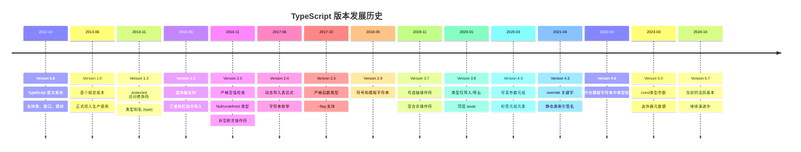
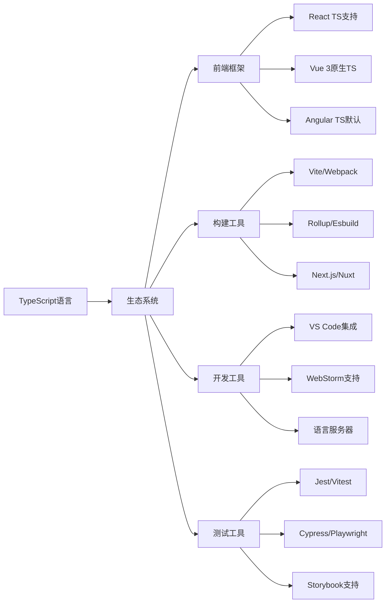

# TypeScript 版本历史

## 🎯 TypeScript 版本发展轨迹

### 📊 版本发布时间线



## 🔥 里程碑版本特性

### ⚡ Version 2.0 - 类型安全突破

```typescript
// Version 2.0 引入的关键特性

// 1. 严格空值检查
let value: string | null = null;
// value.length; // Error: 对象可能为null

// 非空断言操作符
value!.length; // OK: 告诉编译器这里不会是null

// 2. 基于tagged union的区分联合类型
interface Square {
    kind: "square";
    size: number;
}

interface Rectangle {
    kind: "rectangle";
    width: number;
    height: number;
}

type Shape = Square | Rectangle;

function area(s: Shape): number {
    switch (s.kind) {
        case "square":
            return s.size * s.size;
        case "rectangle":
            return s.width * s.height;
    }
}
```

### 🎯 Version 4.0 - 现代化类型系统

```typescript
// Version 4.0 的重磅特性

// 1. 可变参数元组
type Tail<T extends readonly unknown[]> = 
  T extends readonly [any, ...infer Rest] ? Rest : readonly [];

function concat<T extends readonly unknown[], U extends readonly unknown[]>(
    arr1: T,
    arr2: U
): [...T, ...U] {
    return [...arr1, ...arr2] as [...T, ...U];
}

// 2. 标签元组元素
type HttpRequest = 
    [method: 'GET' | 'POST', url: string, headers: Record<string, string>];

function makeRequest(...args: HttpRequest): void {
    const [method, url, headers] = args;
    console.log(`Making ${method} request to ${url}`);
}
```

### 🚀 Version 5.0 - 下一代特性

```typescript
// Version 5.0 的革命性改进

// 1. const 类型参数
function identity<T>(value: T): T {
    return value;
}

function identityConst<const T>(value: T): T {
    return value;
}

const result1 = identity("hello");      // type: string
const result2 = identityConst("hello"); // type: "hello"

// 2. 装饰器元数据增强
function Log(target: any, context: ClassFieldDecoratorContext) {
    return function (this: any, value: any) {
        console.log(`Field ${context.name} set to:`, value);
        return value;
    };
}

class User {
    @Log
    name: string = '';
}
```

## 📈 版本演进策略

### 🎪 语义化版本控制

| 版本类型 | 变化级别 | 示例 | 向后兼容性 |
|----------|----------|------|------------|
| **Major** | 破坏性变更 | 1.0.0 → 2.0.0 | ❌ 可能不兼容 |
| **Minor** | 新功能增加 | 1.0.0 → 1.1.0 | ✅ 保持兼容 |
| **Patch** | 错误修复 | 1.0.0 → 1.0.1 | ✅ 完全兼容 |

### 🔄 迁移指导原则

```typescript
// 版本迁移检查清单

interface MigrationGuide {
    breakingChanges: {
        syntaxChanges: boolean;
        typeCheckChanges: boolean;
        runtimeBehaviorChanges: boolean;
    };
    
    newFeatures: {
        languageFeatures: string[];
        toolingFeatures: string[];
        performanceImprovements: string[];
    };
    
    migrationSteps: {
        updateCompiler: boolean;
        updateDependencies: boolean;
        codeChanges: string[];
        configurationUpdates: boolean;
    };
}
```

## 🎯 重大版本特性对比

### 📊 核心语言特性演进

| 版本 | 重要特性 | 影响评级 | 采用率 |
|------|----------|----------|--------|
| **1.0** | 基础类型系统 | ⭐⭐⭐⭐⭐ | 几乎100% |
| **2.0** | 严格空值检查 | ⭐⭐⭐⭐⭐ | 85%+ |
| **2.9** | 符号和模板字符串 | ⭐⭐⭐⭐ | 70%+ |
| **3.7** | 可选链与空合并 | ⭐⭐⭐⭐⭐ | 90%+ |
| **4.0** | 可变参数元组 | ⭐⭐⭐⭐ | 60%+ |
| **5.0** | const类型参数 | ⭐⭐⭐⭐ | 40%+ |

### 🔧 开发工具演进

```typescript
// 工具链演进历程

interface ToolingEvolution {
    "ESLint集成": "从TSLint迁移到@typescript-eslint";
    "构建工具": "webpack → rollup → esbuild → rsbuild";
    "类型检查": "增量集成优化，提升检查速度"; 
    "语言服务": "改进了代码补全和重构能力";
    "调试支持": "增强了source map和调试体验";
}
```

## 🎪 TypeScript生态演进

### 🌐 配套工具链发展



## 📚 学习不同版本的最佳实践

### 🎯 版本选择策略

| 项目类型 | 推荐版本 | 原因 | 迁移建议 |
|----------|----------|------|----------|
| **新项目** | TypeScript 5.x | 最新特性 | 直接采用最新版本 |
| **企业项目** | TypeScript 4.9 | 稳定性优先 | 评估风险后迁移 |
| **开源库** | TypeScript 4.5+ | 兼容性考虑 | 支持较新版本 |
| **Legacy项目** | TypeScript 3.8+ | 渐进迁移 | 逐步升级策略 |

### 🔗 相关资源

- [[02-Roadmap路线图]] - TypeScript 未来发展方向
- [[03-Breaking-Changes破坏性变更]] - 详细变更记录
- [[04-Future-Directions未来方向]] - 技术发展趋势

---
*💡 理解TypeScript版本历史是掌握技术演进脉络的关键，也为版本迁移规划提供依据*
