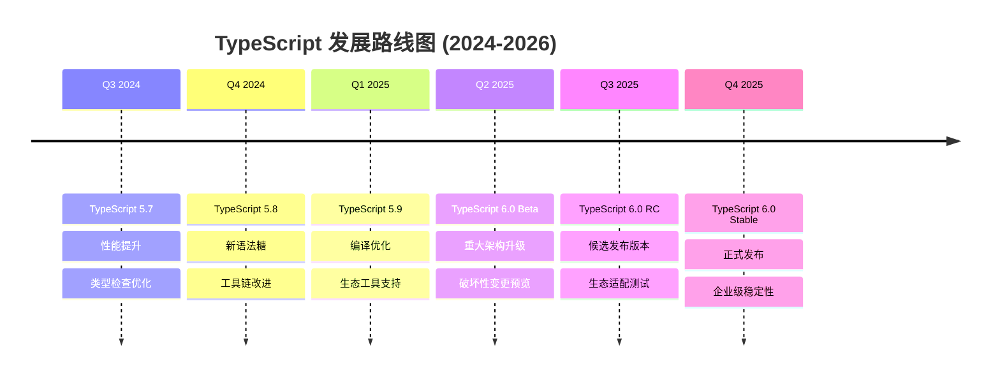

# TypeScript 技术路线图

## 🎯 TypeScript 发展路线图 2024-2026

### 📊 版本发布时间线



## 🚀 技术发展方向

### 🎨 语言特性演进

#### 📝 TypeScript 6.0 预期特性

```typescript
// 1. 增强的类型推断
// 计划：改进复杂泛型的推断能力
class EnhancedIterator<T> {
    // 期望：更智能的约束推断
    iterate(items: Iterable<T>): Generator<T, void, unknown> {
        for (const item of items) {
            yield item;
        }
    }
}

// 2. 新的元编程特性
// 计划：增强装饰器和反射API
declare namespace Reflect {
    function getMetadataKey(target: any, propertyKey: string): string[];
    function defineMetadata(key: string, value: any, target: any, propertyKey?: string): void;
}

// 3. 改进的错误信息
// 计划：更精确的错误定位和建议
interface PlannedErrorImprovements {
    suggestionBasedErrors: boolean;      // 智能修复建议
    contextualHelp: boolean;            // 上下文相关帮助
    progressiveErrors: boolean;         // 渐进式错误修复
}

// 4. 性能优化
// 计划：编译速度和类型检查性能提升
interface PerformanceGoals {
    compileSpeed: '+30%';               // 编译速度提升30%
    typeCheckSpeed: '+50%';             // 类型检查速度提升50%
    memoryUsage: '-20%';                // 内存使用减少20%
}
```

### 🔧 工具链发展

#### 🛠️ 开发工具革新

```typescript
// 1. 下一代语言服务器
interface LanguageServerEnhancements {
    realTimeCollaboration: boolean;     // 实时协作编程
    aiPoweredSuggestions: boolean;      // AI驱动的代码建议
    enhancedRefactoring: boolean;       // 增强的重构支持
    performanceProfiling: boolean;      // 性能分析集成
}

// 2. 构建工具集成优化
interface BuildToolIntegration {
    bundlerOptimization: string[];      // ['webpack', 'rollup', 'esbuild', 'vite']
    monorepoSupport: boolean;          // 更好的monorepo支持
    incrementalBuilds: boolean;         // 增量构建
    parallelProcessing: boolean;        // 并行处理
}

// 3. 调试和开发体验
interface DeveloperExperience {
    enhancedSourceMaps: boolean;        // 改进的源码映射
    typeAwareDebugging: boolean;        // 类型感知调试
    hotReloading: boolean;              // 热重载优化
    memoryProfiling: boolean;           // 内存分析工具
}
```

## 🌐 生态系统扩展

### 📚 框架生态融合

#### ⚛️ 前端框架深度集成

```typescript
// React 18+ TypeScript 集成路线
interface ReactTSEvolution {
    '2024': 'React 19 TypeScript Support';
    '2025': 'Concurrent Features Integration';
    '2026': 'Server Components Type Safety';
}

// Vue 3.x 持续优化
interface VueEnhancement {
    compositionAPI: '增强类型推断';
    templateCompiler: '改进类型检查';
    reactivity: '深度类型集成';
}

// Next.js 全栈TypeScript
interface NextJSRoadmap {
    appRouter: '完全类型安全';
    serverActions: '端到端类型';
    middleware: '类型守卫优化';
}
```

#### 🏢 企业级需求响应

```typescript
// 1. 大规模项目管理
interface EnterpriseFeatures {
    projectReferences: '增强增量编译';
    workspaceSupport: '统一配置管理';
    dependencyOptimization: '智能依赖分析';
    performanceMonitoring: '运行时类型监控';
}

// 2. 团队协作功能
interface CollaborationTools {
    codeReviewIntegration: '类型变更审查';
    documentationGeneration: '自动API文档';
    changeTracking: '类型演进追踪';
    migrationTools: '升级助手';
}
```

## 🔍 技术挑战与机遇

### ⚡ 性能优化重点

#### 📊 编译性能提升

```typescript
// 1. 增量编译增强
interface IncrementalCompilation {
    cacheOptimization: boolean;         // 缓存优化
    dependencyTracking: boolean;       // 依赖追踪
    selectiveRebuilds: boolean;         // 选择性重建
}

// 2. 类型检查加速
interface TypeCheckingOptimization {
    parallelChecking: boolean;          // 并行类型检查
    incrementalValidation: boolean;     // 增量验证
    smartCaching: boolean;              // 智能缓存策略
}

// 3. 内存使用优化
interface MemoryOptimization {
    lazyTypeResolution: boolean;        // 延迟类型解析
    garbageCollectionTuning: boolean;   // 垃圾收集调优
    resourcePooling: boolean;           // 资源池化
}
```

### 🎯 开发者体验提升

#### 💡 智能化开发支持

```typescript
// 1. AI辅助开发
interface AIAssistance {
    intelligentCompletions: boolean;    // 智能代码补全
    refactoringSuggestions: boolean;    // 重构建议
    patternRecognition: boolean;        // 模式识别
    errorPrevention: boolean;           // 错误预防
}

// 2. 学习辅助工具
interface LearningSupport {
    interactiveTutorials: boolean;      // 交互式教程
    typeSystemVisualizer: boolean;      // 类型系统可视化
    bestPracticesGuide: boolean;        // 最佳实践指南
    migrationPathfinder: boolean;       // 迁移路径指导
}

// 3. 社区工具集成
interface CommunityIntegration {
    packageRepository: '官方包仓库';
    templateLibrary: '项目模板库';
    codeSharing: '代码分享平台';
    pluginEcosystem: '插件生态';
}
```

## 📈 采用预期与影响

### 📊 市场采用预测

#### 🌍 全球采用趋势

```typescript
// TypeScript 采用率预测 (2024-2026)
interface AdoptionMetrics {
    corporateAdoption: {
        '2024': '85%';     // 85%的企业项目使用TS
        '2025': '92%';     // 92%的企业项目使用TS  
        '2026': '96%';     // 96%的企业项目使用TS
    };
    
    developerPreference: {
        '2024': '78%';     // 78%的前端开发者偏好TS
        '2025': '84%';     // 84%的前端开发者偏好TS
        '2026': '88%';     // 88%的前端开发者偏好TS
    };
    
    ecosystemGrowth: {
        'packages': '+40% annually';    // 包数量年增长40%
        'frameworks': '+25% annually';  // 框架支持年增长25%
        'tools': '+50% annually';       // 工具集成年增长50%
    };
}
```

### 🎯 行业影响评估

#### 💼 企业级变革

```typescript
// 1. 软件开发流程变革
interface ProcessTransformation {
    shiftLeft: '类型安全左移';              // Shift-left类型安全
    automatedQuality: '自动化质量门';       // 自动化质量控制
    collaborativeDevelopment: '协作开发';   // 增强团队协作
    
}

// 2. 技术债务管理
interface TechnicalDebtManagement {
    proactivePrevention: boolean;        // 主动预防技术债务
    automatedRefactoring: boolean;      // 自动化重构
    continuousMigration: boolean;       // 持续迁移支持
    costOptimization: boolean;          // 成本优化
}

// 3. 人才培养需求
interface TalentDevelopment {
    typeSystemEducation: '类型系统教育';   // 类型系统专门教育
    advancedPatterns: '高级模式培训';       // 高级设计模式培训
    toolingMastery: '工具链精通';          // 工具链熟练使用
    bestPractices: '最佳实践经验';         // 最佳实践知识分享
}
```

## 🔮 新兴技术融合

### 🤖 AI+TypeScript 展望

```typescript
// AI增强的TypeScript开发
interface AIEnhancedDevelopment {
    // 1. 智能代码生成
    intelligentCodeGeneration: {
        contextAwareCompletions: boolean;    // 上下文感知补全
        patternBasedGeneration: boolean;    // 模式生成
        apiIntegrationAssistant: boolean;   // API集成助手
    };
    
    // 2. 自动化重构
    automatedRefactoring: {
        safeTransformation: boolean;         // 安全代码转换
        patternMatching: boolean;           // 模式匹配重构
        optimizationSuggestions: boolean;   // 优化建议
    };
    
    // 3. 智能调试
    intelligentDebugging: {
        errorExplanation: boolean;          // 错误智能解释
        fixSuggestions: boolean;           // 修复建议
        performanceAnalysis: boolean;       // 性能分析
    };
    
    // 4. 代码质量预测
    qualityPrediction: {
        bugRiskAssessment: boolean;         // 缺陷风险评估
        complexityAnalysis: boolean;        // 复杂度分析
        maintainabilityScore: boolean<｜tool▁sep｜>maintainabilityScore: boolean;       // 可维护性评分
    };
}
```

### 🌐 WebAssembly 集成

```typescript
// WASM + TypeScript 集成路线
interface WebAssemblyIntegration {
    '2024': 'WASM模块类型定义';
    '2025': '高性能数值计算';
    '2026': '完整的类型安全互操作';
}

// 预期功能
interface WASMFeatures {
    typeDefinitions: boolean;              // WASM类型定义
    bindingGeneration: boolean;            // 绑定代码生成
    performanceOptimization: boolean;      // 性能优化
    debuggingSupport: boolean;             // 调试支持
}
```

## 📚 学习与适应策略

### 🎯 开发者准备

#### 📖 技能升级路径

```typescript
// 2024-2026学习路线图
interface LearningRoadmap {
    foundationSkills: {
        'Q1 2024': 'TypeScript 5.7+ 新特性';
        'Q2 2024': '高级类型模式';
        'Q3 2024': '性能优化技巧';
        'Q4 2024': '企业级最佳实践';
    };
    
    emergingTechnologies: {
        '2025': 'AI辅助开发工具';
        '2026': 'WebAssembly集成';
    };
    
    specializationPaths: {
        'Frontend': 'React/Vue/Angular深度集成';
        'Backend': 'Node.js企业级架构';
        'FullStack': '端到端类型安全';
        'DevOps': '构建与部署优化';
    };
}
```

### 🔗 持续学习资源

```typescript
interface LearningResources {
    official: {
        documentationUpdates: '官方文档持续更新';
        migrationGuides: '升级指南';
        bestPractices: '官方最佳实践';
    };
    
    community: {
        conferences: 'TypeScript大会';
        workshops: '在线工作坊';
        tutorials: '社区教程';
        books: '技术书籍';
    };
    
    enterprise: {
        consulting: '企业咨询支持';
        training: '定制培训';
        migrationSupport: '迁移支持';
        maintenanceContracts: '维护契约';
    };
}
```

## 🎯 总结与建议

### 📈 关键技术决策

1. **现在 (2024 Q4)**：
   - 升级到 TypeScript 5.7+
   - 实施新的工具链配置
   - 培训团队高级 TypeScript 特性

2. **短期 (2025)**：
   - 为 TypeScript 6.0 做准备
   - 投资 AI 辅助开发工具
   - 优化现有项目性能

3. **长期 (2026+)**：
   - 全面拥抱下一代 TypeScript
   - 探索 WebAssembly 集成
   - 建立企业级 TypeScript 标准

### 🔗 相关深入学习

- [[01-Version-History版本历史]] - 了解版本演进历程
- [[03-Breaking-Changes破坏性变更]] - 版本升级注意事项
- [[04-Future-Directions未来方向]] - 更具体的技术展望

---
*💡 TypeScript的快速发展要求我们保持学习和适应，这个路线图为您的技术规划和团队培训提供了明确的方向*
