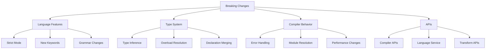

# TypeScript Breaking Changes 破坏性变更指南

## 🎯 Breaking Changes 概览

### 📊 变更分类



## 🔧 语言特性变更

### 💡 严格模式引入

```typescript
// 1. TypeScript 4.0+ 严格模式变更
// tsconfig.json
{
  "compilerOptions": {
    // 4.0 之前：默认关闭，4.0+ 严格模式
    "strict": true,
    
    // 新增的严格检查
    "noImplicitAny": true,           // 4.0+ 默认为 true
    "noImplicitReturns": true,       // 4.0+ 新增
    "noUnusedLocals": true,          // 4.0+ 增强
    "noUnusedParameters": true,      // 4.0+ 增强
    
    // 严格 null 检查改进
    "strictNullChecks": true,        // 4.0+ 更严格
    "noImplicitAny": true,
    
    // 新严格选项
    "exactOptionalPropertyTypes": true   // 4.4+ 可选属性的精确性
  }
}

// 2. NoImplicitAny 变更示例
// ❌ 4.0 之前：隐式 any 被允许
function processData(data) {  // 隐式 any
    return data.name;
}

// ✅ 4.0+ 需要明确类型
function processData(data: { name: string }) {  // 必须明确类型
    return data.name;
}

// 或者使用 any 明确声明
function processData(data: any) {
    return data.name;
}

// 3. ExactOptionalPropertyTypes 变更 (4.4+)
interface UserConfig {
    apiUrl?: string;          // 4.4+ 不能赋值 undefined
    timeout?: number;         // 4.4+ 不能赋值 undefined
    validate?: boolean | undefined;  // 必须明确声明允许 undefined
}

// ❌ 4.4+ 错误：undefined 不被允许
function createConfig(config: Partial<UserConfig>): UserConfig {
    return {
        apiUrl: config.apiUrl,     // 可能 undefined，但接口不允许
        timeout: undefined,        // ❌ 错误：undefined 不被允许
        validate: config.validate
    };
}

// ✅ 修复方案
function createConfigFixed(config: Partial<UserConfig>): UserConfig {
    return {
        apiUrl: config.apiUrl ?? 'default-url',
        timeout: config.timeout ?? 5000,
        validate: config.validate ?? false
    };
}
```

### 🎪 新关键字和语法

```typescript
// 1. TypeScript 4.9+ 新的 satisfies 运算符
// 破坏性：可能影响关键字使用

// ❌ 老版本：使用 as 断言
interface Colors {
  red: "#ff0000";
  blue: "#0000ff";
  green: "#00ff00";
}

const myColors = {
  red: "#ff0000",
  blue: "#0000ff",
  green: "#00ff00",
  purple: "#800080"          // 额外的属性被忽略
} as Colors;

myColors.purple;             // ❌ TypeScript 认为这是错误的

// ✅ 新版本：使用 satisfies
const myColorsNew = {
  red: "#ff0000",
  blue: "#0000ff",
  green: "#00ff00",
  purple: "#800080"          // 保留额外属性
} satisfies Colors;

myColorsNew.purple;          // ✅ 现在可以访问

// 2. Template Literal Types 破坏性变更 (4.1+)
// ❌ 老版本：不支持模板字面量模式
type EventName<T> = `on_${T}`;

// ✅ 新版本：支持的语法
type EventNames<T extends string> = `on_${T}`;
type ClickEvent = EventNames<'click'>;    // 'on_click'

// 破坏性案例：现有类型别名可能需要修改
type OldEventType = string;               // 老定义
type NewEventType<T extends string> = `event_${T}`;  // 新定义需要泛型参数

// 3. Import Type 语法变更 (3.8+)
// ❌ 老版本：type 导入没有特殊处理
import { User, UserService } from './types';

// ✅ 新版本：明确的类型导入
import type { User } from './types';      // 只导入类型
import { UserService } from './types';    // 导入运行时值
// 或者
import { type User, UserService } from './types';
```

## 🚀 类型系统变更

### 🔄 泛型推断增强

```typescript
// 1. TypeScript 4.1+ 泛型推断改进
// 破坏性：可能导致严格化检查
interface GenericResponse<T> {
    data: T;
    status: number;
    message: string;
}

// ❌ 老版本推断：可能过于宽松
function createResponse<T>(data: T): GenericResponse<T> {
    return {
        data,
        status: 200,
        message: 'Success' as string,  // 老版本允许
        timestamp: new Date()          // 额外属性在严格模式下会报错
    };
}

// ✅ 新版本：更精确的推断
function createResponse<T>(data: T): GenericResponse<T> {
    return {
        data,
        status: 200,
        message: 'Success'
        // timestamp: new Date()        // ❌ 严格模式：额外属性被拒绝
    };
}

// 2. Index Signature 变更 (4.1+)
// ❌ 老版本：索引签名过于宽松
interface FlexibleObject {
    [key: string]: any;               // 所有属性都是 any
}

interface StrictObject {
    [key: string]: string | number;   // 更具体的索引类型
    name: string;                     // 具体属性必须兼容索引类型
    age?: number;                     // ✅ 允许的 number
    // isValid: boolean;              // ❌ boolean 不兼容索引类型
}

// 破坏性修复：需要明确属性类型约束
interface CompatibleObject {
    [key: string]: string | number | boolean;
    name: string;
    age: number;
    isValid: boolean;
}

// 3. Overload Resolution 变更 (4.0+)
// ❌ 老版本：模糊的重载可能导致不同行为
function processValue(value: string | number): string;
function processValue(value: string): string {
    return value.toUpperCase();
}

// ❌ TypeScript 4.0+ 可能报重载解析错误
function processValue(value: number): number {
    return value * 2;
}

// ✅ 明确的重载签名顺序
function processValueFixed(value: string): string;
function processValueFixed(value: number): number;
function processValueFixed(value: string | number): string | number {
    if (typeof value === 'string') {
        return value.toUpperCase();
    } else {
        return value * 2;
    }
}
```

### 🎯 模块系统变更

```typescript
// 1. Module Resolution 改进 (4.0+)
// 破坏性：模块解析行为变化

// tsconfig.json
{
  "compilerOptions": {
    "moduleResolution": "node16",     // 4.7+ 推荐
    // "moduleResolution": "node",    // 老版本默认
    
    "allowImportingTsExtensions": true,    // 4.7+ 新增选项
    "noEmit": true,                        // 配合 ts 扩展名导入
    "allowSyntheticDefaultImports": true
  }
}

// ❌ 老版本：模块解析宽松
// package.json 中缺少 exports 字段时的处理
import { someFunction } from 'old-package';

// ✅ 新版本：更严格的模块解析
// package.json 必须包含 exports 字段
{
  "exports": {
    ".": {
      "types": "./dist/index.d.ts",
      "import": "./dist/index.mjs",
      "require": "./dist/index.cjs"
    }
  }
}

// 2. Import Assertions 变更 (4.5+)
// ❌ 老版本：不支持断言语法
import data from './config.json';  // 可能报错

// ✅ 新版本：正确的断言语法
import data from './config.json' assert { type: 'json' };

// TypeScript 4.5+ 后续版本可能改为 import attributes
// import data from './config.json' with { type: 'json' };
```

## 📚 编译器行为变更

### 🔧 错误报告改进

```typescript
// 1. TypeScript 4.0+ 错误信息改进
// 破坏性：更多详细错误信息

// ❌ 老版本：模糊的错误信息
function assignValue(obj: any, key: string, value: any) {
    obj[key] = value;  // 老版本：可能没有明确的错误信息
}

// ✅ 新版本：详细的错误信息
function assignValueBetter(obj: Record<string, unknown>, key: string, value: unknown): void {
    // TypeScript 4.0+ 会给出详细的类型不匹配信息
    obj[key] = value;  // 更详细的赋值错误检查
}

// 2. Unused Variables 检查增强 (4.0+)
function processData(input: string, _unused: number): string {
    // ❌ 4.0+ 严格模式：会检查未使用的变量
    // const helper = 'helper';  // 未使用的变量
    
    return input.toUpperCase();
}

// ✅ 修复：使用下划线前缀
function processDataFixed(input: string, _unused: number): string {
    return input.toUpperCase();
}

// ✅ 或明确返回未使用的变量
function processDataFixed(input: string, unused: number): string {
    unused;  // 明确标记为已使用
    
    return input.toUpperCase();
}

// 3. Source Map 变更 (4.7+)
// tsconfig.json
{
  "compilerOptions": {
    "sourceMap": true,               // 新版本生成更精确的 source map
    "declarationMap": true,          // 声明文件的 source map
    "forceConsistentCasingInFileNames": true,  // 文件名大小写检查更严格
    "exactOptionalPropertyTypes": true         // 可选属性更精确的检查
  }
}
```

## 🎭 迁移策略

### 🔧 自动迁移工具

```typescript
// 1. TypeScript 升级检查脚本
class TypeScriptMigrator {
    static async checkBreakingChanges(
        projectPath: string,
        fromVersion: string,
        toVersion: string
    ): Promise<BreakingChangeReport> {
        const report: BreakingChangeReport = {
            version: toVersion,
            breakingChanges: [],
            recommendations: [],
            migrationSteps: []
        };
        
        // 检查配置文件
        await this.checkConfigChanges(projectPath, fromVersion, toVersion, report);
        
        // 检查代码兼容性
        await this.checkCodeCompatibility(projectPath, fromVersion, toVersion, report);
        
        // 生成迁移建议
        this.generateMigrationRecommendations(report);
        
        return report;
    }
    
    private static async checkConfigChanges(
        projectPath: string,
        fromVersion: string,
        toVersion: string,
        report: BreakingChangeReport
    ): Promise<void> {
        const tsconfigPath = path.join(projectPath, 'tsconfig.json');
        
        if (await fs.pathExists(tsconfigPath)) {
            const config = await import(tsconfigPath);
            
            // 检查严格模式设置
            if (this.shouldEnableStrictMode(fromVersion, toVersion)) {
                report.breakingChanges.push({
                    type: 'config',
                    description: 'Recommending strict mode migration',
                    severity: 'warning',
                    affectedFiles: ['tsconfig.json']
                });
            }
            
            // 检查模块解析设置
            if (this.shouldUpdateModuleResolution(fromVersion, toVersion)) {
                report.recommendations.push({
                    type: 'config',
                    description: 'Consider updating moduleResolution to node16',
                    command: 'npm install typescript@latest'
                });
            }
        }
    }
    
    private static async checkCodeCompatibility(
        projectPath: string,
        fromVersion: string,
        toVersion: string,
        report: BreakingChangeReport
    ): Promise<void> {
        const tsFiles = await glob('**/*.ts', { cwd: projectPath });
        const tsxFiles = await glob('**/*.tsx', { cwd: projectPath });
        const allFiles = [...tsFiles, ...tsxFiles];
        
        for (const file of allFiles) {
            await this.checkFileCompatibility(
                path.join(projectPath, file),
                fromVersion, 
                toVersion,
                report
            );
        }
    }
    
    private static async checkFileCompatibility(
        filePath: string,
        fromVersion: string,
        toVersion: string,
        report: BreakingChangeReport
    ): Promise<void> {
        const content = await fs.readFile(filePath, 'utf8');
        
        // 检查常见破坏性变更模式
        if (content.includes('import(') && this.requiresImportAssertions(toVersion)) {
            report.breakingChanges.push({
                type: 'code',
                description: 'Dynamic imports may require import assertions',
                severity: 'warning',
                affectedFiles: [filePath],
                line: this.findLineNumber(content, 'import(')
            });
        }
        
        // 检查 any 类型使用
        if (this.shouldStrictAnyCheck(fromVersion, toVersion)) {
            const anyCount = (content.match(/\bany\b/g) || []).length;
            if (anyCount > 0) {
                report.recommendations.push({
                    type: 'code',
                    description: `Found ${anyCount} uses of 'any' type`,
                    command: 'Consider adding explicit types'
                });
            }
        }
    }
    
    private static generateMigrationRecommendations(report: BreakingChangeReport): void {
        if (report.breakingChanges.length > 0) {
            report.migrationSteps.push(
                '1. Review breaking changes and update affected code',
                '2. Update tsconfig.json with new strictness options',
                '3. Test your codebase thoroughly',
                '4. Update dependencies that may be affected'
            );
        }
    }
    
    // 版本比较辅助方法
    private static shouldEnableStrictMode(fromVersion: string, toVersion: string): boolean {
        const fromMajor = parseInt(fromVersion.split('.')[0]);
        const toMajor = parseInt(toVersion.split('.')[0]);
        return toMajor > fromMajor && toMajor >= 4;
    }
    
    private static shouldUpdateModuleResolution(fromVersion: string, toVersion: string): boolean {
        const toVersionNum = parseFloat(toVersion);
        return toVersionNum >= 4.7;
    }
    
    private static requiresImportAssertions(version: string): boolean {
        return parseFloat(version) >= 4.5;
    }
    
    private static shouldStrictAnyCheck(fromVersion: string, toVersion: string): boolean {
        const fromMajor = parseInt(fromVersion.split('.')[0]);
        const toMajor = parseInt(toVersion.split('.')[0]);
        return toMajor > fromMajor && toMajor >= 4;
    }
    
    private static findLineNumber(content: string, searchText: string): number {
        const lines = content.split('\n');
        for (let i = 0; i < lines.length; i++) {
            if (lines[i].includes(searchText)) {
                return i + 1;
            }
        }
        return 0;
    }
}

interface BreakingChangeReport {
    version: string;
    breakingChanges: BreakingChange[];
    recommendations: Recommendation[];
    migrationSteps: string[];
}

interface BreakingChange {
    type: 'config' | 'code' | 'api';
    description: string;
    severity: 'error' | 'warning' | 'info';
    affectedFiles: string[];
    line?: number;
}

interface Recommendation {
    type: 'config' | 'code' | 'dependency';
    description: string;
    command: string;
    priority?: 'high' | 'medium' | 'low';
}
```

### 🎯 版本升级检查清单

```typescript
// TypeScript 升级检查清单
const migrationChecklist = {
    // 基础升级步骤
    steps: [
        '1. 备份现有代码',
        '2. 更新 TypeScript 版本',
        '3. 检查 tsconfig.json 配置',
        '4. 运行 type-check',
        '5. 检查依赖兼容性',
        '6. 运行测试套件',
        '7. 更新 CI/CD 配置'
    ],
    
    // 特定版本的迁移指南
    version4: {
        before: 'TypeScript 4.0+',
        changes: [
            '启用 strict 模式检查',
            '更新 index signature 约束',
            '修复 overloading 问题',
            '更新错误信息'
        ],
        checklist: [
            '检查 implicit any 使用',
            '更新泛型约束',
            '修复严格的 null 检查',
            '更新联合类型推断'
        ]
    },
    
    version47: {
        before: 'TypeScript 4.7+',
        changes: [
            '更新 module resolution',
            'Node.js ESM 支持增强',
            'satisfies 操作符',
            '更精确的类型检查'
        ],
        checklist: [
            '更新 package.json exports',
            '检查模块导入语法',
            '更新类型断言',
            '检查可选属性精确性'
        ]
    },
    
    // 工具和自动化
    tools: {
        migration: 'ts-migrate (Airbnb)',
        checker: 'typescript-migration-checker',
        formatter: 'prettier --parser typescript',
        linter: 'eslint --fix'
    },
    
    // 常见问题解决
    troubleshooting: {
        'strict null checks': '使用非空断言或类型守卫',
        'no implicit any': '添加明确的类型注解',
        'module resolution': '更新模块导入路径',
        'overload resolution': '重新排序函数重载'
    }
};

export const MigrationHelpers = {
    // 检查特定破坏性变更
    async checkStrictModeMigration(codebase: string): Promise<StrictModeReport> {
        return {
            implicitAnyErrors: 0,
            strictNullErrors: 0,
            unusedParameterErrors: 0,
            recommendations: []
        };
    },
    
    // 自动修复常见问题
    async autoFixBreakingChanges(filePath: string): Promise<void> {
        // 自动添加类型注解
        // 修复模块导入
        // 更新配置选项
    },
    
    // 生成迁移报告
    async generateMigrationReport(): Promise<string> {
        return 'Migration report...';
    }
};

interface StrictModeReport {
    implicitAnyErrors: number;
    strictNullErrors: number;
    unusedParameterErrors: number;
    recommendations: string[];
}
```

### 🔗 相关深入学习

- [[02-Roadmap路线图]] - TypeScript 发展路线
- [[04-Future-Directions未来方向]] - 未来发展方向
- [[04-Version-Migration升级指南]] - 详细迁移指南

---
*💡 了解破坏性变更对保持 TypeScript 项目现代化至关重要，通过系统化的迁移策略可以平滑升级*
