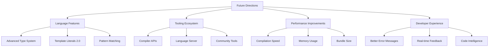

# TypeScript Future Directions 未来发展方向

## 🎯 TypeScript 发展方向概览

### 📊 技术发展趋势



## 🔧 语言特性演进

### 💡 类型系统增强

```typescript
// 1. Template Literal Types 2.0
// 未来支持更复杂的字符串模式匹配

// 当前 TypeScript 4.1+ 支持
type CurrentTemplate<T extends string> = `on_${T}`;

// 未来可能的增强
type FutureTemplate<T extends string, Pattern extends string> = 
    T extends `${infer P}${Pattern}${infer S}`
        ? { prefix: P; match: Pattern; suffix: S }
        : never;

// 字符串模式解构
type ParseURL<U extends string> = 
    U extends `/${infer Route}` 
        ? Route extends `${infer Page}/${infer Section}`
            ? { page: Page; section: Section }
            : { page: Route }
        : never;

type UserProfile = ParseURL<'/users/profile'>; // { page: 'users', section: 'profile' }
type Home = ParseURL<'/home'>; // { page: 'home' }

// 2. Advanced Branded Types
// 更严格的类型边界

type Brand<T, U extends PropertyKey> = T & { __brand: U };

type UserId = Brand<string, 'UserID'>;
type ProductId = Brand<string, 'ProductID'>;

function createUserId(value: string): UserId {
    if (!value || value.length === 0) {
        throw new Error('Invalid user ID');
    }
    return value as UserId;
}

// 防止混淆不同类型的 ID
function getUser(id: UserId) { /* ... */ }
function getProduct(id: ProductId) { /* ... */ }

const userId = createUserId('user-123');
const productId = createProductId('product-456');

getUser(userId); // ✅ OK
getUser(productId); // ❌ Type error: ProductID is not assignable to UserID

// 3. Dependent Types (实验性概念)
// 更强大的类型约束

type Matrix<Rows extends number, Cols extends number> = 
    Array<Array<number>> & { readonly rows: Rows; readonly cols: Cols };

function multiply<A extends number, B extends number>(
    a: Matrix<A, B>,
    b: Matrix<B, C extends number>
): Matrix<A, C> {
    // 类型安全矩阵乘法
    return result as Matrix<A, C>;
}

// 4. Const Assertions 增强
// 更精确的常量推断

// 当前版本
const colors = ['red', 'green', 'blue'] as const;
type Color = typeof colors[number]; // 'red' | 'green' | 'blue'

// 未来可能支持
const futureConfig = {
    api: {
        version: 'v2',
        endpoints: {
            users: '/users',
            posts: '/posts'
        }
    },
    features: {
        darkMode: true,
        analytics: false
    }
} as satisfies ConfigSchema;

type ApiEndpoints = typeof futureConfig.api.endpoints;
type FeatureFlags = typeof futureConfig.features;

// 5. Pattern Matching (TC39 提案)
// 强大的条件逻辑

type Result<T> = { type: 'success'; data: T } | { type: 'error'; error: string };

function handleResult<T>(result: Result<T>) {
    return match(result) {
        case({ type: 'success', data }): {
            return `Success: ${data}`;
        }
        case({ type: 'error', error }): {
            return `Error: ${error}`;
        }
    };
}

// 对象解构模式
function processRequest(req: Request) {
    return match(req) {
        case({ method: 'GET', path: '/users' }): getAllUsers(),
        case({ method: 'POST', path: '/users', body }): createUser(body),
        case({ method: 'PUT', path: `/users/${userId}`, body }): updateUser(userId, body),
        case({ method: 'DELETE', path: `/users/${userId}` }): deleteUser(userId),
        default: throw new Error('Not found')
    };
}
```

### 🎪 编译器性能优化方向

```typescript
// 1. Incremental Compilation 增强
// 更智能的增量编译

interface IncrementalCompilerOptions {
    incremental: true;
    tsBuildInfoFile: '.tsbuildinfo';
    
    // 新功能
    smartCache: {
        enabled: true;
        strategy: 'aggressive' | 'conservative';
        cacheSources: boolean;
        cacheTypes: boolean;
        autoInvalidate: boolean;
    };
    
    parallelExecution: {
        enabled: true;
        maxWorkers: 'auto' | number;
        chunkSize: 'auto' | number;
    };
}

// 2. Memory Management 优化
class OptimizedTypeChecker {
    private typeCache = new WeakMap<ts.Node, ts.Type>();
    private symbolCache = new WeakMap<ts.Node, ts.Symbol>();
    
    constructor(private program: ts.Program) {}
    
    // 智能类型缓存
    getTypeAtLocation(node: ts.Node): ts.Type {
        if (this.typeCache.has(node)) {
            return this.typeCache.get(node)!;
        }
        
        const type = this.program.getTypeChecker().getTypeAtLocation(node);
        
        // 只缓存"昂贵"的类型
        if (this.shouldCacheType(type)) {
            this.typeCache.set(node, type);
        }
        
        return type;
    }
    
    private shouldCacheType(type: ts.Type): boolean {
        // 智能决定哪些类型值得缓存
        return type.symbol?.flags === ts.SymbolFlags.Class ||
               type.symbol?.flags === ts.SymbolFlags.Interface;
    }
    
    // 清理内存
    cleanCache(): void {
        this.typeCache = new WeakMap();
        this.symbolCache = new WeakMap();
    }
}

// 3. Multi-threaded Processing
class ParallelTypeChecker {
    private workerPool = new WorkerPool();
    
    async checkProjectFiles(files: ts.SourceFile[]): Promise<ts.Diagnostic[]> {
        const chunks = this.createChunks(files, this.getOptimalChunkSize());
        
        const promises = chunks.map(chunk => 
            this.workerPool.submit('checkFiles', chunk)
        );
        
        const results = await Promise.all(promises);
        return results.flat();
    }
    
    private createChunks<T>(items: T[], chunkSize: number): T[][] {
        const chunks: T[][] = [];
        for (let i = 0; i < items.length; i += chunkSize) {
            chunks.push(items.slice(i, i + chunkSize));
        }
        return chunks;
    }
    
    private getOptimalChunkSize(): number {
        const cpuCores = navigator.hardwareConcurrency || 4;
        return Math.max(1, Math.floor(1000 / cpuCores));
    }
}

class WorkerPool {
    private workers: Worker[] = [];
    private queue: Array<(worker: Worker) => void> = [];
    
    constructor(poolSize: number = navigator.hardwareConcurrency || 4) {
        for (let i = 0; i < poolSize; i++) {
            this.workers.push(new Worker('./type-checker-worker.js'));
        }
    }
    
    async submit<T>(task: string, data: any): Promise<T> {
        return new Promise((resolve, reject) => {
            const worker = this.getAvailableWorker();
            
            if (worker) {
                this.executeTask(worker, task, data, resolve, reject);
            } else {
                this.queue.push((worker) => {
                    this.executeTask(worker, task, data, resolve, reject);
                });
            }
        });
    }
    
    private executeTask<T>(
        worker: Worker, 
        task: string, 
        data: any, 
        resolve: (value: T) => void, 
        reject: (reason: any) => void
    ): void {
        worker.postMessage({ task, data });
        
        worker.onmessage = (event) => {
            const { result, error } = event.data;
            if (error) {
                reject(error);
            } else {
                resolve(result);
            }
        };
        
        worker.onerror = reject;
    }
    
    private getAvailableWorker(): Worker | undefined {
        return this.workers.find(worker => !worker.busy);
    }
}

// 4. Virtual File System
class VirtualFS {
    private fileCache = new Map<string, FileInfo>();
    
    async readFile(path: string): Promise<string | undefined> {
        if (this.fileCache.has(path)) {
            return this.fileCache.get(path)?.content;
        }
        
        const content = await this.loadFile(path);
        this.fileCache.set(path, {
            content,
            lastModified: Date.now(),
            size: content.length
        });
        
        return content;
    }
    
    watchFile(path: string, callback: (content: string) => void): () => void {
        const interval = setInterval(async () => {
            const currentContent = await this.readFile(path);
            const cachedInfo = this.fileCache.get(path);
            
            if (currentContent && currentContent !== cachedInfo?.content) {
                callback(currentContent);
                this.fileCache.set(path, {
                    content: currentContent,
                    lastModified: Date.now(),
                    size: currentContent.length
                });
            }
        }, 1000);
        
        return () => clearInterval(interval);
    }
    
    private async loadFile(path: string): Promise<string | undefined> {
        // 实现文件加载逻辑
        try {
            const response = await fetch(path);
            return await response.text();
        } catch {
            return undefined;
        }
    }
}

interface FileInfo {
    content: string;
    lastModified: number;
    size: number;
}
```

## 🚀 开发者体验改进

### 🔄 IDE 集成增强

```typescript
// 1. Real-time Collaboration
class CollaborativeTypeScript {
    private editor: MonacoEditor;
    private websocket: WebSocket;
    private cursors: Map<string, CursorPosition> = new Map();
    
    constructor(element: HTMLElement) {
        this.editor = monaco.editor.create(element, {
            value: '',
            language: 'typescript',
            automaticLayout: true,
            theme: 'vs-dark'
        });
        
        this.setupCollaboration();
    }
    
    private setupCollaboration(): void {
        // 监听编辑器变化
        this.editor.onDidChangeModelContent((event) => {
            this.broadcastChanges(event);
        });
        
        // 处理协作事件
        this.editor.onDidChangeCursorSelection((event) => {
            this.broadcastCursorPosition(event);
        });
    }
    
    private broadcastChanges(event: monaco.editor.IModelContentChangedEvent): void {
        const changes = {
            versionId: event.versionId,
            changes: event.changes,
            timestamp: Date.now()
        };
        
        this.websocket.send(JSON.stringify({
            type: 'content-change',
            changes
        }));
    }
    
    private broadcastCursorPosition(event: monaco.editor.ICursorSelectionChangedEvent): void {
        const cursor = {
            line: event.selection.startLineNumber,
            column: event.selection.startColumn,
            timestamp: Date.now()
        };
        
        this.websocket.send(JSON.stringify({
            type: 'cursor-change',
            cursor
        }));
    }
    
    // 应用远程变化
    applyRemoteChange(changes: any): void {
        const model = this.editor.getModel();
        if (!model) return;
        
        model.pushEditOperations(
            [],
            changes.changes.map((change: any) => ({
                range: new monaco.Range(
                    change.range.startLineNumber,
                    change.range.startColumn,
                    change.range.endLineNumber,
                    change.range.endColumn
                ),
                text: change.text
            })),
            () => null
        );
    }
}

interface CursorPosition {
    line: number;
    column: number;
    userId: string;
    color: string;
}

// 2. AI-powered Code Suggestions
class AICodeAssist {
    private languageServer: LanguageClientContainer;
    private suggestionEngine: SuggestionEngine;
    
    constructor() {
        this.suggestionEngine = new SuggestionEngine();
        this.setupLanguageServer();
    }
    
    async getCodeSuggestions(document: string, position: ts.LineAndCharacter): Promise<Suggestion[]> {
        const context = await this.analyzeContext(document, position);
        const suggestions = await this.suggestionEngine.generateSuggestions(context);
        
        return suggestions.map(suggestion => ({
            label: suggestion.text,
            kind: suggestion.type,
            documentation: suggestion.documentation,
            priority: suggestion.confidence,
            insertText: suggestion.text,
            range: suggestion.range
        }));
    }
    
    async generateFunction(name: string, parameters: string[], returnType: string): Promise<string> {
        const signature = `function ${name}(${parameters.join(', ')}): ${returnType}`;
        
        // 使用 AI 生成函数体
        const response = await this.suggestionEngine.generateFunctionBody({
            signature,
            parameters,
            returnType,
            context: this.getCurrentContext()
        });
        
        return `${signature} {\n\t${response.body}\n}`;
    }
    
    private async analyzeContext(document: string, position: ts.LineAndCharacter): Promise<CodeContext> {
        // 分析代码上下文
        const ast = ts.createSourceFile('temp.ts', document, ts.ScriptTarget.Latest);
        const symbol = this.getSymbolAtPosition(ast, position);
        
        return {
            currentSymbol: symbol,
            surroundingCode: this.getSurroundingCode(document, position),
            availableSymbols: this.getAvailableSymbols(ast, position),
            imports: this.getImports(ast),
            projectInfo: this.getProjectInfo()
        };
    }
    
    private getSymbolAtPosition(ast: ts.SourceFile, position: ts.LineAndCharacter): ts.Symbol | undefined {
        const checker = this.languageServer.getTypeChecker();
        const node = ts.getNodeAtPosition(ast, ast.getPositionOfLineAndCharacter(position.line, position.character));
        return checker.getSymbolAtLocation(node);
    }
    
    private getSurroundingCode(document: string, position: ts.LineAndCharacter): string {
        const lines = document.split('\n');
        const start = Math.max(0, position.line - 10);
        const end = Math.min(lines.length - .*, position.line + 10);
        return lines.slice(start, end).join('\n');
    }
    
    private getAvailableSymbols(ast: ts.SourceFile, position: ts.LineAndCharacter): ts.Symbol[] {
        // 获取当前作用域内可用的符号
        return [];
    }
    
    private getImports(ast: ts.SourceFile): ImportInfo[] {
        const imports: ImportInfo[] = [];
        
        ast.forEachChild(node => {
            if (ts.isImportDeclaration(node)) {
                imports.push({
                    moduleSpecifier: node.moduleSpecifier.getText(),
                    namedImports: this.getNamedImports(node),
                    defaultImport: this.getDefaultImport(node)
                });
            }
        });
        
        return imports;
    }
    
    private getNamedImports(node: ts.ImportDeclaration): string[] {
        if (node.importClause?.namedBindings && ts.isNamedImports(node.importClause.namedBindings)) {
            return node.importClause.namedBindings.elements.map(element => element.name.text);
        }
        return [];
    }
    
    private getDefaultImport(node: ts.ImportDeclaration): string | undefined {
        return node.importClause?.name?.text;
    }
    
    private getCurrentContext(): ProjectContext {
        // 获取项目上下文信息
        return {
            files: [],
            dependencies: [],
            frameworks: [],
            patterns: []
        };
    }
}

interface Suggestion {
    label: string;
    kind: string;
    documentation?: string;
    priority: number;
    insertText: string;
    range: ts.Range;
}

interface CodeContext {
    currentSymbol?: ts.Symbol;
    surroundingCode: string;
    availableSymbols: ts.Symbol[];
    imports: RawInfo[];
    projectInfo: ProjectContext;
}

interface ImportInfo {
    moduleSpecifier: string;
    namedImports: string[];
    defaultImport?: string;
}

interface ProjectContext {
    files: string[];
    dependencies: string[];
    frameworks: string[];
    patterns: string[];
}
```

### 🎯 性能监控与分析

```typescript
// 3. Performance Monitoring
class TypeScriptPerformanceMonitor {
    private metrics: PerformanceMetrics[] = [];
    private observers: PerformanceObserver[] = [];
    
    constructor() {
        this.setupMonitoring();
    }
    
    private setupMonitoring(): void {
        // 监听编译性能
        this.observeCompilationTime();
        
        // 监听类型检查性能
        this.observeTypeChecking();
        
        // 监听内存使用
        this.observeMemoryUsage();
        
        // 监听文件系统访问
        this.observeFileSystem();
    }
    
    private observeCompilationTime(): void {
        const observer = new PerformanceObserver((list) => {
            for (const entry of list.getEntries()) {
                if (entry.name.includes('typescript-compilation')) {
                    this.metrics.push({
                        type: 'compilation',
                        name: entry.name,
                        duration: entry.duration,
                        timestamp: entry.startTime,
                        metadata: entry.entryType
                    });
                }
            }
        });
        
        observer.observe({ entryTypes: ['measure'] });
        this.observers.push(observer);
    }
    
    private observeTypeChecking(): void {
        const originalCheckFile = ts.sys.readFile;
        
        ts.sys.readFile = (filename: string, encoding?: string) => {
            const startTime = performance.now();
            const result = originalCheckFile(filename, encoding);
            const endTime = performance.now();
            
            this.metrics.push({
                type: 'file-read',
                name: filename,
                duration: endTime - startTime,
                timestamp: startTime,
                metadata: { size: result?.length || 0 }
            });
            
            return result;
        };
    }
    
    private observeMemoryUsage(): void {
        setInterval(() => {
            if ('memory' in performance) {
                const memory = (performance as any).memory;
                
                this.metrics.push({
                    type: 'memory',
                    name: 'memory-usage',
                    duration: 0,
                    timestamp: Date.now(),
                    metadata: {
                        usedJSHeapSize: memory.usedJSHeapSize,
                        totalJSHeapSize: memory.totalJSHeapSize,
                        jsHeapSizeLimit: memory.jsHeapSizeLimit
                    }
                });
            }
        }, 10000); // 每10秒检查一次
    }
    
    private observeFileSystem(): void {
        const originalHooks = ts.sys.fileExists;
        
        ts.sys.fileExists = (path: string) => {
            const startTime = performance.now();
            const result = originalHooks(path);
            const endTime = performance.now();
            
            this.metrics.push({
                type: 'fs-access',
                name: 'file-exists',
                duration: endTime - startTime,
                timestamp: startTime,
                metadata: { path, exists: result }
            });
            
            return result;
        };
    }
    
    // 获取性能报告
    getPerformanceReport(): PerformanceReport {
        const report: PerformanceReport = {
            totalMetrics: this.metrics.length,
            averageCompilationTime: this.calculateAverage('compilation'),
            averageFileReadTime: this.calculateAverage('file-read'),
            memoryUsage: this.getMemoryUsage(),
            bottlenecks: this.identifyBottlenecks(),
            recommendations: this.generateRecommendations()
        };
        
        return report;
    }
    
    private calculateAverage(type: string): number {
        const relevantMetrics = this.metrics.filter(m => m.type === type);
        if (relevantMetrics.length === 0) return 0;
        
        const totalDuration = relevantMetrics.reduce((sum, m) => sum + m.duration, 0);
        return totalDuration / relevantMetrics.length;
    }
    
    private getMemoryUsage(): MemoryUsage {
        const memoryMetrics = this.metrics.filter(m => m.type === 'memory');
        const latest = memoryMetrics[memoryMetrics.length - 1];
        
        if (latest?.metadata) {
            return latest.metadata as MemoryUsage;
        }
        
        return { usedJSHeapSize: 0, totalJSHeapSize: 0, jsHeapSizeLimit: 0 };
    }
    
    private identifyBottlenecks(): Bottleneck[] {
        const slowOperations = this.metrics.filter(m => m.duration > 1000); // 超过1秒的操作
        
        return slowOperations.map(op => ({
            type: op.type,
            name: op.name,
            duration: op.duration,
            timestamp: op.timestamp,
            impact: op.duration > 5000 ? 'high' : 'medium',
            suggestion: this.getOptimizationSuggestion(op)
        }));
    }
    
    private getOptimizationSuggestion(metric: PerformanceMetrics): string {
        switch (metric.type) {
            case 'compilation':
                return 'Consider enabling incremental compilation or using project references';
            case 'file-read':
                return 'Consider implementing file caching or reducing file system operations';
            case 'fs-access':
                return 'Consider caching file system state or optimizing file watching';
            default:
                return 'Monitor and investigate further';
        }
    }
    
    private generateRecommendations(): string[] {
        const recommendations: string[] = [];
        
        // 基于性能数据生成建议
        const avgCompilationTime = this.calculateAverage('compilation');
        if (avgCompilationTime > 2000) {
            recommendations.push('Enable incremental compilation for faster rebuilds');
            recommendations.push('Consider splitting large projects into smaller modules');
        }
        
        const avgFileReadTime = this.calculateAverage('file-read');
        if (avgFileReadTime > 100) {
            recommendations.push('Implement intelligent file caching');
            recommendations.push('Consider using SSD storage for development');
        }
        
        const memoryUsage = this.getMemoryUsage();
        const memoryRatio = memoryUsage.usedJSHeapSize / memoryUsage.jsHeapSizeLimit;
        if (memoryRatio > 0.8) {
            recommendations.push('Consider optimizing memory usage or increasing Node.js memory limit');
            recommendations.push('Review large object allocations and potential memory leaks');
        }
        
        return recommendations;
    }
    
    // 清理资源
    cleanup(): void {
        this.observers.forEach(observer => observer.disconnect());
        this.observers = [];
        this.metrics = [];
    }
}

interface PerformanceMetrics {
    type: string;
    name: string;
    duration: number;
    timestamp: number;
    metadata: any;
}

interface PerformanceReport {
    totalMetrics: number;
    averageCompilationTime: number;
    averageFileReadTime: number;
    memoryUsage: MemoryUsage;
    bottlenecks: Bottleneck[];
    recommendations: string[];
}

interface Bottleneck {
    type: string;
    name: string;
    duration: number;
    timestamp: number;
    impact: 'low' | 'medium' | 'high';
    suggestion: string;
}

interface MemoryUsage {
    usedJSHeapSize: number;
    totalJSHeapSize: number;
    jsHeapSizeLimit: number;
}
```

### 🔗 相关深入学习

- [[02-Roadmap路线图]] - TypeScript 发展路线
- [[01-Version-History版本历史]] - 版本演进历史
- [[03-Breaking-Changes破坏性变更]] - 破坏性变更迁移

---
*💡 TypeScript 的未来充满无限可能，从语言特性到工具生态都在快速发展，紧跟趋势是保持技术竞争力的关键*
