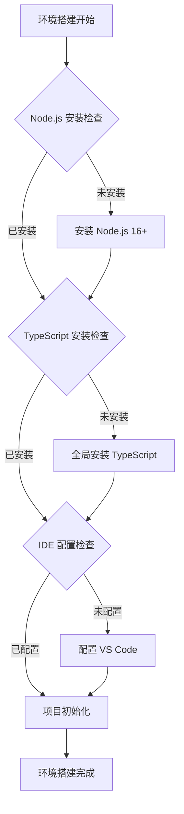

# TypeScript 开发环境全配置

## 🎯 环境搭建总览

### ⚡ 快速搭建检查清单



## 🛠️ 系统环境准备

### 📦 Node.js 环境配置

#### 版本要求和建议

| Node.js 版本 | TypeScript 支持 | 推荐程度 | 原因 |
|--------------|-----------------|----------|------|
| **16.x** | 🟢 完全支持 | ⭐⭐⭐⭐⭐ | LTS + 性能优秀 |
| **18.x** | 🟢 完全支持 | ⭐⭐⭐⭐⭐ | 当前 LTS 版本 |
| **20.x** | 🟢 完全支持 | ⭐⭐⭐⭐ | 最新稳定版 |
| **14.x** | 🟡 限制支持 | ⭐⭐⭐ | 即将停止维护 |

#### 📥 Node.js 安装步骤

```bash
# 方式1: 官方安装包 (推荐新手)
# 1. 访问官网下载: https://nodejs.org/
# 2. 下载 LTS 版本安装包
# 3. 按照向导完成安装

# 方式2: 使用包管理器 (推荐有经验用户)
# Windows (使用 Chocolatey)
choco install nodejs

# macOS (使用 Homebrew)  
brew install node

# Linux (使用包管理器)
sudo apt update && sudo apt install nodejs npm

# 验证安装
node --version
npm --version
```

### 🎯 TypeScript 安装配置

#### 全局安装与本地安装

```bash
# 全局安装 (用于学习和快速原型)
npm install -g typescript
npm install -g ts-node  # 直接运行 .ts 文件

# 本地安装 (推荐项目使用)
npm init -y
npm install -D typescript @types/node

# 验证安装
tsc --version
ts-node --version
```

#### 🏗️ 项目初始化最佳实践

```bash
# 创建新 TypeScript 项目
mkdir my-typescript-project
cd my-typescript-project

# 初始化 package.json
npm init -y

# 安装 TypeScript 开发依赖
npm install -D typescript @types/node nodemon ts-node

# 安装常用工具
npm install -D eslint @typescript-eslint/eslint-plugin @typescript-eslint/parser
npm install -D prettier prettier-tslint

# 初始化 TypeScript 配置
npx tsc --init
```

## 🔧 IDE 环境配置

### 📝 VS Code 完整配置

#### 🎯 必备插件安装

| 插件名 | 功能描述 | T重要性 | 配置复杂度 |
|--------|----------|---------|------------|
| **TypeScript Importer** | 自动导入管理 | ⭐⭐⭐⭐⭐ | 🟢 低 |
| **Bracket Pair Colorizer** | 括号配对着色 | ⭐⭐⭐ | 🟢 低 |
| **Auto Rename Tag** | 标签自动重命名 | ⭐⭐⭐ | 🟢 低 |
| **TypeScript Hero** | TS 增强功能 | ⭐⭐⭐⭐⭐ | 🟡 中 |
| **Prettier - Code formatter** | 代码格式化 | ⭐⭐⭐⭐ | 🟡 中 |
| **ESLint** | 代码质量检查 | ⭐⭐⭐⭐⭐ | 🟡 中 |
| **GitLens** | Git 增强 | ⭐⭐⭐ | 🟢 低 |

#### ⚙️ VS Code 配置文件

```json
// .vscode/settings.json
{
    // TypeScript 配置
    "typescript.preferences.noSemicolons": false,
    "typescript.preferences.importModuleSpecifier": "relative",
    "typescript.suggest.autoImports": true,
    "typescript.updateImportsOnFileMove.enabled": "always",
    
    // 编辑器配置
    "editor.tabSize": 2,
    "editor.insertSpaces": true,
    "editor.detectIndentation": false,
    "editor.formatOnSave": true,
    "editor.formatOnPaste": true,
    "editor.codeActionsOnSave": {
        "source.fixAll.eslint": true,
        "source.organizeImports": true
    },
    
    // Prettier 配置
    "prettier.singleQuote": true,
    "prettier.semi": false,
    "prettier.trailingComma": "es5",
    
    // 文件关联
    "files.associations": {
        "*.ts": "typescript",
        "*.tsx": "typescriptreact",
        "*.vue": "vue"
    },
    
    // 智能提示配置
    "editor.quickSuggestions": {
        "other": true,
        "comments": false,
        "strings": true
    }
}
```

#### 🎪 工作区配置

```json
// .vscode/tasks.json
{
    "version": "2.0.0",
    "tasks": [
        {
            "label": "TypeScript: Watch",
            "type": "typescript",
            "tsconfig": "tsconfig.json",
            "option": "watch",
            "problemMatcher": ["$tsc-watch"],
            "group": {
                "kind": "build",
                "isDefault": true
            }
        },
        {
            "label": "Run TypeScript",
            "type": "shell",
            "command": "npx ts-node",
            "args": ["${file}"],
            "group": "test",
            "presentation": {
                "echo": true,
                "reveal": "always",
                "focus": false,
                "panel": "shared"
            }
        }
    ]
}
```

### 🔗 其他 IDE 支持

#### 📊 IDE 支持对比

| IDE | TypeScript 支持 | 配置复杂度 | 推荐程度 | 适用场景 |
|-----|-----------------|------------|----------|----------|
| **VS Code** | 🟢 原生优秀 | 🟢 简单 | ⭐⭐⭐⭐⭐ | 通用推荐 |
| **WebStorm** | 🟢 商业优秀 | 🟢 简单 | ⭐⭐⭐⭐ | 企业付费 |
| **Vim/Neovim** | 🟡 需要配置 | 🟡 中等 | ⭐⭐⭐ | 命令行爱好者 |
| **Sublime Text** | 🟡 需要插件 | 🟡 中等 | ⭐⭐⭐ | 轻量级编辑器 |
| **Atom** | 🟢 插件支持 | 🟡 中等 | ⭐⭐⭐ | GitHub 生态 |

## 📁 项目结构配置

### 🏗️ 标准项目架构

```bash
project-root/
├── src/                    # 源代码目录
│   ├── components/         # 组件目录
│   ├── types/             # 类型定义目录
│   ├── utils/             # 工具函数目录
│   ├── services/          # 服务层目录
│   └── index.ts           # 入口文件
├── dist/                  # 编译输出目录
├── docs/                  # 文档目录
├── tests/                 # 测试文件目录
├── .vscode/              # VS Code 配置
├── node_modules/         # 依赖包
├── package.json          # 项目配置
├── tsconfig.json         # TypeScript 配置
├── .eslintrc.js          # ESLint 配置
├── .prettierrc           # Prettier 配置
├── .gitignore            # Git 忽略文件
└── README.md             # 项目说明
```

### ⚙️ TypeScript 配置文件详解

```json
// tsconfig.json 最佳实践配置
{
    "compilerOptions": {
        // === 语言和环境 ===
        "target": "ES2022",                    // 编译目标版本
        "lib": ["ES2022", "DOM", "DOM.Iterable"], // 运行时库
        "module": "ESNext",                      // 模块系统
        "moduleResolution": "bundler",           // 模块解析策略
        
        // === 项目结构 ===
        "rootDir": "./src",                      // 源文件根目录
        "outDir": "./dist",                      // 输出目录
        "baseUrl": "./src",                      // 基础路径
        "paths": {                               // 路径映射
            "@/*": ["*"],
            "@/components/*": ["components/*"],
            "@/types/*": ["types/*"]
        },
        
        // === 类型检查 ===
        "strict": true,                          // 启用所有严格检查
        "noImplicitAny": true,                    // 禁止隐式 any
        "strictNullChecks": true,                // 严格空值检查
        "strictFunctionTypes": true,              // 严格函数类型检查
        "noImplicitReturns": true,                // 函数必须有返回值
        
        // === 模块解析 ===
        "esModuleInterop": true,                 // 兼容 CommonJS
        "allowSyntheticDefaultImports": true,    // 允许默认导入
        "forceConsistentCasingInFileNames": true, // 强制文件名大小写一致
        
        // === 编译输出 ===
        "declaration": true,                     // 生成声明文件
        "declarationMap": true,                  // 声明文件 source map
        "sourceMap": true,                       // 生成 source map
        "removeComments": false,                 // 保留注释
        "importHelpers": true,                   // 使用辅助函数
        
        // === 增量编译 ===
        "incremental": true,                     // 增量编译
        "tsBuildInfoFile": "./dist/.tsbuildinfo" // 构建信息文件
    },
    
    "include": [                // 包含文件
        "src/**/*",
        "tests/**/*"
    ],
    
    "exclude": [                // 排除文件
        "node_modules",
        "dist",
        "**/*.spec.ts"
    ],
    
    "compileOnSave": false      // 保存时不自动编译
}
```

## 🚀 开发工具链配置

### 🔧 代码质量工具链

#### 📝 ESLint 配置

```javascript
// .eslintrc.js
module.exports = {
    parser: '@typescript-eslint/parser',
    extends: [
        'eslint:recommended',
        '@typescript-eslint/recommended',
        '@typescript-eslint/recommended-requiring-type-checking'
    ],
    parserOptions: {
        ecmaVersion: 2022,
        sourceType: 'module',
        project: './tsconfig.json'
    },
    plugins: ['@typescript-eslint'],
    rules: {
        // TypeScript 特定规则
        '@typescript-eslint/no-unused-vars': 'error',
        '@typescript-eslint/no-explicit-any': 'warn',
        '@typescript-eslint/explicit-function-return-type': 'off',
        '@typescript-eslint/explicit-module-boundary-types': 'off',
        '@typescript-eslint/no-non-null-assertion': 'warn',
        
        // 代码风格规则
        'indent': ['error', 2],
        'quotes': ['error', 'single'],
        'semi': ['error', 'never'],
        'comma-dangle': ['error', 'es5']
    },
    ignorePatterns: ['dist/', 'node_modules/', '*.js']
}
```

#### 🎨 Prettier 配置

```json
// .prettierrc
{
    "semi": false,
    "singleQuote": true,
    "trailingComma": "es5",
    "tabWidth": 2,
    "useTabs": false,
    "printWidth": 80,
    "bracketSpacing": true,
    "arrowParens": "avoid",
    "endOfLine": "lf"
}
```

### 📦 包管理配置

#### 📋 package.json 脚本配置

```json
{
    "scripts": {
        "build": "tsc",
        "build:watch": "tsc --watch",
        "dev": "nodemon --exec ts-node src/index.ts",
        "start": "node dist/index.js",
        "clean": "rm -rf dist",
        "lint": "eslint src/**/*.ts",
        "lint:fix": "eslint src/**/*.ts --fix",
        "format": "prettier --write src/**/*.ts",
        "test": "jest",
        "test:watch": "jest --watch",
        "type-check": "tsc --noEmit"
    }
}
```

## 🎪 开发环境优化

### ⚡ 性能优化配置

#### 🚀 编译性能优化

```json
// tsconfig.json 性能优化配置
{
    "compilerOptions": {
        // 启用增量编译
        "incremental": true,
        
        // 跳过类型检查但生成文件
        "skipLibCheck": true,
        
        // 使用项目引用进行增量构建
        "composite": true,
        
        // 并行检查声明文件
        "declaration": true,
        "declarationMap": true
    },
    
    // 项目引用优化大项目
    "references": [
        { "path": "./packages/core" },
        { "path": "./packages/utils" }
    ]
}
```

#### 🔍 调试配置优化

```json
// .vscode/launch.json
{
    "version": "0.2.0",
    "configurations": [
        {
            "name": "Debug TypeScript",
            "type": "node",
            "request": "launch",
            "program": "${workspaceFolder}/src/index.ts",
            "outDir": "${workspaceFolder}/dist",
            "runtimeArgs": ["-r", "ts-node/register"],
            "env": {
                "TS_NODE_PROJECT": "${workspaceFolder}/tsconfig.json"
            },
            "console": "integratedTerminal",
            "internalConsoleOptions": "neverOpen",
            "skipFiles": [
                "<node_internals>/**/*.js"
            ]
        }
    ]
}
```

## 🧪 环境验证检查

### ✅ 环境功能测试

#### 🎯 基础功能测试

```typescript
// test-environment.ts
// 1. 基础类型功能测试
interface TestInterface {
    name: string;
    age: number;
    isActive: boolean;
}

function testBasicTypes(): void {
    const data: TestInterface = {
        name: "测试用户",
        age: 25,
        isActive: true
    };
    
    console.log("✅ 基础类型功能正常");
}

// 2. 模块导入导出测试
export { testBasicTypes };
export type { TestInterface };

// 3. 运行测试命令
// ts-node test-environment.ts
testBasicTypes();
```

#### 🔍 配置功能验证

```bash
# 环境验证脚本
echo "🔍 TypeScript 环境验证开始..."

# 检查 TypeScript 安装
echo "检查 TypeScript 版本:"
tsc --version

# 检查 ts-node 安装
echo "检查 ts-node 版本:"
ts-node --version

# 验证配置编译
echo "验证 TypeScript 编译:"
npx tsc --noEmit

# 检查 ESLint
echo "验证 ESLint 配置:"
npx eslint src/test-environment.ts

echo "✅ 环境验证完成!"
```

## 🎯 快速上手指导

### 🏃‍♂️ 30分钟快速搭建流程

1. **安装 Node.js** (10分钟)
   ```bash
   # 下载并安装 Node.js LTS 版本
   # 验证安装: node --version && npm --version
   ```

2. **安装 TypeScript** (5分钟)
   ```bash
   npm install -g typescript ts-node
   # 验证安装: tsc --version
   ```

3. **配置 VS Code** (10分钟)
   - 安装推荐插件
   - 复制上述配置文件
   - 验证智能提示功能

4. **创建测试项目** (5分钟)
   ```bash
   mkdir ts-test && cd ts-test
   npm init -y
   npm install -D typescript @types/node
   npx tsc --init
   ```

5. **测试环境功能**
   ```bash
   echo 'console.log("Hello TypeScript!");' > test.ts
   tsc test.ts
   node test.js
   ```

### 🔗 下一步学习

- [[02-工具链详解]] - 深度了解开发工具
- [[03-最佳实践模板]] - 获取项目模板
- [[01-15分钟快速上手]] - 开始第一个 TypeScript 项目

---
*💡 记住：好的开发环境是高效学习 TypeScript 的基础，花费时间搭建环境是值得的投资*
