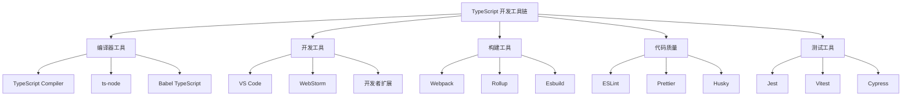

# TypeScript 工具链详解

## 🎯 工具链概览

### 📊 TypeScript 开发生态系统



## 🔧 TypeScript 编译器

### ⚡ TypeScript Compiler (tsc)

#### 🎯 编译选项详解

```typescript
// tsconfig.json 高级配置
{
    "compilerOptions": {
        // === 基础编译选项 ===
        "target": "ES2022",                    // 编译目标版本
        "module": "ESNext",                    // 模块系统
        "lib": ["ES2022", "DOM", "WebWorker"], // 库文件引用
        "allowJs": true,                       // 允许 JavaScript 文件
        "checkJs": false,                     // 检查 JavaScript 文件
        
        // === 模块解析选项 ===
        "moduleResolution": "bundler",         // 模块解析策略
        "baseUrl": "./",                       // 模块解析基础路径
        "paths": {                             // 路径映射
            "@/*": ["src/*"],
            "@/components/*": ["src/components/*"],
            "@/utils/*": ["src/utils/*"]
        },
        "rootDirs": ["./src", "./tests"],     // 根目录列表
        "typeRoots": ["./types", "./node_modules/@types"],
        
        // === 严格检查选项 ===
        "strict": true,                        // 启用所有严格检查
        "noImplicitAny": true,                // 禁止隐式 any
        "strictNullChecks": true,             // 严格空值检查
        "strictFunctionTypes": true,          // 严格函数类型检查
        "strictBindCallApply": true,          // 严格的 bind/call/apply
        "strictPropertyInitialization": true,   // 严格属性初始化
        "noImplicitReturns": true,            // 禁止隐式返回
        "noFallthroughCasesInSwitch": true,   // 禁止 switch 语句穿透
        
        // === 输出控制选项 ===
        "declaration": true,                   // 生成声明文件
        "declarationMap": true,               // 声明文件 source map
        "emitDeclarationOnly": false,         // 仅生成声明文件
        "sourceMap": true,                    // 生成 source map
        "inlineSourceMap": false,             // 内联 source map
        "outFile": "./dist/bundle.js",       // 单文件输出
        "outDir": "./dist",                   // 输出目录
        "removeComments": false,              // 移除注释
        "noEmitOnError": true,                // 错误时不生成文件
        
        // === 语言特性选项 ===
        "experimentalDecorators": true,       // 实验性装饰器
        "emitDecoratorMetadata": true,        // 装饰器元数据
        "jsx": "react-jsx",                   // JSX 支持
        "jsxFactory": "React.createElement",   // JSX 工厂函数
        
        // === 性能优化选项 ===
        "incremental": true,                  // 增量编译
        "tsBuildInfoFile": "./dist/.tsbuildinfo",
        "skipLibCheck": true,                 // 跳过库文件检查
        "skipDefaultLibCheck": false,         // 跳过默认库检查
    }
}
```

#### 🚀 编译命令详解

```bash
# 基础编译命令
tsc                    # 根据 tsconfig.json 编译
tsc app.ts            # 编译单个文件
tsc index.ts app.ts   # 编译多个文件

# 高级编译选项
tsc --watch           # 监视模式
tsc --build           # 增量构建
tsc --clean           # 清理构建信息
tsc --listFiles       # 列出编译文件

# 项目引用
tsc --build --force   # 强制重建所有项目
tsc --build --verbose # 详细输出信息
```

### 🔥 ts-node - 直接运行 TypeScript

#### ⚙️ ts-node 配置选项

```bash
#!/bin/bash
# ts-node 使用示例

# 基础运行
ts-node script.ts

# 使用不同 TypeScript 版本
ts-node --transpile-only app.ts

# 项目模式 (推荐)
ts-node -r tsconfig-paths/register src/index.ts

# 执行特定代码
ts-node -e "console.log('Hello from TypeScript')"

# 交互式 REPL
ts-node
```

#### 🔧 ts-node 高级配置

```javascript
// tsconfig.json 中的 ts-node 配置
{
    "ts-node": {
        "esm": true,                          // ESM 模块支持
        "experimentalSpecifierResolution": "node",
        "compilerOptions": {
            "module": "ESNext",
            "target": "ES2022"
        },
        "files": true,                        // 包含文件列表
        "transpileOnly": true,               // 只转译不检查类型
        "compiler": "typescript",            // 编译器选择
        "skipIgnore": false,                  // 跳过忽略文件
        "experimentalDecorators": true,       // 装饰器支持
        "emitDecoratorMetadata": true         // 装饰器元数据
    }
}
```

## 🛠️ 开发环境工具

### 💻 IDE 集成开发环境

#### 🔥 VS Code TypeScript 扩展

| 扩展名 | 功能描述 | 重要性 | 配置复杂度 |
|--------|----------|--------|------------|
| **TypeScript Importer** | 自动导入和重构 | ⭐⭐⭐⭐⭐ | 🟢 低 |
| **Auto Import - ES6** | ES6 自动导入 | ⭐⭐⭐⭐ | 🟢 低 |
| **TypeScript Hero** | 高级 TypeScript 功能 | ⭐⭐⭐⭐⭐ | 🟡 中 |
| **TSLint** | TypeScript 代码检查 | ⭐⭐⭐⭐⭐ | 🟡 中 |
| **JavaScript and TypeScript Nightly** | 最新 TS 语言服务 | ⭐⭐⭐ | 🟢 低 |
| **TypeScript Error** | 改进错误显示 | ⭐⭐⭐ | 🟢 低 |

#### ⚡ IDE 性能优化

```json
// VS Code settings.json 性能优化
{
    "typescript.preferences.includePackageJsonAutoImports": "auto",
    "typescript.suggest.autoImports": true,
    "typescript.updateImportsOnFileMove.enabled": "true",
    "typescript.preferences.importModuleSpecifier": "relative",
    "typescript.format.enable": true,
    "typescript.preferences.quotes": "single",
    "typescript.preferences.semicolons": "off",
    "editor.tabSize": 2,
    "editor.insertSpaces": true,
    "editor.codeActionsOnSave": {
        "source.formatDocument": true,
        "source.organizeImports": true,
        "source.fixAll": true
    }
}
```

### 🔧 代码编辑器增强

#### 📝 语言服务协议 (LSP)

```json
// 语言服务器配置
{
    "typescript.server.tsserver.plugins": [
        {
            "name": "typescript-hero",
            "config": {
                "sortImports": true,
                "removeUnusedImports": true
            }
        }
    ],
    "typescript.server.syntax": {
        "experimentalDecorators": true,
        "tsImportSupport": {
            "autoTrigger": true
        }
    }
}
```

## 🔨 构建工具集成

### 📦 Webpack TypeScript 集成

#### ⚙️ Webpack 配置

```javascript
// webpack.config.js
const path = require('paths');

module.exports = {
    entry: './src/index.ts',
    module: {
        rules: [
            {
                test: /\.tsx?$/,
                use: 'ts-loader',
                exclude: /node_modules/,
            },
        ],
    },
    resolve: {
        extensions: ['.tsx', '.ts', '.js'],
        alias: {
            '@': path.resolve(__dirname, 'src'),
            '@/components': path.resolve(__dirname, 'src/components'),
            '@/utils': path.resolve(__dirname, 'src/utils'),
        },
    },
    output: {
        filename: 'bundle.js',
        path: path.resolve(__dirname, 'dist'),
        clean: true,
    },
};

// package.json scripts
{
    "scripts": {
        "build": "webpack --mode=production",
        "dev": "webpack serve --mode=development",
        "build:watch": "webpack --watch --mode=development"
    }
}
```

### 🚀 Vite TypeScript 支持

```typescript
// vite.config.ts
import { defineConfig } from 'vite';
import { resolve } from 'path';

export default defineConfig({
    resolve: {
        alias: {
            '@': resolve(__dirname, 'src'),
            '@/components': resolve(__dirname, 'src/components'),
        },
    },
    build: {
        target: 'es2022',
        sourcemap: true,
        rollOptions: {
            external: ['react', 'react-dom'],
            output: {
                globals: {
                    'react': 'React',
                    'react-dom': 'ReactDOM',
                },
            },
        },
    },
    esbuild: {
        target: 'es2022',
    },
});
```

## 🎯 代码质量工具链

### 🔍 ESLint TypeScript 配置

#### ⚙️ 完整 ESLint 配置

```javascript
// .eslintrc.js
module.exports = {
    extends: [
        'eslint:recommended',
        '@typescript-eslint/recommended',
        '@typescript-eslint/recommended-requiring-type-checking'
    ],
    parser: '@typescript-eslint/parser',
    plugins: ['@typescript-eslint'],
    parserOptions: {
        ecmaVersion: 2022,
        sourceType: 'module',
        project: './tsconfig.json',
        tsConfigRootDir: __dirname,
    },
    rules: {
        // TypeScript 特定规则
        '@typescript-eslint/no-unused-vars': ['error', { 'argsIgnorePattern': '^_' }],
        '@typescript-eslint/explicit-function-return-type': 'warn',
        '@typescript-eslint/no-explicit-any': 'warn',
        '@typescript-eslint/no-non-null-assertion': 'error',
        '@typescript-eslint/prefer-nullish-coalescing': 'error',
        '@typescript-eslint/prefer-optional-chain': 'error',
        
        // 代码质量规则
        'complexity': ['error', 10],
        'max-depth': ['error', 4],
        'max-lines-per-function': ['error', 50],
        'no-console': 'warn',
        'prefer-const': 'error',
        
        // 代码风格规则
        'quotes': ['error', 'single'],
        'semi': ['error', 'never'],
        'comma-dangle': ['error', 'es5'],
        'object-curly-spacing': ['error', 'always'],
    },
    ignorePatterns: ['node_modules/', 'dist/', '*.js'],
};
```

### 🎨 Prettier 配置

```json
// .prettierrc
{
    "semi": false,
    "singleQuote": true,
    "trailingComma": "es5",
    "tabWidth": 2,
    "useTabs": false,
    "printWidth": 80,
    "bracketSpacing": true,
    "arrowParens": "avoid",
    "endOfLine": "lf",
    "bracketSameLine": false,
    "singleAttributePerLine": true
}
```

### 🔗 Git Hooks 集成

```javascript
// lint-staged.config.js
module.exports = {
    '**/*.{ts,tsx}': [
        'eslint --fix',
        'prettier --write',
        'git add'
    ],
    '**/*.{js,jsx}': [
        'eslint --fix',
        'prettier --write'
    ],
    '**/*.{json,md,css}': [
        'prettier --write'
    ]
};
```

## 🧪 测试工具链

### 🔥 Jest TypeScript 集成

```javascript
// jest.config.js
module.exports = {
    preset: 'ts-jest',
    testEnvironment: 'node',
    roots: ['<rootDir>/tests'],
    testMatch: ['**/*.test.ts'],
    collectCoverageFrom: [
        'src/**/*.ts',
        '!src/**/*.d.ts',
        '!src/**/*.test.ts',
    ],
    coverageThreshold: {
        global: {
            branches: 80,
            functions: 80,
            lines: 80,
            statements: 80,
        },
    },
    setupFilesAfterEnv: ['<rootDir>/tests/setup.ts'],
    transform: {
        '^.+\\.ts$': 'ts-jest',
    },
    moduleNameMapping: {
        '^@/(.*)$': '<rootDir>/src/$1',
        '^@/components/(.*)$': '<rootDir>/src/components/$1',
    },
};
```

### 📊 测试类型定义

```typescript
// tests/types/jest.d.ts
declare global {
    namespace jest {
        interface Matchers<R> {
            toBeWithinRange(floor: number, ceiling: number): R;
            toBeValidEmail(): R;
            toBeTypeSafe(): R;
        }
    }
}

export {};
```

## 🚀 开发工作流

### 📋 package.json 脚本管理

```json
{
    "scripts": {
        // === 开发脚本 ===
        "dev": "nodemon --exec ts-node -r tsconfig-paths/register src/index.ts",
        "dev:debug": "nodemon --inspect --exec ts-node -r tsconfig-paths/register src/index.ts",
        "dev:watch": "tsc --watch",
        
        // === 构建脚本 ===
        "build": "tsc && npm run build:copy-assets",
        "build:watch": "tsc --watch",
        "build:clean": "rimraf dist",
        "build:copy-assets": "copyfiles src/**/*.json dist",
        
        // === 类型检查 ===
        "type-check": "tsc --noEmit",
        "type-check:watch": "tsc --noEmit --watch",
        
        // === 代码质量 ===
        "lint": "eslint src/**/*.ts --ext .ts",
        "lint:fix": "eslint src/**/*.ts --ext .ts --fix",
        "format": "prettier --write \"src/**/*.{ts,json,md}\"",
        "format:check": "prettier --check \"src/**/*.{ts,json,md}\"",
        
        // === 测试脚本 ===
        "test": "jest",
        "test:watch": "jest --watch",
        "test:coverage": "jest --coverage",
        "test:ci": "jest --ci --coverage --watchAll=false",
        
        // === 预提交钩子 ===
        "prepare": "husky install",
        "pre-commit": "lint-staged",
        
        // === 发布准备 ===
        "pre-build": "npm run clean && npm run type-check && npm run lint",
        "post-build": "npm run test:ci",
        
        // === 生产部署 ===
        "start": "node dist/index.js",
        "start:production": "NODE_ENV=production node dist/index.js"
    }
}
```

### 🔄 持续集成配置

```yaml
# .github/workflows/ci.yml
name: TypeScript CI

on:
    push:
        branches: [ main, develop ]
    pull_request:
        branches: [ main ]

jobs:
    build-and-test:
        runs-on: ubuntu-latest
        
        strategy:
            matrix:
                node-version: [18.x, 20.x]
        
        steps:
        - uses: actions/checkout@v3
        
        - name: Use Node.js ${{矩阵.node-version}}
          uses: actions/setup-node@v3
          with:
            node-version: ${{矩阵.node-version}}
            cache: 'npm'
        
        - name: Install dependencies
          run: npm ci
        
        - name: Run type checking
          run: npm run type-check
        
        - name: Run linting
          run: npm run lint
        
        - name: Run formatting checker
          run: npm run format:check
        
        - name: Run tests
          run: npm run test:ci
        
        - name: Build project
          run: npm run build
```

## 🎯 性能优化技巧

### ⚡ 编译性能优化

#### 🔥 大型项目优化策略

```javascript
// tsconfig.json 性能优化
{
    "compilerOptions": {
        // 启用增量编译
        "incremental": true,
        "tsBuildInfoFile": "./dist/.tsbuildinfo",
        
        // 并行处理
        "skipLibCheck": true,
        
        // 缓存优化
        "preserveWatchOutput": true,
        
        // 工作区优化
        "composite": true
    },
    
    // 项目引用 - 加速大型项目编译
    "references": [
        { "path": "./packages/core" },
        { "path": "./packages/utils" },
        { "path": "./packages/ui" },
        { "path": "./packages/api" }
    ]
}
```

### 💾 内存优化配置

```bash
# Node.js 内存配置
NODE_OPTIONS="--max-old-space-size=4096" npm run build
NODE_OPTIONS="--max-old-space-size=8192" npm run dev
```

## 📚 工具链最佳实践

### 🎯 开发效率提升策略

1. **ESLint + Prettier**: 自动格式化代码风格
2. **Husky + lint-staged**: 提交前自动检查
3. **VS Code 扩展**: 提升开发体验
4. **ts-node**: 开发时跳过编译步骤  
5. **watch 模式**: 监听文件变化自动构建

### 🔧 问题排查技巧

```bash
# TypeScript 编译问题诊断
tsc --diagnostics          # 编译诊断信息
tsc --extendedDiagnostics  # 详细诊断
tsc --listFiles           # 列出编译文件
tsc --showConfig          # 显示实际配置

# 性能分析
tsc --incremental --tsBuildInfoFile build/tsconfig.tsbuildinfo
```

---

*💡 完整的工具链是 TypeScript 开发效率的保证，合理配置能大幅提升开发体验和代码质量*
