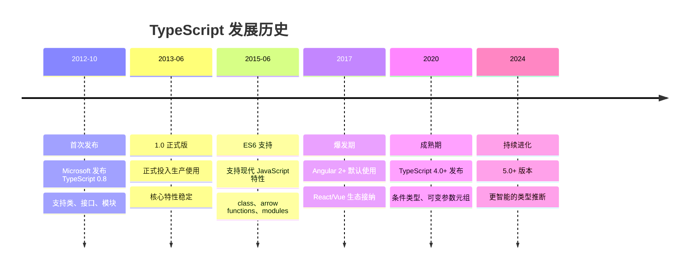
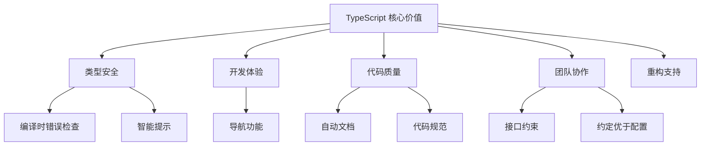
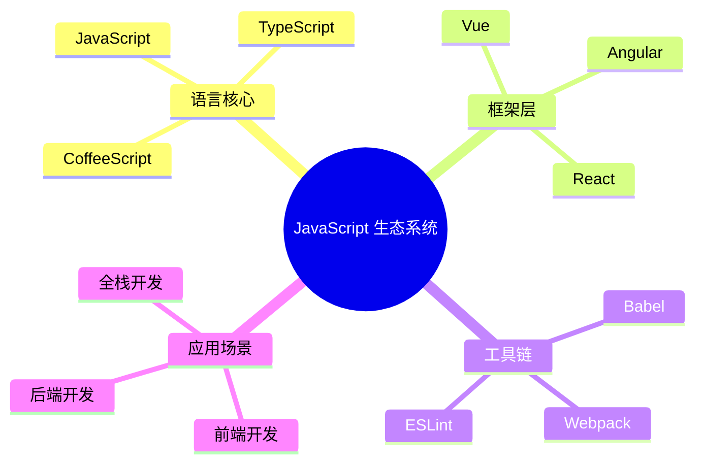
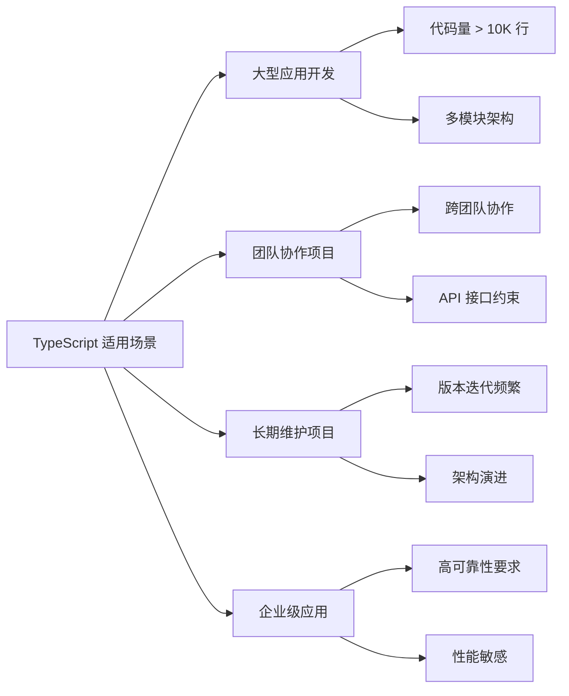
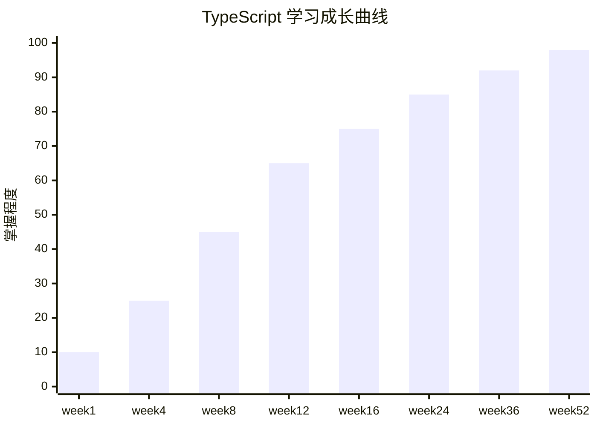

# TypeScript 本质与价值

## 🎯 TypeScript 是什么

### 🔤 核心定义
> TypeScript 是 JavaScript 的超集，为 JavaScript 添加了静态类型系统，让大型应用开发更加可靠、可维护。

```typescript
// JavaScript
function greet(name) {
    return "Hello " + name;
}

// TypeScript - 添加类型注解
function greet(name: string): string {
    return "Hello " + name;
}
```

### 🏗️ TypeScript 三大本质特征

| 特征 | 描述 | 价值体现 |
|------|------|----------|
| **🧩 JavaScript 超集** | 完全兼容 JavaScript 语法 | 渐进式迁移，无重构成本 |
| **⚡ 静态类型系统** | 编译时类型检查 | 减少运行时错误，提升代码质量 |
| **🔧 工具链支持** | IDE 智能提示、重构 | 提升开发体验和效率 |

## 📈 TypeScript 发展历程

### 📅 历史时间线



### 🎪 里程碑版本特性

| 版本 | 重大特性 | 影响意义 |
|------|----------|----------|
| **0.8** | 类型注解、类、接口 | TypeScript 诞生 |
| **1.0** | 模块系统、装饰器 | 生产可用 |
| **2.0** | union types、null checks | 类型安全性提升 |
| **3.0** | 泛型约束、映射类型 | 高级类型系统 |
| **4.0** | 可变参数元组、标签元组 | 函数重载增强 |
| **5.0** | 装饰器元数据、性能优化 | 企业级特性 |

## 💡 TypeScript 核心价值

### 🔍 四大核心价值



### 📊 价值量化对比

| 指标 | JavaScript | TypeScript | 提升幅度 |
|------|------------|------------|----------|
| **编译时错误发现** | 0% | 80%+ | ∞ |
| **智能代码补全** | 基础 | 精确 | 300% |
| **重构成功率** | 60% | 95% | 58% |
| **新人上手速度** | 快 | 中等 | 略慢 |
| **大型项目维护** | 困难 | 简单 | 显著改善 |

## 🚀 TypeScript 技术定位

### 🎪 在 JavaScript 生态中的位置



### 🏆 与传统语言对比

| 特性 | TypeScript | Java | C# | Go |
|------|------------|------|----|----|
| **类型系统** | 结构化 | 名义化 | 名义化 | 结构化 |
| **编译方式** | 转译 | 机器码 | 中间码 | 机器码 |
| **类型推断** | 强大 | 有限 | 强大 | 强|
| **学习曲线** | 低 | 中 | 中 | 低 |
| **生态兼容** | 完美 | 需适配 | 需适配 | 需适配 |

## 🎯 TypeScript 适用场景

### ✅ 最佳适用场景



### 🏗️ 技术栈契合度

| 技术栈 | TypeScript 支持度 | 推荐度 |
|--------|-------------------|--------|
| **React 生态** | 🟢 优秀 | ⭐⭐⭐⭐⭐ |
| **Vue 3.x** | 🟢 原生支持 | ⭐⭐⭐⭐⭐ |
| **Angular** | 🟢 默认使用 | ⭐⭐⭐⭐⭐ |
| **Node.js** | 🟢 成熟方案 | ⭐⭐⭐⭐⭐ |
| **Deno/ Bun** | 🟢 内置支持 | ⭐⭐⭐⭐⭐ |
| **小程序** | 🟡 工具支持 | ⭐⭐⭐ |

## 🎪 TypeScript 学习方法论

### 📚 学习路径设计

1. **认知建立** (1-2天)
   - 理解 TypeScript 本质
   - 搭建开发环境
   - 第一个 Hello World

2. **类型掌握** (2-4周)
   - 基础类型系统
   - 接口与类型别名
   - 泛型基础应用

3. **工程实践** (4-8周)
   - 模块系统
   - 配置管理
   - 与框架集成

4. **深度精通** (8-12周)
   - 高级类型技巧
   - 设计模式应用
   - 性能优化

### 🧠 学习策略

#### 💡 费曼学习法应用
- **解释给他人听**: 每学一个新概念，尝试向朋友解释
- **类比理解**: 将复杂概念与熟悉事物类比
- **简化表达**: 用最简单语言描述核心思想

#### 💪 刻意练习要点
- **明确目标**: 每阶段设定具体技能目标
- **即时反馈**: 通过练习和测试获得反馈
- **走出舒适区**: 逐步挑战更复杂类型操作

## 📊 学习效果预期

### 🎯 学习里程碑

| 阶段 | 时间投入 | 技能水平 | 可完成任务 |
|------|----------|----------|------------|
| **入门** | 2-4 周 | 初级 | 简单类型标注、基础项目开发 |
| **熟练** | 2-3 月 | 中级 | 复杂类型设计、框架集成项目 |
| **精通** | 6-12 月 | 高级 | 类型库设计、企业级架构设计 |

### 📈 技能成长曲线预测



## 🎯 行动指南

### 🏃‍♂️ 立即行动清单

- [ ] 理解 TypeScript 核心概念和价值定位
- [ ] 搭建第一个 TypeScript 开发环境
- [ ] 创建第一个 TypeScript 项目
- [ ] 指定个人学习计划和目标

### 🔗 相关资源

- [[02-TypeScript设计哲学]] - 深入学习设计理念
- [[03-学习路径规划]] - 制定个性化学习方案
- [[01-开发环境全配置]] - 环境搭建实践

---
*💡 核心理念：TypeScript 不是目的，而是更安全、更高效地构建 JavaScript 应用的手段*
