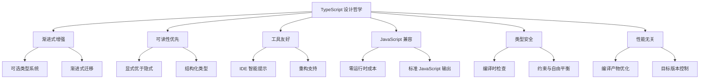
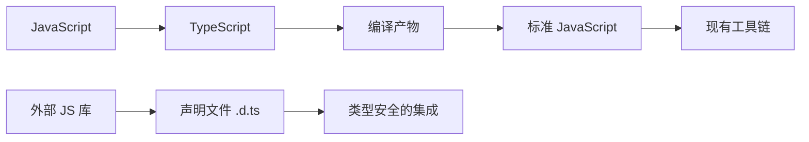
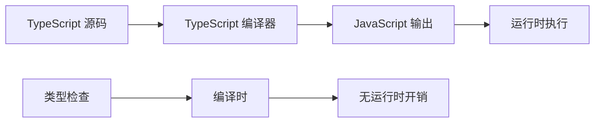

# TypeScript 设计哲学

## 🎯 设计理念核心

### 💡 六大设计原则



## 🔍 深度理念解析

### 📈 一、渐进式增强 (Progressive Enhancement)

> **核心理念**: TypeScript 应该能够逐步增强现有 JavaScript 代码，而非颠覆式重构。

#### 🎪 渐进式设计体现

| 特性 | 设计原则 | 实现方式 |
|------|----------|----------|
| **可选类型检查** | 类型标注是可选的 | `--noImplicitAny: false` |
| **增量迁移** | 逐个文件迁移 | 单一文件编译支持 |
| **宽松模式** | 兼容现有 JS 代码 | `strict: false` 默认配置 |

```typescript
// 示例：渐进式类型增强
// 1. 原始 JavaScript 代码
function processData(data) {
    return data.map(item => ({
        id: item.id,
        name: item.name.toUpperCase()
    }));
}

// 2. 添加基础类型注解（渐进式步骤1）
function processData(data: any[]): any[] {
    return data.map(item => ({
        id: item.id,
        name: item.name.toUpperCase()
    }));
}

// 3. 添加精确类型定义（渐进式步骤2）
interface UserData {
    id: number;
    name: string;
}

function processData(data: UserData[]): Array<{id: number, name: string}> {
    return data.map(item => ({
        id: item.id,
        name: item.name.toUpperCase()
    }));
}
```

### 📖 二、可读性优先 (Readability First)

> **核心理念**: 类型系统应该增强代码可读性，而非增加复杂性。

#### 🎯 可读性设计原则

```typescript
// ✅ 良好的类型设计 - 自解释性强
interface ApiResponse<T> {
    success: boolean;
    data: T;
    error?: string;
}

// ✅ 函数意图清晰
function validateUserInput(input: string): boolean {
    return input.length > 0 && input.trim().length > 0;
}

// ❌ 过度复杂的类型设计
type HyperComplexType<T, K extends keyof T> = {
    readonly [P in keyof T]: T[P] extends infer R ? R extends K ? never : T[P] : never;
}
```

### 🛠️ 三、工具友好 (Tool-friendly)

> **核心理念**: TypeScript 设计始终考虑开发工具的需求，提供丰富的类型信息。

#### 🔧 工具友好特性

| 工具需求 | TypeScript 支持 | 开发者受益 |
|----------|------------------|------------|
| **智能提示** | 精确类型推断 | 减少查找时间 50%+ |
| **错误诊断** | 详细错误信息 | 快速定位问题 |
| **自动重构** | 类型信息完整 | 重构安全可靠 |
| **文档生成** | 类型即文档 | 自动 API 文档 |

```typescript
// 工具友好的接口设计示例
interface ProductAPI {
    // API 文档自动生成
    /**
     * 获取产品列表
     * @param category 产品分类 ID
     * @param page 页码，从 1 开始
     * @param pageSize 每页数量，最大 100
     */
    async getProducts(
        category: ProductCategory['id'],
        page: number,
        pageSize: number = 20
    ): Promise<PaginatedResponse<Product>>;
}
```

### 🔄 四、JavaScript 兼容 (JavaScript Compatibility)

> **核心理念**: TypeScript 必须与 JavaScript 生态系统完美兼容，不影响现有工具链。

#### 🎪 兼容性设计策略



#### 📊 兼容性保证机制

| 兼容层面 | 实现方式 | 验证方法 |
|----------|----------|----------|
| **语法兼容** | ES2022+ 支持 | 所有 JS 语法可用 |
| **运行时兼容** | 零类型信息残留 | 运行时类型消失 |
| **工具链兼容** | 标准模块系统 | 支持 webpack/rollup |
| **生态系统兼容** | 声明文件机制 | 第三方库无缝集成 |

### 🛡️ 五、类型安全 (Type Safety)

> **核心理念**: 在类型安全和开发灵活性之间寻求最优平衡。

#### ⚖️ 安全与灵活性平衡

```typescript
// 渐进式安全模式
// Strict Mode: 最高安全级别
{
  "strict": true,
  "strictNullAllecks": true,
  "strictFunctionTypes": true
}

// Flexible Mode: 更高灵活性
{
  "strict": false,
  "noImplicitAny": false,
  "suppressImplicitAnyIndexErrors": true
}
```

#### 🎯 TypeScript 类型安全分层

| 安全级别 | 配置选项 | 适用场景 |
|----------|----------|----------|
| **基础安全** | `--noImplicitAny` | 脚本开发和原型设计 |
| **标准安全** | `"strict": true` | 一般项目开发 |
| **严格安全** | 全 strict 选项 | 大型企业和关键系统 |

### ⚡ 六、性能无关 (Zero Runtime Cost)

> **核心理念**: TypeScript 的类型信息只在编译时存在，不影响运行时性能。

#### 📈 性能影响分析



## 🎪 设计权衡的艺术

### ⚖️ 核心权衡决策

| 权衡维度 | TypeScript 选择 | 替代方案 | 选择原因 |
|----------|------------------|----------|----------|
| **类型系统** | 结构化类型 | 名义类型 | JavaScript 兼容性 |
| **严格模式** | 可选开启 | 默认严格 | 渐进式采用 |
| **类型推断** | 激进推断 | 保守推断 | 减少样板代码 |
| **模块支持** | ES6+标准 | 自有模块系统 | 生态兼容性 |

### 🧠 设计决策思维模式

#### 📚 第一性原理思考

```typescript
// TypeScript 设计的第一性原理思考过程

// 问题：如何为动态的 JavaScript 添加静态类型？
// 约束：
// 1. 必须保持 JavaScript 的所有特性
// 2. 不能破坏现有生态系统
// 3. 需要有良好的开发体验
// 4. 编译产物必须是标准 JavaScript

// 解决方案推导：
// ✅ 类型注解是可选的 -> 渐进式采用
// ✅ 类型只存在于编译时 -> 零运行时成本  
// ✅ 结构化类型系统 -> JavaScript 对象兼容
// ✅ 模块系统使用 ES6 -> 工具链兼容
```

## 🌟 TypeScript 独特价值

### 🎯 创新的设计特征

| 特征 | 创新点 | 价值体现 |
|------|--------|----------|
| **类型擦除** | 运行时完全消除类型信息 | 性能无损的静态类型 |
| **结构化类型** | 基于形状而非名称的类型匹配 | 更好的可组合性 |
| **类型推断** | 智能推导，减少手动标注 | 提高开发效率 |
| **声明合并** | 同名接口自动合并 | 模块扩充的优雅方式 |

### 🏗️ 影响深远的架构决策

```typescript
// 示例：声明合并的设计价值
interface User {
    id: number;
    name: string;
}

// 在另一个模块中扩充 User
interface User {
    email: string;
    lastLogin: Date;
}

// 合并后的 User 包含所有属性
const user: User = {
    id: 1,
    name: "John",
    email: "john@example.com", 
    lastLogin: new Date()
};
```

## 🎯 实践启示

### 💡 开发者应该理解的设计思维

1. **渐进式采用是正道**
   - 不要一次性重构整个项目
   - 从新功能开始，逐步迁移老代码

2. **类型是文档，不是负担**
   - 优秀的类型定义本身就是最好的文档
   - 类型设计要优先考虑可读性

3. **工具友好性是关键**
   - 优先选择 IDE 支持良好的语法
   - 类型设计要考虑自动重构的可能性

4. **JavaScript 兼容性不容妥协**
   - 类型设计不能脱离 JavaScript 的实际使用模式
   - 始终考虑编译产物在现有工具链中的表现

### 🔗 与学习路径的关系

理解 TypeScript 设计哲学对于深入学习至关重要：

- [[01-Type-System入门]] - 结构化类型系统的具体体现
- [[01-ES6-Modules现代解析]] - JavaScript 兼容性的深度解析
- [[04-类型设计模式最佳实践]] - 可读性优先的具体应用

---
*💡 牢记：TypeScript 的设计哲学始终围绕着"增强而非颠覆"的核心思想，这也是我们学习 TypeScript 的策略基石*
