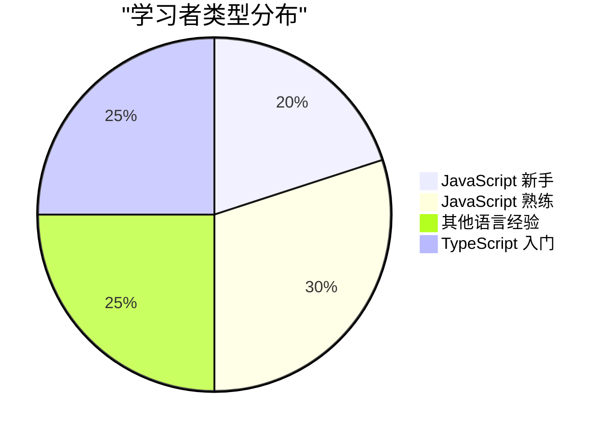
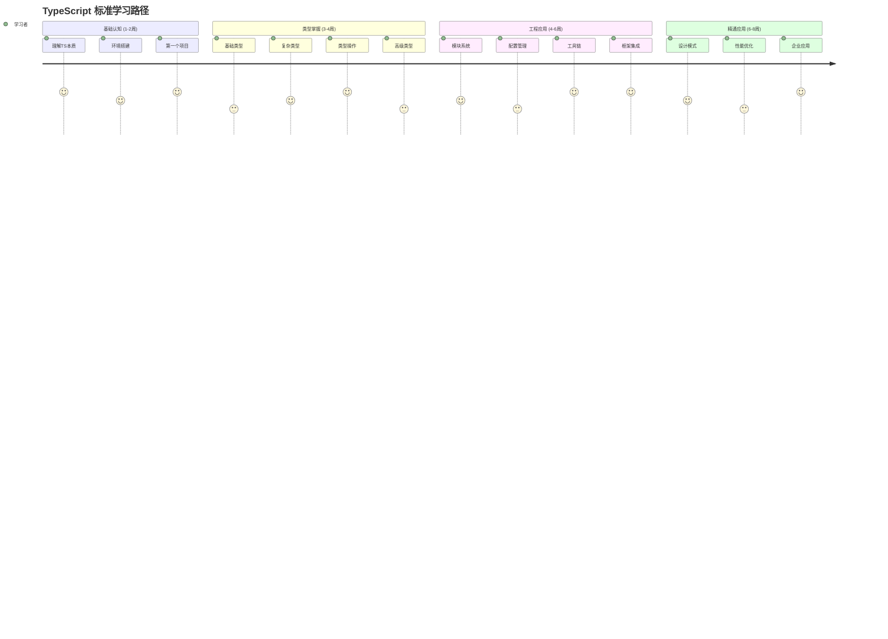
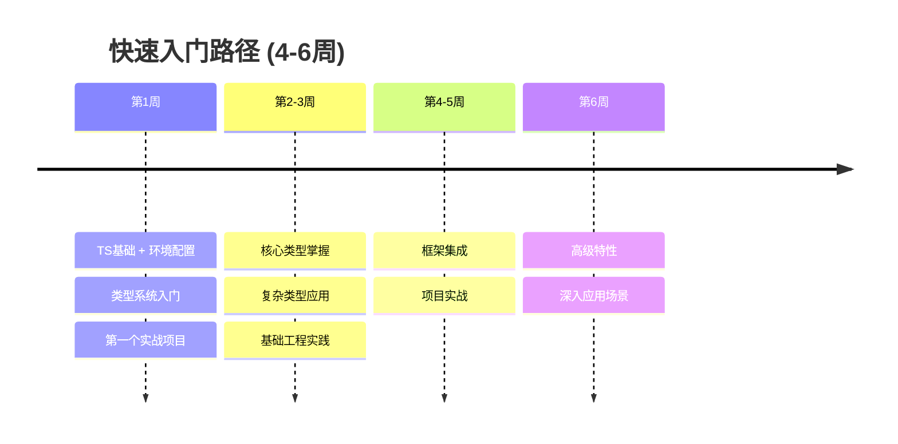
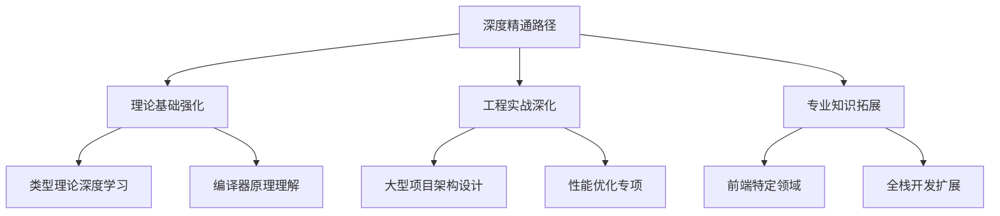
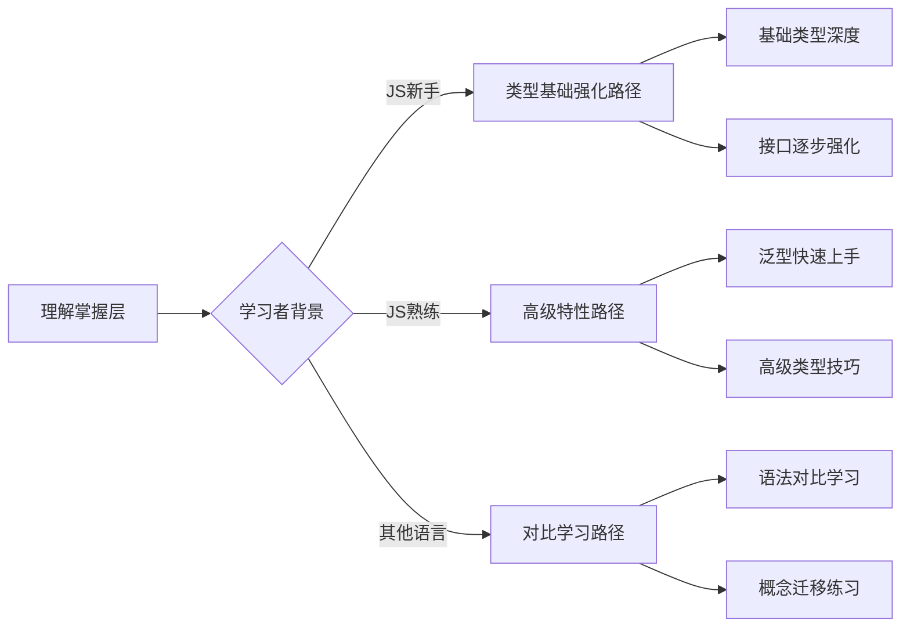
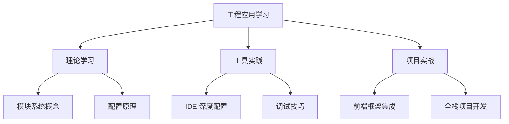
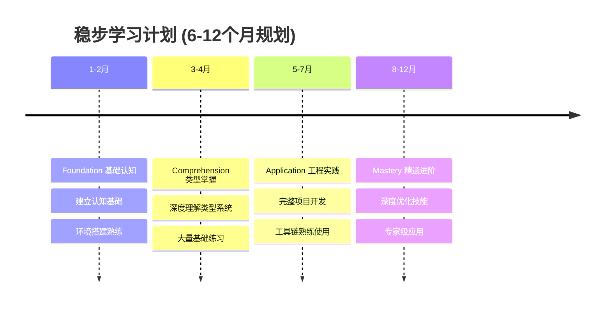
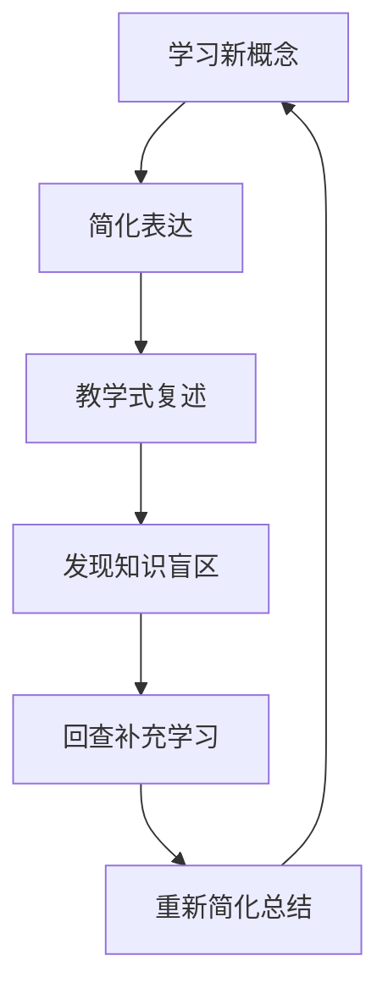

# TypeScript 学习路径规划

## 🎯 个性化学习诊断

### 📊 学习者水平评估



### 🎪 学习者画像分析

| 学习类型 | 特征描述 | 学习挑战 | 推荐策略 |
|----------|----------|----------|----------|
| **JS新手型** | 前端基础薄弱 | TS 概念理解难 | 先强化 JS 基础 |
| **JS熟练型** | 有 JS 开发经验 | 类型思维转换 | 重点类型系统学习 |
| **跨语言型** | 有其他静态语言经验 | 语法差异适应 | 对比学习加深理解 |
| **TS入门型** | 已有 TS 基础 | 深度理解提升 | 重点高级特性学习 |

## 🛤️ 学习路径设计

### 📈 A. 标准学习路径 (推荐)



### 🚀 B. 快速入门路径 (时间紧迫)



### 🎖️ C. 深度精通路径 (追求卓越)



## 📚 分层学习计划

### 🏗️ Level 1: Foundation (基础认知)

#### 📅 学习时间表

| 周次 | 学习内容 | 时间投入 | 实践任务 |
|------|----------|----------|----------|
| **第1周** | ~~TS本质与价值~~ [[01-TypeScript本质与价值]] | 6小时 | 环境搭建 + Hello World |
| **第2周** | ~~设计哲学~~ [[02-TypeScript设计哲学]] | 4小时 | 配置文件学习 |

#### 🎯 达成目标
- [ ] 理解 TypeScript 核心价值和定位
- [ ] 能够搭建完整开发环境  
- [ ] 成功运行第一个 TypeScript 程序
- [ ] 掌握基础编译命令使用

#### 🧪 能力测评
```typescript
// Level 1 基础考核题目
// 1. 写出一个简单的 TypeScript 函数声明
function greet(name: string): string {
    return `Hello, ${name}!`;
}

// 2. 编译并运行以上代码，确认无错误
```

### 🧠 Level 2: Comprehension (理解掌握)

#### 📅 详细学习规划

| 模块 | 学习子项 | 时间预算 | 重点难度 |
|------|----------|----------|----------|
| **类型基础** | 4个子章节 | 16小时 | ⭐⭐⭐ |
| **复杂类型** | 4个子章节 | 20小时 | ⭐⭐⭐⭐ |
| **高级类型** | 5个子章节 | 30小时 | ⭐⭐⭐⭐⭐ |
| **类型操作** | 5个子章节 | 20小时 | ⭐⭐⭐⭐ |

#### 🎯 学习路径选择



#### 🎪 Comprehension 学习策略

##### 📖 类型基础学习策略
1. **概念理解** → [[01-Type-System入门]]
2. **语法练习** → [[02-Primitive-Types完全指南]]
3. **推断机制** → [[03-Type-Inference揭秘]]
4. **对比分析** → [[04-Type-vs-Interface深度对比]]

##### 🏗️ 复杂类型学习策略  
1. **数据结构** → [[01-Array-and-Tuple完全解析]]
2. **对象设计** → [[02-Object-Types设计模式]]
3. **函数签名** → [[03-Function-Types签名技巧]]
4. **类与接口** → [[04-Class-Types架构设计]]

##### 🚀 高级类型进阶策略
1. **泛型基础** → [[01-Generics泛型精通]]
2. **类型组合** → [[02-Union-and-Intersection实战]]
3. **条件类型** → [[03-Conditional-Types深度应用]]
4. **工具类型** → [[04-Mapped-Types工具类型库]]
5. **字符串类型** → [[05-Template-Literals字符串魔法]]

### 🛠️ Level 3: Application (工程应用)

#### 📊 Application 学习矩阵

| 技能域 | 理论学习 | 实践时间 | 项目产出 |
|--------|----------|----------|----------|
| **模块系统** | 8小时 | 4小时 | 示例模块库 |
| **配置管理** | 6小时 | 8小时 | 完整配置文件 |
| **开发工具** | 8小时 | 6小时 | 工具链集成 |
| **框架集成** | 12小时 | 10小时 | 框架项目 |
| **企业开发** | 10小时 | 12小时 | 企业级架构 |

#### 🎯 实践导向学习



### 🎖️ Level 4: Mastery (精通层)

#### 🌟 Mastery 精通进阶路径

| 精通方向 | 目标技能 | 时间投入 | 认证目标 |
|----------|----------|----------|----------|
| **架构设计** | 大型系统设计 | 60小时 | 架构师级别 |
| **性能优化** | 编译优化技巧 | 40小时 | 性能专家级别 |
| **工具开发** | 自定义工具链 | 80小时 | 工具开发者级别 |
| **专业领域** | 垂直领域应用 | 50小时 | 领域专家级别 |

## 🎪 个性化路径定制

### 🧬 基于背景的路径调整

#### 🚀 JavaScript 熟练者路径

```typescript
// 针对 JS 熟练者的学习重点
interface JSDeveloperPath {
    // 重点跳过的基础内容
    skip: ['basic-types', 'simple-functions'];
    
    // 重点学习的进阶内容  
    focus: ['advanced-types', 'generic-programming', 'type-system-design'];
    
    // 快速实践周期
    practiceCycle: 'immediate';
    
    // 项目驱动学习
    learningMode: 'project-driven';
}
```

#### 🔄 其他语言迁移者路径

```typescript
// 针对有静态类型语言经验的学习者
interface StaticTypingBackgroundPath {
    // 对比学习重点
    comparisons: {
        'Java → TypeScript': 'structural-vs-nominal-typing',
        'C# → TypeScript': 'interface-vs-class-design',
        'Go → TypeScript': 'type-inference-patterns'
    };
    
    // 快速上手策略
    accelerationPoints: ['basic-types', 'interfaces', 'generics'];
    
    // 需要重点关注的差异点
    focusAreas: ['union-types', 'literal-types', 'intersection-types'];
}
```

### 📊 学习节奏个性化

#### ⚡ 高强度学习计划 (每日 2-3小时)

| 阶段 | 每日内容 | 周末任务 | 月度里程碑 |
|------|----------|----------|------------|
| **Foundation** | 1个核心概念 + 15分钟实践 | 小项目开发 | 完成基础层 |
| **Comprehension** | 类型学习 + 代码练习 | 中型项目 | 类型系统掌握 |
| **Application** | 工具学习 + 实战应用 | 框架集成项目 | 工程能力形成 |
| **Mastery** | 深度阅读 + 项目优化 | 开源贡献 | 专家级别形成 |

#### 🐌 稳步学习计划 (每日 30-45分钟)



## 🎯 学习效率优化

### 🏃‍♂️ 高效学习方法

#### 💡 费曼学习法实践


#### 💪 刻意练习框架

| 练习类型 | 练习频率 | 持续时间 | 目标技能 |
|----------|----------|----------|----------|
| **语法练习** | 每次学习后 | 10-15分钟 | 语法熟练度 |
| **类型设计** | 每周2次 | 30分钟 | 抽象思维能力 |
| **错误调试** | 遇到问题时 | 即时解决 | 问题解决能力 |
| **项目实战** | 每2周1次 | 2-4小时 | 持续更新应用 |

### 📈 学习效果评估

#### 🔍 阶段性评估体系

```typescript
// 学习进度评估指标
interface LearningProgress {
    // 知识点掌握度评估
    knowledgeMastery: {
        foundation: number; // 0-100
        comprehension: number; // 0-100  
        application: number; // 0-100
        mastery: number; // 0-100
    };
    
    // 实践能力评估
    practicalSkills: {
        codingSpeed: 'beginner' | 'intermediate' | 'advanced' | 'expert';
        debuggingAbility: 'beginner' | 'intermediate' | 'advanced' | 'expert';
        projectPlanning: 'beginner' | 'intermediate' | 'advanced' | 'expert';
    };
    
    // 学习建议
    nextSteps: string[];
}
```

## 🎯 实施指南

### 📅 制定个人学习计划

1. **自我评估**: 确定当前水平和学习目标
2. **选择路径**: 根据背景选择合适的学习路径
3. **时间规划**: 制定现实可行的学习时间表
4. **进度跟踪**: 定期评估学习效果和调整计划

### 🔗 相关资源整合

- [[03-学习进度]] - 详细的学习进度跟踪
- [[04-关联图谱]] - 知识点关联关系
- [[01-开发环境全配置]] - 环境搭建具体指导

---
*💡 记住：最好的学习路径是适合自己的路径，保持学习的热情和持续性是成功的关键*
