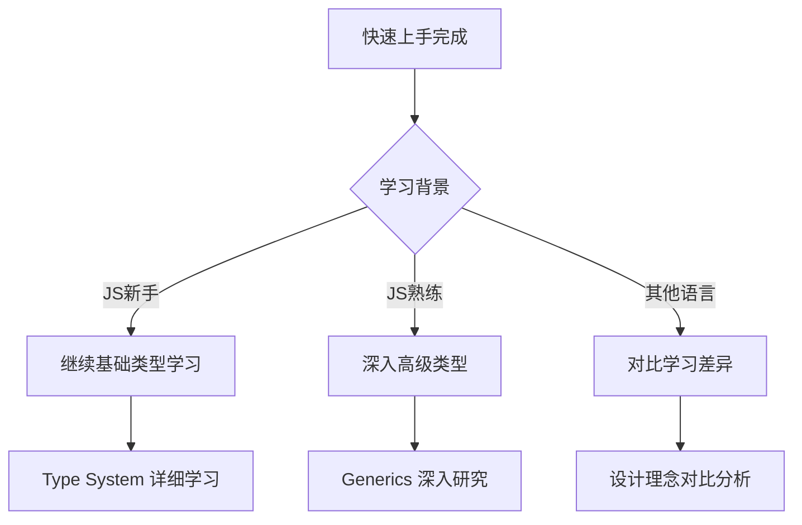

# TypeScript 15分钟快速上手

## ⚡ 快速体验 TypeScript

### 🎯 学习目标
在15分钟内，体验 TypeScript 的核心特性，建立基础认知。

## 🚀 第一步：Hello World (2分钟)

```typescript
// hello.ts
function greet(name: string): string {
    return `Hello, ${name}!`;
}

const message = greet("TypeScript");
console.log(message);
```

**执行命令：**
```bash
tsc hello.ts && node hello.js
```

### 💡 观察要点
- ✅ `name: string` - 类型注解
- ✅ `: string` - 返回类型声明
- ✅ 编译时类型检查

## 🎪 第二步：类型系统体验 (5分钟)

### 🔤 基础类型演示

```typescript
// types-demo.ts
// 1. 原始类型
let name: string = "Alice";
let age: number = 25;
let isStudent: boolean = true;

// 2. 数组类型
let hobbies: string[] = ["coding", "reading"];
let scores: Array<number> = [85, 90, 78];

// 3. 对象类型
interface Person {
    name: string;
    age: number;
    email?: string; // 可选属性
}

const person: Person = {
    name: "Bob",
    age: 30
    // email 可选，可不提供
};

// 4. 函数类型
function calculate(a: number, b: number, operation: 'add' | 'sub' | 'mul' | 'div'): number {
    switch(operation) {
        case 'add': return a + b;
        case 'sub': return a - b;
        case 'mul': return a * b;
        case 'div': return a / b;
    }
}

console.log(calculate(10, 5, 'add')); // 15
```

### 🎯 类型检查体验

```typescript
// 尝试故意制造错误，观察 TypeScript 错误提示
function testErrors(): void {
    // ❌ 错误1: 类型不匹配
    // let wrong: string = 123;
    
    // ❌ 错误2: 缺少必需属性  
    // const badPerson: Person = { name: "Charlie" };
    
    // ❌ 错误3: 错误的函数调用
    // calculate("10", 5, 'add');
    
    console.log("✅ 类型检查正常工作");
}
```

## 🏗️ 第三步：接口和类型 (5分钟)

### 📝 数据建模演示

```typescript
// data-modeling.ts
// 电商商品模型
interface Product {
    id: number;
    name: string;
    price: number;
    inStock: boolean;
    category: 'electronics' | 'clothing' | 'books';
}

interface Customer {
    id: number;
    name: string;
    email: string;
    phone?: string;
    addresses: Address[];
}

interface Address {
    street: string;
    city: string;
    country: string;
    zipCode: string;
}

// API 响应类型
interface ApiResponse<T> {
    success: boolean;
    data: T;
    error?: string;
}

// 使用示例
const laptop: Product = {
    id: 1,
    name: "MacBook Pro",
    price: 1999,
    inStock: true,
    category: 'electronics'
};

function fetchProduct(id: number): Promise<ApiResponse<Product>> {
    // 模拟 API 调用
    return Promise.resolve({
        success: true,
        data: laptop
    });
}
```

### 🎪 泛型初体验

```typescript
// generic-demo.ts
// 泛型函数
function getProperty<T, K extends keyof T>(obj: T, key: K): T[K] {
    return obj[key];
}

// 使用泛型
const person = { name: "Alice", age: 30 };
const name = getProperty(person, 'name'); // string
const age = getProperty(person, 'age');   // number

// 泛型接口
interface ListResponse<T> {
    items: T[];
    total: number;
    page: number;
}

const productList: ListResponse<Product> = {
    items: [laptop],
    total: 1,
    page: 1
};
```

## 🔧 第四步：现代特性 (3分钟)

### 🎯 ES6+ 特性支持

```typescript
// modern-features.ts
// 解构赋值 + 类型注解
const company = {
    name: "Tech Corp",
    employees: 1000,
    founded: 2020
};

function logCompany({ name, employees }: { name: string; employees: number }): void {
    console.log(`${name} has ${employees} employees`);
}

// 箭头函数 + 类型
const calculateTax = (income: number, rate: number = 0.1): number => {
    return income * rate;
};

// 类 + 访问修饰符
class Employee {
    private id: number;
    public name: string;
    protected department: string;
    
    constructor(id: number, name: string, department: string) {
        this.id = id;
        this.name = name;
        this.department = department;
    }
    
    public getEmployeeId(): number {
        return this.id;
    }
}

const emp = new Employee(1, "John", "Engineering");
console.log(emp.name);           // 可以访问
console.log(emp.getEmployeeId()); // 可以访问
// emp.id;                       // ❌ 编译错误（私有属性）
```

## 🎯 实践练习

### 🧪 练习题

```typescript
// exercise.ts
// 练习1: 创建一个用户管理系统的基础结构

interface User {
    id: number;
    username: string;
    email: string;
    isActive: boolean;
    createdAt: Date;
}

interface UserService<T> {
    create(data: Omit<T, 'id' | 'createdAt'>): T;
    findById(id: number): T | null;
    update(id: number, data: Partial<T>): T;
    delete(id: number): boolean;
}

class InMemoryUserService implements UserService<User> {
    private users: User[] = [];
    private nextId = 1;
    
    create(data: Omit<User, 'id' | 'createdAt'>): User {
        const newUser: User = {
            id: this.nextId++,
            createdAt: new Date(),
            ...data
        };
        this.users.push(newUser);
        return newUser;
    }
    
    findById(id: number): User | null {
        return this.users.find(user => user.id === id) || null;
    }
    
    update(id: number, data: Partial<User>): User {
        const userIndex = this.users.findIndex(user => user.id === id);
        if (userIndex === -1) {
            throw new Error(`User with id ${id} not found`);
        }
        
        this.users[userIndex] = { ...this.users[userIndex], ...data };
        return this.users[userIndex];
    }
    
    delete(id: number): boolean {
        const userIndex = this.users.findIndex(user => user.id === id);
        if (userIndex === -1) {
            return false;
        }
        
        this.users.splice(userIndex, 1);
        return true;
    }
}

// 使用示例
const userService = new InMemoryUserService();

const newUser = userService.create({
    username: "alice",
    email: "alice@example.com",
    isActive: true
});

console.log("Created user:", newUser);
```

## 📊 TypeScript 价值总结

### 🔍 15分钟体验的收获

| 特性体验 | JavaScript | TypeScript | 优势 |
|----------|------------|------------|------|
| **类型安全** | 运行时发现错误 | 编译时发现错误 | 🚀 错误预防 |
| **智能提示** | 基础提示 | 精确类型预测 | 🧠 开发体验 |
| **重构支持** | 容易出错 | 安全重构 | 🔧 可靠修改 |
| **文档化** | 需要额外文档 | 类型即文档 | 📚 代码自解释 |

### 🎯 下一步学习建议



## 🚀 动手实践清单

- [ ] 运行所有示例代码
- [ ] 修改类型定义观察错误提示
- [ ] 尝试移除类型注解对比体验
- [ ] 完成练习题实践

### 🔗 深入学习路径

- [[01-Type-System入门]] - 深入理解类型系统
- [[02-Primitive-Types完全指南]] - 基础类型详解
- [[01-Hello-TypeScript实践]] - 更完整的实战项目

---
*💡 快速体验目标达成！你现在对 TypeScript 有了直观认识，可以开始系统性学习了*
