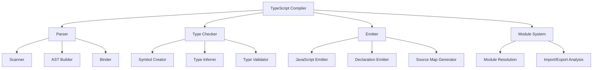

# TypeScript 编译器内部原理

## 🎯 TypeScript 编译器架构

### 📊 编译器组件架构



## 🔧 解析器 (Parser) 内部

### 💡 词法分析器实现

```typescript
// 1. Token 类型定义
enum SyntaxKind {
    // 关键字
    AbstractKeyword = 135,
    AnyKeyword = 136,
    AsKeyword = 137,
    AssertKeyword = 138,
    AsyncKeyword = 139,
    
    // 标识符和字面量
    Identifier = 79,
    NumericLiteral = 7,
    StringLiteral = 8,
    
    // 运算符
    PlusToken = 26,
    MinusToken = 27,
    AsteriskToken = 28,
    SlashToken = 29,
    
    // 其他
    EndOfFileToken = 1,
    Unknown = 0
}

interface Token {
    kind: SyntaxKind;
    text: string;
    start: number;
    end: number;
    width: number;
}

// 2. 最小化扫描器实现
class Scanner {
    private source: string;
    private pos: number = 0;
    private len: number;
    private tokens: Token[] = [];
    
    constructor(source: string) {
        this.source = source;
        this.len = source.length;
        this.scanAll();
    }
    
    private scanAll(): void {
        while (this.pos < this.len) {
            const start = this.pos;
            const ch = this.source[this.pos];
            
            let kind: SyntaxKind;
            let text: string;
            
            if (this.isDigit(ch)) {
                ({ kind, text, width } = this.scanNumber());
            } else if (this.isIdentifierStart(ch)) {
                ({ kind, text, width } = this.scanIdentifier());
            } else if (ch === '"' || ch === "'") {
                ({ kind, text, width } = this.scanString());
            } else {
                ({ kind, text, width } = this.scanPunctuation());
            }
            
            this.tokens.push({
                kind,
                text,
                start,
                end: start + width,
                width
            });
            
            this.pos += width;
        }
        
        // 添加 EOF token
        this.tokens.push({
            kind: SyntaxKind.EndOfFileToken,
            text: '',
            start: this.pos,
            end: this.pos,
            width: 0
        });
    }
    
    private scanNumber(): { kind: SyntaxKind; text: string; width: number } {
        const start = this.pos;
        let text = '';
        
        // 整数组部分
        while (this.pos < this.len && this.isDigit(this.source[this.pos])) {
            text += this.source[this.pos++];
        }
        
        // 小数部分
        if (this.pos < this.len && this.source[this.pos] === '.') {
            text += this.source[this.pos++];
            
            while (this.pos < this.len && this.isDigit(this.source[this.pos])) {
                text += this.source[this.pos++];
            }
        }
        
        // 指数部分
        if (this.pos < this.len && (this.source[this.pos] === 'e' || this.source[this.pos] === 'E')) {
            text += this.source[this.pos++];
            
            if (this.pos < this.len && (this.source[this.pos] === '+' || this.source[this.pos] === '-')) {
                text += this.source[this.pos++];
            }
            
            while (this.pos < this.len && this.isDigit(this.source[this.pos])) {
                text += this.source[this.pos++];
            }
        }
        
        return {
            kind: SyntaxKind.NumericLiteral,
            text,
            width: this.pos - start
        };
    }
    
    private scanIdentifier(): { kind: SyntaxKind; text: string; width: number } {
        const start = this.pos;
        let text = this.source[this.pos++];
        
        while (this.pos < this.len && this.isIdentifierPart(this.source[this.pos])) {
            text += this.source[this.pos++];
        }
        
        const kind = this.getKeywordKind(text);
        
        return {
            kind: kind || SyntaxKind.Identifier,
            text,
            width: this.pos - start
        };
    }
    
    private scanString(): { kind: SyntaxKind; text: string; width: number } {
        const start = this.pos;
        const quote = this.source[this.pos++];
        let text = quote;
        let escaped = false;
        
        while (this.pos < this.len) {
            const ch = this.source[this.pos];
            
            if (escaped) {
                escaped = false;
            } else if (ch === '\\') {
                escaped = true;
            } else if (ch === quote) {
                text += this.source[this.pos++];
                break;
            }
            
            text += this.source[this.pos++];
        }
        
        if (this.pos === this.len) {
            throw new Error('Unterminated string literal');
        }
        
        return {
            kind: SyntaxKind.StringLiteral,
            text,
            width: this.pos - start
        };
    }
    
    private scanPunctuation(): { kind: SyntaxKind; text: string; width: number } {
        const ch = this.source[this.pos];
        let kind: SyntaxKind | undefined;
        
        // 单字符标点
        switch (ch) {
            case '+': kind = SyntaxKind.PlusToken; break;
            case '-': kind = SyntaxKind.MinusToken; break;
            case '*': kind = SyntaxKind.AsteriskToken; break;
            case '/': kind = SyntaxKind.SlashToken; break;
            default:
                kind = SyntaxKind.Unknown;
        }
        
        return {
            kind,
            text: ch,
            width: 1
        };
    }
    
    private getKeywordKind(text: string): SyntaxKind | undefined {
        switch (text) {
            case 'abstract': return SyntaxKind.AbstractKeyword;
            case 'any': return SyntaxKind.AnyKeyword;
            case 'as': return SyntaxKind.AsKeyword;
            case 'assert': return SyntaxKind.AssertKeyword;
            case 'async': return SyntaxKind.AsyncKeyword;
            default: return undefined;
        }
    }
    
    private isDigit(ch: string): boolean {
        return ch >= '0' && ch <= '9';
    }
    
    private isIdentifierStart(ch: string): boolean {
        return (ch >= 'a' && ch <= 'z') || 
               (ch >= 'A' && ch <= 'Z') || 
               ch === '_' || 
               ch === '$';
    }
    
    private isIdentifierPart(ch: string): boolean {
        return this.isIdentifierStart(ch) || this.isDigit(ch);
    }
    
    getTokens(): Token[] {
        return [...this.tokens];
    }
}
```

### 🎪 AST 构建器

```typescript
// 最小化 AST 节点类型
interface Node {
    kind: SyntaxKind;
    start: number;
    end: number;
    text?: string;
    children?: Node[];
}

interface Identifier extends Node {
    kind: SyntaxKind.Identifier;
    text: string;
}

interface LiteralExpression extends Node {
    kind: SyntaxKind.NumericLiteral | SyntaxKind.StringLiteral;
    text: string;
}

interface BinaryExpression extends Node {
    kind: SyntaxKind.BinaryExpression;
    left: Expression;
    operator: Token;
    right: Expression;
}

interface VariableStatement extends Node {
    kind: SyntaxKind.VariableStatement;
    declarationList: VariableDeclarationList;
}

interface VariableDeclarationList extends Node {
    kind: SyntaxKind.VariableDeclarationList;
    declarations: VariableDeclaration[];
}

interface VariableDeclaration extends Node {
    kind: SyntaxKind.VariableDeclaration;
    name: Identifier;
    type?: TypeNode;
    initializer?: Expression;
}

type Expression = Identifier | LiteralExpression | BinaryExpression;
type Statement = VariableStatement;
type TypeNode = Identifier;

// 解析器实现
class Parser {
    private scanner: Scanner;
    private tokens: Token[];
    private pos: number = 0;
    
    constructor(source: string) {
        this.scanner = new Scanner(source);
        this.tokens = this.scanner.getTokens();
    }
    
    parse(): Statement[] {
        const statements: Statement[] = [];
        
        while (!this.isAtEnd()) {
            const statement = this.parseStatement();
            if (statement) {
                statements.push(statement);
            }
        }
        
        return statements;
    }
    
    private parseStatement(): Statement | null {
        // 简化：只解析变量声明语句
        if (this.match(SyntaxKind.VarKeyword) || 
            this.match(SyntaxKind.LetKeyword) || 
            this.match(SyntaxKind.ConstKeyword)) {
            return this.parseVariableStatement();
        }
        
        this.advance();
        return null;
    }
    
    private parseVariableStatement(): VariableStatement {
        const keyword = this.previous();
        const declarations = this.parseVariableDeclarationList();
        
        return {
            kind: SyntaxKind.VariableStatement,
            start: keyword.start,
            end: declarations.end,
            text: `${keyword.text} ${declarations.text}`,
            declarationList: declarations
        };
    }
    
    private parseVariableDeclarationList(): VariableDeclarationList {
        const declarations: VariableDeclaration[] = [];
        
        do {
            declarations.push(this.parseVariableDeclaration());
        } while (this.match(SyntaxKind.CommaToken));
        
        return {
            kind: SyntaxKind.VariableDeclarationList,
            start: declarations[0]?.start || 0,
            end: declarations[declarations.length - 1]?.end || 0,
            text: declarations.map(d => d.text || '').join(', '),
            declarations
        };
    }
    
    private parseVariableDeclaration(): VariableDeclaration {
        const name = this.parseIdentifier();
        let typeNode: TypeNode | undefined;
        
        if (this.match(SyntaxKind.ColonToken)) {
            this.advance(); // consume :
            typeNode = this.parseIdentifier();
        }
        
        let initializer: Expression | undefined;
        if (this.match(SyntaxKind.EqualsToken)) {
            this.advance(); // consume =
            initializer = this.parseExpression();
        }
        
        return {
            kind: SyntaxKind.VariableDeclaration,
            start: name.start,
            end: initializer?.end || typeNode?.end || name.end,
            text: `${name.text}${typeNode ? `: ${typeNode.text}` : ''}${initializer ? ` = ${initializer.text}` : ''}`,
            name,
            type: typeNode,
            initializer
        };
    }
    
    private parseExpression(): Expression {
        return this.parseBinaryExpression();
    }
    
    private parseBinaryExpression(): Expression {
        let expr = this.parsePrimaryExpression();
        
        while (this.match(SyntaxKind.PlusToken) || 
               this.match(SyntaxKind.MinusToken) ||
               this.match(SyntaxKind.AsteriskToken) ||
               this.match(SyntaxKind.SlashToken)) {
            const operator = this.previous();
            const right = this.parsePrimaryExpression();
            
            expr = {
                kind: SyntaxKind.BinaryExpression,
                start: expr.start,
                end: right.end,
                text: `${expr.text} ${operator.text} ${right.text}`,
                left: expr,
                operator,
                right
            };
        }
        
        return expr;
    }
    
    private parsePrimaryExpression(): Expression {
        if (this.match(SyntaxKind.Identifier)) {
            return this.parseIdentifier();
        }
        
        if (this.match(SyntaxKind.NumericLiteral)) {
            return this.parseNumericLiteral();
        }
        
        if (this.match(SyntaxKind.StringLiteral)) {
            return this.parseStringLiteral();
        }
        
        throw new Error(`Unexpected token: ${this.current().text}`);
    }
    
    private parseIdentifier(): Identifier {
        const token = this.advance();
        return {
            kind: SyntaxKind.Identifier,
            start: token.start,
            end: token.end,
            text: token.text
        };
    }
    
    private parseNumericLiteral(): LiteralExpression {
        const token = this.advance();
        return {
            kind: SyntaxKind.NumericLiteral,
            start: token.start,
            end: token.end,
            text: token.text
        };
    }
    
    private parseStringLiteral(): LiteralExpression {
        const token = this.advance();
        return {
            kind: SyntaxKind.StringLiteral,
            start: token.start,
            end: token.end,
            text: token.text
        };
    }
    
    // 工具方法
    private isAtEnd(): boolean {
        return this.current().kind === SyntaxKind.EndOfFileToken;
    }
    
    private current(): Token {
        return this.tokens[this.pos];
    }
    
    private previous(): Token {
        return this.tokens[this.pos - 1];
    }
    
    private advance(): Token {
        if (!this.isAtEnd()) this.pos++;
        return this.previous();
    }
    
    private match(...kinds: SyntaxKind[]): boolean {
        for (const kind of kinds) {
            if (this.check(kind)) {
                this.advance();
                return true;
            }
        }
        return false;
    }
    
    private check(kind: SyntaxKind): boolean {
        if (this.isAtEnd()) return false;
        return this.current().kind === kind;
    }
}
```

## 🚀 类型检查器内部

### 🔄 解析器接口

```typescript
// 类型检查器核心接口
interface TypeChecker {
    // 符号和类型操作
    getSymbol(symbol: Node): Symbol | undefined;
    getType(symbol: Node): Type;
    
    // 类型关系检查
    isAssignableTo(source: Type, target: Type): boolean;
    isTypeIdentical(src: Type, dest: Type): boolean;
    isTypeEqual(t1: Type, t2: Type): boolean;
    
    // 类型推断
    getInferredType(symbol: Symbol): Type;
    inferTypeArguments(targets: Node[], sources: Type[]): Type[];
    
    // 程序信息
    getDiagnostics(): Diagnostic[];
    getProgramFiles(): SourceFile[];
    getSourceFiles(): SourceFile[];
}

// 符号表实现
class Symbol {
    public name: string;
    public type: Type | undefined;
    public valueDeclaration: Declaration | undefined;
    public declarations: Declaration[] | undefined;
    
    constructor(name: string) {
        this.name = name;
    }
    
    getFlags(): SymbolFlags {
        return SymbolFlags.None;
    }
    
    getExportSymbol(): Symbol | undefined {
        return undefined;
    }
}

// 类型表示
abstract class Type {
    public flags: TypeFlags = TypeFlags.None;
    
    abstract toString(): string;
    abstract getSymbol(): Symbol | undefined;
    abstract isAssignableTo(type: Type): boolean;
}

class NumberType extends Type {
    toString(): string {
        return 'number';
    }
    
    getSymbol(): Symbol | undefined {
        return undefined;
    }
    
    isAssignableTo(type: Type): boolean {
        return type instanceof NumberType;
    }
}

class StringType extends Type {
    toString(): string {
        return 'string';
    }
    
    getSymbol(): Symbol | undefined {
        return undefined;
    }
    
    isAssignableTo(type: Type): boolean {
        return type instanceof StringType;
    }
}

class UnionType extends Type {
    constructor(private types: Type[]) {
        super();
    }
    
    toString(): string {
        return this.types.map(t => t.toString()).join(' | ');
    }
    
    getSymbol(): Symbol | undefined {
        return undefined;
    }
    
    isAssignableTo(type: Type): boolean {
        return this.types.some(t => t.isAssignableTo(type));
    }
    
    getTypes(): Type[] {
        return [...this.types];
    }
}

// 简单的类型检查器实现
class SimpleTypeChecker implements TypeChecker {
    private symbols = new Map<string, Symbol>();
    private sourceFiles: SourceFile[] = [];
    private diagnostics: Diagnostic[] = [];
    
    getSymbol(node: Node): Symbol | undefined {
        if (node.kind === SyntaxKind.Identifier) {
            const name = (node as Identifier).text;
            return this.forSymbol(name);
        }
        return undefined;
    }
    
    getType(node: Node): Type {
        if (node.kind === SyntaxKind.NumericLiteral) {
            return new NumberType();
        }
        
        if (node.kind === SyntaxKind.StringLiteral) {
            return new StringType();
        }
        
        if (node.kind === SyntaxKind.Identifier) {
            const symbol = this.getSymbol(node);
            return symbol?.type || new AnyType();
        }
        
        return new AnyType();
    }
    
    isAssignableTo(source: Type, target: Type): boolean {
        // 简化实现：只检查基本类型
        if (source instanceof NumberType && target instanceof NumberType) {
            return true;
        }
        
        if (source instanceof StringType && target instanceof StringType) {
            return true;
        }
        
        if (target instanceof AnyType) {
            return true;
        }
        
        return false;
    }
    
    isTypeIdentical(src: Type, dest: Type): boolean {
        return this.isAssignableTo(src, dest) && this.isAssignableTo(dest, src);
    }
    
    isTypeEqual(t1: Type, t2: Type): boolean {
        return t1.toString() === t2.toString();
    }
    
    typeArguments(targets: Node[], sources: Type[]): Type[] {
        // 简化实现：不进行类型参数推断
        return [];
    }
    
    infered(symbol: Symbol): Type {
        return symbol.type || new AnyType();
    }
    
    check(sourceFile: SourceFile): Diagnostic[] {
        this.sourceFiles = [sourceFile];
        this.diagnostics = [];
        
        // 检查文件中的所有语句
        for (const statement of sourceFile.statements) {
            this.checkStatement(statement);
        }
        
        return [...this.diagnostics];
    }
    
    private checkStatement(statement: Statement): void {
        if (statement.kind === SyntaxKind.VariableStatement) {
            const varStmt = statement as VariableStatement;
            this.checkVariableStatement(varStmt);
        }
    }
    
    private checkVariableStatement(statement: VariableStatement): void {
        for (const declaration of statement.declarationList.declarations) {
            this.checkVariableDeclaration(declaration);
        }
    }
    
    private checkVariableDeclaration(declaration: VariableDeclaration): void {
        // 声明变量符号
        const symbol = this.forSymbol(declaration.name.text);
        
        // 如果有类型注解，检查类型
        if (declaration.type) {
            symbol.type = this.resolveTypeReference(declaration.type);
        }
        
        // 如果有初始化器，推断类型
        if (declaration.initializer) {
            const inferredType = this.getType(declaration.initializer);
            
            if (symbol.type && !this.isAssignableTo(inferredType, symbol.type)) {
                this.diagnostics.push({
                    message: `Type '${inferredType.toString()}' is not assignable to type '${symbol.type.toString()}'`,
                    category: DiagnosticCategory.Error,
                    file: undefined,
                    start: declaration.name.start,
                    length: declaration.name.end - declaration.name.start
                });
            } else if (!symbol.type) {
                symbol.type = inferredType;
            }
        }
    }
    
    private resolveTypeReference(typeNode: TypeNode): Type {
        const typeName = typeNode.text;
        
        switch (typeName) {
            case 'number': return new NumberType();
            case 'string': return new StringType();
            case 'boolean': return new BooleanType();
            case 'any': return new AnyType();
            default: return new AnyType();
        }
    }
    
    private forSymbol(name: string): Symbol {
        if (!this.symbols.has(name)) {
            this.symbols.set(name, new Symbol(name));
        }
        return this.symbols.get(name)!;
    }
    
    getDiagnostics(): Diagnostic[] {
        return [...this.diagnostics];
    }
    
    getProgramFiles(): SourceFile[] {
        return [...this.sourceFiles];
    }
    
    getSourceFiles(): SourceFile[] {
        return [...this.sourceFiles];
    }
}

// 辅助类型定义
enum SymbolFlags {
    None = 0,
    Variable = 1 << 0,
    Function = 1 << 1,
    Class = 1 << 2,
    Interface = 1 << 3
}

enum TypeFlags {
    None = 0,
    StringLike = 1 << 0,
    NumberLike = 1 << 1,
    BooleanLike = 1 << 2,
    Any = 1 << 3
}

interface Diagnostic {
    message: string;
    category: DiagnosticCategory;
    file?: SourceFile;
    start: number;
    length: number;
}

enum DiagnosticCategory {
    Error = 1,
    Warning = 2,
    Message = 3
}

interface SourceFile {
    statements: Statement[];
}

// 完整的基本类型类
class BooleanType extends Type {
    toString(): string { return 'boolean'; }
    getSymbol(): Symbol | undefined { return undefined; }
    isAssignableTo(type: Type): boolean { return type instanceof BooleanType; }
}

class AnyType extends Type {
    toString(): string { return 'any'; }
    getSymbol(): Symbol | undefined { return undefined; }
    isAssignableTo(type: Type): boolean { return true; }
}
```

### 🔗 相关深入学习

- [[02-AST-Manipulation AST操作]] - AST 操作技术
- [[03-Performance-Analysis性能分析]] - 编译性能分析
- [[04-Custom-Transformers自定义转换器]] - 自定义转换器

---
*💡 理解 TypeScript 编译器的内部原理对于深入掌握类型系统和编写高级工具至关重要*
