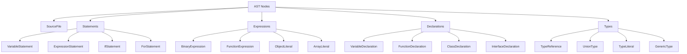

# TypeScript AST 操作完全指南

## 🎯 AST 概览与核心概念

### 📊 AST 节点类型体系



## 🔧 AST 访问与遍历

### 💡 Visitor 模式实现

```typescript
// 1. AST 访问器基础类
import * as ts from 'typescript';

interface ASTVisitor {
    // 语句访问器
    visitSourceFile?(node: ts.SourceFile): void;
    visitaStatement?(node: ts.Statement): ts.SourceFile;
    
    // 表达式访问器
    visitExpressionStatement?(node: ts.ExpressionStatement): ts.ExpressionStatement;
    visitBinaryExpression?(node: ts.BinaryExpression): ts.BinaryExpression;
    visitCallExpression?(node: ts.CallExpression): ts.CallExpression;
    visitPropertyAccess?(node: ts.PropertyAccessExpression): ts.PropertyAccessExpression;
    
    // 声明访问器
    visitVariableDeclaration?(node: ts.VariableDeclaration): ts.VariableDeclaration;
    visitFunctionDeclaration?(node: ts.FunctionDeclaration): ts.FunctionDeclaration;
    visitClassDeclaration?(node: ts.ClassDeclaration): ts.ClassDeclaration;
    
    // 类型访问器
    visitTypeReference?(node: ts.TypeReferenceNode): ts.TypeReferenceNode;
    visitUnionType?(node: ts.UnionTypeNode): ts.UnionTypeNode;
}

// 2. 通用 AST 访问器实现
class BaseASTVisitor implements ASTVisitor {
    protected visitNode<T extends ts.Node>(node: T): T | undefined {
        if (!node) return undefined;
        
        // 递归访问子节点
        return ts.visitNode(node, (childNode) => {
            return this.astNode(childNode);
        }) as T;
    }
    
    protected visitNodes<T extends ts.Node>(nodes: ts.NodeArray<T>): ts.NodeArray<T> {
        if (!nodes) return nodes || ts.createNodeArray();
        
        return ts.visitNodes(nodes, (node) => {
            return this.visitNode(node);
        }) as ts.NodeArray<T>;
    }
    
    protected astNode(node: ts.Node): ts.Node {
        if (!node) return node;
        
        switch (node.kind) {
            // 语句访问
            case ts.SyntaxKind.SourceFile:
                return this.visitaSourceFile(node as ts.SourceFile) || node;
            case ts.SyntaxKind.ExpressionStatement:
                return this.visitExpressionStatement(node as ts.ExpressionStatement) || node;
            case ts.SyntaxKind.VariableStatement:
                return this.visitVariableStatement(node as ts.VariableStatement) || node;
            case ts.SyntaxKind.IfStatement:
                return this.visitIfStatement(node as ts.IfStatement) || node;
            case ts.SyntaxKind.ForStatement:
                return this.visitForStatement(node as ts.ForStatement) || node;
            case ts.SyntaxKind.ReturnStatement:
                return this.visitReturnStatement(node as ts.ReturnStatement) || node;
                
            // 表达式访问
            case ts.SyntaxKind.BinaryExpression:
                return this.visitBinaryExpression(node as ts.BinaryExpression) || node;
            case ts.SyntaxKind.CallExpression:
                return this.visitCallExpression(node as ts.CallExpression) || node;
            case ts.SyntaxKind.PropertyAccessExpression:
                return this.visitPropertyAccess(node as ts.PropertyAccessExpression) || node;
            case ts.SyntaxKind.ObjectLiteralExpression:
                return this.visitObjectLiteral(node as ts.ObjectLiteralExpression) || node;
            case ts.SyntaxKind.ArrayLiteralExpression:
                return this.visitArrayLiteral(node as ts.ArrayLiteralExpression) || node;
                
            // 声明访问
            case ts.SyntaxKind.VariableDeclaration:
                return this.visitVariableDeclaration(node as ts.VariableDeclaration) || node;
            case ts.SyntaxKind.FunctionDeclaration:
                return this.visitFunctionDeclaration(node as ts.FunctionDeclaration) || node;
            case ts.SyntaxKind.ClassDeclaration:
                return this.visitClassDeclaration(node as ts.ClassDeclaration) || node;
            case ts.SyntaxKind.InterfaceDeclaration:
                return this.visitInterfaceDeclaration(node as ts.InterfaceDeclaration) || node;
                
            // 类型访问
            case ts.SyntaxKind.TypeReference:
                return this.visitTypeReference(node as ts.TypeReferenceNode) || node;
            case ts.SyntaxKind.UnionType:
                return this.visitUnionType(node as ts.UnionTypeNode) || node;
            case ts.SyntaxKind.TypeLiteral:
                return this.visitTypeLiteral(node as ts.TypeLiteralNode) || node;
                
            // 默认情况：递归访问子节点
            default:
                return ts.visitNode(node, (childNode) => {
                    return this.astNode(childNode);
                }) || node;
        }
    }
    
    // 默认实现：递归访问
    protected visitaSourceFile(node: ts.SourceFile): ts.SourceFile | undefined {
        return ts.updateSourceFile(node, this.visitNodes(node.statements));
    }
    
    protected visitExpressionStatement(node: ts.ExpressionStatement): ts.ExpressionStatement | undefined {
        return ts.updateExpressionStatement(node, this.visitNode(node.expression) as ts.Expression);
    }
    
    protected visitVariableStatement(node: ts.VariableStatement): ts.VariableStatement | undefined {
        return ts.updateVariableStatement(node, this.visitNodes(node.declarationList));
    }
    
    protected visitIfStatement(node: ts.IfStatement): ts.IfStatement | undefined {
        return ts.updateIfStatement(node,
            node.expression,
            this.visitNode(node.thenStatement) as ts.Statement,
            node.elseStatement ? this.visitNode(node.elseStatement) as ts.Statement : undefined
        );
    }
    
    protected visitForStatement(node: ts.ForStatement): ts.ForStatement | undefined {
        return ts.updateForStatement(node,
            node.initializer ? this.visitNode(node.initializer) as ts.ForInitializer : undefined,
            node.condition ? this.visitNode(node.condition) as ts.Expression : undefined,
            node.incrementor ? this.visitNode(node.incrementor) as ts.Expression : undefined,
            this.visitNode(node.statement) as ts.Statement
        );
    }
    
    protected visitReturnStatement(node: ts.ReturnStatement): ts.ReturnStatement | undefined {
        return ts.updateReturnStatement(node,
            node.expression ? this.visitNode(node.expression) as ts.Expression : undefined
        );
    }
    
    protected visitBinaryExpression(node: ts.BinaryExpression): ts.BinaryExpression | undefined {
        return ts.updateBinaryExpression(node,
            this.visitNode(node.left) as ts.Expression,
            node.operatorToken,
            this.visitNode(node.right) as ts.Expression
        );
    }
    
    protected visitCallExpression(node: ts.CallExpression): ts.CallExpression | undefined {
        return ts.updateCallExpression(node,
            this.visitNode(node.expression) as ts.Expression,
            this.visitNodes(node.typeArguments),
            this.visitNodes(node.arguments)
        );
    }
    
    protected visitPropertyAccess(node: ts.PropertyAccessExpression): ts.PropertyAccessExpression | undefined {
        return ts.updatePropertyAccessExpression(node,
            this.visitNode(node.expression) as ts.Expression,
            node.name
        );
    }
    
    protected visitObjectLiteral(node: ts.ObjectLiteralExpression): ts.ObjectLiteralExpression | undefined {
        return ts.updateObjectLiteralExpression(node, this.visitNodes(node.properties));
    }
    
    protected visitArrayLiteral(node: ts.ArrayLiteralExpression): ts.ArrayLiteralExpression | undefined {
        return ts.updateArrayLiteralExpression(node, this.visitNodes(node.elements));
    }
    
    protected visitVariableDeclaration(node: ts.VariableDeclaration): ts.VariableDeclaration | undefined {
        return ts.updateVariableDeclaration(node,
            node.name,
            node.type ? this.visitNode(node.type) as ts.TypeNode : undefined,
            node.initializer ? this.visitNode(node.initializer) as ts.Expression : undefined
        );
    }
    
    protected visitFunctionDeclaration(node: ts.FunctionDeclaration): ts.FunctionDeclaration | undefined {
        return ts.updateFunctionDeclaration(node,
            node.decorators ? this.visitNodes(node.decorators) : undefined,
            node.modifiers ? this.visitNodes(node.modifiers) : undefined,
            node.asteriskToken,
            node.name,
            node.typeParameters ? this.visitNodes(node.typeParameters) : undefined,
            this.visitNodes(node.parameters),
            node.type ? this.visitNode(node.type) as ts.TypeNode : undefined,
            node.body ? this.visitNode(node.body) as ts.Block : undefined
        );
    }
    
    protected visitClassDeclaration(node: ts.ClassDeclaration): ts.ClassDeclaration | undefined {
        return ts.updateClassDeclaration(node,
            node.decorators ? this.visitNodes(node.decorators) : undefined,
            node.modifiers ? this.visitNodes(node.modifiers) : undefined,
            node.name,
            node.typeParameters ? this.visitNodes(node.typeParameters) : undefined,
            node.heritageClauses ? this.visitNodes(node.heritageClauses) : undefined,
            this.visitNodes(node.members)
        );
    }
    
    protected visitInterfaceDeclaration(node: ts.InterfaceDeclaration): ts.InterfaceDeclaration | undefined {
        return ts.updateInterfaceDeclaration(node,
            node.decorators ? this.visitNodes(node.decorators) : undefined,
            node.modifiers ? this.visitNodes(node.modifiers) : undefined,
            node.name,
            node.typeParameters ? this.visitNodes(node.typeParameters) : undefined,
            node.heritageClauses ? this.visitNodes(node.heritageClauses) : undefined,
            this.visitNodes(node.members)
        );
    }
    
    protected visitTypeReference(node: ts.TypeReferenceNode): ts.TypeReferenceNode | undefined {
        return ts.updateTypeReferenceNode(node,
            node.typeName,
            this.visitNodes(node.typeArguments) as ts.TypeNode[]
        );
    }
    
    protected visitUnionType(node: ts.UnionTypeNode): ts.UnionTypeNode | undefined {
        return ts.updateUnionTypeNode(node, this.visitNodes(node.types));
    }
    
    protected visitTypeLiteral(node: ts.TypeLiteralNode): ts.TypeLiteralNode | undefined {\
        return ts.updateTypeLiteralNode(node, this.visitNodes(node.members));
    }
}
```

### 🎪 高级 AST 转换器

```typescript
// 3. AST 转换器基类
abstract class ASTTransformer extends BaseASTVisitor {
    constructor(
        private sourceFile: ts.SourceFile,
        private typeChecker: ts.TypeChecker,
        private context: ts.TransformationContext
    ) {
        super();
    }
    
    // 执行转换
    public transform(): ts.SourceFile {
        return this.visitNode(this.sourceFile) as ts.SourceFile;
    }
    
    // 获取节点类型信息
    protected getNodeType(node: ts.Node): ts.Type {
        return this.typeChecker.getTypeAtLocation(node);
    }
    
    // 获取符号信息
    protected getSymbol(node: ts.Node): ts.Symbol | undefined {
        return this.typeChecker.getSymbolAtLocation(node);
    }
    
    // 创建新的 AST 节点
    protected createIdentifier(name: string): ts.Identifier {
        return ts.factory.createIdentifier(name);
    }
    
    protected createStringLiteral(text: string): ts.StringLiteral {
        return ts.factory.createStringLiteral(text);
    }
    
    protected createNumericLiteral(value: number): ts.NumericLiteral {
        return ts.factory.createNumericLiteral(value.toString());
    }
    
    protected createCallExpression(
        expression: ts.Expression, 
        args: ts.Expression[] = []
    ): ts.CallExpression {
        return ts.factory.createCallExpression(
            expression,
            undefined,
            args
        );
    }
    
    protected createPropertyAccessExpression(
        expression: ts.Expression,
        name: string | ts.Expression
    ): ts.PropertyAccessExpression {
        const propertyName = typeof name === 'string' 
            ? ts.factory.createIdentifier(name)
            : name;
            
        return ts.factory.createPropertyAccessExpression(
            expression,
            propertyName
        );
    }
    
    protected createVariableDeclaration(
        name: string | ts.BindingName,
        type?: ts.TypeNode | undefined,
        initializer?: ts.Expression | undefined
    ): ts.VariableDeclaration {
        const bindingName = typeof name === 'string'
            ? ts.factory.createIdentifier(name)
            : name;
            
        return ts.factory.createVariableDeclaration(
            bindingName,
            undefined,
            type,
            initializer
        );
    }
    
    protected createFunctionDeclaration(
        name: string,
        parameters: ts.ParameterDeclaration[] = [],
        returnType?: ts.TypeNode,
        body?: ts.Block
    ): ts.FunctionDeclaration {
        return ts.factory.createFunctionDeclaration(
            undefined,
            [], // modifiers
            undefined,
            name,
            undefined, // typeParameters
            parameters,
            returnType,
            body
        );
    }
    
    protected createClassDeclaration(
        name: string,
        members: ts.ClassElement[] = [],
        modifiers: ts.Modifier[] = []
    ): ts.ClassDeclaration {
        return ts.factory.createClassDeclaration(
            modifiers,
            name,
            undefined, // typeParameters
            undefined, // heritageClauses
            members
        );
    }
}

// 4. 具体的 AST 转换器示例：日志注入器
class LogInjectionTransformer extends ASTTransformer {
    transform(): ts.SourceFile {
        return this.visitNode(this.sourceFile) as ts.SourceFile;
    }
    
    protected visitFunctionDeclaration(node: ts.FunctionDeclaration): ts.FunctionDeclaration {
        const transformedNode = super.visitFunctionDeclaration(node) as ts.FunctionDeclaration;
        
        if (!transformedNode || !transformedNode.body) {
            return transformedNode;
        }
        
        // 创建日志函数调用
        const logCall = this.createLogCall(transformedNode);
        
        // 创建新的函数体，在开始添加日志
        const newStatements = [
            logCall,
            ...transformedNode.body.statements
        ];
        
        const newBody = ts.factory.createBlock(newStatements);
        
        return ts.updateFunctionDeclaration(transformedNode,
            transformedNode.decorators,
            transformedNode.modifiers,
            transformedNode.asteriskToken,
            transformedNode.name,
            transformedNode.typeParameters,
            transformedNode.parameters,
            transformedNode.type,
            newBody
        );
    }
    
    protected visitMethodDeclaration(node: ts.MethodDeclaration): ts.MethodDeclaration {
        const transformedNode = super.visitMethodDeclaration(node) as ts.MethodDeclaration;
        
        if (!transformedNode || !transformedNode.body) {
            return transformedNode;
        }
        
        // 添加方法调用的日志
        const logCall = this.createMethodLog(node);
        
        const newStatements = [
            logCall,
            ...transformedNode.body.statements
        ];
        
        const newBody = ts.factory.createBlock(newStatements);
        
        return ts.updateMethodDeclaration(transformedNode,
            transformedNode.decorators,
            transformedNode.modifiers,
            transformedNode.asteriskToken,
            transformedNode.name,
            transformedNode.questionToken,
            transformedNode.typeParameters,
            transformedNode.parameters,
            transformedNode.type,
            newBody
        );
    }
    
    protected visitMethodDeclaration(node: ts.MethodDeclaration): ts.MethodDeclaration {
        return node; // 占位符实现
    }
    
    private createLogCall(functionNode: ts.FunctionDeclaration): ts.Statement {
        const functionName = functionNode.name 
            ? functionNode.name.text 
            : 'anonymous';
            
        const logMessage = `Entering function: ${functionName}`;
        
        return ts.factory.createExpressionStatement(
            this.createCallExpression(
                this.createPropertyAccessExpression(
                    ts.factory.createIdentifier('console'),
                    'log'
                ),
                [this.createStringLiteral(logMessage)]
            )
        );
    }
    
    private createMethodLog(methodNode: ts.MethodDeclaration): ts.Statement {
        const methodName = methodNode.name;
        const className = this.getClassName(methodNode);
        
        const fullName = className 
            ? `${className}.${methodName.text}`
            : methodName.text;
            
        const logMessage = `Method called: ${fullName}`;
        
        return ts.factory.createExpressionStatement(
            this.createCallExpression(
                this.createPropertyAccessExpression(
                    storedLog.factory.createIdentifier('console'),
                    'log'
                ),
                [this.createStringLiteral(logMessage)]
            )
        );
    }
    
    private getClassName(methodNode: ts.MethodDeclaration): string | undefined {
        // 简化实现，实际需要遍历父节点
        return undefined;
    }
}

// 5. 装饰器注入转换器
class DecoratorInjectionTransformer extends ASTTransformer {
    private decorators: Map<string, ts.Decorator[]> = new Map();
    
    constructor(
        sourceFile: ts.SourceFile,
        typeChecker: ts.TypeChecker,
        context: ts.TransformationContext
    ) {
        super(sourceFile, typeChecker, context);
    }
    
    // 添加装饰器配置
    public addDecorator(targetPattern: string, decorator: ts.Decorator): void {
        if (!this.decorators.has(targetPattern)) {
            this.decorators.set(targetPattern, []);
        }
        this.decorators.get(targetPattern)!.push(decorator);
    }
    
    protected visitClassDeclaration(node: ts.ClassDeclaration): ts.ClassDeclaration {
        const transformedNode = super.visitClassDeclaration(node) as ts.ClassDeclaration;
        
        if (!transformedNode || !transformedNode.name) {
            return transformedNode;
        }
        
        const className = transformedNode.name.text;
        const classDecorators = this.decorators.get(className) || [];
        
        if (classDecorators.length === 0) {
            return transformedNode;
        }
        
        // 合并装饰器
        const existingDecorators = node.decorators || [];
        const allDecorators = [...existingDecorators, ...classDecorators];
        
        return ts.updateClassDeclaration(transformedNode,
            allDecorators,
            transformedNode.modifiers,
            transformedNode.name,
            transformedNode.typeParameters,
            transformedNode.heritageClauses,
            transformedNode.members
        );\n    }
    
    protected visitPropertyDeclaration(node: ts.PropertyDeclaration): ts.PropertyDeclaration {
        const transformedNode = super.visitPropertyDeclaration(node) as ts.PropertyDeclaration;
        
        if (!transformedNode || !transformedNode.name) {
            return transformedNode;
        }
        
        const propertyName = transformedNode.name;
        const className = this.getClassName(transformedNode);
        
        const decoratorPatterns = [
            `${className}.${propertyName}`,
            `${className}.*`,
            propertyName.text,
            '*'
        ];
        
        const relevantDecorators: ts.Decorator[] = [];
        
        for (const pattern of decoratorPatterns) {
            const decorators = this.decorators.get(pattern) || [];
            relevantDecorators.push(...decorators);
        }
        
        if (relevantDecorators.length === 0) {
            return transformedNode;
        }
        
        const existingDecorators = node.decorators || [];
        const allDecorators = [...existingDecorators, ...relevantDecorators];
        
        return ts.updatePropertyDeclaration(transformedNode,
            allDecorators,
            transformedNode.modifiers,
            transformedNode.name,
            transformedNode.questionToken,
            transformedNode.type,
            transformedNode.initializer
        );
    }
    
    protected visitPropertyDeclaration(node: ts.PropertyDeclaration): ts.PropertyDeclaration {
        return node; // 占位符实现
    }
    
    private getClassName(node: ts.Node): string {
        // 查找父类声明的名称
        let current = node.parent;
        while (current) {
            if (ts.isClassDeclaration(current) && current.name) {
                return current.name.text;
            }
            current = current.parent;
        }
        return 'unknown';
    }
}

// 6. 使用方法
function createTransformerOptions(
    transformers: ASTTransformer[]
): ts.TransformerFactory<ts.SourceFile> {
    return (context: ts.TransformationContext) => {
        return (sourceFile: ts.SourceFile) => {
            let transformed = sourceFile;
            
            for (const transformer of transformers) {
                transformed = transformer.transform();
            }
            
            return transformed;
        };
    };
}

// 示例：使用日志注入转换器
const sourceCode = `
class UserService {
    getUser(id: string): User {
        return this.userRepository.findById(id);
    }
    
    createUser(userData: UserCreateData): User {
        return this.userRepository.create(userData);
    }
}
`;

const sourceFile = ts.createSourceFile(
    'temp.ts',
    sourceCode,
    ts.ScriptTarget.ES2020,
    true
);

const program = ts.createProgram(['temp.ts'], {
    target: ts.ScriptTarget.ES2020
});

const typeChecker = program.getTypeChecker();

const context: ts.TransformationContext = {
    getCompilerOptions: () => program.getCompilerOptions(),
    reportDiagnostic: () => {},
    startLexicalEnvironment: () => {},
    endLexicalEnvironment: () => {},
    suspendLexicalEnvironment: () => {},
    resumeLexicalEnvironment: () => {},
};

const logTransformer = new LogInjectionTransformer(sourceFile, typeChecker, context);
const transformed = logTransformer.transform();

console.log(ts.createPrinter().printFile(transformed));
```

## 🚀 AST 代码生成

### 🔄 代码生成器

```typescript
// 7. 代码生成器实现
class TypeScriptCodeGenerator {
    private printer = ts.createPrinter({
        removeComments: false,
        omitTrailingCommaInModule: true,
    });
    
    // 生成 API 服务类
    generateApiService(apiConfig: ApiConfig): string {
        const classDeclaration = this.createApiServiceClass(apiConfig);
        const sourceFile = this.createSourceFile([classDeclaration]);
        
        return this.printer.printFile(sourceFile);
    }
    
    // 生成控制器类
    generateController(controllerConfig: ControllerConfig): string {
        const classDeclaration = this.createControllerClass(controllerConfig);
        const sourceFile = this.createSourceFile([classDeclaration]);
        
        return this.printer.printFile(sourceFile);
    }
    
    // 生成 DTO 类
    generateDtoClass(dtoConfig: DtoConfig): string {
        const classDeclaration = this.createDtoClass(dtoConfig);
        const sourceFile = this.createSourceFile([classDeclaration]);
        
        return this.printer.printFile(sourceFile);
    }
    
    // 生成数据库迁移文件
    generateMigration(migrationConfig: MigrationConfig): string {
        const functionDeclaration = this.createMigrationFunction(migrationConfig);
        const sourceFile = this.createSourceFile([functionDeclaration]);
        
        return this.printer.printFile(sourceFile);
    }
    
    private createApiServiceClass(config: ApiConfig): ts.ClassDeclaration {
        const members: ts.ClassElement[] = [];
        
        // 构造函数
        const constructor = ts.factory.createConstructor(
            undefined,
            [],
            ts.factory.createBlock([
                ts.factory.createExpressionStatement(
                    ts.factory.createCallExpression(
                        ts.factory.createPropertyAccessExpression(
                            ts.factory.createIdentifier('super'),
                            ts.factory.createIdentifier('constructor')
                        ),
                        undefined,
                        []
                    )
                )
            ])
        );
        
        members.push(constructor);
        
        // 添加方法
        for (const method of config.methods) {
            const methodDeclaration = this.createMethodDeclaration(method);
            members.push(methodDeclaration);
        }
        
        // 添加响应处理方法
        const responseHandler = this.createResponseHandlerMethod();
        members.push(responseHandler);
        
        return ts.factory.createClassDeclaration(
            [ts.createModifier(ts.SyntaxKind.ExportKeyword)],
            config.name,
            undefined,
            undefined,
            members
        );
    }
    
    private createMethodDeclaration(method: MethodConfig): ts.MethodDeclaration {
        const parameters = method.parameters.map(param => 
            ts.factory.createParameterDeclaration(
                undefined,
                ts.createModifier(ts.SyntaxKind.PublicKeyword),
                param.name,
                undefined,
                ts.factory.createTypeReferenceNode(param.type),
                undefined
            )
        );
        
        const body = ts.factory.createBlock([
            ts.factory.createVariableStatement(
                undefined,
                ts.factory.createVariableDeclarationList([
                    ts.factory.createVariableDeclaration(
                        'url',
                        undefined,
                        undefined,
                        ts.factory.createTemplateExpression(
                            ts.factory.createTemplateHead(`/api/`, ''),
                            [ts.factory.createTemplateSpan(
                                ts.factory.createPropertyAccessExpression(
                                    ts.factory.createThis(),
                                    'baseUrl'
                                ),
                                ts.createLiteralTypeNode(ts.factory.createStringLiteral(ts.SyntaxKind.TemplateTail as any))
                            )]
                        )
                    )
                ])
            ),
            ts.factory.createReturnStatement(
                ts.factory.createCallExpression(
                    ts.factory.createPropertyAccessExpression(
                        ts.factory.createSuper(),
                        'request'
                    ),
                    undefined,
                    [
                        ts.factory.createObjectLiteralExpression([
                            ts.factory.createPropertyAssignment('method', ts.factory.createStringLiteral(method.httpMethod)),
                            ts.factory.createPropertyAssignment('url', ts.factory.createIdentifier('url')),
                            ts.factory.createPropertyAssignment('body', ts.factory.createIdentifier('body'))
                        ])
                    ]
                )
            )
        ]);
        
        return ts.factory.createMethodDeclaration(
            undefined,
            [ts.createModifier(ts.SyntaxKind.PublicKeyword)],
            undefined,
            method.name,
            undefined,
            undefined,
            parameters,
            ts.factory.createTypeReferenceNode('Promise', [
                ts.factory.createTypeReferenceNode(method.returnType)
            ]),
            body
        );
    }
    
    private createResponseHandlerMethod(): ts.MethodDeclaration {
        return ts.factory.createMethodDeclaration(
            undefined,
            [ts.createModifier(ts.SyntaxKind.PrivateKeyword)],
            undefined,
            'handleResponse',
            undefined,
            undefined,
            [
                ts.factory.createParameterDeclaration(
                    undefined,
                    undefined,
                    'response',
                    undefined,
                    ts.factory.createTypeReferenceNode('AxiosResponse'),
                    undefined
                )
            ],
            ts.factory.createTypeReferenceNode('unknown'),
            ts.factory.createBlock([
                ts.factory.createIfStatement(
                    ts.factory.createBinaryExpression(
                        ts.factory.createPropertyAccessExpression(
                            ts.factory.createIdentifier('response'),
                            'status'
                        ),
                        ts.SyntaxKind.GreaterThanEqualsToken,
                        ts.factory.createNumericLiteral('400')
                    ),
                    ts.factory.createBlock([
                        ts.factory.createThrowStatement(
                            ts.factory.createNewExpression(
                                ts.factory.createIdentifier('Error'),
                                undefined,
                                [ts.factory.createPropertyAccessExpression(
                                    ts.factory.createIdentifier('response'),
                                    'data'
                                )]
                            )
                        )
                    ])
                ),
                ts.factory.createReturnStatement(
                    ts.factory.createPropertyAccessExpression(
                        ts.factory.createIdentifier('response'),
                        'data'
                    )
                )
            ])
        );
    }
    
    private createSourceFile(statements: ts.Statement[]): ts.SourceFile {
        return ts.factory.createSourceFile(
            statements,
            ts.factory.createToken(ts.SyntaxKind.EndOfFileToken),
            ts.NodeFlags.None
        );
    }
}

// 配置接口
interface ApiConfig {
    name: string;
    baseUrl: string;
    methods: MethodConfig[];
}

interface MethodConfig {
    name: string;
    httpMethod: 'GET' | 'POST' | 'PUT' | 'DELETE';
    path: string;
    parameters: ParameterConfig[];
    returnType: string;
}

interface ParameterConfig {
    name: string;
    type: string;
    optional?: boolean;
}

interface ControllerConfig {
    name: string;
    basePath: string;
    endpoints: EndpointConfig[];
}

interface EndpointConfig {
    path: string;
    method: string;
    handler: string;
    parameters: ParameterConfig[];
    returnType: string;
}

interface DtoConfig {
    name: string;
    properties: PropertyConfig[];
}

interface PropertyConfig {
    name: string;
    type: string;
    optional?: boolean;
    decorators?: string[];
}

interface MigrationConfig {
    name: string;
    up: Operation[];
    down: Operation[];
}

interface Operation {
    type: 'create_table' | 'drop_table' | 'add_column' | 'drop_column';
    table: string;
    definition?: any;
    column?: string;
}

// 使用示例
const apiConfig: ApiConfig = {
    name: 'UserService',
    baseUrl: 'http://api.example.com',
    methods: [
        {
            name: 'getUser',
            httpMethod: 'GET',
            path: '/users/:id',
            parameters: [{ name: 'id', type: 'string' }],
            returnType: 'User'
        },
        {
            name: 'createUser',
            httpMethod: 'POST',
            path: '/users',
            parameters: [{ name: 'userData', type: 'UserCreateData' }],
            returnType: 'User'
        }
    ]
};

const generator = new TypeScriptCodeGenerator();
const generatedCode = generator.generateApiService(apiConfig);
console.log(generatedCode);
```

### 🔗 相关深入学习

- [[01-Compiler-Internals编译器内部]] - 编译器工作原理
- [[03-Performance-Analysis性能分析]] - AST 性能分析
- [[04-Custom-Transformers自定义转换器]] - 自定义转换器开发

---
*💡 AST 操作是深度定制 TypeScript 编译器行为的关键技术，掌握 AST 操作可以构建强大的代码分析和转换工具*
