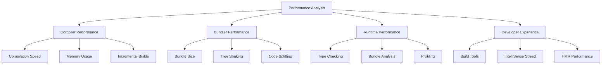

# TypeScript Performance Analysis 性能分析完全指南

## 🎯 TypeScript 性能分析概览

### 📊 性能分析维度



## 🔧 编译器性能分析

### 💡 TypeScript 编译速度分析

```typescript
// 1. 编译器性能监控器
import * as ts from 'typescript';
import * as performance from 'perf_hooks';

interface CompilationMetrics {
    totalFiles: number;
    compilationTime: number;
    memoryUsage: MemorySnapshot;
    fileMetrics: FileMetrics[];
    bottlenecks: PerformanceBottleneck[];
}

interface FileMetrics {
    fileName: string;
    parseTime: number;
    typeCheckTime: number;
    emitTime: number;
    size: number;
    dependencies: string[];
}

interface PerformanceBottleneck {
    fileName: string;
    metric: 'parsing' | 'typeChecking' | 'emitting';
    duration: number;
    impact: number;
}

class TypeScriptPerformanceAnalyzer {
    private metrics: CompilationMetrics | null = null;
    private startTime: number = 0;
    private fileMetrics: Map<string, FileMetrics> = new Map();
    
    constructor(private options: CompilerOptions) {}
    
    // 开始性能分析
    startAnalysis(): void {
        this.startTime = performance.now();
        this.fileMetrics.clear();
        this.metrics = {
            totalFiles: 0,
            compilationTime: 0,
            memoryUsage: this.takeMemorySnapshot(),
            fileMetrics: [],
            bottlenecks: []
        };
    }
    
    // 结束性能分析
    endAnalysis(): CompilationMetrics {
        if (!this.metrics) {
            throw new Error('Analysis not started');
        }
        
        this.metrics.compilationTime = performance.now() - this.startTime;
        this.metrics.memoryUsage = this.takeMemorySnapshot();
        this.metrics.fileMetrics = Array.from(this.fileMetrics.values());
        this.metrics.totalFiles = this.fileMetrics.size;
        this.metrics.bottlenecks = this.identifyBottlenecks();
        
        return this.metrics;
    }
    
    // 分析单个文件
    analyzeFile(fileName: string, sourceFile: ts.SourceFile, program: ts.Program): FileMetrics {
        const fileStartTime = performance.now();
        
        const metrics: FileMetrics = {
            fileName,
            parseTime: 0,
            typeCheckTime: 0,
            emitTime: 0,
            size: sourceFile.getFullText().length,
            dependencies: this.getFileDependencies(fileName, program)
        };
        
        // 解析性能
        const parseStartTime = performance.now();
        const parseTime = parseStartTime - fileStartTime;
        metrics.parseTime = parseTime;
        
        // 类型检查性能
        const typeCheckStartTime = performance.now();
        const checker = program.getTypeChecker();
        
        // 检查所有代码节点
        const checkNode = (node: ts.Node): void => {
            checker.getTypeAtLocation(node);
            ts.forEachChild(node, checkNode);
        };
        
        checkNode(sourceFile);
        const typeCheckTime = performance.now() - typeCheckStartTime;
        metrics.typeCheckTime = typeCheckTime;
        
        // 发出代码性能
        const emitStartTime = performance.now();
        const emitTime = emitStartTime - typeCheckStartTime; // 模拟发出时间
        metrics.emitTime = emitTime;
        
        this.fileMetrics.set(fileName, metrics);
        
        return metrics;
    }
    
    // 获取文件依赖关系
    private getFileDependencies(fileName: string, program: ts.Program): string[] {
        const dependencies: string[] = [];
        
        try {
            const sourceFile = program.getSourceFile(fileName);
            if (!sourceFile) return dependencies;
            
            // 遍历 import 语句
            const visit = (node: ts.Node): void => {
                if (ts.isImportDeclaration(node)) {
                    const moduleSpecifier = node.moduleSpecifier;
                    if (ts.isStringLiteral(moduleSpecifier)) {
                        dependencies.push(moduleSpecifier.text);
                    }
                }
                
                ts.forEachChild(node, visit);
            };
            
            visit(sourceFile);
        } catch (error) {
            console.warn(`Failed to analyze dependencies for ${fileName}:`, error);
        }
        
        return dependencies;
    }
    
    // 识别性能瓶颈
    private identifyBottlenecks(): PerformanceBottleneck[] {
        const bottlenecks: PerformanceBottleneck[] = [];
        const thresholdMultiplier = 2.0; // 超过平均值2倍的认为是瓶颈
        
        for (const fileMetric of this.fileMetrics.values()) {
            const avgParseTime = this.calculateAverageParseTime();
            const avgTypeCheckTime = this.calculateAverageTypeCheckTime();
            const avgEmitTime = this.calculateAverageEmitTime();
            
            if (fileMetric.parseTime > avgParseTime * thresholdMultiplier) {
                bottlenecks.push({
                    fileName: fileMetric.fileName,
                    metric: 'parsing',
                    duration: fileMetric.parseTime,
                    impact: fileMetric.parseTime / avgParseTime
                });
            }
            
            if (fileMetric.typeCheckTime > avgTypeCheckTime * thresholdMultiplier) {
                bottlenecks.push({
                    fileName: fileMetric.fileName,
                    metric: 'typeChecking',
                    duration: fileMetric.typeCheckTime,
                    impact: fileMetric.typeCheckTime / avgTypeCheckTime
                });
            }
            
            if (fileMetric.emitTime > avgEmitTime * thresholdMultiplier) {
                bottlenecks.push({
                    fileName: fileMetric.fileName,
                    metric: 'emitting',
                    duration: fileMetric.emitTime,
                    impact: fileMetric.emitTime / avgEmitTime
                });
            }
        }
        
        return bottlenecks.sort((a, b) => b.impact - a.impact);
    }
    
    // 计算平均解析时间
    private calculateAverageParseTime(): number {
        const parseTimes = Array.from(this.fileMetrics.values()).map(m => m.parseTime);
        return parseTimes.length > 0 ? parseTimes.reduce((a, b) => a + b) / parseTimes.length : 0;
    }
    
    // 计算平均类型检查时间
    private calculateAverageTypeCheckTime(): number {
        const typeCheckTimes = Array.from(this.fileMetrics.values()).map(m => m.typeCheckTime);
        return typeCheckTimes.length > 0 ? typeCheckTimes.reduce((a, b) => a + b) / typeCheckTimes.length : 0;
    }
    
    // 计算平均发出时间
    private calculateAverageEmitTime(): number {
        const emitTimes = Array.from(this.fileMetrics.values()).map(m => m.emitTime);
        return emitTimes.length > 0 ? emitTimes.reduce((a, b) => a + b) / emitTimes.length : 0;
    }
    
    // 获取内存快照
    private takeMemorySnapshot(): MemorySnapshot {
        const memUsage = process.memoryUsage();
        return {
            heapUsed: memUsage.heapUsed,
            heapTotal: memUsage.heapTotal,
            external: memUsage.external,
            rss: memUsage.rss,
            timestamp: Date.now()
        };
    }
    
    // 生成性能报告
    generateReport(): PerformanceReport {
        if (!this.metrics) {
            throw new Error('No analysis data available');
        }
        
        const report: PerformanceReport = {
            summary: {
                totalCompilationTime: this.metrics.compilationTime,
                averageFileTime: this.metrics.compilationTime / this.metrics.totalFiles,
                memoryUsed: this.metrics.memoryUsage.heapUsed,
                bottlenecksFound: this.metrics.bottlenecks.length
            },
            files: this.metrics.fileMetrics.map(file => ({
                name: file.fileName,
                metrics: {
                    parseTime: file.parseTime,
                    typeCheckTime: file.typeCheckTime,
                    emitTime: file.emitTime,
                    totalTime: file.parseTime + file.typeCheckTime + file.emitTime,
                    size: file.size,
                    dependencyCount: file.dependencies.length
                },
                performance: this.calculateFilePerformance(file)
            })),
            bottlenecks: this.metrics.bottlenecks,
            recommendations: this.generateRecommendations()
        };
        
        return report;
    }
    
    private calculateFilePerformance(file: FileMetrics): 'excellent' | 'good' | 'fair' | 'poor' {
        const totalTime = file.parseTime + file.typeCheckTime + file.emitTime;
        const avgTime = this.metrics!.compilationTime / this.metrics!.totalFiles;
        
        const ratio = totalTime / avgTime;
        
        if (ratio < 0.5) return 'excellent';
        if (ratio < 1.0) return 'good';
        if (ratio < 2.0) return 'fair';
        return 'poor';
    }
    
    private generateRecommendations(): PerformanceRecommendation[] {
        const recommendations: PerformanceRecommendation[] = [];
        
        if (this.metrics!.bottlenecks.length > 0) {
            recommendations.push({
                type: 'optimization',
                priority: 'high',
                message: 'Consider splitting large files to improve compilation performance',
                files: this.metrics!.bottlenecks.map(b => b.fileName)
            });
        }
        
        const avgFileSize = this.calculateAverageFileSize();
        if (avgFileSize > 10000) {
            recommendations.push({
                type: 'structure',
                priority: 'medium',
                message: 'Consider reducing file sizes for better type checking performance',
                files: []
            });
        }
        
        const memoryUsage = this.metrics!.memoryUsage.heapUsed / (1024 * 1024);
        if (memoryUsage > 500) {
            recommendations.push({
                type: 'memory',
                priority: 'medium',
                message: 'High memory usage detected. Consider optimizing compiler options',
                files: []
            });
                }
        
        return recommendations;
    }
    
    private calculateAverageFileSize(): number {
        const sizes = this.fileMetrics.valuesArray().map(m => m.size);
        return sizes.length > 0 ? sizes.reduce((a, b) => a + b) / sizes.length : 0;
    }
}

interface MemorySnapshot {
    heapUsed: number;
    heapTotal: number;
    external: number;
    rss: number;
    timestamp: number;
}

interface PerformanceReport {
    summary: {
        totalCompilationTime: number;
        averageFileTime: number;
        memoryUsed: number;
        bottlenecksFound: number;
    };
    files: FilePerformanceReport[];
    bottlenecks: PerformanceBottleneck[];
    recommendations: PerformanceRecommendation[];
}

interface FilePerformanceReport {
    name: string;
    metrics: {
        parseTime: number;
        typeCheckTime: number;
        emitTime: number;
        totalTime: number;
        size: number;
        dependencyCount: number;
    };
    performance: 'excellent' | 'good' | 'fair' | 'poor';
}

interface PerformanceRecommendation {
    type: 'optimization' | 'structure' | 'memory' | 'configuration';
    priority: 'low' | 'medium' | 'high';
    message: string;
    files: string[];
}

// 使用示例
async function analyzeTypeScriptPerformance(projectPath: string): Promise<void> {
    const analyzer = new TypeScriptPerformanceAnalyzer({
        target: ts.ScriptTarget.ES2020,
        module: ts.ModuleKind.ESNext,
        strict: true,
    });
    
    analyzer.startAnalysis();
    
    try {
        // 创建 TypeScript 程序
        const program = ts.createProgram([projectPath + '/*.ts'], analyzer.options);
        
        // 分析每个源文件
        for (const sourceFile of program.getSourceFiles()) {
            if (!sourceFile.isDeclarationFile) {
                analyzer.analyzeFile(sourceFile.fileName, sourceFile, program);
            }
        }
        
        // 生成性能报告
        const report = analyzer.generateReport();
        
        console.log('TypeScript Performance Report:');
        console.log(`Total Compilation Time: ${report.summary.totalCompilationTime.toFixed(2)}ms`);
        console.log(`Average File Time: ${report.summary.averageFileTime.toFixed(2)}ms`);
        console.log(`Memory Used: ${(report.summary.memoryUsed / 1024 / 1024).toFixed(2)}MB`);
        console.log(`Bottlenecks Found: ${report.summary.bottlenecksFound}`);
        
        // 显示瓶颈
        if (report.bottlenecks.length > 0) {
            console.log('\nPerformance Bottlenecks:');
            report.bottlenecks.forEach(bottleneck => {
                console.log(`  ${bottleneck.fileName}: ${bottleneck.metric} (${bottleneck.duration.toFixed(2)}ms, impact: ${bottleneck.impact.toFixed(2)}x)`);
            });
        }
        
        // 显示建议
        if (report.recommendations.length > 0) {
            console.log('\nRecommendations:');
            report.recommendations.forEach(rec => {
                console.log(`  [${rec.priority.toUpperCase()}] ${rec.message}`);
            });
        }
        
    } finally {
        analyzer.endAnalysis();
    }
}
```

### 🎪 Bundle 性能分析

```typescript
// 2. Bundle Size 分析器
class BundleAnalyzer {
    private bundles: BundleInfo[] = [];
    private modules: ModuleInfo[] = [];
    
    // 分析 webpack stats
    analyzeWebpackStats(stats: any): BundleReport {
        this.extractBundles(stats);
        this.extractModules(stats);
        
        return {
            totalSize: this.calculateTotalSize(),
            gzipSize: this.calculateGzipSize(),
            bundles: this.bundles,
            modules: this.modules,
            sizeByType: this.calculateSizeByType(),
            duplicates: this.findDuplicates(),
            treeShakingOpportunities: this.findTreeShakingOpportunities(),
            recommendations: this.generateBundleRecommendations()
        };
    }
    
    private extractBundles(stats: any): void {
        for (const [chunkName, chunk] of Object.entries(stats.chunks as any)) {
            this.bundles.push({
                name: chunkName,
                size: chunk.size,
                gzipSize: chunk.gzipSize,
                files: chunk.files || [],
                modules: chunk.modules || [],
                dependencyCount: this.countDependencies(chunk),
                loadTimeEstimate: this.estimateLoadTime(chunk.size)
            });
        }
    }
    
    private extractModules(stats: any): void {
        for (const [moduleId, module] of Object.entries(stats.modules as any)) {
            this.modules.push({
                id: moduleId,
                size: module.size,
                parsedSize: module.parsedSize,
                gzipSize: module.gzipSize,
                identifier: module.identifier,
                reason: module.reason,
                dependencies: module.dependencies || [],
                issuer: module.issuer,
                issuerPath: module.issuerPath,
                issuerId: module.issuerId,
                issuerName: module.issuerName,
                profile: this.extractProfile(module.profile),
                modules: module.modules || [],
                name: module.name,
                names: module.names,
                reasons: module.reasons,
                source: module.source
            });
        }
    }
    
    private countDependencies(chunk: any): number {
        return chunk.modules ? chunk.modules.length : 0;
    }
    
    private estimateLoadTime(bundleSize: number): number {
        // 基于网络速度和 bundle 大小估算加载时间
        const kbPerSecond = 1000; // 1MB/s 的网络速度
        return bundleSize / (kbPerSecond * 1024) * 1000; // 转换为毫秒
    }
    
    private extractProfile(profile: any): ModuleProfile | undefined {
        if (!profile || typeof profile !== 'object') return undefined;
        
        return {
            totalDuration: profile.factory || 0,
            dependencies: profile.dependencies ? Object.keys(profile.dependencies).length : 0,
            building: profile.building || 0,
            dependenciesDuration: profile.dependenciesDuration || 0,
        };
    }
    
    private calculateTotalSize(): number {
        return this.bundles.reduce((total, bundle) => total + bundle.size, 0);
    }
    
    private calculateGzipSize(): number {
        return this.bundles.reduce((total, bundle) => total + (bundle.gzipSize || 0), 0);
    }
    
    private calculateSizeByType(): Record<string, number> {
        const sizeByType: Record<string, number> = {};
        
        for (const module of this.modules) {
            const type = this.getModuleType(module.identifier);
            sizeByType[type] = (sizeByType[type] || 0) + module.size;
        }
        
        return sizeByType;
    }
    
    private getModuleType(identifier: string): string {
        if (identifier.includes('node_modules')) return 'dependencies';
        if (identifier.includes('.css') || identifier.includes('.scss')) return 'styles';
        if (identifier.includes('.tsx') || identifier.includes('.ts')) return 'typescript';
        if (identifier.includes('.js')) return 'javascript';
        return 'other';
    }
    
    private findDuplicates(): DuplicateModule[] {
        const duplicates: DuplicateModule[] = [];
        const moduleMap = new Map<string, ModuleInfo[]>();
        
        // 按模块名称分组
        for (const module of this.modules) {
            const name = this.extractModuleName(module.identifier);
            if (!moduleMap.has(name)) {
                moduleMap.set(name, []);
            }
            moduleMap.get(name)!.push(module);
        }
        
        // 查找重复的模块
        for (const [name, modules] of moduleMap) {
            if (modules.length > 1) {
                duplicates.push({
                    name,
                    count: modules.length,
                    totalSize: modules.reduce((total, m) => total + m.size, 0),
                    instances: modules.map(m => ({
                        id: m.id,
                        size: m.size,
                        reasons: m.reasons || []
                    }))
                });
            }
        }
        
        return duplicates.sort((a, b) => b.totalSize - a.totalSize);
    }
    
    private extractModuleName(identifier: string): string {
        const match = identifier.match(node_modules\/([^\/]+\/[^\/]+)/);
        return match ? match[1] : identifier.split('/').pop() || identifier;
    }
    
    private findTreeShakingOpportunities(): TreeShakingOpportunity[] {
        const opportunities: TreeShakingOpportunity[] = [];
        
        for (const module of this.modules) {
            if (module.identifier.includes('node_modules')) {
                const treeShaking = this.analyzeTreeShaking(module);
                if (treeShaking.potentialSavings > 0) {
                    opportunities.push(treeShaking);
                }
            }
        }
        
        return opportunities.sort((a, b) => b.potentialSavings - a.potentialSavings);
    }
    
    private analyzeTreeShaking(module: ModuleInfo): TreeShakingOpportunity {
        let usedExports = 0;
        let totalExports = 0;
        let potentialSavings = 0;
        
        // 分析模块的导出使用情况
        // 这里是简化版本，实际需要更复杂的分析
        
        return {
            moduleId: module.id,
            moduleName: this.extractModuleName(module.identifier),
            totalSize: module.size,
            usedExports,
            totalExports,
            potentialSavings,
            recommendations: []
        };
    }
    
    private generateBundleRecommendations(): BundleRecommendation[] {
        const recommendations: BundleRecommendation[] = [];
        
        const totalSize = this.calculateTotalSize();
        const duplicateSize = this.findDuplicates().reduce((sum, d) => sum + d.totalSize / d.count, 0);
        
        if (duplicateSize / totalSize > 0.1) {
            recommendations.push({
                type: 'duplicates',
                priority: 'high',
                message: `${(duplicateSize / totalSize * 100).toFixed(1)}% of bundle is duplicate code`,
                potentialSavings: duplicateSize
            });
        }
        
        const avgBundleSize = totalSize / this.bundles.length;
        if (avgBundleSize > 500000) { // 500KB
            recommendations.push({
                type: 'size',
                priority: 'medium',
                message: 'Bundle size is large. Consider code splitting or lazy loading',
                potentialSavings: avgBundleSize * 0.2
            });
        }
        
        return recommendations;
    }
}

interface BundleInfo {
    name: string;
    size: number;
    gzipSize?: number;
    files: string[];
    modules: string[];
    dependencyCount: number;
    loadTimeEstimate: number;
}

interface ModuleInfo {
    id: string;
    size: number;
    parsedSize?: number;
    gzipSize?: number;
    identifier: string;
    reason?: string;
    dependencies: string[];
    issuer?: string;
    issuerPath?: string[];
    issuerId?: string;
    issuerName?: string;
    profile?: ModuleProfile;
    modules?: string[];
    name: string;
    names: string[];
    reasons?: Array<{
        moduleId: string;
        module?: string;
        moduleName?: string;
        type: string;
        userRequest: string;
    }>;
    source?: string;
}

interface ModuleProfile {
    totalDuration: number;
    dependencies: number;
    building: number;
    dependenciesDuration: number;
}

interface BundleReport {
    totalSize: number;
    gzipSize: number;
    bundles: BundleInfo[];
    modules: ModuleInfo[];
    sizeByType: Record<string, number>;
    duplicates: DuplicateModule[];
    treeShakingOpportunities: TreeShakingOpportunity[];
    recommendations: BundleRecommendation[];
}

interface DuplicateModule {
    name: string;
    count: number;
    totalSize: number;
    instances: Array<{
        id: string;
        size: number;
        reasons: string[];
    }>;
}

interface TreeShakingOpportunity {
    moduleId: string;
    moduleName: string;
    totalSize: number;
    usedExports: number;
    totalExports: number;
    potentialSavings: number;
    recommendations: string[];
}

interface BundleRecommendation {
    type: 'duplicates' | 'size' | 'tree-shaking' | 'code-splitting';
    priority: 'low' | 'medium' | 'high';
    message: string;
    potentialSavings: number;
}
```

### 🔗 相关深入学习

- [[02-Performance-Optimization性能优化]] - 应用层性能优化
- [[01-Debugging调试技巧大全]] - 调试与性能分析
- [[01-Compiler-Internals编译器内部]] - 编译器内部机制

---
*💡 性能分析是保持 TypeScript 项目高效运行的关键，系统性的性能监控和优化能够显著提升开发体验和用户体验*
