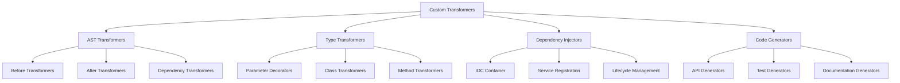

# TypeScript 自定义转换器完全指南

## 🎯 自定义转换器概览

### 📊 转换器生态系统



## 🔧 基础转换器架构

### 💡 Transformer Factory Pattern

```typescript
// Custom Transformer Architecture
import * as ts from 'typescript';

// 1. Base Transformer Interface
interface CustomTransformer {
    before?(sourceFile: ts.SourceFile): ts.SourceFile;
    after?(sourceFile: ts.SourceFile, result: ts.EmitResult): ts.EmitResult;
}

// 2. Advanced Transformer Factory
class TransformerFactory {
    private transformers: Map<string, CustomTransformer> = new Map();
    private context: ts.TransformationContext;
    
    constructor(program: ts.Program) {
        this.program = program;
        this.typeChecker = program.getTypeChecker();
        this.initContext();
    }
    
    private initContext(): void {
        // 创建转换上下文
        const context: ts.TransformationContext = {
            // 编译器选项
            getCompilerOptions: () => this.program.getCompilerOptions(),
            
            // 诊断报告
            reportDiagnostic: (diagnostic) => {
                console.warn(`Diagnostic: ${diagnostic.messageText}`);
            },
            
            // 环境管理
            startLexicalEnvironment: () => {},
            endLexicalEnvironment: () => ts.createNodeArray(),
            suspendLexicalEnvironment: () => {},
            resumeLexicalEnvironment: () => ts.createNodeArray(),
        };
        
        this.context = context;
    }
    
    // 注册转换器
    registerTransformer(name: string, transformer: CustomTransformer): this {
        this.transformers.set(name, transformer);
        return this;
    }
    
    // 创建转换器链
    createTransformerChain(): ts.TransformerFactory<ts.SourceFile> {
        return (context: ts.TransformationContext) => {
            return (sourceFile: ts.SourceFile) => {
                let transformed = sourceFile;
                
                // 应用所有注册的转换器
                for (const [name, transformer] of this.transformers) {
                    if (transformer.before) {
                        try {
                            transformed = transformer.before(transformed);
                        } catch (error) {
            Console.error(`Error in transformer ${name}:`, error);
                        }
                    }
                }
                
                return transformed;
            };
        };
    }
    
    // 批量转换文件
    async transformProject(): Promise<void> {
        const files = this.program.getSourceFiles();
        
        for (const sourceFile of files) {
            if (sourceFile.isDeclarationFile) continue;
            
            const transformerChain = this.createTransformerChain();
            const transformationResult = ts.transform(sourceFile, [transformerChain]);
            
            if (transformationResult.transformed.length > 0) {
                // 输出转换后的代码
                const result = transformationResult.transformed[0];
                await this.writeTransformedFile(sourceFile.fileName, result);
            }
            
            transformationResult.dispose();
        }
    }
    
    private async writeTransformedFile(fileName: string, sourceFile: ts.SourceFile): Promise<void> {
        const printer = ts.createPrinter({
            removeComments: false,
            omitTrailingCommaInModule: true,
        });
        
        const sourceCode = printer.printFile(sourceFile);
        await fs.writeFile(fileName.replace('.ts', '.transformed.ts'), sourceCode);
    }
}

// 3. Decorator Processing Transformer
class DecoratorProcessorTransformer implements CustomTransformer {
    before(sourceFile: ts.SourceFile): ts.SourceFile {
        return ts.visitNode(sourceFile, this.visit);
    }
    
    private visit = (node: ts.Node): ts.Node => {
        // 处理类装饰器
        if (ts.isClassDeclaration(node)) {
            node = this.processClassDecorators(node);
        }
        
        // 处理方法装饰器
        if (ts.isMethodDeclaration(node)) {
            node = this.processMethodDecorators(node);
        }
        
        // 处理属性装饰器
        if (ts.isPropertyDeclaration(node)) {
            node = this.processPropertyDecorators(node);
        }
        
        // 处理参数装饰器
        if (ts.isParameter(node)) {
            node = this.processParameterDecorators(node);
        }
        
        return ts.visitEachChild(node, this.visit, this.context);
    };
    
    private processClassDecorators(node: ts.ClassDeclaration): ts.ClassDeclaration {
        if (!node.decorators) return node;
        
        for (const decorator of node.decorators) {
            if (ts.isIdentifier(decorator.expression)) {
                const decoratorName = decorator.expression.text;
                
                switch (decoratorName) {
                    case 'Singleton':
                        node = this.injectSingleton(node);
                        break;
                    case 'Injectable':
                        node = this.injectInjectable(node);
                        break;
                    case 'Controller':
                        node = this.injectController(node);
                        break;
                }
            }
        }
        
        return node;
    }
    
    private injectSingleton(node: ts.ClassDeclaration): ts.ClassDeclaration {
        const className = node.name?.text || 'AnonymousClass';
        
        // 生成单例模式代码
        const singletonField = ts.factory.createPropertyDeclaration(
            undefined,
            undefined,
            'instance',
            undefined,
            undefined,
            undefined
        );
        
        const getInstanceMethod = ts.factory.createMethodDeclaration(
            undefined,
            undefined,
            'getInstance',
            undefined,
            undefined,
            [],
            ts.factory.createTypeReferenceNode(className),
            ts.factory.createBlock([
                ts.factory.createIfStatement(
                    ts.factory.createLogicalNot(this.references['instance']),
                    ts.factory.createBlock([
                        this.refs['instance'] = new (className)()
                    ])
                ),
                ts.factory.createReturnStatement(this.refs['instance'])
            ])
        );
        
        const updatedMembers = [...(node.members || []), singletonField, getInstanceMethod];
        
        return ts.factory.updateClassDeclaration(
            node,
            node.decorators,
            node.modifiers,
            node.name,
            node.typeParameters,
            node.heritageClauses,
            updatedMembers
        );
    }
}
```

### 🎪 Dependency Injection Transform

```typescript
// Dependency Injection Transformer
class DITransformer implements CustomTransformer {
    private serviceRegistry: Map<string, ServiceDefinition> = new Map();
    private injectionPoints: Map<string, InjectionPoint[]> = new Map();
    
    constructor(private context: ts.TransformationContext) {}
    
    before(sourceFile: ts.SourceFile): ts.SourceFile {
        this.collectServiceDefinitions(sourceFile);
        this.collectInjectionPoints(sourceFile);
        return this.transform(sourceFile);
    }
    
    private collectServiceDefinitions(sourceFile: ts.SourceFile): void {
        ts.forEachChild(sourceFile, (node) => {
            if (ts.isClassDeclaration(node)) {
                const decorators = node.decorators || [];
                
                for (const decorator of decorators) {
                    if (this.isInjectableDecorator(decorator)) {
                        const serviceDef = this.extractServiceDefinition(node, decorator);
                        this.serviceRegistry.set(serviceDef.name, serviceDef);
                    }
                }
            }
        });
    }
    
    private extractServiceDefinition(
        node: ts.ClassDeclaration, 
        decorator: ts.Decorator
    ): ServiceDefinition {
        const className = node.name?.text || 'AnonymousService';
        
        // 提取构造函数参数
        const constructor = node.members.find(m => ts.isConstructorDeclaration(m)) as ts.ConstructorDeclaration;
        const dependencies = constructor?.parameters.map(param => ({
            type: this.getParameterType(param),
            name: param.name,
            optional: !!param.questionToken
        })) || [];
        
        // 提取生命周期
        const lifetime = this.extractLifetime(decorator);
        
        return {
            name: className,
            dependencies,
            lifetime,
            constructor,
            methods: this.extractMethods(node)
        };
    }
    
    private extractLifetime(decorator: ts.Decorator): ServiceLifetime {
        // 解析装饰器参数获取生命周期
        if (ts.isCallExpression(decorator.expression)) {
            const args = decorator.expression.arguments;
            if (args.length > 0 && ts.isObjectLiteralExpression(args[0])) {
                // 解析对象字面量中的lifetime属性
                // 简化的实现，实际需要更复杂的解析
                return 'singleton'; // 默认值
            }
        }
        
        return 'transient'; // 默认生命周期
    }
    
    private transform(sourceFile: ts.SourceFile): ts.SourceFile {
        return ts.visitNode(sourceFile, (node) => {
            if (ts.isClassDeclaration(node)) {
                return this.transformClassWithDI(node);
            }
            return ts.visitEachChild(node, (child) => this.transform(child), this.context);
        });
    }
    
    private transformClassWithDI(node: ts.ClassDeclaration): ts.ClassDeclaration {
        const serviceName = node.name?.text;
        if (!serviceName || !this.serviceRegistry.has(serviceName)) {
            return node;
        }
        
        const serviceDef = this.serviceRegistry.get(serviceName)!;
        
        // 注入依赖解析代码
        const dependencyResolverField = ts.factory.createPropertyDeclaration(
            undefined,
            undefined,
            '_dependencies',
            undefined,
            ts.factory.createArrayTypeNode(
                ts.factory.createTypeReferenceNode('ServiceReference')
            ),
            ts.factory.createArrayLiteralExpression([
                ...serviceDef.dependencies.map(dep => 
                    ts.factory.createObjectLiteralExpression([
                        ts.factory.createPropertyAssignment('type', ts.factory.createStringLiteral(dep.type)),
                        ts.factory.createPropertyAssignment('name', ts.factory.createStringLiteral(dep.name)),
                        ts.factory.createPropertyAssignment('optional', 
                            dep.optional ? ts.factory.createTrue() : ts.factory.createFalse())
                    ])
                )
            ])
        );
        
        // 注入解析方法
        const resolveMethod = this.createResolveMethod(serviceDef);
        
        const updatedMembers = [
            dependencyResolverField,
            ...(node.members || []),
            resolveMethod
        ];
        
        return ts.factory.updateClassDeclaration(
            node,
            node.decorators,
            node.modifiers,
            node.name,
            node.typeParameters,
            node.heritageClauses,
            updatedMembers
        );
    }
    
    private createResolveMethod(serviceDef: ServiceDefinition): ts.MethodDeclaration {
        return ts.factory.createMethodDeclaration(
            undefined,
            undefined,
            'resolveDependencies',
            undefined,
            undefined,
            [],
            undefined,
            ts.factory.createBlock([
                ts.factory.createVariableStatement(
                    undefined,
                    ts.factory.createVariableDeclarationList([
                        ts.factory.createVariableDeclaration(
                            'resolved',
                            undefined,
                            undefined,
                            ts.factory.createArrayLiteralExpression([], true)
                        )
                    ])
                ),
                
                ...serviceDef.dependencies.map((dep, index) => 
                    ts.factory.createVariableStatement(
                        undefined,
                        ts.factory.createVariableDeclarationList([
                            ts.factory.createVariableDeclaration(
                                dep.name,
                                undefined,
                                undefined,
                                ts.factory.createCallExpression(
                                    ts.factory.createPropertyAccessExpression(
                                        ts.factory.createThis(),
                                        'getService'
                                    ),
                                    undefined,
                                    [ts.factory.createStringLiteral(dep.type)]
                                )
                            )
                        ])
                    )
                ),
                
                ts.factory.createReturnStatement(
                    ts.factory.createNewExpression(
                        ts.factory.createIdentifier(serviceDef.name),
                        undefined,
                        serviceDef.dependencies.map(dep => ts.factory.createIdentifier(dep.name))
                    )
                )
            ])
        );
    }
    
    private isInjectableDecorator(decorator: ts.Decorator): boolean {
        if (ts.isCallExpression(decorator.expression)) {
            const expression = decorator.expression;
            if (ts.isIdentifier(expression.expression)) {
                return ['Injectable', 'Singleton', 'Transient', 'Scoped'].includes(
                    expression.expression.text
                );
            }
        }
        
        if (ts.isIdentifier(decorator.expression)) {
            return ['Injectable', 'Singleton', 'Transient', 'Scoped'].includes(
                decorator.expression.text
            );
        }
        
        return false;
    }
}

// Types for DI Transformer
interface ServiceDefinition {
    name: string;
    dependencies: DependencyDefinition[];
    lifetime: ServiceLifetime;
    constructor?: ts.ConstructorDeclaration;
    methods: ts.MethodDeclaration[];
}

interface DependencyDefinition {
    type: string;
    name: string;
    optional: boolean;
}

type ServiceLifetime = 'singleton' | 'transient' | 'scoped';

interface InjectionPoint {
    declaration: ts.ParameterDeclaration;
    serviceType: string;
    isOptional: boolean;
}
```

## 🚀 Advanced Transformers

### 🔄 API Generation Transformer

```typescript
// API Generation Transformer
class APIGenerationTransformer implements CustomTransformer {
    private apiDefinitions: Map<string, APIDefinition> = new Map();
    private generatedFiles: Map<string, ts.SourceFile> = new Map();
    
    before(sourceFile: ts.SourceFile): ts.SourceFile {
        this.extractAPIDefinitions(sourceFile);
        return sourceFile;
    }
    
    after(sourceFile: ts.SourceFile, result: ts.EmitResult): ts.EmitResult {
        this.generateAPIFiles();
        return result;
    }
    
    private extractAPIDefinitions(sourceFile: ts.SourceFile): void {
        ts.forEachChild(sourceFile, (node) => {
            if (ts.isClassDeclaration(node)) {
                const decorators = node.decorators || [];
                
                for (const decorator of decorators) {
                    if (this.isControllerDecorator(decorator)) {
                        const apiDef = this.extractControllerAPI(node, decorator);
                        this.apiDefinitions.set(apiDef.name, apiDef);
                    }
                }
            }
        });
    }
    
    private isControllerDecorator(decorator: ts.Decorator): boolean {
        if (ts.isCallExpression(decorator.expression)) {
            const expr = decorator.expression.expression;
            if (ts.isIdentifier(expr)) {
                return expr.text === 'Controller';
            }
        }
        
        return false;
    }
    
    private extractControllerAPI(node: ts.ClassDeclaration, decorator: ts.Decorator): APIDefinition {
        const className = node.name?.text || 'AnonymousController';
        
        // 提取路由前缀
        const routePrefix = this.extractRoutePrefix(decorator);
        
        // 提取方法
        const endpoints = this.extractEndpoints(node);
        
        return {
            name: className,
            routePrefix,
            endpoints,
            middlewares: this.extractMiddlewares(node),
            version: this.extractVersion(decorator)
        };
    }
    
    private extractEndpoints(node: ts.ClassDeclaration): APIEndpoint[] {
        const endpoints: APIEndpoint[] = [];
        
        for (const member of node.members) {
            if (ts.isMethodDeclaration(member)) {
                const endpoint = this.extractMethodEndpoint(member);
                if (endpoint) {
                    endpoints.push(endpoint);
                }
            }
        }
        
        return endpoints;
    }
    
    private extractMethodEndpoint(method: ts.MethodDeclaration): APIEndpoint | null {
        const decorators = method.decorators;
        if (!decorators) return null;
        
        let httpMethod: HttpMethod | null = null;
        let route = '';
        let middlewares: string[] = [];
        
        for (const decorator of decorators) {
            if (ts.isCallExpression(decorator.expression)) {
                const expr = decorator.expression.expression;
                if (ts.isIdentifier(expr)) {
                    const decoratorName = expr.text;
                    
                    if (['Get', 'Post', 'Put', 'Delete', 'Patch'].includes(decoratorName)) {
                        httpMethod = decoratorName.toUpperCase() as HttpMethod;
                        
                        // 提取路由
                        if (decorator.expression.arguments.length > 0) {
                            const routeArg = decorator.expression.arguments[0];
                            if (ts.isStringLiteral(routeArg)) {
                                route = routeArg.text;
                            }
                        }
                    }
                    
                    if (['Use', 'Middleware'].includes(decoratorName)) {
                        // 提取中间件
                        const middlewareArgs = decorator.expression.arguments;
                        middlewareArgs.forEach(arg => {
                            if (ts.isStringLiteral(arg)) {
                                middlewares.push(arg.text);
                            }
                        });
                    }
                }
            }
        }
        
        if (!httpMethod) return null;
        
        return {
            httpMethod,
            route,
            methodName: method.name?.getText() || 'anonymous',
            parameters: this.extractParameters(method),
            returnType: this.extractReturnType(method),
            middlewares,
            documentation: this.extractDocumentation(method)
        };
    }
    
    private generateAPIFiles(): void {
        // 生成接口定义文件
        const interfaceFile = this.generateInterfaceFile();
        this.generatedFiles.set('api-interfaces.ts', interfaceFile);
        
        // 生成客户端文件
        const clientFile = this.generateClientFile();
        this.generatedFiles.set('api-client.ts', clientFile);
        
        // 生成测试文件
        const testFile = this.generateTestFile();
        this.generatedFiles.set('api-tests.ts', testFile);
        
        // 生成文档
        const docsFile = this.generateDocsFile();
        this.generatedFiles.set('api-documentation.md', docsFile);
    }
    
    private generateInterfaceFile(): ts.SourceFile {
        const statements: ts.Statement[] = [];
        
        // 生成每个 API 的接口
        for (const [controllerName, apiDef] of this.apiDefinitions) {
            // 为每个端点生成请求/响应接口
            for (const endpoint of apiDef.endpoints) {
                const requestInterface = this.generateRequestInterface(controllerName, endpoint);
                const responseInterface = this.generateResponseInterface(controllerName, endpoint);
                
                statements.push(requestInterface);
                statements.push(responseInterface);
            }
        }
        
        return ts.factory.createSourceFile(
            statements,
            ts.factory.createToken(ts.SyntaxKind.EndOfFileToken),
            ts.NodeFlags.None
        );
    }
    
    private generateRequestInterface(
        controllerName: string, 
        endpoint: APIEndpoint
    ): ts.InterfaceDeclaration {
        const interfaceName = `${controllerName}${this.capitalize(endpoint.methodName)}Request`;
        
        const properties: ts.PropertySignature[] = endpoint.parameters
            .filter(param => param.source !== 'response')
            .map(param => 
                ts.factory.createPropertySignature(
                    param.modifiers || [],
                    param.name,
                    param.questionToken,
                    ts.factory.createTypeReferenceNode(param.type)
                )
            );
        
        return ts.factory.createInterfaceDeclaration(
            undefined,
            undefined,
            interfaceName,
            undefined,
            undefined,
            properties
        );
    }
    
    private generateClientFile(): ts.SourceFile {
        const statements: ts.Statement[] = [];
        
        // 生成基础客户端类
        const clientClass = this.generateBaseClientClass();
        statements.push(clientClass);
        
        // 为每个控制器生成专门的客户端
        for (const [controllerName, apiDef] of this.apiDefinitions) {
            const controllerClient = this.generateControllerClient(controllerName, apiDef);
            statements.push(controllerClient);
        }
        
        return ts.factory.createSourceFile(
            statements,
            ts.factory.createToken(ts.SyntaxKind.EndOfFileToken),
            ts.NodeFlags.None
        );
    }
    
    private generateBaseClientClass(): ts.ClassDeclaration {
        return ts.factory.createClassDeclaration(
            undefined,
            [ts.factory.createToken(ts.SyntaxKind.ExportKeyword)],
            'APIClient',
            undefined,
            undefined,
            [
                // 构造函数
                ts.factory.createConstructor(
                    undefined,
                    [
                        ts.factory.createParameterDeclaration(
                            undefined,
                            undefined,
                            'baseURL',
                            undefined,
                            ts.factory.createKeywordTypeNode(ts.SyntaxKind.StringKeyword),
                            undefined
                        )
                    ],
                    ts.factory.createBlock([
                        ts.factory.createExpressionStatement(
                            ts.factory.createAssignment(
                                ts.factory.createPropertyAccessExpression(
                                    ts.factory.createThis(),
                                    'baseURL'
                                ),
                                ts.factory.createIdentifier('baseURL')
                            )
                        )
                    ])
                ),
                
                // HTTP 方法
                ...this.generateHTTPMethods()
            ]
        );
    }
    
    private generateHTTPMethods(): ts.MethodDeclaration[] {
        return ['get', 'post', 'put', 'delete', 'patch'].map(method =>
            ts.factory.createMethodDeclaration(
                undefined,
                [ts.factory.createModifier(ts.SyntaxKind.ProtectedKeyword)],
                method,
                undefined,
                [
                    ts.factory.createTypeParameterDeclaration(
                        undefined,
                        'T',
                        ts.factory.createTypeReferenceNode('any')
                    )
                ],
                [
                    ts.factory.createParameterDeclaration(
                        undefined,
                        undefined,
                        'url',
                        undefined,
                        ts.factory.createKeywordTypeNode(ts.SyntaxKind.StringKeyword),
                        undefined
                    ),
                    ts.factory.createParameterDeclaration(
                        undefined,
                        undefined,
                        'data',
                        undefined,
                        ts.factory.createKeywordTypeNode(ts.SyntaxKind.ObjectKeyword),
                        ts.factory.createNull()
                    )
                ],
                ts.factory.createTypeReferenceNode('Promise', [
                    ts.factory.createTypeReferenceNode('T')
                ]),
                ts.factory.createBlock([
                    ts.factory.createReturnStatement(
                        ts.factory.createAwaitExpression(
                            ts.factory.createCallExpression(
                                ts.factory.createPropertyAccessExpression(
                                    ts.factory.createIdentifier('fetch'),
                                    'then'
                                ),
                                undefined,
                                [
                                    ts.factory.createArrowFunction(
                                        undefined,
                                        undefined,
                                        [
                                            ts.factory.createParameterDeclaration(
                                                undefined,
                                                undefined,
                                                'response',
                                                undefined,
                                                undefined,
                                                undefined
                                            )
                                        ],
                                        undefined,
                                        undefined,
                                        ts.factory.createCallExpression(
                                            ts.factory.createPropertyAccessExpression(
                                                ts.factory.createIdentifier('response'),
                                                'json'
                                            ),
                                            undefined,
                                            []
                                        )
                                    )
                                ]
                            )
                        )
                    )
                ])
            )
        );
    }
}

// Supporting Types
interface APIDefinition {
    name: string;
    routePrefix: string;
    endpoints: APIEndpoint[];
    middlewares: string[];
    version?: string;
}

interface APIEndpoint {
    httpMethod: HttpMethod;
    route: string;
    methodName: string;
    parameters: APIParameter[];
    returnType: string;
    middlewares: string[];
    documentation?: string;
}

interface APIParameter {
    name: string;
    type: string;
    optional: boolean;
    modifiers?: ts.Modifier[];
    questionToken?: ts.QuestionToken;
    source: 'query' | 'body' | 'param' | 'header' | 'response';
}

type HttpMethod = 'GET' | 'POST' | 'PUT' | 'DELETE' | 'PATCH';
```

### 🔀 Configuration System

```typescript
// Configuration System for Custom Transformers
interface TransformerConfig {
    enabled: boolean;
    options: Record<string, any>;
    targetFiles: string[];
    excludeFiles: string[];
    dependencies: string[];
}

class TransformerConfigurationManager {
    private configs: Map<string, TransformerConfig> = new Map();
    
    loadFromFile(configPath: string): void {
        const configContent = fs.readFileSync(configPath, 'utf-8');
        const parsedConfig = JSON.parse(configContent);
        
        for (const [name, config] of Object.entries(parsedConfig.transformers)) {
            this.configs.set(name, config as TransformerConfig);
        }
    }
    
    getTransformerConfig(name: string): TransformerConfig | undefined {
        return this.configs.get(name);
    }
    
    getAllConfigs(): Map<string, TransformerConfig> {
        return this.configs;
    }
    
    validateConfig(): ValidationResult {
        const errors: string[] = [];
        
        for (const [name, config] of this.configs) {
            if (!config.enabled) continue;
            
            // 检查依赖
            for (const dep of config.dependencies) {
                if (!this.configs.has(dep)) {
                    errors.push(`Transformer ${name} depends on non-existent transformer: ${dep}`);
                }
            }
            
            // 检查文件模式
            if (config.targetFiles.length === 0) {
                errors.push(`Transformer ${name} has no target files specified`);
            }
        }
        
        return {
            valid: errors.length === 0,
            errors
        };
    }
}

// Example configuration file structure
const exampleConfig = {
    "transformers": {
        "decoratorProcessor": {
            "enabled": true,
            "options": {
                "enableSingleton": true,
                "enableInjectable": true,
                "enableController": true
            },
            "targetFiles": ["**/*.ts"],
            "excludeFiles": ["**/*.test.ts", "**/*.spec.ts"],
            "dependencies": []
        },
        "apiGenerator": {
            "enabled": true,
            "options": {
                "outputDirectory": "./generated",
                "generateInterfaces": true,
                "generateClient": true,
                "generateTests": true,
                "generateDocs": true
            },
            "targetFiles": ["**/controllers/**/*.ts"],
            "excludeFiles": [],
            "dependencies": ["decoratorProcessor"]
        },
        "dependencyInjector": {
            "enabled": true,
            "options": {
                "containerName": "DI_Container",
                "enableSingletonPattern": true,
                "generateResolver": true
            },
            "targetFiles": ["**/services/**/*.ts"],
            "excludeFiles": [],
            "dependencies": ["decoratorProcessor"]
        }
    }
};
```

### 🔗 相关深入学习

- [[01-Compiler-Internals编译器内部]] - 编译器工作原理
- [[02-AST-Manipulation AST操作]] - AST操作技术
- [[03-Performance-Analysis性能分析]] - 性能分析与优化

---
*💡 自定义转换器是TypeScript最强大的扩展能力之一，能够实现从代码生成到依赖注入等复杂的企业级功能*
