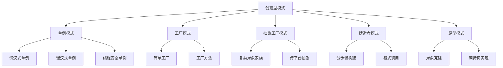

# TypeScript 创建型设计模式

## 🎯 创建型模式概览

### 📊 创建型模式架构图



## 🔧 单例模式 (Singleton)

### 💡 基础单例实现

```typescript
// 懒汉式单例 (线程安全版本)
class DatabaseConnection {
    private static instance: DatabaseConnection | null = null;
    private connectionId: string;
    
    private constructor() {
        this.connectionId = `conn_${Date.now()}_${Math.random().toString(36).substr(2, 9)}`;
        console.log(`创建数据库连接: ${this.connectionId}`);
    }
    
    public static getInstance(): DatabaseConnection {
        if (DatabaseConnection.instance === null) {
            DatabaseConnection.instance = new DatabaseConnection();
        }
        return DatabaseConnection.instance;
    }
    
    public connect(): void {
        console.log(`连接到数据库: ${this.connectionId}`);
    }
    
    public getConnectionId(): string {
        return this.connectionId;
    }
    
    // 防止克隆
    public clone(): never {
        throw new Error('Singleton cannot be cloned');
    }
    
    // 防止序列化重建
    private readResolve(): DatabaseConnection {
        return DatabaseConnection.getInstance();
    }
}

// 使用示例
const db1 = DatabaseConnection.getInstance();
const db2 = DatabaseConnection.getInstance();

console.log(db1 === db2); // true - 同一个实例
db1.connect(); // 输出: 连接到数据库: conn_xxx
```

### 🎯 高级单例模式

```typescript
// 泛型单例基类
abstract class Singleton<T = {}> {
    private static instances: Map<string, any> = new Map();
    
    protected constructor() {}
    
    public static getInstance<T extends Singleton<T>>(
        this: new() => T, 
        key?: string
    ): T {
        const instanceKey = key || this.name;
        
        if (!Singleton.instances.has(instanceKey)) {
            Singleton.instances.set(instanceKey, new this());
        }
        
        return Singleton.instances.get(instanceKey);
    }
    
    public static clearInstance(key?: string): void {
        if (key) {
            Singleton.instances.delete(key);
        } else {
            Singleton.instances.clear();
        }
    }
}

// 配置管理器单例
interface AppConfig {
    apiBaseUrl: string;
    timeout: number;
    retries: number;
    enableLogging: boolean;
}

class ConfigManager extends Singleton<AppConfig> {
    private config: AppConfig;
    
    protected constructor() {
        super();
        this.config = {
            apiBaseUrl: process.env.API_BASE_URL || 'https://api.example.com',
            timeout: parseInt(process.env.TIMEOUT || '5000'),
            retries: parseInt(process.env.RETRIES || '3'),
            enableLogging: process.env.NODE_ENV === 'development'
        };
    }
    
    public get<K extends keyof AppConfig>(key: K): AppConfig[K] {
        return this.config[key];
    }
    
    public update<K extends keyof AppConfig>(key: K, value: AppConfig[K]): void {
        this.config[key] = value;
        console.log(`配置已更新: ${key} = ${value}`);
    }
    
    public getAll(): Readonly<AppConfig> {
        return { ...this.config };
    }
}

// 使用泛型单例
const config1 = ConfigManager.getInstance();
const config2 = ConfigManager.getInstance();
console.log(config1 === config2); // true - 同一个实例
console.log(config1.get('apiBaseUrl'));
```

## 🏭 工厂模式 (Factory)

### 🎯 简单工厂模式

```typescript
// 车辆产品抽象
abstract class Vehicle {
    protected brand: string;
    protected model: string;
    protected year: number;
    
    constructor(brand: string, model: string, year: number) {
        this.brand = brand;
        this.brand = model;
        this.year = year;
    }
    
    abstract start(): string;
    abstract stop(): string;
    abstract accelerate(): string;
    
    public getInfo(): string {
        return `${this.year} ${this.brand} ${this.brand}`;
    }
}

// 具体车辆类
class Car extends Vehicle {
    public start(): string {
        return `${this.getInfo()}发动引擎 - 钥匙启动`;
    }
    
    public stop(): string {
        return `${this.getInfo()}停车 - 手刹拉起`;
    }
    
    public accelerate(): string {
        return `${this.getInfo()}加速 - 踩油门`;
    }
}

class Motorcycle extends Vehicle {
    public start(): string {
        return `${this.getInfo()}踢启动杆 - 电启动`;
    }
    
    public stop(): string {
        return `${this.getInfo()}停车 - 脚刹`;
    }
    
    public accelerate(): string {
        return `${this.getInfo()}加速 - 拧油门`;
    }
}

class Truck extends Vehicle {
    public start(): string {
        return `${this.getInfo()}发动柴油引擎 - 气动启动`;
    }
    
    public stop(): string {
        return `${this.getInfo()}停车 - 气刹系统`;
    }
    
    public accelerate(): string {
        return `${this.getInfo()}加速 - 柴油涡轮增压`;
    }
}

// 简单工厂
type VehicleType = 'car' | 'motorcycle' | 'truck';

interface VehicleSpecification {
    type: VehicleType;
    brand: string;
    model: string;
    year: number;
}

class VehicleFactory {
    public static createVehicle(spec: VehicleSpecification): Vehicle {
        switch (spec.type) {
            case 'car':
                return new Car(spec.brand, spec.model, spec.year);
            case 'motorcycle':
                return new Motorcycle(spec.brand, spec.model, spec.year);
            case 'truck':
                return new Truck(spec.brand, spec.model, spec.year);
            default:
                throw new Error(`不支持的车辆类型: ${spec.type}`);
        }
    }
}

// 使用简单工厂
const vehicle1 = VehicleFactory.createVehicle({
    type: 'car',
    brand: 'Toyota',
    model: 'Camry',
    year: 2023
});

const vehicle2 = VehicleFactory.createVehicle({
    type: 'motorcycle',
    brand: 'Honda',
    model: 'CBR',
    year: 2023
});

console.log(vehicle1.start()); // Toyota Camry发动引擎 - 钥匙启动
console.log(vehicle2.start()); // Honda CBR踢启动杆 - 电启动
```

### 🔧 工厂方法模式

```typescript
// 抽象工厂接口
abstract class VehicleFactoryMethod {
    // 工厂方法：由子类决定创建哪个具体产品
    abstract createVehicle(spec: VehicleSpecification): Vehicle;
    
    // 模板方法：使用产品
    public manufactureVehicle(spec: VehicleSpecification): string {
        console.log('🔨 开始创建车辆...');
        
        const vehicle = this.createVehicle(spec);
        
        console.log('🔧 进行质量检查...');
        this.qualityCheck(vehicle);
        
        console.log('📋 记录生产信息...');
        this.logProduction(vehicle, spec);
        
        concole.log('✅ 车辆生产完成');
        
        return `${vehicle.getInfo()} 生产完成`;
    }
    
    private qualityCheck(vehicle: Vehicle): void {
        // 通用质量检查逻辑
        console.log(`  检查 ${vehicle.getInfo()} 的基本功能...`);
        console.log(`  启动测试: ${vehicle.start()}`);
        console.log(`  加速测试: ${vehicle.accelerate()}`);
        console.log(`  停车测试: ${vehicle.stop()}`);
    }
    
    private logProduction(vehicle: Vehicle, spec: VehicleSpecification): void {
        console.log(`  生产记录: ${vehicle.getInfo()}`);
        console.log(`  订单规格: ${JSON.stringify(spec)}`);
        console.log(`  生产时间: ${new Date().toISOString()}`);
    }
}

// 具体工厂类
class CarFactory extends VehicleFactoryMethod {
    public createVehicle(spec: VehicleSpecification): Vehicle {
        if (spec.type !== 'car') {
            throw new Error('CarFactory 只能创建汽车');
        }
        return new Car(spec.brand, spec.model, spec.year);
    }
}

class MotorcycleFactory extends VehicleFactoryMethod {
    public createVehicle(spec: VehicleSpecification): Vehicle {
        if (spec.type !== 'motorcycle') {
            throw new Error('MotorcycleFactory 只能创建摩托车');
        }
        return new Motorcycle(spec.brand, spec.model, spec.year);
    }
}

// 抽象工厂注册系统
class VehicleFactoryRegistry {
    private static factories: Map<VehicleType, VehicleFactoryMethod> = new Map();
    
    static {
        this.registerFactory('car', new CarFactory());
        this.registerFactory('motorcycle', new MotorcycleFactory());
        this.registerFactory('truck', new TruckFactory());
    }
    
    public static registerFactory(type: VehicleType, factory: VehicleFactoryMethod): void {
        this.factories.set(type, factory);
    }
    
    public static getFactory(type: VehicleType): VehicleFactoryMethod {
        const factory = this.factories.get(type);
        if (!factory) {
            throw new Error(`未找到类型 ${type} 的工厂`);
        }
        return factory;
    }
    
    public static createVehicleWithFactory(spec: VehicleSpecification): string {
        const factory = this.getFactory(spec.type);
        return factory.manufactureVehicle(spec);
    }
}

// 使用工厂方法模式
const result1 = VehicleFactoryRegistry.createVehicleWithFactory({
    type: 'car',
    brand: 'BMW',
    model: 'X5',
    year: 2024
});
```

## 🏗️ 抽象工厂模式 (Abstract Factory)

### 🎯 跨平台UI组件工厂

```typescript
// 抽象产品族
interface Button {
    render(): string;
    onClick(): void;
}

interface Input {
    render(): string;
    focus(): void;
    getValue(): string;
    setValue(value: string): void;
}

interface Checkbox {
    render(): string;
    toggle(): void;
    isChecked(): boolean;
}

// Web产品族
class WebButton implements Button {
    constructor(private text: string) {}
    
    public render(): string {
        return `<button>${this.text}</button>`;
    }
    
    public onClick(): void {
        console.log(`Web按钮 ${this.text} 被点击`);
    }
}

class WebInput implements Input {
    private value: string = '';
    
    public render(): string {
        return `<input value="${this.value}" />`;
    }
    
    public focus(): void {
        console.log('Web输入框获得焦点');
    }
    
    public getValue(): string {
        return this.value;
    }
    
    public setValue(value: string): void {
        this.value = value;
        console.log(`Web输入框值设置为: ${value}`);
    }
}

class WebCheckbox implements Checkbox {
    private checked: boolean = false;
    
    public render(): string {
        return `<input type="checkbox" ${this.checked ? 'checked' : ''} />`;
    }
    
    public toggle(): void {
        this.checked = !this.checked;
        console.log(`Web复选框切换为: ${this.checked ? '选中' : '未选中'}`);
    }
    
    public isChecked(): boolean {
        return this.checked;
    }
}

// 移动端产品族
class MobileButton implements Button {
    constructor(private text: string) {}
    
    public render(): string {
        return `<TouchableOpacity><Text>${this.text}</Text></TouchableOpacity>`;
    }
    
    public onClick(): void {
        console.log(`移动端按钮 ${this.text} 被触摸`);
    }
}

class MobileInput implements Input {
    private value: string = '';
    
    public render(): string {
        return `<TextInput value="${this.value}" />`;
    }
    
    public focus(): void {
        console.log('移动端输入框获得焦点，软键盘弹出');
    }
    
    public getValue(): string {
        return this.value;
    }
    
    public setValue(value: string): void {
        this.value = value;
        console.log(`移动端输入框值设置为: ${value}`);
    }
}

class MobileCheckbox implements Checkbox {
    private checked: boolean = false;
    
    public render(): string {
        return `<TouchableOpacity>${this.checked ? '☑' : '☐'}</TouchableOpacity>`;
    }
    
    public toggle(): void {
        this.checked = !this.checked;
        console.log(`移动端复选框切换为: ${this.checked ? '选中' : '未选中'}`);
    }
    
    public isChecked(): boolean {
        return this.checked;
    }
}

// 抽象工厂接口
interface UIFactory {
    createButton(text: string): Button;
    createInput(): Input;
    createCheckbox(): Checkbox;
}

// 具体抽象工厂
class WebUIFactory implements UIFactory {
    public createButton(text: string): Button {
        return new WebButton(text);
    }
    
    public createInput(): Input {
        return new WebInput();
    }
    
    public createCheckbox(): Checkbox {
        return new WebCheckbox();
    }
}

class MobileUIFactory implements UIFactory {
    public createButton(text: string): Button {
        return new MobileButton(text);
    }
    
    public createInput(): Input {
        return new MobileInput();
    }
    
    public createCheckbox(): Checkbox {
        return new MobileCheckbox();
    }
}

// 抽象工厂管理器
class UIFactoryManager {
    private static factories: Map<Platform, UIFactory> = new Map();
    
    static {
        this.registerFactory('web', new WebUIFactory());
        this.registerFactory('mobile', new MobileUIFactory());
    }
    
    public static registerFactory(platform: Platform, factory: UIFactory): void {
        this.factories.set(platform, factory);
    }
    
    public static getFactory(platform: Platform): UIFactory {
        const factory = this.factories.get(platform);
        if (!factory) {
            throw new Error(`不支持的操作系统: ${platform}`);
        }
        return factory;
    }
    
    public static createUIComponents(platform: Platform): UIComponents {
        const factory = this.getFactory(platform);
        
        return {
            submitButton: factory.createButton('提交'),
            nameInput: factory.createInput(),
            agreementCheckbox: factory.createCheckbox()
        };
    }
}

// 类型定义
type Platform = 'web' | 'mobile';

interface UIComponents {
    submitButton: Button;
    nameInput: Input;
    agreementCheckbox: Checkbox;
}

// 使用抽象工厂
const webComponents = UIFactoryManager.createUIComponents('web');
const mobileComponents = UIFactoryManager.createUIComponents('mobile');

console.log('Web组件:', webComponents.submitButton.render());
console.log('移动端组件:', mobileComponents.submitButton.render());
```

## 🔨 建造者模式 (Builder)

### 🎯 复杂对象构建

```typescript
// 复杂对象 - 计算机配置
interface ComputerSpec {
    cpu: string;
    memory: string;
    storage: string;
    graphicsCard: string;
    motherboard: string;
    powerSupply: string;
    case: string;
    cooling: string;
    extras: string[];
}

class Computer {
    private config: ComputerSpec;
    
    constructor(spec: ComputerSpec) {
        this.config = { ...spec };
    }
    
    public getSpecification(): ComputerSpec {
        return { ...this.config };
    }
    
    public calculatePrice(): number {
        // 简化的价格计算
        let basePrice = 5000;
        if (this.config.graphicsCard.includes('RTX 40')) basePrice += 3000;
        if (this.config.memory.includes('DDR5')) basePrice += 500;
        if (this.config.storage.includes('NVMe')) basePrice += 300;
        
        return basePrice + (this.config.extras.length * 200);
    }
    
    public displaySpec(): string {
        return `
🏢 计算机配置:
  CPU: ${this.config.cpu}
  内存: ${this.config.memory}
  存储: ${this.config.storage}
  显卡: ${this.config.graphicsCard}
  主板: ${this.config.motherboard}
  电源: ${this.config.powerSupply}
  机箱: ${this.config.case}
  散热: ${this.config.cooling}
  附加: ${this.config.extras.join(', ') || '无'}
💰 预估价格: ¥${this.calculatePrice()}
        `.trim();
    }
}

// 抽象建造者
abstract class ComputerBuilder {
    protected computerConfig: Partial<ComputerSpec> = {
        extras: []
    };
    
    // 抽象建造方法
    public abstract build(): Computer;
    
    // 通用建造方法
    public setCPU(cpu: string): this {
        this.computerConfig.cpu = cpu;
        return this;
    }
    
    public setMemory(memory: string): this {
        this.computerConfig.memory = memory;
        return this;
    }
    
    public setStorage(storage: string): this {
        this.computerConfig.storage = storage;
        return this;
    }
    
    public setGraphicsCard(graphicsCard: string): this {
        this.computerConfig.graphicsCard = graphicsCard;
        return this;
    }
    
    public setMotherboard(motherboard: string): this {
        this.computerConfig.motherboard = motherboard;
        return this;
    }
    
    public setPowerSupply(powerSupply: string): this {
        this.computerConfig.powerSupply = powerSupply;
        return this;
    }
    
    public setCase(caseType: string): this {
        this.computerConfig.case = caseType;
        return this;
    }
    
    public setCooling(cooling: string): this {
        this.computerConfig.cooling = cooling;
        return this;
    }
    
    public addExtra(extra: string): this {
        if (!this.computerConfig.extras) {
            this.computerConfig.extras = [];
        }
        this.computerConfig.extras.push(extra);
        return this;
    }
    
    protected validateConfig(): void {
        const required = ['cpu', 'memory', 'storage', 'graphicsCard', 'motherboard', 'powerSupply', 'case', 'cooling'];
        const missing = required.filter(field => !this.computerConfig[field as keyof ComputerSpec]);
        
        if (missing.length > 0) {
            throw new Error(`缺少必要的配置: ${missing.join(', ')}`);
        }
    }
}

// 具体建造者 - 游戏配置
class GamingComputerBuilder extends ComputerBuilder {
    public build(): Computer {
        this.validateConfig();
        
        // 游戏配置的默认设置
        const gamingDefaults: Partial<ComputerSpec> = {
            cpu: 'Intel i7-13700K',
            graphicsCard: 'NVIDIA RTX 4070',
            memory: '32GB DDR5-5600',
            storage: '1TB NVMe SSD',
            motherboard: 'ASUS Z790',
            powerSupply: '850W Gold',
            case: 'NZXT H7 Flow',
            cooling: 'AIO 280mm'
        };
        
        const completeConfig: ComputerSpec = {
            ...gamingDefaults,
            ...this.computerConfig
        } as ComputerSpec;
        
        return new Computer(completeConfig);
    }
}

// 具体建造者 - 办公配置
class OfficeComputerBuilder extends ComputerBuilder {
    public build(): Computer {
        this.validateConfig();
        
        // 办公配置的默认设置
        const officeDefaults: Partial<ComputerSpec> = {
            cpu: 'Intel i5-13400',
            graphicsCard: '集成显卡',
            memory: '16GB DDR4-3200',
            storage: '512GB SSD',
            motherboard: 'ASUS B760',
            powerSupply: '550W 80+ Bronze',
            case: 'Fractal Design Core 1000',
            cooling: '风冷散热器'
        };
        
        const completeConfig: ComputerSpec = {
            ...officeDefaults,
            ...this.computerConfig
        } as ComputerSpec;
        
        return new Computer(completeConfig);
    }
}

// 指导者类 - 预设配置
class ComputerDirector {
    public buildBasicGamingPC(): Computer {
        return new GamingComputerBuilder()
            .setCPU('Intel i5-13600K')
            .setMemory('16GB DDR5-5600')
            .setStorage('500GB NVMe SSD')
            .setGraphicsCard('NVIDIA RTX 4060')
            .setMotherboard('MSI B760')
            .setPowerSupply('650W Gold')
            .setCase('Corsair Cooler Master')
            .setCooling('风冷散热器')
            .build();
    }
    
    public buildHighEndGamingPC(): Computer {
        return new GamingComputerBuilder()
            .setMemory('32GB DDR5-6400')
            .setStorage('2TB NVMe SSD')
            .addExtra('RGB 灯条')
            .addExtra('高级散热器')
            .addExtra('机械键盘')
            .build();
    }
    
    public buildBudgetOfficePC(): Computer {
        return new OfficeComputerBuilder()
            .setMemory('8GB DDR4-3200')
            .setStorage('256GB SSD')
            .build();
    }
    
    public buildSilentOfficePC(): Computer {
        return new OfficeComputerBuilder()
            .setCooling('无风扇设计')
            .setCase('静音机箱')
            .addExtra('静音电源')
            .build();
    }
}

// 高级建造者 - 自定义配置
class CustomComputerBuilder {
    private configBuilder: GamingComputerBuilder | OfficeComputerBuilder;
    
    constructor(computerType: 'gaming' | 'office') {
        this.configBuilder = computerType === 'gaming' 
            ? new GamingComputerBuilder() 
            : new OfficeComputerBuilder();
    }
    
    public get GamingComputerBuilder(): CustomComputerBuilder {
        return this.createStep(() => {
            // 游戏配置链式建造
            console.log('🎮 配置游戏计算机');
        });
    }
    
    public get OfficeComputerBuilder(): CustomComputerBuilder {
        return this.createStep(() => {
            // 办公配置链式建造
            console.log('💼 配置办公计算机');
        });
    }
    
    public CPU(cpu: string): CustomComputerBuilder {
        return this.createStep(() => {
            this.configBuilder.setCPU(cpu);
            console.log(`  💾 CPU: ${cpu}`);
        });
    }
    
    public Memory(memory: string): CustomComputerBuilder {
        return this.createStep(() => {
            this.configBuilder.setMemory(memory);
            console.log(`  🧠 内存: ${memory}`);
        });
    }
    
    public Storage(storage: string): CustomComputerBuilder {
        return this.createStep(() => {
            this.configBuilder.setStorage(storage);
            console.log(`  💿 存储: ${storage}`);
        });
    }
    
    public AddExtra(extra: string): CustomComputerBuilder {
        return this.createStep(() => {
            this.configBuilder.addExtra(extra);
            console.log(`  ✨ 附加: ${extra}`);
        });
    }
    
    public Build(): Computer {
        console.log('🔨 开始构建计算机...');
        const computer = this.configBuilder.build();
        console.log('✅ 计算机构建完成!\n');
        return computer;
    }
    
    private createStep(action: () => void): CustomComputerBuilder {
        action();
        return this;
    }
}

// 使用建造者模式
const director = new ComputerDirector();

console.log('=== 预设配置 ===\n');
console.log('1. 基础游戏计算机:');
console.log(director.buildBasicGamingPC().displaySpec());
console.log('\n2. 高端游戏计算机:');
console.log(director.buildHighEndGamingPC().displaySpec());

console.log('\n=== 自定义配置 ===\n');
console.log('3. 自定义游戏计算机:');
const customGamingPC = new CustomComputerBuilder('gaming')
    .CPU('Intel i7-13700K')
    .Memory('64GB DDR5-6400')
    .Storage('2TB NVMe SSD')
    .AddExtra('RGB 水冷')
    .AddExtra('高端网卡')
    .Build();

console.log(customGamingPC.displaySpec());
```

## 🎪 原型模式 (Prototype)

### 🎯 对象克隆实现

```typescript
// 抽象原型接口
interface Prototype {
    clone(): Prototype;
}

// 具体原型类 - 游戏角色
interface CharacterStats {
    health: number;
    mana: number;
    strength: number;
    agility: number;
    intelligence: number;
    level: number;
    experience: number;
}

interface CharacterSkills {
    attack: number;
    defense: number;
    magic: number;
    stealth: number;
    survival: number;
}

class GameCharacter implements Prototype {
    private id: string;
    private data: CharacterStats;
    private skills: CharacterSkills;
    private equipment: string[];
    private statusEffects: string[];
    
    constructor(
        id: string,
        stats: Partial<CharacterStats>,
        skills: Partial<CharacterSkills>
    ) {
        this.id = id;
        this.data = {
            health: 100,
            mana: 100,
            strength: 10,
            agility: 10,
            intelligence: 10,
            level: 1,
            experience: 0,
            ...stats
        };
        
        this.skills = {
            attack: 0,
            defense: 0,
            magic: 0,
            stealth: 0,
            survival: 0,
            ...skills
        };
        
        this.equipment = [];
        this.statusEffects = [];
    }
    
    // 浅克隆实现
    public clone(): GameCharacter {
        const clonedCharacter = Object.create(Object.getPrototypeOf(this));
        
        // 克隆基本属性
        clonedCharacter.id = this.generateNewId();
        clonedCharacter.data = { ...this.data };
        clonedCharacter.skills = { ...this.skills };
        
        // 浅拷贝数组引用
        clonedCharacter.equipment = [...this.equipment];
        clonedCharacter.statusEffects = [...this.statusEffects];
        
        return clonedCharacter;
    }
    
    // 深克隆实现
    public deepClone(): GameCharacter {
        const clonedCharacter = Object.create(Object.getPrototypeOf(this));
        
        clonedCharacter.id = this.generateNewId();
        clonedCharacter.data = JSON.parse(JSON.stringify(this.data));
        clonedCharacter.skills = JSON.parse(JSON.stringify(this.skills));
        clonedCharacter.equipment = JSON.parse(JSON.stringify(this.equipment));
        clonedCharacter.statusEffects = JSON.parse(JSON.stringify(this.statusEffects));
        
        return clonedCharacter;
    }
    
    private generateNewId(): string {
        return `${this.id}_clone_${Date.now()}_${Math.random().toString(36).substr(2, 9)}`;
    }
    
    // 角色操作
    public levelUp(): void {
        this.data.level += 1;
        this.data.health += 10;
        this.data.mana += 5;
        console.log(`${this.id} 升级到等级 ${this.data.level}`);
    }
    
    public equipItem(item: string): void {
        this.equipment.push(item);
        console.log(`${this.id} 装备了 ${item}`);
    }
    
    public addStatusEffect(effect: string): void {
        this.statusEffects.push(effect);
        console.log(`${this.id} 受到了 ${effect} 效果`);
    }
    
    public getInfo(): string {
        return `
角色 ${this.id}:
  等级: ${this.data.level}
  生命值: ${this.data.health}
  法力值: ${this.data.mana}
  力量: ${this.data.strength} | 敏捷: ${this.data.agility} | 智力: ${this.data.intelligence}
  装备: ${this.equipment.join(', ') || '无'}
  状态效果: ${this.statusEffects.join(', ') || '无'}
        `.trim();
    }
}

// 角色工厂 - 基于原型创建
class CharacterFactory {
    private characterPrototypes: Map<string, GameCharacter> = new Map();
    
    constructor() {
        this.initializePrototypes();
    }
    
    private initializePrototypes(): void {
        // 战士原型
        this.characterPrototypes.set('warrior', new GameCharacter('warrior_template', {
            health: 150,
            mana: 50,
            strength: 20,
            agility: 5,
            intelligence: 5,
            level: 1,
            experience: 0
        }, {
            attack: 15,
            defense: 10,
            magic: 2,
            stealth: 1,
            survival: 5
        }));
        
        // 法师原型
        this.characterPrototypes.set('mage', new GameCharacter('mage_template', {
            health: 80,
            mana: 200,
            strength: 5,
            agility: 5,
            intelligence: 25,
            level: 1,
            experience: 0
        }, {
            attack: 5,
            defense: 3,
            magic: 20,
            stealth: 8,
            survival: 3
        }));
        
        // 游侠原型
        this.characterPrototypes.set('ranger', new GameCharacter('ranger_template', {
            health: 100,
            mana: 100,
            strength: 10,
            agility: 20,
            intelligence: 10,
            level: 1,
            experience: 0
        }, {
            attack: 10,
            defense: 6,
            magic: 5,
            stealth: 15,
            survival: 12
        }));
    }
    
    public createCharacter(templateKey: string, customName?: string): GameCharacter {
        const prototype = this.characterPrototypes.get(templateKey);
        if (!prototype) {
            throw new Error(`未知的角色模板: ${templateKey}`);
        }
        
        const character = character.deepClone();
        character.id = customName || `${templateKey}_${Date.now()}`;
        
        console.log(`从模板 ${templateKey} 创建角色: ${character.id}`);
        return character;
    }
    
    public registerPrototype(key: string, prototype: GameCharacter): void {
        this.characterPrototypes.set(key, prototype);
        console.log(`为模板 ${key} 注册了新的原型`);
    }
    
    public listAvailableTemplates(): string[] {
        return Array.from(this.characterPrototypes.keys());
    }
}

// 使用原型模式
const characterFactory = new CharacterFactory();

console.log('=== 可用角色模板 ===');
console.log(characterFactory.listAvailableTemplates());

console.log('\n=== 创建角色 ===');
const warrior1 = characterFactory.createCharacter('warrior', '战士亚瑟');
const warrior2 = characterFactory.createCharacter('warrior', '战士比利');
const mage1 = characterFactory.createCharacter('mage', '法师梅林');

console.log('\n=== 角色成长 ===');
warrior1.levelUp();
warrior1.equipItem('钢铁剑');
warrior1.addStatusEffect('力量祝福');

warrior2.levelUp();
warrior2.equipItem('魔法盾牌');
warrior2.addStatusEffect('护甲提升');

console.log('\n=== 角色信息 ===');
console.log(warrior1.getInfo());
console.log(warrior2.getInfo());
console.log(mage1.getInfo());

console.log('\n=== 验证原型隔离 ===');
console.log('woarrior1 和 warrior2 是不同的实例:', warrior1 !== warrior2);
console.log('warrior1 装备:', warrior1.equipment);
console.log('warrior2 装备:', warrior2.equipment);
```

## 📚 创建型模式最佳实践

### 🎯 TypeScript 中的模式选择

| 场景 | 推荐模式 | 原因 | 示例 |
|------|----------|------|------|
| **全局单例** | 单例模式 | 确保唯一实例 | 数据库连接、配置管理器 |
| **简单对象创建** | 简单工厂 | 封装创建逻辑 | 车辆、UI组件创建 |
| **复杂对象族** | 抽象工厂 | 成套产品创建 | 跨平台UI组件 |
| **复杂对象构建** | 建造者模式 | 分步构建 | 复杂配置对象 |
| **对象克隆** | 原型模式 | 高效复制 | 游戏角色、文档模板 |

### 🔗 相关深入学习

- [[02-Structural-Patterns结构型模式]] - 学习结构型模式
- [[03-Behavioral-Patterns行为型模式]] - 学习行为型模式
- [[01-Type-Design-Patterns类型设计模式]] - 类型系统设计模式

---
*💡 创建型模式是对象设计的基础，掌握这些模式能让您写出更加灵活和可维护的TypeScript代码*
