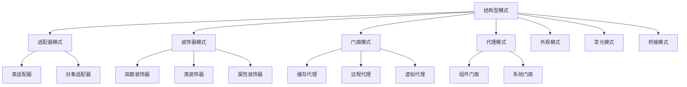

# TypeScript 结构型设计模式

## 🎯 结构型模式概览

### 📊 结构型模式架构图



## 🔌 适配器模式 (Adapter)

### 🎯 适配不同接口

```typescript
// 目标接口
interface ModernComputer {
    connect(): string;
    disconnect(): string;
    send(msg: string): string;
}

// 遗留系统
class LegacyPrinter {
    public turnOn(): string {
        return "Legacy printer turned on";
    }
    
    public turnOff(): string {
        return "Legacy printer turned off";
    }
    
    public print(content: string): string {
        return `Legacy printing: ${content}`;
    }
}

// 适配器模式
class PrinterAdapter implements ModernComputer {
    private printer: LegacyPrinter;
    
    constructor(printer: LegacyPrinter) {
        this.printer = printer;
    }
    
    public connect(): string {
        return this.printer.turnOn();
    }
    
    public disconnect(): string {
        return this.printer.turnOff();
    }
    
    public send(msg: string): string {
        return this.printer.print(msg);
    }
}
```

## 🎨 装饰器模式 (Decorator)

### 💫 TypeScript 装饰器实现

```typescript
// 基础组件接口
interface Coffee {
    getCost(): number;
    getDescription(): string;
}

// 具体组件
class SimpleCoffee implements Coffee {
    public getCost(): number {
        return 10;
    }
    
    public getDescription(): string {
        return "简单咖啡";
    }
}

// 抽象装饰器
abstract class CoffeeDecorator implements Coffee {
    protected cofee: Coffee;
    
    constructor(coffee: Coffee) {
        this.coffee = coffee;
    }
    
    public getCost(): number {
        return this.coffee.getCost();
    }
    
    public getDescription(): string {
        return this.coffee.getDescription();
    }
}

// 具体装饰器
class MilkDecorator extends CoffeeDecorator {
    public getCost(): number {
        return this.coffee.getCost() + 2;
    }
    
    public getDescription(): string {
        return this.coffee.getDescription() + ", 牛奶";
    }
}

class SugarDecorator extends CoffeeDecorator {
    public getCost(): number {
        return this.coffee.getCost() + 1;
    }
    
    public getDescription(): string {
        return this.coffee.getDescription() + ", 糖";
    }
}

// TypeScript 类装饰器
function Logger<T extends new (...args: any[]) => {}>(constructor: T) {
    return class extends constructor {
        constructor(...args: any[]) {
            super(...args);
            console.log(`创建了实例: ${constructor.name}`);
        }
    };
}

@Logger
class DataProcessor {
    process(data: any): any {
        return data;
    }
}

// 方法装饰器
function LogMethod(target: any, propertyKey: string, descriptor: PropertyDescriptor) {
    const originalMethod = descriptor.value;
    
    descriptor.value = function (...args: any[]) {
        console.log(`调用方法: ${propertyKey}, 参数:`, args);
        const result = originalMethod.apply(this, args);
        console.log(`方法结果:`, result);
        return result;
    };
    
    return descriptor;
}

class Calculator {
    @LogMethod
    add(a: number, b: number): number {
        return a + b;
    }
}
```

## 🏢 门面模式 (Facade)

### 🎯 简化复杂子系统的接口

```typescript
// 复杂子系统
class CPU {
    public start(): void {
        console.log("CPU initialized");
    }
    
    public execute(): void {
        console.log("CPU executing instructions");
    }
}

class Memory {
    public load(): void {
        console.log("Memory loading data");
    }
    
    public allocate(): void {
        console.log("Memory allocated");
    }
}

class DiskDrive {
    public boot(): void {
        console.log("Disk drive booting");
    }
    
    public read(): void {
        console.log("Disk drive reading");
    }
}

// 门面模式
class ComputerFacade {
    private cpu: CPU;
    private memory: Memory;
    private diskDrive: DiskDrive;
    
    constructor() {
        this.cpu = new CPU();
        this.memory = new Memory();
        this.diskDrive = new DiskDrive();
    }
    
    public startComputer(): void {
        console.log("Computer starting...");
        this.diskDrive.boot();
        this.cpu.start();
        this.memory.load();
        this.memory.allocate();
        this.cpu.execute();
        console.log("Computer started successfully!");
    }
    
    public shutdownComputer(): void {
        console.log("Computer shutting down...");
        console.log("Shutdown complete");
    }
}

// 使用门面
const computer = new ComputerFacade();
computer.startComputer(); // 复杂的启动过程被简化
```

## 🎭 代理模式 (Proxy)

### 🎯 访问控制和缓存代理

```typescript
// 原始服务接口
interface BankService {
    makePayment(amount: number): boolean;
    checkBalance(): number;
}

// 具体服务
class BankServiceImpl implements BankService {
    private balance: number = 1000;
    
    public makePayment(amount: number): boolean {
        if (amount <= this.balance) {
            this.balance -= amount;
            console.log(`支付成功: $${amount}`);
            return true;
        } else {
            console.log("余额不足");
            return false;
        }
    }
    
    public checkBalance(): number {
        console.log(`余额查询中...`);
        return this.balance;
    }
}

// 安全代理
class SecureBankProxy implements BankService {
    private service: BankService;
    private allowPayment: boolean = false;
    
    constructor(service: BankService) {
        this.service = service;
    }
    
    public authorize(allow: boolean): void {
        this.allowPayment = allow;
        console.log(`交易授权: ${allow ? '已授权' : '未授权'}`);
    }
    
    public makePayment(amount: number): boolean {
        if (!this.allowPayment) {
            console.log("未授权，拒绝支付");
            return false;
        }
        
        if (amount > 100) {
            console.log("金额超过限制，需要额外授权");
            return false;
        }
        
        return this.service.makePayment(amount);
    }
    
    public checkBalance(): number {
        return this.service.checkBalance();
    }
}

// 缓存代理
class CachedBankProxy implements BankService {
    private service: BankService;
    private cache: Map<string, any> = new Map();
    private readonly CACHE_TTL = 5000; // 5秒缓存
    
    constructor(service: BankService) {
        this.service = service;
    }
    
    public makePayment(amount: number): boolean {
        return this.service.makePayment(amount);
    }
    
    public checkBalance(): number {
        const cacheKey = 'balance';
        const cached = this.cache.get(cacheKey);
        
        if (cached && Date.now() - cached.timestamp < this.CACHE_TTL) {
            console.log("从缓存获取余额");
            return cached.value;
        }
        
        const balance = this.service.checkBalance();
        this.cache.set(cacheKey, {
            value: balance,
            timestamp: Date.now()
        });
        
        return balance;
    }
}

// 代理集合
class BankingProxyManager {
    private service: BankService;
    private proxies: BankService[] = [];
    
    constructor() {
        this.service = new BankServiceImpl();
        this.setupProxies();
    }
    
    private setupProxies(): void {
        let currentService: BankService = this.service;
        
        // 添加缓存代理
        currentService = new CachedBankProxy(currentService);
        this.proxies.push(currentService);
        
        // 添加安全代理
        currentService = new SecureBankProxy(currentService);
        this.proxies.push(currentService);
        
        this.service = currentService;
    }
    
    public getService(): BankService {
        return this.service;
    }
    
    public authorizePayment(allow: boolean): void {
        const secureProxy = this.proxies.find(p => p instancef SecureBankProxy) as SecureBankProxy;
        if (secureProxy) {
            secureProxy.authorize(allow);
        }
    }
}

// 使用多层代理
const bankingManager = new BankingProxyManager();
const bankService = bankingManager.getService();

bankService.checkBalance(); // 第一次查询，访问数据库
setTimeout(() => bankService.checkBalance(), 1000); // 从缓存获取
bankingManager.authorizePayment(true);
bankService.makePayment(50); // 成功支付
```

## 📋 复合模式 (Composite)

### 🌳 树形结构组合

```typescript
// 基础组件接口
abstract class FileSystemComponent {
    protected name: string;
    
    constructor(name: string) {
        this.name = name;
    }
    
    abstract getSize(): number;
    abstract getContent(): string[];
    abstract create(): void;
    abstract delete(): void;
    
    public getName(): string {
        return this.name;
    }
}

// 叶子节点
class File extends FileSystemComponent {
    private content: string;
    private size: number;
    
    constructor(name: string, content: string = "") {
        super(name);
        this.content = content;
        this.size = content.length;
    }
    
    public getSize(): number {
        return this.size;
    }
    
    public getContent(): string[] {
        return this.content.split('\n');
    }
    
    public create(): void {
        console.log(`创建文件: ${this.name}`);
    }
    
    public delete(): void {
        console.log(`删除文件: ${this.name}`);
        this.content = "";
        this.size = 0;
    }
    
    public appendContent(text: string): void {
        this.content += '\n' + text;
        this.size = this.content.length;
    }
}

// 复合节点
class Folder extends FileSystemComponent {
    private children: FileSystemComponent[] = [];
    
    public getSize(): number {
        return this.children.reduce((total, child) => total + child.getSize(), 0);
    }
    
    public getContent(): string[] {
        const content: string[] = [];
        this.children.forEach(child => {
            content.push(`[${child instanceof Folder ? 'Folder' : 'File'}] ${child.getName()}`);
            content.push(...child.getContent().map(line => `  ${line}`));
        });
        return content;
    }
    
    public create(): void {
        console.log(`创建文件夹: ${this.name}`);
    }
    
    public delete(): void {
        console.log(`删除文件夹: ${this.name}`);
        this.children.forEach(child => child.delete());
        this.children = [];
    }
    
    public add(component: FileSystemComponent): void {
        this.children.push(component);
    }
    
    public remove(componentName: string): boolean {
        const index = this.children.findIndex(child => child.getName() === componentName);
        if (index !== -1) {
            this.children[index].delete();
            this.children.splice(index, 1);
            return true;
        }
        return false;
    }
}

// 文件系统管理器
class FileSystemManager {
    private root: Folder;
    
    constructor() {
        this.root = new Folder("root");
    }
    
    public createFolder(path: string): void {
        const folder = new Folder(path);
        this.root.add(folder);
    }
    
    public createFile(path: string, content: string): void {
        const file = new File(path, content);
        this.root.add(file);
    }
    
    public displayStructure(): void {
        console.log("📁 文件系统结构:");
        console.log(this.root.getContent().join('\n'));
        console.log(`\n📊 总大小: ${this.root.getSize()} bytes`);
    }
}

// 使用复合模式
const fileSystem = new FileSystemManager();
fileSystem.createFolder("documents");
fileSystem.createFolder("images");
fileSystem.createFile("readme.txt", "项目说明文档");
fileSystem.createFile("config.json", '{"debug": true}');
fileSystem.displayStructure();
```

## 📚 结构型模式最佳实践

### 🎯 模式选择指南

| 模式 | 使用场景 | TypeScript优势 | 注意事项 |
|------|----------|----------------|----------|
| **适配器** | 接口不兼容 | 类型安全转换 | 避免过度适配 |
| **装饰器** | 动态添加功能 | 原生装饰器支持 | 保持接口一致 |
| **门面** | 简化复杂接口 | 强类型定义 | 不要暴露内部逻辑 |
| **代理** | 访问控制、缓存 | 类型代理实现 | 保持透明性 |

### 🔗 相关深入学习

- [[03-Behavioral-Patterns行为型模式]] - 学习行为型模式
- [[04-Architectural-Patterns架构模式]] - 学习架构模式
- [[01-Type-Design-Patterns类型设计模式]] - 类型系统设计模式

---
*💡 结构型模式帮助构建复杂的对象关系，是设计大型TypeScript应用的重要基础*
