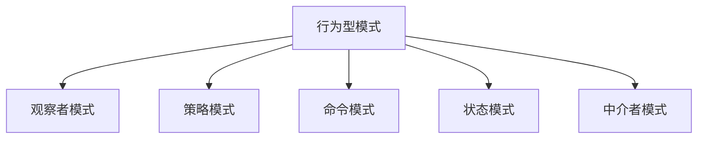

# TypeScript 行为型设计模式

## 🎯 行为型模式概览

行为型模式主要解决对象之间的交互和职责分配问题。

### 📊 行为型模式分类



## 👥 观察者模式 (Observer)

### 💫 事件驱动架构

```typescript
interface Observer<T> {
    update(data: T): void;
}

class Subject<T> {
    private observers: Observer<T>[] = [];
    
    attach(observer: Observer<T>): void {
        this.observers.push(observer);
    }
    
    detach(observer: Observer<T>): void {
        const index = this.observers.indexOf(observer);
        if (index > -1) {
            this.observers.splice(index, 1);
        }
    
    notify(data: T): void {
        this.observers.forEach(observer => observer.update(data));
    }
}

// 具体实现
class NewsletterServer extends Subject<string> {
    publishNews(news: string): void {
        console.log(`发布新闻: ${news}`);
        this.notify(news);
    }
}

class EmailSubscriber implements Observer<string> {
    constructor(private email: string) {}
    
    update(news: string): void {
        console.log(`发送邮件到 ${this.email}: ${news}`);
    }
}
```

## 🎯 策略模式 (Strategy)

### 🔄 算法族封装

```typescript
interface PaymentStrategy {
    pay(amount: number): boolean;
}

class CreditCardPayment implements PaymentStrategy {
    constructor(private cardNumber: string) {}
    
    pay(amount: number): boolean {
        console.log(`信用卡支付: $${amount} (卡号: ${this.cardNumber})`);
        return true;
    }
}

class PayPalPayment implements PaymentStrategy {
    constructor(private email: string) {}
    
    pay(amount: number): boolean {
        console.log(`PayPal支付: $${amount} (邮箱: ${this.email})`);
        return true;
    }
}

class PaymentProcessor {
    private strategy: PaymentStrategy;
    
    constructor(strategy: PaymentStrategy) {
        this.strategy = strategy;
    }
    
    setStrategy(strategy: PaymentStrategy): void {
        this.strategy = strategy;
    }
    
    processPayment(amount: number): boolean {
        return this.strategy.pay(amount);
    }
}
```

## 🎭 命令模式 (Command)

### 📝 请求封装

```typescript
interface Command {
    execute(): void;
    undo(): void;
}

class Light {
    isOn: boolean = false;
    
    turnOn(): void {
        this.isOn = true;
        console.log('灯已打开');
    }
    
    turnOff(): void {
        this.isOn = false;
        console.log('灯已关闭');
    }
}

class TurnOnLightCommand implements Command {
    constructor(private light: Light) {}
    
    execute(): void {
        this.light.turnOn();
    }
    
    undo(): void {
        this.light.turnOff();
    }
}

class Invoker {
    private commands: Command[] = [];
    
    executeCommand(command: Command): void {
        command.execute();
        this.commands.push(command);
    }
    
    undoLastCommand(): void {
        const command = this.commands.pop();
        if (command) {
            command.undo();
        }
    }
}
```

## 🔗 中介者模式 (Mediator)

### 🎪 组件解耦

```typescript
interface Mediator {
    notify(sender: BaseComponent, event: string): void;
}

class BaseComponent {
    constructor(protected mediator: Mediator) {}
}

class AuthenticationDialog implements Mediator {
    private titleLabel: Title = new Title(this);
    private loginTextBox: TextBox = new TextBox(this);
    private passwordTextBox: TextBox = new TextBox(this);
    
    notify(sender: BaseComponent, event: string): void {
        if (event === 'loginTextBoxChanged') {
            this.titleLabel.updateDisplay();
        } else if (event === 'loginButtonClicked') {
            this.authenticateUser();
        }
    }
    
    private authenticateUser(): void {
        console.log('验证用户...');
    }
}

class Title extends BaseComponent {
    updateDisplay(): void {
        console.log('更新标题显示');
    }
}
```

## 🏁 状态模式 (State)

### 🎮 状态机实现

```typescript
interface State {
    handle(context: Context): void;
}

class Context {
    private state: State;
    
    constructor(state: State) {
        this.changeState(state);
    }
    
    changeState(state: State): void {
        this.state = state;
    }
    
    request(): void {
        this.state.handle(this);
    }
}

class ConcreteStateA implements State {
    handle(context: Context): void {
        console.log('处理状态A');
        context.changeState(new ConcreteStateB());
    }
}

class ConcreteStateB implements State {
    handle(context: Context): void {
        console.log('处理状态B');
        context.changeState(new ConcreteStateA());
    }
}

// 使用
const context = new Context(new ConcreteStateA());
context.request(); // 处理状态A
context.request(); // 处理状态B
```

这是行为型设计模式的核心实现，每种模式都解决了特定的对象交互问题。
