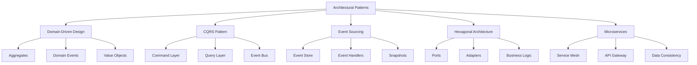

# TypeScript 架构模式实现

## 🎯 架构模式概览

### 📊 架构模式分类



## 🔧 Domain-Driven Design

### 💡 领域模型实现

```typescript
// 1. 领域实体基类
abstract class DomainEntity<TId> {
    protected constructor(
        private readonly _id: TId,
        private readonly _createdAt: Date = new Date()
    ) {}
    
    get id(): TId {
        return this._id;
    }
    
    get createdAt(): Date {
        return this._createdAt;
    }
    
    abstract equals(entity: DomainEntity<TId>): boolean;
}

// 2. 聚合根
abstract class AggregateRoot<TId> extends DomainEntity<TId> {
    private _domainEvents: DomainEvent[] = [];
    
    constructor(id: TId, createdAt?: Date) {
        super(id, createdAt);
    }
    
    protected addDomainEvent(event: DomainEvent): void {
        this._domainEvents.push(event);
    }
    
    get domainEvents(): ReadonlyArray<DomainEvent> {
        return [...this._domainEvents];
    }
    
    clearDomainEvents(): void {
        this._domainEvents = [];
    }
}

// 3. 值对象
abstract class ValueObject {
    abstract equals(value: ValueObject): boolean;
    
    abstract toString(): string;
}

class Money extends ValueObject {
    constructor(
        private readonly _amount: number,
        private readonly _currency: Currency
    ) {
        super();
        this.validateAmount();
    }
    
    get amount(): number {
        return this._amount;
    }
    
    get currency(): Currency {
        return this._currency;
    }
    
    plus(other: Money): Money {
        this.validateSameCurrency(other.currency);
        return new Money(this._amount + other._amount, this._currency);
    }
    
    minus(other: Money): Money {
        this.validateSameCurrency(other.currency);
        return new Money(this._amount - other._amount, this._currency);
    }
    
    multiply(factor: number): Money {
        return new Money(this._amount * factor, this._currency);
    }
    
    equals(other: ValueObject): boolean {
        if (!(other instanceof Money)) return false;
        return this._amount === other._amount && this._currency === other._currency;
    }
    
    toString(): string {
        return `${this._currency.symbol}${this._amount.toFixed(2)}`;
    }
    
    private validateAmount(): void {
        if (this._amount < 0) {
            throw new Error('Amount cannot be negative');
        }
        if (!Number.isFinite(this._amount)) {
            throw new Error('Amount must be a finite number');
        }
    }
    
    private validateSameCurrency(currency: Currency): void {
        if (this._currency !== currency) {
            throw new Error('Cannot perform operations on different currencies');
        }
    }
}

// 4. 领域事件
abstract class DomainEvent {
    constructor(
        public readonly eventName: string,
        public readonly occurredOn: Date = new Date(),
        public readonly eventId: string = crypto.randomUUID()
    ) {}
}

// 5. 产品聚合示例
interface ProductId extends ValueObject {
    readonly value: string;
}

class ProductIdValue extends ValueObject implements ProductId {
    constructor(public readonly value: string) {
        super();
        this.validateValue();
    }
    
    equals(other: ValueObject): boolean {
        if (!(other instanceof ProductIdValue)) return false;
        return this.value === other.value;
    }
    
    toString(): string {
        return this.value;
    }
    
    private validateValue(): void {
        if (!this.value || this.value.trim().length === 0) {
            throw new Error('ProductId cannot be empty');
        }
    }
}

class Product extends AggregateRoot<ProductIdValue> {
    private _name: ProductName;
    private _description: string;
    private _price: Money;
    private _stock: Stock;
    private _category: Category;
    
    constructor(
        id: ProductIdValue,
        name: ProductName,
        description: string,
        price: Money,
        stock: Stock,
        category: Category
    ) {
        super(id);
        this._name = name;
        this._description = description;
        this._price = price;
        this._stock = stock;
        this._category = category;
    }
    
    static create(
        name: ProductName,
        description: string,
        price: Money,
        stock: Stock,
        category: Category
    ): Product {
        const product = new Product(
            new ProductIdValue(crypto.randomUUID()),
            name,
            description,
            price,
            stock,
            category
        );
        
        product.addDomainEvent(new ProductCreatedEvent(product.id));
        return product;
    }
    
    updateName(newName: ProductName): void {
        if (this._name.equals(newName)) return;
        
        this._name = newName;
        this.addDomainEvent(new ProductNameUpdatedEvent(this.id, newName));
    }
    
    updatePrice(newPrice: Money): void {
        if (this._price.equals(newPrice)) return;
        
        const oldPrice = this._price;
        this._price = newPrice;
        this.addDomainEvent(new ProductPriceUpdatedEvent(this.id, oldPrice, newPrice));
    }
    
    reduceStock(quantity: number): void {
        const newStock = this._stock.reduce(quantity);
        
        if (newStock.isOutOfStock()) {
            this.addDomainEvent(new ProductOutOfStockEvent(this.id));
        }
        
        this._stock = newStock;
        this.addDomainEvent(new ProductStockReducedEvent(this.id, quantity));
    }
    
    increaseStock(quantity: number): void {
        this._stock = this._stock.increase(quantity);
        this.addDomainEvent(new ProductStockIncreasedEvent(this.id, quantity));
    }
    
    // Getters
    get name(): ProductName { return this._name; }
    get description(): string { return this._description; }
    get price(): Money { return this._price; }
    get stock(): Stock { return this._stock; }
    get category(): Category { return this._category; }
    
    equals(entity: DomainEntity<ProductIdValue>): boolean {
        if (!(entity instanceof Product)) return false;
        return this.id.equals(entity.id);
    }
}

// 6. 库存值对象
class Stock extends ValueObject {
    constructor(private readonly _quantity: number) {
        super();
        this.validateQuantity();
    }
    
    get quantity(): number {
        return this._quantity;
    }
    
    reduce(amount: number): Stock {
        if (amount <= 0) throw new Error('Reduction amount must be positive');
        if (amount > this._quantity) throw new Error('Insufficient stock');
        
        return new Stock(this._quantity - amount);
    }
    
    increase(amount: number): Stock {
        if (amount <= 0) throw new Error('Increase amount must be positive');
        return new Stock(this._quantity + amount);
    }
    
    isOutOfStock(): boolean {
        return this._quantity === 0;
    }
    
    isLowStock(threshold: number = 10): boolean {
        return this._quantity <= threshold;
    }
    
    equals(other: ValueObject): boolean {
        if (!(other instanceof Stock)) return false;
        return this._quantity === other._quantity;
    }
    
    toString(): string {
        return this._quantity.toString();
    }
    
    private validateQuantity(): void {
        if (this._quantity < 0) {
            throw new Error('Stock quantity cannot be negative');
        }
        if (!Number.isInteger(this._quantity)) {
            throw new Error('Stock quantity must be an integer');
        }
    }
}
```

### 🎪 领域事件系统

```typescript
// 1. 产品相关事件
class ProductCreatedEvent extends DomainEvent {
    constructor(public readonly productId: ProductIdValue) {
        super('ProductCreated');
    }
}

class ProductNameUpdatedEvent extends DomainEvent {
    constructor(
        public readonly productId: ProductIdValue,
        public readonly newName: ProductName
    ) {
        super('ProductNameUpdated');
    }
}

class ProductPriceUpdatedEvent extends DomainEvent {
    constructor(
        public readonly productId: ProductIdValue,
        public readonly oldPrice: Money,
        public readonly newPrice: Money
    ) {
        super('ProductPriceUpdated');
    }
}

class ProductOutOfStockEvent extends DomainEvent {
    constructor(public readonly productId: ProductIdValue) {
        super('ProductOutOfStock');
    }
}

class ProductStockReducedEvent extends DomainEvent {
    constructor(
        public readonly productId: ProductIdValue,
        public readonly quantity: following

class ProductStockIncreasedEvent extends DomainEvent {
    constructor(
        public readonly productId: ProductIdValue,
        public readonly quantity: number
    ) {
        super('ProductStockIncreased');
    }
}

// 2. 领域事件处理器
interface DomainEventHandler<T extends DomainEvent> {
    handle(event: T): Promise<void>;
    listenTo(): string;
}

// 3. 产品库存处理器
class ProductStockEventHandler implements DomainEventHandler<ProductStockReducedEvent> {
    listenTo(): string {
        return 'ProductStockReduced';
    }
    
    async handle(event: ProductStockReducedEvent): Promise<void> {
        // 更新库存缓存
        await this.updateInventoryCache(event.productId, event.quantity);
        
        // 发送低库存警告
        const product = await this.productRepository.findById(event.productId);
        if (product && product.stock.isLowStock()) {
            await this.sendLowStockAlert(product);
        }
    }
    
    private async updateInventoryCache(productId: ProductIdValue, quantity: number): Promise<void> {
        // 缓存更新逻辑
        console.log(`Updating cache for product ${productId.value}, reduced stock by ${quantity}`);
    }
    
    private async sendLowStockAlert(product: Product): Promise<void> {
        // 发送警告邮件
        console.log(`Low stock alert for product: ${product.name.toString()}`);
    }
    
    constructor(private productRepository: IProductRepository) {}
}

// 4. 领域事件总线
class DomainEventBus {
    private handlers: Map<string, DomainEventHandler<DomainEvent>[]> = new Map();
    
    register<T extends DomainEvent>(handler: DomainEventHandler<T>): void {
        const eventType = handler.listenTo();
        
        if (!this.handlers.has(eventType)) {
            this.handlers.set(eventType, []);
        }
        
        const handlers = this.handlers.get(eventType)!;
        handlers.push(handler as DomainEventHandler<DomainEvent>);
    }
    
    async publish(event: DomainEvent): Promise<void> {
        const eventType = event.eventName;
        const eventHandlers = this.handlers.get(eventType) || [];
        
        await Promise.all(
            eventHandlers.map(handler => 
                this.handleEventSafely(handler, event)
            )
        );
    }
    
    private async handleEventSafely(handler: DomainEventHandler<DomainEvent>, event: DomainEvent): Promise<void> {
        try {
            await handler.handle(event);
        } catch (error) {
            console.error(`Error handling event ${event.eventName}:`, error);
            // 在实际应用中，这里应该记录错误到日志系统
        }
    }
}
```

## 🚀 CQRS Pattern

### 🔄 命令与查询分离

```typescript
// 1. 命令基类
abstract class Command {
    constructor(
        public readonly commandId: string = crypto.randomUUID(),
        public readonly timestamp: Date = new Date()
    ) {}
}

abstract class CommandResult {
    constructor(
        public readonly commandId: string,
        public readonly success: boolean,
        public readonly error?: string
    ) {}
}

// 2. 查询基类
abstract class Query {
    constructor(
        public readonly queryId: string = crypto.randomUUID(),
        public readonly timestamp: Date = new Date()
    ) {}
}

abstract class QueryResult<T> {
    constructor(
        public readonly queryId: string,
        public readonly data: T
    ) {}
}

// 3. 产品命令
class CreateProductCommand extends Command {
    constructor(
        public readonly name: string,
        public readonly description: string,
        public readonly price: number,
        public readonly currency: string,
        public readonly initialStock: number,
        public readonly categoryId: string
    ) {
        super();
    }
}

class UpdateProductCommand extends Command {
    constructor(
        public readonly productId: string,
        public readonly name?: string,
        public readonly description?: string,
        public readonly price?: number
    ) {
        super();
    }
}

class ReduceStockCommand extends Command {
    constructor(
        public readonly productId: string,
        public readonly quantity: number
    ) {
        super();
    }
}

// 4. 产品查询
class GetProductQuery extends Query {
    constructor(public readonly productId: string) {
        super();
    }
}

class GetProductsQuery extends Query {
    constructor(
        public readonly page: number = 1,
        public readonly pageSize: number = 10,
        public readonly categoryId?: string,
        public readonly searchTerm?: string
    ) {
        super();
    }
}

class GetLowStockProductsQuery extends Query {
    constructor(public readonly threshold: number = 10) {
        super();
    }
}

// 5. 命令处理器
interface CommandHandler<TCommand extends Command, TResult extends CommandResult> {
    handle(command: TCommand): Promise<TResult>;
}

class CreateProductHandler implements CommandHandler<CreateProductCommand, CommandResult> {
    constructor(
        private readonly unitOfWork: IUnitOfWork
    ) {}
    
    async handle(command: CreateProductCommand): Promise<CommandResult> {
        try {
            await this.unitOfWork.begin();
            
            // 创建产品聚合
            const price = new Money(command.price, new Currency(command.currency));
            const name = new ProductName(command.name);
            const stock = new Stock(command.initialStock);
            const category = await this.categoryRepository.findById(new CategoryId(command.categoryId));
            
            const product = Product.create(name, command.description, price, stock, category);
            
            // 保存产品
            await this.productRepository.save(product);
            
            await this.unitOfWork.commit();
            
            return new CommandResult(command.commandId, true);
            
        } catch (error) {
            await this.unitOfWork.rollback();
            return new CommandResult(command.commandId, false, error instanceof Error ? error.message : 'Unknown error');
        }
    }
    
    constructor(
        private readonly categoryRepository: ICategoryRepository,
        private readonly productRepository: IProductRepository
    ) {}
}

// 6. 查询处理器
interface QueryHandler<TQuery extends Query, TResult extends QueryResult<any>> {
    handle(query: TQuery): Promise<TResult>;
}

class GetProductsQueryHandler implements QueryHandler<GetProductsQuery, QueryResult<ProductViewDto[]>> {
    constructor(private readonly productReadModel: IProductReadModel) {}
    
    async handle(query: GetProductsQuery): Promise<QueryResult<ProductViewDto[]>> {
        const products = await this.productReadModel.getProducts({
            page: query.page,
            pageSize: query.pageSize,
            categoryId: query.categoryId,
            searchTerm: query.searchTerm
        });
        
        return new QueryResult(query.queryId, products);
    }
}

// 7. CQRS 总线
class CommandBus {
    private handlers: Map<string, CommandHandler<any, any>> = new Map();
    
    register<TCommand extends Command, TResult extends CommandResult>(
        commandType: string,
        handler: CommandHandler<TCommand, TResult>
    ): void {
        this.handlers.set(commandType, handler);
    }
    
    async send<TCommand extends Command, TResult extends CommandResult>(
        command: TCommand
    ): Promise<TResult> {
        const handler = this.handlers.get(command.constructor.name);
        if (!handler) {
            throw new Error(`No handler registered for command: ${command.constructor.name}`);
        }
        
        return handler.handle(command) as Promise<TResult>;
    }
}

class QueryBus {
    private handlers: Map<string, QueryHandler<any, any>> = new Map();
    
    register<TQuery extends Query, TResult extends QueryResult<any>>(
        queryType: string,
        handler: QueryHandler<TQuery, TResult>
    ): void {
        this.handlers.set(queryType, handler);
    }
    
    async send<TQuery extends Query, TResult extends QueryResult<any>>(
        query: TQuery
    ): Promise<TResult> {
        const handler = this.handlers.get(query.constructor.name);
        if (!handler) {
            throw new Error(`No handler registered for query: ${query.constructor.name}`);
        }
        
        return handler.handle(query) as Promise<TResult>;
    }
}
```

## 🎭 Hexagonal Architecture

### 🔧 端口与适配器

```typescript
// 1. 端口定义（业务接口）
interface IProductRepository {
    save(product: Product): Promise<void>;
    findById(id: ProductIdValue): Promise<Product | null>;
    findByCategory(categoryId: CategoryId): Promise<Product[]>;
}

interface IMailService {
    send(to: string, subject: string, body: string): Promise<void>;
}

interface IInventoryService {
    updateStock(productId: string, quantity: number): Promise<void>;
    getCurrentStock(productId: string): Promise<number>;
}

interface IEventStore {
    saveEvents(aggregateId: string, events: DomainEvent[], expectedVersion: number): Promise<void>;
    getEvents(aggregateId: string): Promise<DomainEvent[]>;
}

// 2. 应用服务（业务逻辑）
class ProductApplicationService {
    constructor(
        private readonly productRepository: IProductRepository,
        private readonly mailService: IMailService,
        private readonly inventoryService: IInventoryService,
        private readonly eventStore: IEventStore,
        private readonly eventBus: DomainEventBus
    ) {}
    
    async createProduct(command: CreateProductCommand): Promise<void> {
        const product = Product.create(
            new ProductName(command.name),
            command.description,
            new Money(command.price, new Currency(command.currency)),
            new Stock(command.initialStock),
            await this.getCategory(command.categoryId)
        );
        
        await this.productRepository.save(product);
        
        // 发布领域事件
        await this.eventBus.publish(product.domainEvents[0]);
        
        // 更新读模型
        await this.inventoryService.updateStock(product.id.toString(), command.initialStock);
    }
    
    async reduceStock(productId: string, quantity: number): Promise<void> {
        const product = await this.productRepository.findById(new ProductIdValue(productId));
        if (!product) {
            throw new Error('Product not found');
        }
        
        product.reduceStock(quantity);
        await this.productRepository.save(product);
        
        // 发布事件
        for (const event of product.domainEvents) {
            await this.eventBus.publish(event);
        }
    }
    
    private async getCategory(categoryId: string): Promise<Category> {
        // 实现获取分类的逻辑
        throw new Error('Not implemented');
    }
}

// 3. 适配器实现（基础设施）
class PostgresProductRepository implements IProductRepository {
    constructor(private readonly db: PoolConnection) {}
    
    async save(product: Product): Promise<void> {
        const events = product.domainEvents;
        
        if (events.length > 0) {
            await this.eventStore.saveEvents(
                product.id.toString(),
                events,
                await this.getExpectedVersion(product.id.toString())
            );
        }
        
        // 保存聚合快照
        await this.saveSnapshot(product);
        product.clearDomainEvents();
    }
    
    async findById(id: ProductIdValue): Promise<Product | null> {
        // 从快照加载
        const snapshot = await this.loadLatestSnapshot(id.toString());
        
        // 加载后续事件
        const events = await this.eventStore.getEvents(id.toString());
        
        // 重构聚合
        return this.reconstructProduct(snapshot, events);
    }
    
    async findByCategory(categoryId: CategoryId): Promise<Product[]> {
        const query = `
            SELECT id FROM product_snapshots 
            WHERE category_id = $1
        `;
        
        const result = await this.db.query(query, [categoryId.toString()]);
        const products: Product[] = [];
        
        for (const row of result.rows) {
            const product = await this.findById(new ProductIdValue(row.id));
            if (product) {
                products.push(product);
            }
        }
        
        return products;
    }
    
    private async saveSnapshot(product: Product): Promise<void> {
        // 保存聚合快照逻辑
    }
    
    private async loadLatestSnapshot(aggregateId: string): Promise<any> {
        // 加载最新快照逻辑
    }
    
    private async reconstructProduct(snapshot: any, events: DomainEvent[]): Promise<Product> {
        // 重构聚合逻辑
        throw new Error('Not implemented');
    }
    
    private async getExpectedVersion(aggregateId: string): Promise<number> {
        // 获取期望版本号逻辑
        return 0;
    }
}

// 4. HttpClient 适配器
class HttpInventoryService implements IInventoryService {
    constructor(private readonly httpClient: AxiosInstance) {}
    
    async updateStock(productId: string, quantity: number): Promise<void> {
        const response = await this.httpClient.post('/api/inventory/update', {
            productId,
            quantity
        });
        
        if (response.status !== 200) {
            throw new Error('Failed to update inventory');
        }
    }
    
    async getCurrentStock(productId: string): Promise<number> {
        const response = await this.httpClient.get(`/api/inventory/${productId}`);
        
        return response.data.stock;
    }
}

// 5. Express 适配器（Web控制器）
class ProductController {
    constructor(private readonly productService: ProductApplicationService) {}
    
    async createProduct(req: Request, res: Response): Promise<void> {
        try {
            const command = new CreateProductCommand(
                req.body.name,
                req.body.description,
                req.body.price,
                req.body.currency,
                req.body.initialStock,
                req.body.categoryId
            );
            
            await this.productService.createProduct(command);
            res.status(201).json({ success: true });
            
        } catch (error) {
            res.status(400).json({
                success: false,
                error: error instanceof Error ? error.message : 'Unknown error'
            });
        }
    }
    
    async reduceStock(req: Request, res: Response): Promise<void> {
        try {
            const { productId } = req.params;
            const { quantity } = req.body;
            
            await this.productService.reduceStock(productId, quantity);
            res.status(200).json({ success: true });
            
        } catch (error) {
            res.status(400).json({
                success: false,
                error: error instanceof Error ? error.message : 'Unknown error'
            });
        }
    }
}
```

### 🔗 相关深入学习

- [[01-Creational-Patterns创建型模式]] - 创建型设计模式
- [[02-Structural-Patterns结构型模式]] - 结构型设计模式
- [[03-Behavioral-Patterns行为型模式]] - 行为型设计模式

---
*💡 架构模式是构建大型TypeScript应用的核心，掌握DDD、CQRS、六边形架构等模式能显著提升系统的可维护性和扩展性*
