# TypeScript Systems Programming 系统编程

## 🎯 TypeScript 系统编程深度指南

### 📊 系统编程领域概览

```mermaid
graph TD
    A[Systems Programming] --> B[System Tools]
    A --> C[Device Programming]
    A --> D[File System Operations]
    A --> E[Network Programming]
    A --> F[Process Management]
    A --> G[Memory Management]
    
    B --> B1[CLI Applications]
    B --> B2[Text Processing]
    B --> B3[System Monitoring]
    B --> B4[Automation Scripts]
    
    C --> C1[IO Interfaces]
    C --> C2[Hardware Control]
    C --> C3[Device Drivers]
    C --> C4[Protocol Implementation]
    
    D --> D1[File Operations]
    D --> D2[Directory Management]
    D --> D3[Permission Control]
    D --> D4[System Calls]
    
    E --> E1[Socket Programming]
    E --> E2[Protocol Stacks]
    E --> E3[Network Services]
    E --> E4[Security Protocols]
    
    F --> F1[Process Creation]
    F --> F2[Inter-Process Communication]
    F --> F3[Signal Handling]
    F --> F4[Process Synchronization]
    
    G --> G1[Memory Allocation]
    G --> G2[Garbage Collection]
    G --> G3[Memory Mapping]
    G --> G4[Buffer Management]
```



## 🔧 Node.js System Programming

### 💡 Advanced File System Operations

```typescript
// Advanced File System Programming
namespace SystemProgramming {
    // File System Types
    interface FileHandle extends Disposable {
        read(buffer: Buffer, offset?: number): Promise<NodeJS.ReadInfo>;
        write(data: Buffer | DataView | ArrayBufferView): Promise<number>;
        write(data: string, encoding?: BufferEncoding): Promise<number>;
        flush(): Promise<void>;
        close(): Promise<void>;
    }
    
    interface StreamOptions {
        flags?: string;
        encoding?: BufferEncoding;
        start?: number;
        end?: number;
        autoClose?: boolean;
        emitClose?: boolean;
    }
    
    interface WatchOptions {
        persistent?: boolean;
        recursive?: boolean;
        encoding?: BufferEncoding;
        signal?: AbortSignal;
    }
    
    // File Operations Manager
    class AdvancedFileManager {
        private fileHandles: Map<string, FileHandle> = new Map();
        private watchers: Map<string, FileSystemWatcher> = new Map();
        
        // Atomic file operations
        async atomicWrite(
            filePath: string, 
            data: string | Buffer, 
            options: AtomicWriteOptions = {}
        ): Promise<void> {
            const tempPath = `${filePath}.tmp.${Date.now()}`;
            
            try {
                // Write to temporary file
                await fs.writeFile(tempPath, data, options.encoding);
                
                // Atomic rename
                await fs.rename(tempPath, filePath);
                
                // Set permissions if specified
                if (options.mode) {
                    await fs.chmod(filePath, options.mode);
                }
                
            } catch (error) {
                // Clean up temp file on error
                try {
                    await fs.unlink(tempPath);
                } catch (cleanupError) {
                    console.warn('Failed to cleanup temp file:', cleanupError);
                }
                throw error;
            }
        }
        
        // Memory-mapped file operations
        async createMemoryMappedFile(
            filePath: string,
            options: MemoryMapOptions
        ): Promise<MemoryMappedFile> {
            const stats = await fs.stat(filePath);
            const size = stats.size || options.initialSize || 0;
            
            return new MemoryMappedFile(filePath, size, options);
        }
        
        // File locking
        async lockFile(filePath: string, mode: LockMode): Promise<FileLock> {
            const fd = await fs.open(filePath, 'r+');
            const lock = new FileLock(fd, mode);
            
            await lock.acquire();
            this.fileHandles.set(filePath, lock);
            
            return lock;
        }
        
        // Directory operations with proper error handling
        async ensureDirectory(
            dirPath: string, 
            options: DirectoryOptions = {}
        ): Promise<void> {
            const mode = options.mode || 0o755;
            
            try {
                const stats = await fs.stat(dirPath);
                if (!stats.isDirectory()) {
                    throw new Error(`Path exists but is not a directory: ${dirPath}`);
                }
            } catch (error) {
                if (error.code === 'ENOENT') {
                    await this.createDirectoryRecursive(dirPath, mode);
                } else {
                    throw error;
                }
            }
        }
        
        private async createDirectoryRecursive(dirPath: string, mode: number): Promise<void> {
            const parent = path.dirname(dirPath);
            
            if (parent !== dirPath) {
                await this.createDirectoryRecursive(parent, mode);
            }
            
            try {
                await fs.mkdir(dirPath, mode);
            } catch (error) {
                if (error.code !== 'EEXIST') {
                    throw error;
                }
            }
        }
        
        // File system events monitoring
        watchFileSystem(
            paths: string[],
            handler: FileSystemEventHandler,
            options: WatchOptions
        ): FileSystemWatcher {
            const watcher = new FileSystemWatcher(paths, handler, options);
            
            for (const path of paths) {
                this.watchers.set(path, watcher);
            }
            
            return watcher;
        }
        
        // Cleanup resources
        async cleanup(): Promise<void> {
            // Close all file handles
            for (const [path, handle] of this.fileHandles) {
                try {
                    await handle.close();
                } catch (error) {
                    console.error(`Error closing file handle for ${path}:`, error);
                }
            }
            
            // Close all watchers
            for (const watcher of this.watchers.values()) {
                watcher.close();
            }
            
            this.fileHandles.clear();
            this.watchers.clear();
        }
    }
    
    // File Lock Implementation
    class FileLock implements FileHandle {
        private locked = false;
        
        constructor(
            private fileDescriptor: number,
            private mode: LockMode
        ) {}
        
        async acquire(): Promise<void> {
            if (this.locked) {
                throw new Error('Lock already acquired');
            }
            
            const flock = promisify(ffi.LockFileEx);
            await flock(this.fileDescriptor, this.mode, 0, 0, 0xffffffff, 0xffffffff);
            this.locked = true;
        }
        
        async release(): Promise<void> {
            if (!this.locked) {
                return;
            }
            
            const funlock = promisify(ffi.UnlockFile);
            await funlock(this.fileDescriptor, 0, 0); // Unlock entire file
            this.locked = false;
        }
        
        async close(): Promise<void> {
            await this.release();
            await fs.close(this.fileDescriptor);
        }
        
        async [Symbol.dispose](): Promise<void> {
            await this.close();
        }
    }
    
    // Memory Mapped File Implementation
    class MemoryMappedFile {
        private mmap: Buffer | null = null;
        
        constructor(
            private filePath: string,
            private size: number,
            private options: MemoryMapOptions
        ) {}
        
        async map(): Promise<Buffer> {
            if (this.mmap) {
                return this.mmap;
            }
            
            try {
                const fd = await fs.open(this.filePath, 'r+');
                
                // Create memory mapping using native library
                this.mmap = NativeMemoryMapping.map(fd, 0, this.size);
                
                await fs.close(fd);
                return this.mmap;
            } catch (error) {
                throw new Error(`Failed to map file ${this.filePath}: ${error.message}`);
            }
        }
        
        async unmap(): Promise<void> {
            if (this.mmap) {
                NativeMemoryMapping.unmap(this.mmap);
                this.mmap = null;
            }
        }
        
        async sync(): Promise<void> {
            if (this.mmap) {
                NativeMemoryMapping.sync(this.mmap);
            }
        }
    }
    
    // File System Event Watcher
    class FileSystemWatcher {
        private watchers: NodeJS.TreeWatcherT[]
        private disposed = false;
        
        constructor(
            private paths: string[],
            private handler: FileSystemEventHandler,
            private options: WatchOptions
        ) {
            this.watchers = [];
            this.startWatching();
        }
        
        private startWatching(): void {
            for (const path of this.paths) {
                const watcher = fs.watch(path, {
                    persistent: this.options.persistent ?? true,
                    recursive: this.options.recursive ?? false,
                    encoding: this.options.encoding ?? 'utf8'
                });
                
                watcher.on('change', (eventType, filename) => {
                    this.handler(eventType, filename, path);
                });
                
                watcher.on('error', (error) => {
                    this.handler('error', error.message, path);
                });
                
                this.watchers.push(watcher);
            }
        }
        
        close(): void {
            if (this.disposed) {
                return;
            }
            
            for (const watcher of this.watchers) {
                watcher.close();
            }
            
            this.watchers = [];
            this.disposed = true;
        }
        
        isDisposed(): boolean {
            return this.disposed;
        }
    }
    
    // Supporting Types
    type LockMode = 'SHARED' | 'EXCLUSIVE' | 'NON_BLOCKING';
    
    interface AtomicWriteOptions {
        mode?: number;
        encoding?: BufferEncoding;
        flag?: string;
    }
    
    interface MemoryMapOptions {
        initialSize?: number;
        copyOnWrite?: boolean;
        shared?: boolean;
    }
    
    interface DirectoryOptions {
        mode?: number;
        recursive?: boolean;
    }
    
    type FileSystemEventHandler = (
        eventType: string, 
        filename: string | Buffer, 
        path: string
    ) => void;
}

// Process Management
class AdvancedProcessManager {
    private processes = new Map<string, ChildProcess>();
    private processGroups = new Map<string, ProcessGroup>();
    
    // Spawn process with advanced options
    async spawnProcess(
        command: string,
        args: string[] = [],
        options: SpawnOptions = {}
    ): Promise<ManagedProcess> {
        const processId = this.generateProcessId();
        const spawnOptions: NodeJS.ProcessEnv = {
            ...options.env,
            stdio: options.stdio || 'inherit',
            cwd: options.cwd || process.cwd(),
            shell: options.shell || false,
            windowsHide: options.windowsHide ?? true
        };
        
        const child = spawn(command, args, spawnOptions);
        const managedProcess = new ManagedProcess(processId, child, options);
        
        this.processes.set(processId, managedProcess);
        
        // Set up process monitoring
        await this.setupProcessMonitoring(managedProcess);
        
        return managedProcess;
    }
    
    // Process group management
    async createProcessGroup(name: string): Promise<ProcessGroup> {
        const group = new ProcessGroup(name);
        this.processGroups.set(name, group);
        return group;
    }
    
    async addProcessToGroup(processId: string, groupName: string): Promise<void> {
        const processInstance = this.processes.get(processId);
        const group = this.processGroups.get(groupName);
        
        if (!processInstance) {
            throw new Error(`Process ${processId} not found`);
        }
        
        if (!group) {
            throw new Error(`Process group ${groupName} not found`);
        }
        
        group.addProcess(processInstance);
    }
    
    // Signal handling
    async sendSignal(processId: string, signal: ProcessSignal): Promise<void> {
        const process = this.processes.get(processId);
        
        if (!process) {
            throw new Error(`Process ${processId} not found`);
        }
        
        if (process.isTerminated()) {
            throw new Error(`Process ${processId} is already terminated`);
        }
        
        process.sendSignal(signal);
    }
    
    async terminateProcessGroup(groupName: string, signal?: ProcessSignal): Promise<void> {
        const group = this.processGroups.get(groupName);
        
        if (!group) {
            throw new Error(`Process group ${groupName} not found`);
        }
        
        await group.terminateAll(signal);
    }
    
    private async setupProcessMonitoring(managedProcess: ManagedProcess): Promise<void> {
        const process = managedProcess.getChildProcess();
        
        process.on('exit', (code, signal) => {
            managedProcess.handleExit(code, signal);
            this.processes.delete(managedProcess.getId());
        });
        
        process.on('error', (error) => {
            managedProcess.handleError(error);
        });
        
        process.on('spawn', () => {
            managedProcess.handleSpawn();
        });
        
        // Monitor resources if available
        if (process.pid) {
            await this.startResourceMonitoring(managedProcess);
        }
    }
    
    private async startResourceMonitoring(managedProcess: ManagedProcess): Promise<void> {
        const interval = setInterval(async () => {
            if (managedProcess.isTerminated()) {
                clearInterval(interval);
                return;
            }
            
            try {
                const stats = await this.getProcessStats(managedProcess.getPid()!);
                managedProcess.updateStats(stats);
            } catch (error) {
                // Process may have terminated
                if (!managedProcess.isTerminated()) {
                    console.warn(`Failed to get stats for process ${managedProcess.getId()}:`, error);
                }
            }
        }, 1000); // Update every second
    }
    
    private async getProcessStats(pid: number): Promise<ProcessStats> {
        // Use system tools to get process statistics
        const { stdout } = await execAsync(`ps -p ${pid} -o pid,ppid,rss,vsz,pcpu,pmem`);
        const lines = stdout.trim().split('\n').slice(1); // Skip header
        
        if (lines.length === 0) {
            throw new Error(`Process ${pid} not found`);
        }
        
        const values = lines[0].split(/\s+/);
        return {
            pid: parseInt(values[0]),
            parentPid: parseInt(values[1]),
            residentSetSize: parseInt(values[2]), // RSS in KB
            virtualSize: parseInt(values[3]),     // VSZ in KB
            cpuUsage: parseFloat(values[4]),      // CPU usage percentage
            memoryUsage: parseFloat(values[5])    // Memory usage percentage
        };
    }
    
    private generateProcessId(): string {
        return `proc_${Date.now()}_${Math.random().toString(36).substr(2, 9)}`;
    }
}

// Managed Process Implementation
class ManagedProcess {
    private stats?: ProcessStats;
    private startTime?: Date;
    private exitTime?: Date;
    private terminated = false;
    
    constructor(
        private id: string,
        private child: ChildProcess,
        private options: SpawnOptions
    ) {}
    
    getId(): string {
        return this.id;
    }
    
    getChildProcess(): ChildProcess {
        return this.child;
    }
    
    getPid(): number | undefined {
        return this.child.pid;
    }
    
    isTerminated(): boolean {
        return this.terminated;
    }
    
    async waitForExit(timeout?: number): Promise<ProcessExitCode> {
        return new Promise((resolve, reject) => {
            if (this.terminated) {
                resolve({ code: 0, signal: null });
                return;
            }
            
            const timeoutId = timeout ? setTimeout(() => {
                reject(new Error(`Process ${this.id} timed out after ${timeout}ms`));
            }, timeout) : undefined;
            
            this.child.once('exit', (code, signal) => {
                if (timeoutId) {
                    clearTimeout(timeoutId);
                }
                
                resolve({ code: code || 0, signal });
            });
        });
    }
    
    sendSignal(signal: ProcessSignal): void {
        if (!this.terminated && this.child.kill) {
            this.child.kill(signal);
        }
    }
    
    async writeToStdin(data: string | Buffer): Promise<void> {
        if (this.terminated || !this.child.stdin) {
            throw new Error(`Cannot write to stdin: process terminated or stdin not available`);
        }
        
        return new Promise<void>((resolve, reject) => {
            const writeSuccess = this.child.stdin!.write(data);
            if (writeSuccess) {
                resolve();
            } else {
                this.child.stdin!.once('drain', resolve);
                this.child.stdin!.once('error', reject);
            }
        });
    }
    
    handleExit(code: number | null, signal: NodeJS.Signal | null): void {
        this.exitTime = new Date();
        this.terminated = true;
        
        // Emit exit event
        process.emit('managedProcessExit', {
            id: this.id,
            code,
            signal,
            duration: this.startTime ? this.exitTime.getTime() - this.startTime.getTime() : 0
        });
    }
    
    handleError(error: Error): void {
        process.emit('managedProcessError', {
            id: this.id,
            error
        });
    }
    
    handleSpawn(): void {
        this.startTime = new Date();
        this.terminated = false;
        
        process.emit('managedProcessSpawn', {
            id: this.id,
            pid: this.getPid()
        });
    }
    
    updateStats(stats: ProcessStats): void {
        this.stats = stats;
        
        process.emit('managedProcessStats', {
            id: this.id,
            stats
        });
    }
    
    getStats(): ProcessStats | undefined {
        return this.stats;
    }
}

// Process Group Implementation
class ProcessGroup {
    private processes: ManagedProcess[] = [];
    
    constructor(private name: string) {}
    
    getName(): string {
        return this.name;
    }
    
    addProcess(process: ManagedProcess): void {
        this.processes.push(process);
        
        // Listen for process exit to remove from group
        process.getChildProcess().once('exit', () => {
            this.removeProcess(process);
        });
    }
    
    removeProcess(process: ManagedProcess): void {
        const index = this.processes.indexOf(process);
        if (index >= 0) {
            this.processes.splice(index, 1);
        }
    }
    
    async terminateAll(signal: ProcessSignal = 'SIGTERM'): Promise<void> {
        const terminationPromises = this.processes.map(async (process) => {
            if (!process.isTerminated()) {
                process.sendSignal(signal);
                await process.waitForExit(5000); // 5 second timeout
            }
        });
        
        await Promise.allSettled(terminationPromises);
        this.processes = [];
    }
    
    getProcessCount(): number {
        return this.processes.filter(process => !process.isTerminated()).length;
    }
    
    getProcesses(): ManagedProcess[] {
        return this.processes.filter(process => !process.isTerminated());
    }
}

// Network Programming
class AdvancedNetworkManager {
    private servers: Map<string, NetServer> = new Map();
    private clients: Map<string, NetSocket> = new Map();
    
    // TCP Server
    async createTCPServer(
        port: number,
        options: TCPServerOptions = {}
    ): Promise<string> {
        return new Promise((resolve, reject) => {
            const server = createServer(options.handler);
            const serverId = this.generateServerId();
            
            server.listen(port, options.host || 'localhost', () => {
                this.servers.set(serverId, server);
                resolve(serverId);
            });
            
            server.on('error', reject);
        });
    }
    
    // UDP Socket
    async createUDPSocket(options: UDPSocketOptions = {}): Promise<string> {
        const socket = createSocket({
            type: options.type || 'udp4'
        });
        
        const socketId = this.generateSocketId();
        
        if (options.port) {
            await socket.bind(options.port, options.address);
        }
        
        this.clients.set(socketId, socket);
        
        socket.on('message', (message, rinfo) => {
            process.emit('udpMessage', {
                socketId,
                message,
                remoteInfo: rinfo
            });
        });
        
        return socketId;
    }
    
    async sendUDP(
        socketId: string,
        data: Buffer | string,
        port: number,
        address: string
    ): Promise<void> {
        const socket = this.clients.get(socketId);
        
        if (!socket) {
            throw new Error(`Socket ${socketId} not found`);
        }
        
        return new Promise((resolve, reject) => {
            socket.send(data, port, address, (error) => {
                if (error) {
                    reject(error);
                } else {
                    resolve();
                }
            });
        });
    }
    
    // Raw Socket Operations
    async createRawSocket(
        protocol: RawSocketProtocol,
        options: RawSocketOptions = {}
    ): Promise<RawSocket> {
        const socketId = this.generateSocketId();
        
        const rawSocket = new RawSocket(socketId, protocol, options);
        
        this.clients.set(socketId, rawSocket.getSocket());
        
        return rawSocket;
    }
    
    private generateServerId(): string {
        return `server_${Date.now()}_${Math.random().toString(36).substr(2, 9)}`;
    }
    
    private generateSocketId(): string {
        return `socket_${Date.now()}_${Math.random().toString(36).substr(2, 9)}`;
    }
}

// Raw Socket Implementation
class RawSocket {
    constructor(
        private id: string,
        private protocol: RawSocketProtocol,
        private options: RawSocketOptions
    ) {
        this.initializeSocket();
    }
    
    private initializeSocket(): void {
        // Implementation depends on platform-specific raw socket support
        // This would typically require native addons or external libraries
    }
    
    async sendPacket(packet: Packet, destination: NetworkAddress): Promise<void> {
        // Raw packet transmission implementation
    }
    
    async receivePackets(): Promise<Packet[]> {
        // Raw packet reception implementation
    }
    
    getSocket(): NetSocket {
        // Return underlying socket
        throw new Error('Raw socket implementation required');
    }
}

// Supporting Types
interface SpawnOptions {
    env?: NodeJS.ProcessEnv;
    stdio?: string;
    cwd?: string;
    shell?: boolean;
    windowsHide?: boolean;
    detached?: boolean;
    uid?: number;
    gid?: number;
}

interface ProcessExitCode {
    code: number;
    signal: NodeJS.Signal | null;
}

interface ProcessStats {
    pid: number;
    parentPid: number;
    residentSetSize: number;
    virtualSize: number;
    cpuUsage: number;
    memoryUsage: number;
}

interface Packet {
    header: Buffer;
    payload: Buffer;
    checksum?: number;
}

interface NetworkAddress {
    host: string;
    port: number;
}
```

This represents a comprehensive TypeScript systems programming implementation covering advanced file operations, process management, and network programming with TypeScript's type safety features.

### 🔗 相关深入学习

- [[01-Game-Development游戏开发]] - 游戏引擎开发
- [[02-Machine-Learning ML集成]] - ML系统工程集成
- [[03-Graphics-and-WebGL图形编程]] - 图形系统开发

---
*💡 TypeScript系统编程展示了其在底层系统开发中的潜力，通过类型安全实现高性能的系统级应用*
