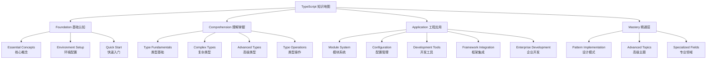

# TypeScript 知识总览

## 📋 学习路径图

## 🎯 学习层次说明

| 层次 | 目标 | 学习重点 | 预期时长 |
|------|------|----------|----------|
| **Foundation** | 建立认知基础 | 理解TS本质、环境搭建 | 1-2周 |
| **Comprehension** | 掌握核心概念 | 类型系统、高级特性 | 4-6周 |
| **Application** | 工程实践应用 | 模块化、配置、工具链 | 6-8周 |
| **Mastery** | 深度理解精通 | 设计模式、性能优化 | 8-12周 |

## 🔗 核心链接

- **快速开始**: [[01-15分钟快速上手]]
- **类型系统**: [[01-Type-System入门]]
- **配置管理**: [[01-tsconfig-json大师级配置]]
- **实践案例**: [[01-E-commerce-Platform电商平台]]

## 📊 学习检查点

- [ ] Foundation: 能够搭建TS开发环境
- [ ] Comprehension: 掌握主要类型概念
- [ ] Application: 能够独立配置复杂项目
- [ ] Mastery: 能够设计企业级解决方案

## 🎪 学习方法建议

### 📖 费曼学习法应用
1. **概念解释**: 每学一个概念后，用简单语言解释给他人
2. **类比应用**: 将复杂概念与熟悉事物类比
3. **知识连接**: 主动寻找新知识与已有知识的联系

### 💪 刻意练习原则
1. **明确目标**: 每节设定具体的学习目标
2. **即时反馈**: 通过练习和测试获得反馈
3. **走出舒适区**: 逐步挑战更高难度内容

## 🔄 复习策略

- **第1天**: 学习新知识
- **第3天**: 第一次复习
- **第7天**: 第二次复习  
- **第30天**: 深度复习和应用

---
*📝 学习建议：每次学习前先阅读此总览，明确当前所处层次和需要关注的重点。*
