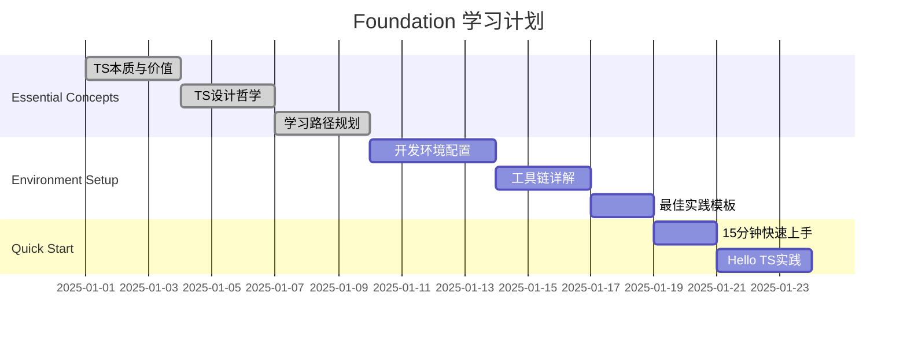

# TypeScript 学习进度跟踪

## 📊 学习状态总览

```mermaid
progressbar
    title "整体学习进度"
    Foundation "Foundation" : 0
    Comprehension "Comprehension" : 0  
    Application "Application" : 0
    Mastery "Mastery" : 0
```

## 🎯 Foundation - 基础认知层

### 📖 理论学习进度

| 模块 | 文件 | 状态 | 完成日期 | 熟练度 |
|------|------|------|----------|--------|
| **Essential Concepts** | |
| | [[01-TypeScript本质与价值]] | ⭕ 未开始 | - | - |
| | [[02-TypeScript设计哲学]] | ⭕ 未开始 | - | - |
| | [[03-学习路径规划]] | ⭕ 未开始 | - | - |
| **Environment Setup** | |
| | [[01-开发环境全配置]] | ⭕ 未开始 | - | - |
| | [[02-工具链详解]] | ⭕ 未开始 | - | - |
| | [[03-最佳实践模板]] | ⭕ 未开始 | - | - |
| **Quick Start** | |
| | [[01-15分钟快速上手]] | ⭕ 未开始 | - | - |
| | [[02-Hello-TypeScript实践]] | ⭕ 未开始 | - | - |

**Foundation 完成度**: 0/8 (0%)

### 🏃‍♂️ Foundation 学习计划



## 💡 Comprehension - 理解掌握层

### 📖 理论学习进度

| 模块 | 文件 | 状态 | 完成日期 | 熟练度 |
|------|------|------|----------|--------|
| **Type Fundamentals** | |
| | [[01-Type-System入门]] | ⭕ 未开始 | - | - |
| | [[02-Primitive-Types完全指南]] | ⭕ 未开始 | - | - |
| | [[03-Type-Inference揭秘]] | ⭕ 未开始 | - | - |
| | [[04-Type-vs-Interface深度对比]] | ⭕ 未开始 | - | - |
| **Complex Types** | |
| | [[01-Array-and-Tuple完全解析]] | ⭕ 未开始 | - | - |
| | [[02-Object-Types设计模式]] | ⭕ 未开始 | - | - |
| | [[03-Function-Types签名技巧]] | ⭕ 未开始 | - | - |
| | [[04-Class-Types架构设计]] | ⭕ 未开始 | - | - |
| **Advanced Types** | |
| | [[01-Generics泛型精通]] | ⭕ 未开始 | - | - |
| | [[02-Union-and-Intersection实战]] | ⭕ 未开始 | - | - |
| | [[03-Conditional-Types深度应用]] | ⭕ 未开始 | - | - |
| | [[04-Mapped-Types工具类型库]] | ⭕ 未开始 | - | - |
| | [[05-Template-Literals字符串魔法]] | ⭕ 未开始 | - | - |
| **Type Operations** | |
| | [[01-Type-Guards类型守护]] | ⭕ 未开始 | - | - |
| | [[02-Type-Assertions类型断言]] | ⭕ 未开始 | - | - |
| | [[03-Decorators装饰器系统]] | ⭕ 未开始 | - | - |
| | [[04-Enums枚举最佳实践]] | ⭕ 未开始 | - | - |
| | [[05-Namespaces命名空间设计]] | ⭕ 未开始 | - | - |

**Comprehension 完成度**: 0/18 (0%)

## 🚀 Application - 工程应用层

### 📖 理论学习进度

| 模块 | 文件 | 状态 | 完成日期 | 熟练度 |
|------|------|------|----------|--------|
| **Module System** | |
| | [[01-ES6-Modules现代解析]] | ⭕ 未开始 | - | - |
| | [[02-Declaration-Files声明文件]] | ⭕ 未开始 | - | - |
| | [[03-Module-Resolution策略]] | ⭕ 未开始 | - | - |
| | [[04-Third-party-Integration第三方集成]] | ⭕ 未开始 | - | - |
| **Configuration** | |
| | [[01-tsconfig-json大师级配置]] | ⭕ 未开始 | - | - |
| | [[02-Production优化策略]] | ⭕ 未开始 | - | - |
| | [[03-Multi-project多项目管理]] | ⭕ 未开始 | - | - |
| | [[04-Build-Toolchain构建工具链]] | ⭕ 未开始 | - | - |
| **Development Tools** | |
| | [[01-Debugging调试技巧大全]] | ⭕ 未开始 | - | - |
| | [[02-Performance-Optimization性能优化]] | ⭕ 未开始 | - | - |
| | [[03-Code-Quality代码质量保证]] | ⭕ 未开始 | - | - |
| | [[04-Version-Migration升级指南]] | ⭕ 未开始 | - | - |
| **Framework Integration** | |
| | [[01-React-plus-TypeScript生态]] | ⭕ 未开始 | - | - |
| | [[02-Vue3-plus-TypeScript最佳实践]] | ⭕ 未开始 | - | - |
| | [[03-Node-js-plus-TypeScript全栈开发]] | ⭕ 未开始 | - | - |
| | [[04-Full-Stack大项目实战]] | ⭕ 未开始 | - | - |
| **Enterprise Development** | |
| | [[01-Large-Scale大型项目管理]] | ⭕ 未开始 | - | - |
| | [[02-Team-Production团队协作]] | ⭕ 未开始 | - | - |
| | [[03-Type-Library-Maintenance类型库维护]] | ⭕ 未开始 | - | - |
| | [[04-Security-and-Testing安全与测试]] | ⭕ 未开始 | - | - |

**Application 完成度**: 0/20 (0%)

## 🎖️ Mastery - 精通层

### 📖 理论学习进度

| 模块 | 文件 | 状态 | 完成日期 | 熟练度 |
|------|------|------|----------|--------|
| **Pattern Implementation** | |
| | [[01-Creational-Patterns创建型模式]] | ⭕ 未开始 | - | - |
| | [[02-Structural-Patterns结构型模式]] | ⭕ 未开始 | - | - |
| | [[03-Behavioral-Patterns行为型模式]] | ⭕ 未开始 | - | - |
| | [[04-Architectural-Patterns架构模式]] | ⭕ 未开始 | - | - |
| **Advanced Topics** | |
| | [[01-Compiler-Internals编辑器内部]] | ⭕ 未开始 | - | - |
| | [[02-AST-Manipulation]] | ⭕ 未开始 | - | - |
| | [[03-Performance-Analysis性能分析]] | ⭕ 未开始 | - | - |
| | [[04-Custom-Transformers自定义转换器]] | ⭕ 未开始 | - | - |
| **Specialized Fields** | |
| | [[01-Game-Development游戏开发]] | ⭕ 未开始 | - | - |
| | [[02-Machine-Learning-ML集成]] | ⭕ 未开始 | - | - |
| | [[03-Graphics-and-WebGL图形编程]] | ⭕ 未开始 | - | - |
| | [[04-Systems-Programming系统编程]] | ⭕ 未开始 | - | - |

**Mastery 完成度**: 0/12 (0%)

## 📊 整体学习统计

| 指标 | 数值 | 目标 |
|------|------|------|
| **总体完成度** | 0/58 (0%) | 100% |
| **Foundation** | 0/8 (0%) | 100% |
| **Comprehension** | 0/18 (0%) | 100% |
| **Application** | 0/20 (0%) | 100% |
| **Mastery** | 0/12 (0%) | 100% |

## 🏆 学习里程碑

- [ ] **新手入门**: Foundation层 100% 完成
- [ ] **中级掌握**: Comprehension层 100% 完成  
- [ ] **高级应用**: Application层 100% 完成
- [ ] **专家精通**: Mastery层 100% 完成

## 🎯 学习建议

### 📈 学习顺序
1. **Linear Path**: Foundation → Comprehension → Application → Mastery
2. **Spiral Path**: 每个层次快速过一遍，再深入细节
3. **Project-driven**: 围绕项目需求学习相关知识

### 🧠 强化复习
- **艾宾浩斯遗忘曲线**: 1天、3天、7天、30天复习
- **费曼学习法**: 学习后立即教学式复述
- **刻意练习**: 专注薄弱环节，有目标练习

---
*💡 学习方法：每次开始新学习前，先更新此进度表，保持学习动力*
