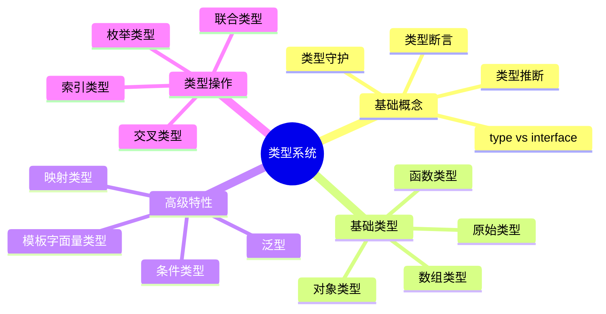
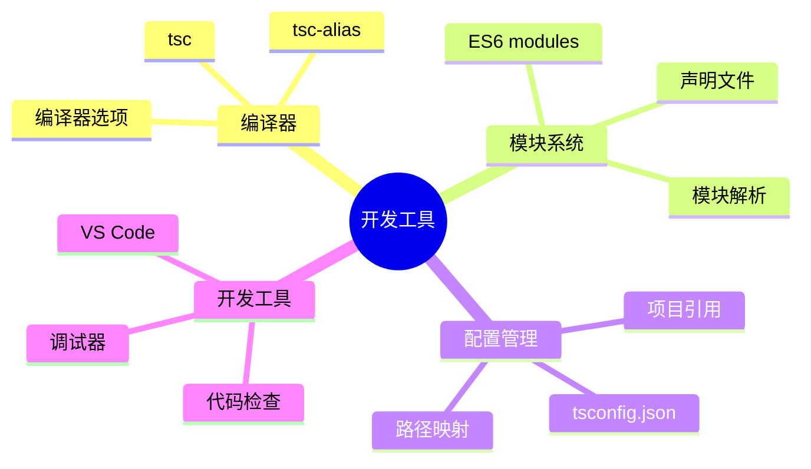

# TypeScript 关联图谱

## 🕸️ 知识关系网络图

```mermaid
graph TD
    A["TypeScript 核心"] --> B["类型系统"]
    A --> C["编译器"]
    A can --> D["JavaScript"]
    
    B --> B1["基础类型"]
    B --> B2["复杂类型"]
    B --> B3["高级类型"]
    B --> B4["类型操作"]
    
    B1 --> B11["primitive types"]
    B1 --> B12["特殊类型"]
    B2 --> B21["对象类型"]
    B2 --> B22["函数类型"]
    B2 --> B23["数组类型"]
    B3 --> B31["泛型"]
    B3 --> B32["条件类型"]
    B3 --> B33["映射类型"]
    B4 --> B41["类型断言"]
    B4 --> B42["类型守护"]
    
    C --> C1["模块系统"]
    C --> C2["配置管理"]
    C --> C3["开发工具"]
    
    C1 --> C11["ES6 modules"]
    C1 --> C12["声明文件"]
    C2 --> C21["tsconfig.json"]
    C2 --> C22["构建工具"]
    C3 --> C31["调试工具"]
    C3 --> C32["代码质量"]
    
    D --> E["框架集成"]
    E --> E1["React"]
    E --> E2["Vue"]
    E --> E3["Node.js"]
```

## 🔗 模块间依赖关系

### 📚 Foundation → Comprehension
- [[01-TypeScript本质与价值]] → [[01-Type-System入门]]
- [[02-工具链详解 ]] → [[03-Type-Inference揭秘]]
- [[03-最佳实践模板]] → [[02-Object-Types设计模式]]

### 💡 Comprehension → Application  
- [[01-Type-System入门]] → [[01-ES6-Modules现代解析]]
- [[04-Type-vs-Interface深度对比]] → [[02-Declaration-Files声明文件]]
- [[03-Function-Types签名技巧]] → [[01-tsconfig-json大师级配置]]

### 🚀 Application → Mastery
- [[04-Third-party-Integration第三方集成]] → [[01-Creational-Patterns创建型模式]]
- [[02-Production优化策略]] → [[03-Performance-Analysis性能分析]]
- [[04-Full-Stack大项目实战]] → [[04-Architectural-Patterns架构模式]]

## 🧩 知识点交叉引用

### 🔤 类型系统知识树


### 🛠️ 工具链知识树


## 📈 学习路径选择

### 🎯 新手路径 (0基础)
1. Foundation → 2. Type Fundamentals → 3. Configuration

### 🚀 有经验路径 (JS基础)
1. Quick Start → 2. Advanced Types → 3. Application

### 🏆 专家路径 (TS基础)
1. Pattern Implementation → 2. Specialized Fields → 3. Enterprise

## 🔄 复习闭环设计

### 📖 学习循环


### 🎪 强化记忆策略
- **间隔复习**: 艾宾浩斯遗忘曲线应用
- **交叉练习**: 不同类型问题混合练习  
- **深层理解**: 费曼学习法教学式复习

## 🎯 专项主题关联

### 🏗️ 架构设计专题
- [[04-Class-Types架构设计]]
- [[01-Large-Scale大型项目管理]]
- [[04-Architectural-Patterns架构模式]]
- [[04-Architecture-Decisions架构决策]]

### 🚀 性能优化专题
- [[02-Performance-Optimization性能优化]]
- [[03-Performance-Analysis性能分析]]
- [[02-Performance-Issues性能问题]]
- [[02-Production优化策略]]

### 🧪 测试驱动专题
- [[04-Security-and-Testing安全与测试]]
- [[03-Testing-Strategy测试策略]]
- [[03-Code-Quality代码质量保证]]

## 📱 实战项目路径

### 💼 电商平台项目
1. [[02-Object-Types设计模式]] - 数据建模
2. [[04-Framework-Integration/01-React-plus-TypeScript生态]] - 前端开发
3. [[03-Node-js-plus-TypeScript全栈开发]] - 后端开发
4. [[01-E-commerce-Platform电商平台]] - 集成实践

### 📊 数据可视化项目  
1. [[05-Template-Literals字符串魔法]] - 动态类型生成
2. [[03-Graphics-and-WebGL图形编程]] - 图形库集成
3. [[01-Dashboard-System仪表板系统]] - 完整实现

### 🔧 微服务架构项目
1. [[03-Module-Resolution策略]] - 模块设计
2. [[03-Microservices-Gateway微服务网关]] - 架构设计
3. [[01-Large-Scale大型项目管理]] - 规模化管理

## 🎪 跨领域知识连接

### 🧠 计算机科学概念映射
- **类型理论** ↔ [[01-Type-System入门]]
- **编译原理** ↔ [[01-Compiler-Internals编译器内部]]  
- **设计模式** ↔ [[01-Creational-Patterns创建型模式]]
- **软件工程** ↔ [[01-Large-Scale大型项目管理]]

### 🌐 前端框架生态
- **React生态** ↔ [[01-React-plus-TypeScript生态]]
- **Vue生态** ↔ [[02-Vue3-plus-TypeScript最佳实践]]
- **Node生态** ↔ [[03-Node-js-plus-TypeScript全栈开发]]

---
*💡 使用技巧：利用此图谱制定个性化学习路径，避免知识孤岛*
