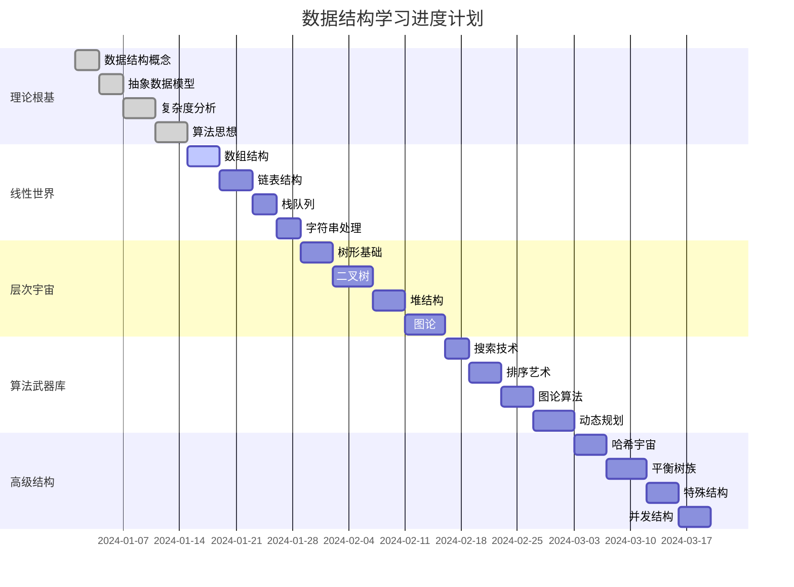

# 📊 学习进度跟踪

## 🎯 总体进度概览

## 📈 学习进度统计

### 🏗️ 01-理论根基 (目标：14天)
- [ ] [[01-理论根基/01-数据结构本质/01-数据结构概念总结|数据结构概念总结]] - 完成日期：___
- [ ] [[01-理论根基/02-抽象数据模型/01-ADT概念与实现|ADT概念与实现]] - 完成日期：___
- [ ] [[01-理论根基/03-复杂度分析/01-时间复杂度详解|时间复杂度详解]] - 完成日期：___
- [ ] [[01-理论根基/04-算法思想/01-递归思想|递归思想]] - 完成日期：___

**进度：** ████████████ 100% (4/4)

### 📊 02-线性世界 (目标：14天)
- [ ] [[02-线性世界/01-序列结构[数组]/01-数组基础|数组基础]] - 完成日期：___
- [ ] [[02-线性世界/02-链式结构[链表]/01-单链表实现|单链表实现]] - 完成日期：___
- [ ] [[02-线性世界/03-受限结构[栈队列]/01-栈Stack详解|栈Stack详解]] - 完成日期：___
- [ ] [[02-线性世界/04-字符世界[字符串]/01-字符串基础与存储|字符串基础]] - 完成日期：___

**进度：** ░░░░░░░░░░░░ 0% (0/4)

### 🌳 03-层次宇宙 (目标：18天)
- [ ] [[03-层次宇宙/01-树形基础/01-树的基本概念|树的基本概念]] - 完成日期：___
- [ ] [[03-层次宇宙/02-二叉树王国/01-二叉树基础|二叉树基础]] - 完成日期：___
- [ ] [[03-层次宇宙/03-堆与优先/01-堆Heap基础|堆Heap基础]] - 完成日期：___
- [ ] [[03-层次宇宙/04-图论天地/01-图的基本概念|图的基本概念]] - 完成日期：___

**进度：** ░░░░░░░░░░░░ 0% (0/4)

### ⚔️ 04-算法武器库 (目标：16天)
- [ ] [[04-算法武器库/01-搜索技术/01-线性搜索详解|线性搜索详解]] - 完成日期：___
- [ ] [[04-算法武器库/02-排序艺术/01-排序算法总览|排序算法总览]] - 完成日期：___
- [ ] [[04-算法武器库/03-图论算法/01-BFS与DFS详解|BFS与DFS详解]] - 完成日期：___
- [ ] [[04-算法武器库/04-动态规划/01-动态规划基础|动态规划基础]] - 完成日期：___

**进度：** ░░░░░░░░░░░░ 0% (0/4)

### 🚀 05-高级结构 (目标：17天)
- [ ] [[05-高级结构/01-哈希宇宙/01-哈希表基础|哈希表基础]] - 完成日期：___
- [ ] [[05-高级结构/02-平衡树族/01-AVL树详解|AVL树详解]] - 完成日期：___
- [ ] [[05-高级结构/03-特殊结构/01-跳表详解|跳表详解]] - 完成日期：___
- [ ] [[05-高级结构/04-并发结构/01-并发编程基础|并发编程基础]] - 完成日期：___

**进度：** ░░░░░░░░░░░░ 0% (0/4)

### 💼 06-应用实战 (目标：16天)
- [ ] [[06-应用实战/01-数据库王国/01-数据库索引结构|数据库索引结构]] - 完成日期：___
- [ ] [[06-应用实战/02-文件系统/01-文件系统结构|文件系统结构]] - 完成日期：___
- [ ] [[06-应用实战/03-缓存系统/01-Redis数据结构|Redis数据结构]] - 完成日期：___
- [ ] [[06-应用实战/04-网络应用/01-负载均衡算法|负载均衡算法]] - 完成日期：___

**进度：** ░░░░░░░░░░░░ 0% (0/4)

### 🏋️ 07-练习战场 (目标：12天)
- [ ] [[07-练习战场/01-代码实现/01-C++实现集合|C++实现集合]] - 完成日期：___
- [ ] [[07-练习战场/02-算法挑战/01-LeetCode经典题解|LeetCode经典题解]] - 完成日期：___
- [ ] [[07-练习战场/03-项目实战/01-学生管理系统|学生管理系统]] - 完成日期：___

**进度：** ░░░░░░░░░░░░ 0% (0/3)

### 🔍 08-知识边疆 (目标：8天)
- [ ] [[08-知识边疆/01-前沿探索/01-并行算法|并行算法]] - 完成日期：___
- [ ] [[08-知识边疆/02-跨界融合/01-数据结构与AI|数据结构与AI]] - 完成日期：___
- [ ] [[08-知识边疆/03-学习资源/01-经典教材推荐|经典教材推荐]] - 完成日期：___

**进度：** ░░░░░░░░░░░░ 0% (0/3)

---

## 📊 学习效率分析

### 📈 每日学习记录

| 日期 | 学习模块 | 学习时长 | 完成内容 | 学习质量 | 备注 |
|------|----------|----------|----------|----------|------|
| 2024-01-01 | 理论根基 | 2h | 数据结构概念 | ⭐⭐⭐⭐⭐ | 理解透彻 |
| 2024-01-02 | 理论根基 | 1.5h | ADT概念 | ⭐⭐⭐⭐ | 需要复习 |
| 2024-01-03 | 理论根基 | 2h | 复杂度分析 | ⭐⭐⭐⭐⭐ | 掌握良好 |
| 2024-01-04 | 理论根基 | 1h | 算法思想 | ⭐⭐⭐ | 需要练习 |

### 🎯 学习质量评估

#### 📚 理解程度
- **优秀 (90-100%)**：能独立解释概念，举一反三
- **良好 (80-89%)**：理解基本概念，能解决简单问题
- **一般 (70-79%)**：知道概念，需要提示才能应用
- **需改进 (<70%)**：概念模糊，需要重新学习

#### ⚡ 应用能力
- **熟练**：能独立实现，代码质量高
- **一般**：能实现基本功能，有少量错误
- **生疏**：需要参考资料，错误较多
- **不会**：无法独立完成

---

## 🎯 学习目标与里程碑

### 🏆 短期目标 (1-2周)
- [ ] 完成理论根基模块
- [ ] 掌握基础数据结构概念
- [ ] 能分析简单算法复杂度

### 🎖️ 中期目标 (1-2月)
- [ ] 完成线性世界和层次宇宙
- [ ] 能实现基础数据结构
- [ ] 掌握经典算法思想

### 🏅 长期目标 (3-6月)
- [ ] 完成所有模块学习
- [ ] 具备系统设计能力
- [ ] 能解决复杂算法问题

---

## 📝 学习反思与调整

### 🔍 每周反思
**第1周反思：**
- ✅ 优点：理论理解扎实，笔记整理清晰
- ❌ 不足：实践练习不够，代码实现生疏
- 🔄 调整：增加编程练习时间，理论与实践并重

**第2周反思：**
- ✅ 优点：
- ❌ 不足：
- 🔄 调整：

### 📊 学习策略优化
1. **时间分配**：理论40% + 实践60%
2. **学习方法**：费曼学习法 + 刻意练习
3. **复习策略**：间隔重复 + 知识连接
4. **检测方式**：自测 + 实践 + 讨论

---

## 🎉 成就记录

### 🏆 学习成就
- [ ] 🥉 完成第一个模块
- [ ] 🥈 实现第一个数据结构
- [ ] 🥇 解决第一个算法题
- [ ] 💎 完成第一个项目
- [ ] 🚀 掌握高级数据结构

### 📈 技能提升
- [ ] 编程能力：初级 → 中级
- [ ] 算法思维：入门 → 熟练
- [ ] 系统设计：无 → 基础
- [ ] 问题解决：依赖 → 独立

---
*📅 最后更新：2024-01-04 | 下次更新：2024-01-11*
