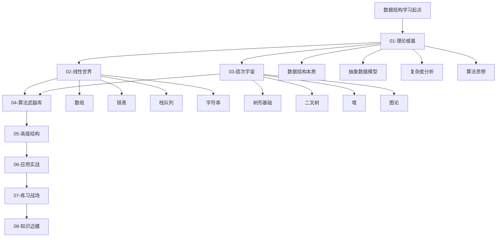

# 🗺️ 数据结构学习路径图

## 📋 学习导航

> **学习目标**：掌握数据结构核心概念，建立系统性知识体系，提升算法思维和编程能力

### 🎯 学习路径概览

## 🚀 学习阶段规划

### 阶段一：理论筑基（1-2周）
- [[01-理论根基/01-数据结构本质/01-数据结构概念总结|数据结构概念]]
- [[01-理论根基/02-抽象数据模型/01-ADT概念与实现|抽象数据类型]]
- [[01-理论根基/03-复杂度分析/01-时间复杂度详解|复杂度分析]]

### 阶段二：线性结构（2-3周）
- [[02-线性世界/01-序列结构[数组]/01-数组基础|数组基础]]
- [[02-线性世界/02-链式结构[链表]/01-单链表实现|链表实现]]
- [[02-线性世界/03-受限结构[栈队列]/01-栈Stack详解|栈与队列]]

### 阶段三：层次结构（3-4周）
- [[03-层次宇宙/01-树形基础/01-树的基本概念|树形基础]]
- [[03-层次宇宙/02-二叉树王国/01-二叉树基础|二叉树]]
- [[03-层次宇宙/04-图论天地/01-图的基本概念|图论基础]]

### 阶段四：算法应用（4-5周）
- [[04-算法武器库/01-搜索技术/02-二分搜索算法|搜索算法]]
- [[04-算法武器库/02-排序艺术/02-快速排序详解|排序算法]]
- [[04-算法武器库/04-动态规划/01-动态规划基础|动态规划]]

### 阶段五：高级进阶（5-6周）
- [[05-高级结构/01-哈希宇宙/01-哈希表基础|哈希结构]]
- [[05-高级结构/02-平衡树族/02-红黑树详解|平衡树]]
- [[05-高级结构/03-特殊结构/01-跳表详解|特殊结构]]

## 📊 学习进度检查点

### ✅ 基础检查点
- [ ] 理解数据结构基本概念
- [ ] 掌握时间复杂度分析方法
- [ ] 能够实现基础线性结构

### ✅ 进阶检查点
- [ ] 熟练实现树形结构
- [ ] 掌握经典算法思想
- [ ] 能够分析算法复杂度

### ✅ 高级检查点
- [ ] 理解高级数据结构原理
- [ ] 能够设计高效算法
- [ ] 具备实际应用能力

## 🔗 快速链接

### 📚 核心概念
- [[01-理论根基/01-数据结构本质/01-数据结构概念总结|数据结构定义]]
- [[01-理论根基/03-复杂度分析/04-大O记号详解|大O记号]]
- [[01-理论根基/04-算法思想/01-递归思想|递归思想]]

### 🛠️ 实践工具
- [[07-练习战场/01-代码实现/01-C++实现集合|C++实现]]
- [[07-练习战场/02-算法挑战/01-LeetCode经典题解|LeetCode题解]]
- [[07-练习战场/03-项目实战/01-学生管理系统|项目实战]]

### 🎯 学习资源
- [[08-知识边疆/03-学习资源/01-经典教材推荐|经典教材]]
- [[08-知识边疆/03-学习资源/02-在线课程推荐|在线课程]]
- [[08-知识边疆/03-学习资源/04-技术博客与论坛|技术博客]]

## 💡 学习建议

1. **循序渐进**：按照路径图顺序学习，不要跳跃
2. **理论结合实践**：每学一个概念都要动手实现
3. **刻意练习**：定期进行算法题练习
4. **知识连接**：建立知识点之间的关联
5. **定期复习**：使用[[🧠-记忆宫殿法|记忆宫殿法]]巩固知识

---
*📝 学习记录：开始日期 _____ 预计完成日期 _____*
