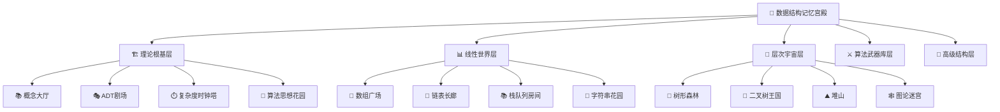

# 🧠 记忆宫殿法 - 数据结构记忆系统

## 🏰 记忆宫殿原理

记忆宫殿法是一种古老而有效的记忆技术，通过将抽象信息与具体的空间位置关联，利用人类强大的空间记忆能力来存储和回忆复杂信息。

### 🎯 核心原理
1. **空间定位**：将知识映射到熟悉的空间
2. **视觉联想**：用图像和故事增强记忆
3. **情感连接**：通过情感加深印象
4. **重复强化**：定期回顾巩固记忆

---

## 🏗️ 数据结构记忆宫殿设计

### 🏛️ 宫殿布局



---

## 🎭 具体记忆场景设计

### 🏗️ 01-理论根基层

#### 📚 概念大厅
**位置**：宫殿入口大厅
**记忆场景**：
- **数据结构定义**：大厅中央的"数据雕塑"（数据元素+关系）
- **分类体系**：大厅四角的分类展柜
  - 线性结构：直线型展柜
  - 非线性结构：树形展柜
  - 文件结构：书架型展柜
  - 抽象结构：透明展柜

#### 🎭 ADT剧场
**位置**：宫殿左侧剧场
**记忆场景**：
- **ADT概念**：舞台上的"抽象演员"
- **封装**：演员的"面具"（隐藏实现）
- **接口**：演员的"台词"（公开操作）
- **实现**：后台的"道具"（具体实现）

#### ⏱️ 复杂度时钟塔
**位置**：宫殿右侧高塔
**记忆场景**：
- **时间复杂度**：塔顶的"时间沙漏"
- **空间复杂度**：塔内的"空间容器"
- **大O记号**：塔身的"刻度标记"
- **复杂度等级**：不同楼层的"复杂度房间"

### 📊 02-线性世界层

#### 🔢 数组广场
**位置**：宫殿前广场
**记忆场景**：
- **数组定义**：广场上的"整齐队列"
- **索引访问**：队列中的"编号牌"
- **内存连续**：队列的"紧密排列"
- **动态数组**：可伸缩的"弹性队列"

#### 🔗 链表长廊
**位置**：宫殿左侧长廊
**记忆场景**：
- **节点结构**：长廊中的"信息亭"
- **指针连接**：亭子间的"指示牌"
- **遍历过程**：沿着长廊"漫步"
- **插入删除**：在长廊中"增减亭子"

#### 📚 栈队列房间
**位置**：宫殿内部专用房间
**记忆场景**：
- **栈（LIFO）**：房间里的"叠盘子"
- **队列（FIFO）**：房间里的"排队等候"
- **操作过程**：模拟"盘子叠放"和"排队进出"

### 🌳 03-层次宇宙层

#### 🌲 树形森林
**位置**：宫殿后花园
**记忆场景**：
- **树根**：森林中的"大树根"
- **树枝**：树上的"分叉枝条"
- **树叶**：枝条末端的"数据叶子"
- **遍历**：在森林中"不同路径探索"

#### 🌳 二叉树王国
**位置**：森林中的"特殊区域"
**记忆场景**：
- **左子树**：国王的"左手领地"
- **右子树**：国王的"右手领地"
- **BST性质**：领地中的"大小规则"
- **平衡树**：领地间的"平衡杆"

#### ⛰️ 堆山
**位置**：宫殿后山
**记忆场景**：
- **堆顶**：山顶的"最大/最小值"
- **堆化**：山体的"自动调整"
- **堆排序**：从山顶"滚落排序"

---

## 🎨 记忆技巧与联想

### 🖼️ 视觉联想技巧

#### 🔢 数字联想
- **O(1)**：闪电⚡（瞬间完成）
- **O(log n)**：楼梯📶（逐步上升）
- **O(n)**：直线➡️（线性增长）
- **O(n²)**：网格🔲（平方增长）

#### 🎭 角色扮演
- **数组**：严格的"军队指挥官"
- **链表**：灵活的"导游"
- **栈**：后进先出的"叠盘子服务员"
- **队列**：先进先出的"银行柜员"
- **树**：有层次的"家族族长"
- **图**：复杂的"社交网络"

### 🎵 韵律记忆

#### 📝 复杂度口诀
```
常数时间O(1)，瞬间完成不费力
对数时间O(log n)，二分查找最神奇
线性时间O(n)，遍历一遍没问题
平方时间O(n²)，双重循环要小心
```

#### 🌳 树遍历口诀
```
前序遍历：根左右，先看根再左右
中序遍历：左根右，先左后根再右
后序遍历：左右根，先左右后根
```

---

## 🔄 记忆巩固策略

### 📅 复习时间表

| 复习周期 | 复习内容 | 记忆强度 |
|----------|----------|----------|
| 第1天 | 新学内容 | 🔴 强记忆 |
| 第3天 | 第1天内容 | 🟡 中记忆 |
| 第7天 | 第1、3天内容 | 🟢 弱记忆 |
| 第14天 | 第1、3、7天内容 | 🔵 巩固记忆 |
| 第30天 | 全部内容 | 💎 长期记忆 |

### 🎯 记忆检测方法

#### 🧩 空间回忆法
1. **闭眼回忆**：在脑海中"漫步"记忆宫殿
2. **路径追踪**：按照固定路径回忆知识点
3. **场景重现**：重现具体的记忆场景
4. **细节检查**：检查记忆中的具体细节

#### 🎭 角色扮演法
1. **概念解释**：扮演"老师"解释概念
2. **应用演示**：扮演"工程师"演示应用
3. **问题解决**：扮演"专家"解决问题
4. **创新设计**：扮演"发明家"设计新方案

---

## 🎨 个性化记忆宫殿

### 🏠 个人空间设计
选择你熟悉的空间作为记忆宫殿：
- **家**：客厅、卧室、厨房、书房
- **学校**：教室、图书馆、操场、食堂
- **工作场所**：办公室、会议室、休息区
- **城市**：街道、公园、商场、地铁站

### 🎯 记忆锚点设置
在每个空间中设置"记忆锚点"：
- **客厅**：沙发（数组）、茶几（链表）、电视（栈）
- **卧室**：床（树）、衣柜（哈希表）、书桌（队列）
- **厨房**：冰箱（堆）、炉子（图）、水槽（字符串）

---

## 📊 记忆效果评估

### 🎯 记忆质量指标

| 指标 | 优秀 | 良好 | 一般 | 需改进 |
|------|------|------|------|--------|
| 回忆速度 | <5秒 | 5-10秒 | 10-20秒 | >20秒 |
| 准确度 | 100% | 90-99% | 80-89% | <80% |
| 完整性 | 100% | 90-99% | 80-89% | <80% |
| 持久性 | >30天 | 15-30天 | 7-15天 | <7天 |

### 📈 记忆训练计划

#### 🏃‍♂️ 日常训练
- **晨练**：5分钟空间回忆
- **午练**：10分钟概念联想
- **晚练**：15分钟综合复习

#### 🏋️‍♂️ 强化训练
- **周末**：30分钟深度记忆
- **月末**：1小时全面复习
- **季末**：2小时系统整理

---

## 💡 记忆优化建议

### 🎯 提高记忆效率
1. **多感官参与**：视觉+听觉+触觉+情感
2. **故事化记忆**：将抽象概念编成故事
3. **情感化记忆**：用情感加深印象
4. **实践化记忆**：通过动手加深理解

### 🔄 保持记忆新鲜
1. **定期更新**：根据新知识更新记忆宫殿
2. **场景变换**：偶尔改变记忆场景
3. **联想扩展**：增加新的联想连接
4. **应用验证**：通过实际应用验证记忆

---
*🧠 记忆宫殿法让抽象的数据结构变得具体可感，让复杂的概念变得生动有趣！*
