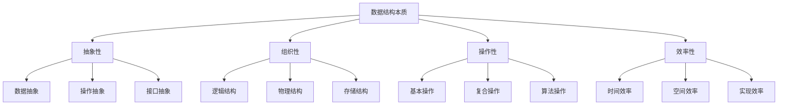

# 数据结构本质

## 📖 核心概念

**数据结构本质**是理解数据结构的基础。数据结构不仅仅是存储数据的方式，更是组织数据、管理数据、操作数据的抽象模型。

### 🏗️ 本质特征



## 🔧 抽象性理解

### 数据抽象

```cpp
// 数据抽象的层次
class DataAbstraction {
public:
    // 第一层：原始数据
    int rawData;
    string rawString;
    
    // 第二层：结构化数据
    struct Person {
        string name;
        int age;
        string email;
    };
    
    // 第三层：抽象数据类型
    class AbstractDataStructure {
    public:
        virtual void insert(int value) = 0;
        virtual bool search(int value) = 0;
        virtual void remove(int value) = 0;
        virtual void display() = 0;
    };
    
    // 第四层：高级抽象
    class HighLevelAbstraction {
    public:
        virtual void processData() = 0;
        virtual void optimizePerformance() = 0;
        virtual void handleErrors() = 0;
    };
};
```

### 操作抽象

```cpp
// 操作抽象的层次
class OperationAbstraction {
public:
    // 基本操作抽象
    class BasicOperations {
    public:
        virtual void create() = 0;
        virtual void destroy() = 0;
        virtual void initialize() = 0;
        virtual void clear() = 0;
    };
    
    // 访问操作抽象
    class AccessOperations {
    public:
        virtual void insert() = 0;
        virtual void delete_() = 0;
        virtual void update() = 0;
        virtual void retrieve() = 0;
    };
    
    // 遍历操作抽象
    class TraversalOperations {
    public:
        virtual void traverse() = 0;
        virtual void search() = 0;
        virtual void sort() = 0;
        virtual void filter() = 0;
    };
    
    // 高级操作抽象
    class AdvancedOperations {
    public:
        virtual void merge() = 0;
        virtual void split() = 0;
        virtual void transform() = 0;
        virtual void analyze() = 0;
    };
};
```

## 🎯 组织性理解

### 逻辑结构

```cpp
// 逻辑结构的分类
class LogicalStructure {
public:
    // 线性结构
    class LinearStructure {
    public:
        // 数组
        class Array {
        private:
            int* data;
            int size;
            int capacity;
            
        public:
            Array(int cap) : capacity(cap), size(0) {
                data = new int[capacity];
            }
            
            void insert(int index, int value) {
                if (index >= 0 && index <= size && size < capacity) {
                    for (int i = size; i > index; --i) {
                        data[i] = data[i-1];
                    }
                    data[index] = value;
                    size++;
                }
            }
            
            int get(int index) {
                if (index >= 0 && index < size) {
                    return data[index];
                }
                return -1;
            }
        };
        
        // 链表
        class LinkedList {
        private:
            struct Node {
                int data;
                Node* next;
                Node(int d) : data(d), next(nullptr) {}
            };
            
            Node* head;
            int size;
            
        public:
            LinkedList() : head(nullptr), size(0) {}
            
            void insert(int value) {
                Node* newNode = new Node(value);
                newNode->next = head;
                head = newNode;
                size++;
            }
            
            bool search(int value) {
                Node* current = head;
                while (current) {
                    if (current->data == value) {
                        return true;
                    }
                    current = current->next;
                }
                return false;
            }
        };
    };
    
    // 树形结构
    class TreeStructure {
    public:
        struct TreeNode {
            int data;
            TreeNode* left;
            TreeNode* right;
            
            TreeNode(int d) : data(d), left(nullptr), right(nullptr) {}
        };
        
        TreeNode* root;
        
        TreeStructure() : root(nullptr) {}
        
        void insert(int value) {
            root = insertHelper(root, value);
        }
        
        TreeNode* insertHelper(TreeNode* node, int value) {
            if (!node) {
                return new TreeNode(value);
            }
            
            if (value < node->data) {
                node->left = insertHelper(node->left, value);
            } else if (value > node->data) {
                node->right = insertHelper(node->right, value);
            }
            
            return node;
        }
    };
    
    // 图结构
    class GraphStructure {
    private:
        vector<vector<int>> adjacencyList;
        int vertices;
        
    public:
        GraphStructure(int v) : vertices(v) {
            adjacencyList.resize(v);
        }
        
        void addEdge(int from, int to) {
            adjacencyList[from].push_back(to);
            adjacencyList[to].push_back(from);
        }
        
        void display() {
            for (int i = 0; i < vertices; ++i) {
                cout << "Vertex " << i << ": ";
                for (int neighbor : adjacencyList[i]) {
                    cout << neighbor << " ";
                }
                cout << endl;
            }
        }
    };
};
```

### 物理结构

```cpp
// 物理结构的实现
class PhysicalStructure {
public:
    // 顺序存储
    class SequentialStorage {
    private:
        int* data;
        int size;
        int capacity;
        
    public:
        SequentialStorage(int cap) : capacity(cap), size(0) {
            data = new int[capacity];
        }
        
        ~SequentialStorage() {
            delete[] data;
        }
        
        void insert(int value) {
            if (size < capacity) {
                data[size++] = value;
            }
        }
        
        int get(int index) {
            if (index >= 0 && index < size) {
                return data[index];
            }
            return -1;
        }
    };
    
    // 链式存储
    class LinkedStorage {
    private:
        struct Node {
            int data;
            Node* next;
            Node(int d) : data(d), next(nullptr) {}
        };
        
        Node* head;
        int size;
        
    public:
        LinkedStorage() : head(nullptr), size(0) {}
        
        ~LinkedStorage() {
            while (head) {
                Node* temp = head;
                head = head->next;
                delete temp;
            }
        }
        
        void insert(int value) {
            Node* newNode = new Node(value);
            newNode->next = head;
            head = newNode;
            size++;
        }
        
        bool search(int value) {
            Node* current = head;
            while (current) {
                if (current->data == value) {
                    return true;
                }
                current = current->next;
            }
            return false;
        }
    };
    
    // 索引存储
    class IndexedStorage {
    private:
        vector<int> data;
        map<int, int> index;
        
    public:
        void insert(int key, int value) {
            data.push_back(value);
            index[key] = data.size() - 1;
        }
        
        int get(int key) {
            if (index.find(key) != index.end()) {
                return data[index[key]];
            }
            return -1;
        }
        
        void update(int key, int value) {
            if (index.find(key) != index.end()) {
                data[index[key]] = value;
            }
        }
    };
};
```

## 📊 操作性理解

### 基本操作

```cpp
// 基本操作的实现
class BasicOperations {
public:
    // 创建操作
    class CreateOperation {
    public:
        static int* createArray(int size) {
            return new int[size];
        }
        
        static vector<int> createVector(int size) {
            return vector<int>(size);
        }
        
        static map<int, int> createMap() {
            return map<int, int>();
        }
    };
    
    // 销毁操作
    class DestroyOperation {
    public:
        static void destroyArray(int* arr) {
            delete[] arr;
        }
        
        static void destroyVector(vector<int>& vec) {
            vec.clear();
        }
        
        static void destroyMap(map<int, int>& mp) {
            mp.clear();
        }
    };
    
    // 初始化操作
    class InitializeOperation {
    public:
        static void initializeArray(int* arr, int size, int value) {
            for (int i = 0; i < size; ++i) {
                arr[i] = value;
            }
        }
        
        static void initializeVector(vector<int>& vec, int size, int value) {
            vec.assign(size, value);
        }
        
        static void initializeMap(map<int, int>& mp, int size, int value) {
            for (int i = 0; i < size; ++i) {
                mp[i] = value;
            }
        }
    };
    
    // 清空操作
    class ClearOperation {
    public:
        static void clearArray(int* arr, int size) {
            for (int i = 0; i < size; ++i) {
                arr[i] = 0;
            }
        }
        
        static void clearVector(vector<int>& vec) {
            vec.clear();
        }
        
        static void clearMap(map<int, int>& mp) {
            mp.clear();
        }
    };
};
```

### 复合操作

```cpp
// 复合操作的实现
class CompositeOperations {
public:
    // 合并操作
    class MergeOperation {
    public:
        static vector<int> mergeArrays(const vector<int>& arr1, const vector<int>& arr2) {
            vector<int> result;
            result.reserve(arr1.size() + arr2.size());
            
            int i = 0, j = 0;
            while (i < arr1.size() && j < arr2.size()) {
                if (arr1[i] <= arr2[j]) {
                    result.push_back(arr1[i++]);
                } else {
                    result.push_back(arr2[j++]);
                }
            }
            
            while (i < arr1.size()) {
                result.push_back(arr1[i++]);
            }
            
            while (j < arr2.size()) {
                result.push_back(arr2[j++]);
            }
            
            return result;
        }
    };
    
    // 分割操作
    class SplitOperation {
    public:
        static pair<vector<int>, vector<int>> splitArray(const vector<int>& arr, int pivot) {
            vector<int> left, right;
            
            for (int value : arr) {
                if (value < pivot) {
                    left.push_back(value);
                } else {
                    right.push_back(value);
                }
            }
            
            return make_pair(left, right);
        }
    };
    
    // 转换操作
    class TransformOperation {
    public:
        static vector<int> transformArray(const vector<int>& arr, function<int(int)> func) {
            vector<int> result;
            result.reserve(arr.size());
            
            for (int value : arr) {
                result.push_back(func(value));
            }
            
            return result;
        }
    };
    
    // 分析操作
    class AnalyzeOperation {
    public:
        static map<int, int> analyzeFrequency(const vector<int>& arr) {
            map<int, int> frequency;
            
            for (int value : arr) {
                frequency[value]++;
            }
            
            return frequency;
        }
        
        static pair<int, int> findMinMax(const vector<int>& arr) {
            if (arr.empty()) {
                return make_pair(0, 0);
            }
            
            int minVal = arr[0];
            int maxVal = arr[0];
            
            for (int value : arr) {
                minVal = min(minVal, value);
                maxVal = max(maxVal, value);
            }
            
            return make_pair(minVal, maxVal);
        }
    };
};
```

## 🎮 效率性理解

### 时间效率

```cpp
// 时间效率的分析
class TimeEfficiency {
public:
    // 时间复杂度分析
    class TimeComplexity {
    public:
        // O(1) - 常数时间
        static int constantTime(int* arr, int index) {
            return arr[index];
        }
        
        // O(log n) - 对数时间
        static int binarySearch(const vector<int>& arr, int target) {
            int left = 0, right = arr.size() - 1;
            
            while (left <= right) {
                int mid = left + (right - left) / 2;
                
                if (arr[mid] == target) {
                    return mid;
                } else if (arr[mid] < target) {
                    left = mid + 1;
                } else {
                    right = mid - 1;
                }
            }
            
            return -1;
        }
        
        // O(n) - 线性时间
        static int linearSearch(const vector<int>& arr, int target) {
            for (int i = 0; i < arr.size(); ++i) {
                if (arr[i] == target) {
                    return i;
                }
            }
            return -1;
        }
        
        // O(n log n) - 线性对数时间
        static void mergeSort(vector<int>& arr, int left, int right) {
            if (left < right) {
                int mid = left + (right - left) / 2;
                mergeSort(arr, left, mid);
                mergeSort(arr, mid + 1, right);
                merge(arr, left, mid, right);
            }
        }
        
        // O(n²) - 平方时间
        static void bubbleSort(vector<int>& arr) {
            int n = arr.size();
            for (int i = 0; i < n - 1; ++i) {
                for (int j = 0; j < n - i - 1; ++j) {
                    if (arr[j] > arr[j + 1]) {
                        swap(arr[j], arr[j + 1]);
                    }
                }
            }
        }
        
    private:
        static void merge(vector<int>& arr, int left, int mid, int right) {
            vector<int> temp(right - left + 1);
            int i = left, j = mid + 1, k = 0;
            
            while (i <= mid && j <= right) {
                if (arr[i] <= arr[j]) {
                    temp[k++] = arr[i++];
                } else {
                    temp[k++] = arr[j++];
                }
            }
            
            while (i <= mid) {
                temp[k++] = arr[i++];
            }
            
            while (j <= right) {
                temp[k++] = arr[j++];
            }
            
            for (int i = 0; i < temp.size(); ++i) {
                arr[left + i] = temp[i];
            }
        }
    };
    
    // 性能测试
    class PerformanceTest {
    public:
        static void testTimeComplexity() {
            vector<int> arr = {5, 2, 8, 1, 9, 3, 7, 4, 6};
            
            // 测试线性搜索
            auto start = chrono::high_resolution_clock::now();
            int result = TimeComplexity::linearSearch(arr, 7);
            auto end = chrono::high_resolution_clock::now();
            auto duration = chrono::duration_cast<chrono::microseconds>(end - start);
            
            cout << "Linear search result: " << result << endl;
            cout << "Time taken: " << duration.count() << " microseconds" << endl;
            
            // 测试二分搜索（需要排序）
            vector<int> sortedArr = arr;
            sort(sortedArr.begin(), sortedArr.end());
            
            start = chrono::high_resolution_clock::now();
            result = TimeComplexity::binarySearch(sortedArr, 7);
            end = chrono::high_resolution_clock::now();
            duration = chrono::duration_cast<chrono::microseconds>(end - start);
            
            cout << "Binary search result: " << result << endl;
            cout << "Time taken: " << duration.count() << " microseconds" << endl;
        }
    };
};
```

### 空间效率

```cpp
// 空间效率的分析
class SpaceEfficiency {
public:
    // 空间复杂度分析
    class SpaceComplexity {
    public:
        // O(1) - 常数空间
        static int constantSpace(int a, int b) {
            return a + b;
        }
        
        // O(n) - 线性空间
        static vector<int> linearSpace(const vector<int>& arr) {
            vector<int> result;
            for (int value : arr) {
                result.push_back(value * 2);
            }
            return result;
        }
        
        // O(n²) - 平方空间
        static vector<vector<int>> squareSpace(int n) {
            vector<vector<int>> result(n, vector<int>(n));
            for (int i = 0; i < n; ++i) {
                for (int j = 0; j < n; ++j) {
                    result[i][j] = i * j;
                }
            }
            return result;
        }
        
        // O(log n) - 对数空间
        static int recursiveSpace(int n) {
            if (n <= 1) {
                return 1;
            }
            return recursiveSpace(n / 2) + recursiveSpace(n / 2);
        }
    };
    
    // 内存管理
    class MemoryManagement {
    public:
        // 动态内存分配
        static int* allocateArray(int size) {
            return new int[size];
        }
        
        // 动态内存释放
        static void deallocateArray(int* arr) {
            delete[] arr;
        }
        
        // 智能指针管理
        static unique_ptr<int[]> allocateSmartArray(int size) {
            return make_unique<int[]>(size);
        }
        
        // 内存泄漏检测
        static void detectMemoryLeak() {
            // 模拟内存泄漏
            int* leaked = new int[1000];
            // 忘记释放内存
            // delete[] leaked;
        }
    };
    
    // 空间优化
    class SpaceOptimization {
    public:
        // 原地算法
        static void inPlaceReverse(vector<int>& arr) {
            int left = 0, right = arr.size() - 1;
            while (left < right) {
                swap(arr[left], arr[right]);
                left++;
                right--;
            }
        }
        
        // 压缩存储
        static vector<int> compressArray(const vector<int>& arr) {
            vector<int> compressed;
            int count = 1;
            
            for (int i = 1; i < arr.size(); ++i) {
                if (arr[i] == arr[i-1]) {
                    count++;
                } else {
                    compressed.push_back(arr[i-1]);
                    compressed.push_back(count);
                    count = 1;
                }
            }
            
            compressed.push_back(arr.back());
            compressed.push_back(count);
            
            return compressed;
        }
        
        // 稀疏矩阵
        static map<pair<int, int>, int> sparseMatrix(const vector<vector<int>>& matrix) {
            map<pair<int, int>, int> sparse;
            
            for (int i = 0; i < matrix.size(); ++i) {
                for (int j = 0; j < matrix[i].size(); ++j) {
                    if (matrix[i][j] != 0) {
                        sparse[{i, j}] = matrix[i][j];
                    }
                }
            }
            
            return sparse;
        }
    };
};
```

## 🔗 相关链接

- [[02-抽象数据模型|抽象数据模型]]
- [[03-复杂度分析|复杂度分析]]
- [[04-算法思想|算法思想]]

## 💡 数据结构本质要点

1. **抽象性**：数据结构的核心是抽象，隐藏实现细节
2. **组织性**：合理组织数据，提高访问效率
3. **操作性**：定义清晰的操作接口，支持各种应用
4. **效率性**：平衡时间和空间效率，满足性能需求

---

*📝 本质提示：理解数据结构的本质有助于更好地设计和实现高效的数据结构*
