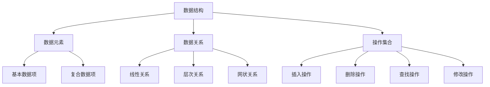
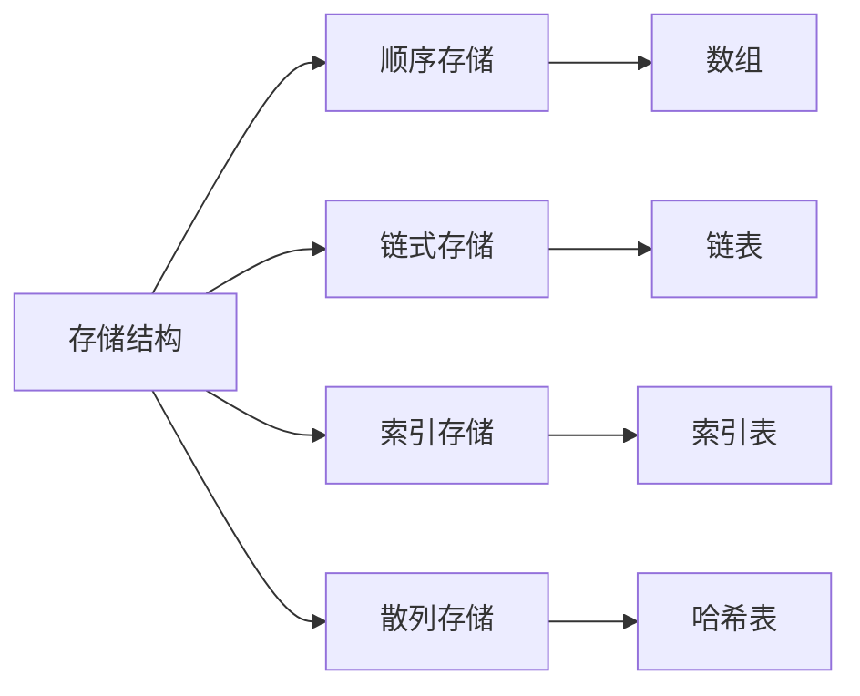
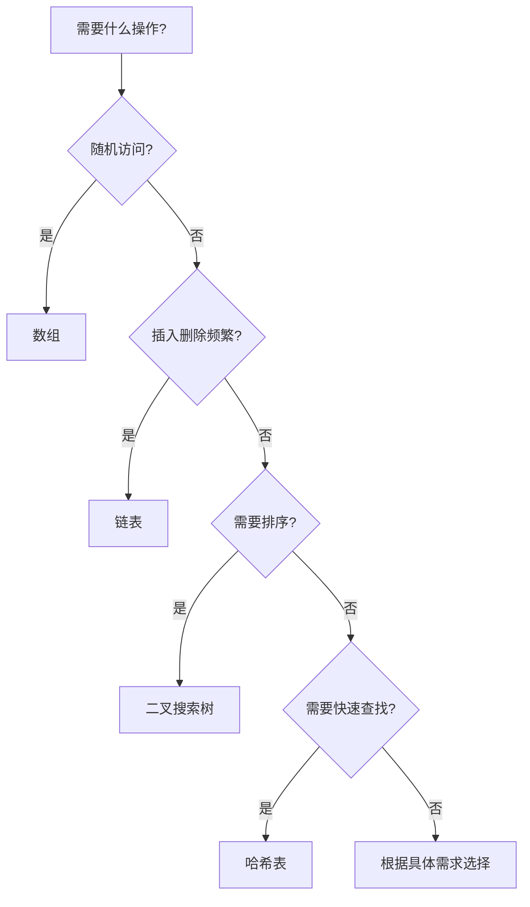
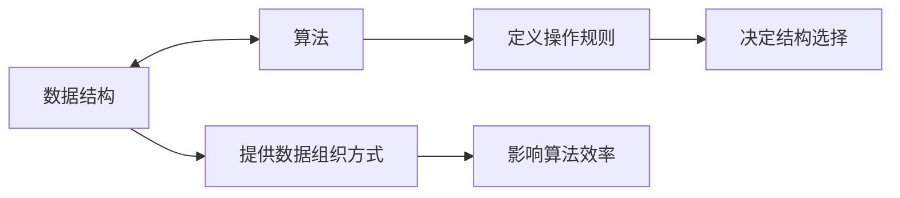

# 📚 数据结构概念总结

## 🎯 核心定义

**数据结构**是计算机存储、组织数据的方式，指相互之间存在一种或多种特定关系的数据元素的集合。

### 🔍 本质理解
数据结构 = 数据元素 + 数据关系 + 操作集合

---

## 📊 数据结构分类体系

### 🏗️ 按逻辑结构分类

| 分类 | 特点 | 典型结构 | 应用场景 |
|------|------|----------|----------|
| **线性结构** | 一对一关系 | 数组、链表、栈、队列 | 序列处理、缓存 |
| **树形结构** | 一对多关系 | 二叉树、B树、堆 | 层次管理、搜索 |
| **图状结构** | 多对多关系 | 有向图、无向图 | 网络分析、路径规划 |
| **集合结构** | 无特定关系 | 哈希表、集合 | 快速查找、去重 |

### 💾 按存储结构分类

#### 🔢 顺序存储
- **特点**：逻辑相邻的元素物理位置也相邻
- **优点**：随机访问、空间利用率高
- **缺点**：插入删除效率低、空间固定
- **代表**：数组

#### 🔗 链式存储
- **特点**：通过指针链接，逻辑相邻物理可不相邻
- **优点**：动态分配、插入删除灵活
- **缺点**：不支持随机访问、额外空间开销
- **代表**：链表

---

## 🎯 数据结构选择准则

### 📋 选择决策树

### 🎯 选择考虑因素

#### 📊 操作需求分析
| 操作类型 | 频率 | 推荐结构 | 原因 |
|----------|------|----------|------|
| **随机访问** | 高 | 数组 | O(1)时间复杂度 |
| **插入删除** | 高 | 链表 | O(1)时间复杂度 |
| **查找** | 高 | 哈希表 | O(1)平均时间复杂度 |
| **排序** | 需要 | 二叉搜索树 | 自动维护有序性 |

#### ⚡ 性能要求分析
| 性能指标 | 优先级 | 影响选择 | 示例 |
|----------|--------|----------|------|
| **时间复杂度** | 高 | 选择高效算法 | 快速排序 vs 冒泡排序 |
| **空间复杂度** | 中 | 考虑内存限制 | 数组 vs 链表 |
| **实现复杂度** | 中 | 开发效率 | 简单结构优先 |
| **维护成本** | 低 | 长期考虑 | 平衡树 vs 普通树 |

---

## 🔄 数据结构与算法关系

### 🎭 相互依存关系

### 📈 效率影响分析

#### 🕐 时间复杂度影响
- **数组**：随机访问O(1)，但插入删除O(n)
- **链表**：插入删除O(1)，但查找O(n)
- **二叉搜索树**：查找、插入、删除都是O(log n)
- **哈希表**：查找、插入、删除平均O(1)

#### 💾 空间复杂度影响
- **数组**：空间固定，利用率高
- **链表**：动态分配，有额外指针开销
- **树**：递归结构，栈空间开销
- **图**：邻接矩阵O(n²)，邻接表O(n+e)

---

## 🎯 实际应用场景

### 💼 常见应用模式

#### 🗄️ 数据库系统
- **B+树**：数据库索引，支持范围查询
- **哈希表**：快速主键查找
- **链表**：事务日志，支持顺序访问

#### 🌐 网络应用
- **队列**：消息队列，保证顺序
- **图**：路由表，路径计算
- **哈希表**：缓存系统，快速查找

#### 🎮 游戏开发
- **四叉树**：空间分割，碰撞检测
- **优先队列**：AI决策，任务调度
- **图**：地图导航，路径规划

---

## 🧠 学习策略建议

### 📚 理解层次递进

#### 🔴 认识层次
- 知道数据结构的定义
- 了解基本分类
- 识别典型应用

#### 🟡 理解层次
- 理解数据关系
- 掌握操作原理
- 分析优缺点

#### 🟢 应用层次
- 能选择合适结构
- 会实现基本操作
- 能解决实际问题

#### 🔵 创新层次
- 能设计新结构
- 会优化现有结构
- 能组合多种结构

### 🎯 学习路径建议

1. **从简单到复杂**：数组 → 链表 → 树 → 图
2. **理论与实践结合**：概念理解 + 代码实现
3. **对比学习**：相似结构的优缺点对比
4. **应用驱动**：从实际问题出发学习结构选择

---

## 🔗 相关链接

### 📖 深入学习
- [[02-数据结构分类详解|数据结构分类详解]]
- [[03-数据结构选择准则|数据结构选择准则]]
- [[04-复杂度对比表|复杂度对比表]]

### 🛠️ 实践应用
- [[02-线性世界/01-序列结构[数组]/01-数组基础|数组基础]]
- [[02-线性世界/02-链式结构[链表]/01-单链表实现|链表实现]]
- [[03-层次宇宙/01-树形基础/01-树的基本概念|树形基础]]

### 🎯 检测学习
- [[00-学习枢纽/📋-知识点检测清单|知识点检测清单]]
- [[00-学习枢纽/📊-学习进度跟踪|学习进度跟踪]]

---
*💡 数据结构是算法的基础，选择合适的数据结构是解决问题的关键！*
