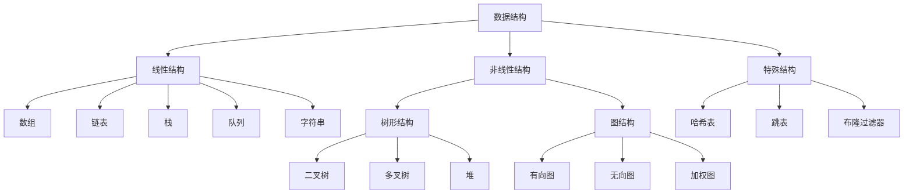
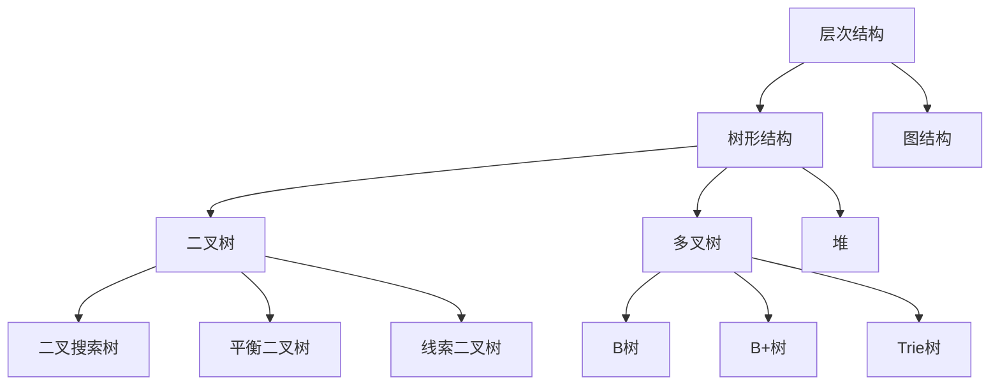

# 数据结构分类详解

## 📖 核心概念

**数据结构分类**是理解数据结构体系的基础。通过系统性的分类，我们可以更好地理解各种数据结构的特点、适用场景和相互关系。

### 🏗️ 数据结构分类体系



## 🔍 按存储方式分类

### 顺序存储结构

| 结构类型 | 特点 | 优点 | 缺点 | 适用场景 |
|----------|------|------|------|----------|
| **数组** | 连续内存 | 随机访问O(1) | 大小固定 | 频繁随机访问 |
| **栈** | 后进先出 | 实现简单 | 只能访问栈顶 | 函数调用、表达式求值 |
| **队列** | 先进先出 | 公平调度 | 只能两端操作 | 任务调度、BFS |

### 链式存储结构

| 结构类型 | 特点 | 优点 | 缺点 | 适用场景 |
|----------|------|------|------|----------|
| **单链表** | 单向链接 | 动态大小 | 只能顺序访问 | 频繁插入删除 |
| **双链表** | 双向链接 | 双向遍历 | 空间开销大 | 需要双向操作 |
| **循环链表** | 首尾相连 | 循环遍历 | 实现复杂 | 循环处理 |

## 🌳 按逻辑关系分类

### 层次结构



### 网状结构

| 图类型 | 特点 | 应用场景 | 算法 |
|--------|------|----------|------|
| **有向图** | 边有方向 | 依赖关系 | 拓扑排序 |
| **无向图** | 边无方向 | 社交网络 | 最小生成树 |
| **加权图** | 边有权重 | 路径规划 | 最短路径 |

## 💻 按操作特性分类

### 静态结构 vs 动态结构

| 特性 | 静态结构 | 动态结构 |
|------|----------|----------|
| **大小** | 固定 | 可变 |
| **内存** | 连续 | 分散 |
| **访问** | 随机O(1) | 顺序O(n) |
| **插入** | 困难 | 容易 |
| **删除** | 困难 | 容易 |

### 有序结构 vs 无序结构

| 特性 | 有序结构 | 无序结构 |
|------|----------|----------|
| **查找** | 二分O(log n) | 线性O(n) |
| **插入** | 需要排序 | 直接插入 |
| **空间** | 额外排序信息 | 节省空间 |
| **维护** | 复杂 | 简单 |

## 🎯 选择准则

### 按操作频率选择

```cpp
// 频繁查找 -> 哈希表
unordered_map<string, int> hashMap;

// 频繁插入删除 -> 链表
list<int> linkedList;

// 频繁随机访问 -> 数组
vector<int> array;

// 需要排序 -> 平衡树
set<int> balancedTree;
```

### 按数据规模选择

| 数据规模 | 推荐结构 | 原因 |
|----------|----------|------|
| **小规模(<1000)** | 数组 | 简单高效 |
| **中规模(1000-10000)** | 平衡树 | 平衡性能 |
| **大规模(>10000)** | 哈希表 | 常数时间 |

## 🔗 相关链接

- [[01-数据结构概念总结|数据结构概念]]
- [[03-数据结构选择准则|选择准则]]
- [[04-复杂度对比表|复杂度对比]]

## 💡 记忆要点

1. **线性结构**：一对一关系，顺序存储
2. **树形结构**：一对多关系，层次存储
3. **图结构**：多对多关系，网状存储
4. **选择原则**：根据操作特性和数据规模

---

*📝 学习提示：理解分类有助于快速定位合适的数据结构*
