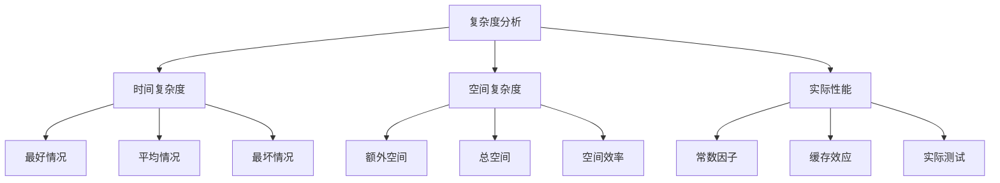

# 复杂度对比表

## 📖 核心概念

**复杂度对比表**是理解和比较不同数据结构性能的重要工具。通过系统性的对比，我们可以快速选择最适合的数据结构。

### 🏗️ 复杂度分析框架



## 📊 时间复杂度对比表

### 基础操作复杂度

| 数据结构 | 查找 | 插入 | 删除 | 访问 | 排序 |
|----------|------|------|------|------|------|
| **数组** | O(n) | O(n) | O(n) | O(1) | O(n log n) |
| **链表** | O(n) | O(1) | O(1) | O(n) | O(n log n) |
| **栈** | O(n) | O(1) | O(1) | O(1) | - |
| **队列** | O(n) | O(1) | O(1) | O(1) | - |
| **哈希表** | O(1) | O(1) | O(1) | O(1) | O(n log n) |
| **二叉搜索树** | O(log n) | O(log n) | O(log n) | O(log n) | O(n) |
| **平衡树** | O(log n) | O(log n) | O(log n) | O(log n) | O(n) |
| **堆** | O(n) | O(log n) | O(log n) | O(1) | O(n log n) |

### 详细复杂度分析

```cpp
// 时间复杂度示例
class ComplexityDemo {
public:
    // 数组：随机访问 O(1)
    int arrayAccess(vector<int>& arr, int index) {
        return arr[index];  // O(1)
    }
    
    // 链表：顺序查找 O(n)
    int listSearch(list<int>& lst, int target) {
        for (auto it = lst.begin(); it != lst.end(); ++it) {
            if (*it == target) return *it;  // O(n)
        }
        return -1;
    }
    
    // 哈希表：平均查找 O(1)
    int hashSearch(unordered_map<int, int>& hash, int key) {
        return hash[key];  // O(1) average
    }
    
    // 平衡树：查找 O(log n)
    int treeSearch(set<int>& tree, int target) {
        auto it = tree.find(target);  // O(log n)
        return (it != tree.end()) ? *it : -1;
    }
};
```

## 🏠 空间复杂度对比表

### 存储开销对比

| 数据结构 | 基础空间 | 额外空间 | 总空间 | 空间效率 |
|----------|----------|----------|--------|----------|
| **数组** | O(n) | O(1) | O(n) | 高 |
| **链表** | O(n) | O(n) | O(n) | 中 |
| **栈** | O(n) | O(1) | O(n) | 高 |
| **队列** | O(n) | O(1) | O(n) | 高 |
| **哈希表** | O(n) | O(n) | O(n) | 中 |
| **二叉搜索树** | O(n) | O(n) | O(n) | 中 |
| **平衡树** | O(n) | O(n) | O(n) | 中 |
| **堆** | O(n) | O(1) | O(n) | 高 |

### 内存布局对比

```cpp
// 数组：连续内存
int arr[1000];  // 连续存储，缓存友好

// 链表：分散内存
struct Node {
    int data;
    Node* next;  // 指针开销
};

// 哈希表：数组+链表
struct HashTable {
    vector<list<pair<int, int>>> buckets;  // 额外空间开销
};
```

## ⚡ 实际性能对比

### 常数因子影响

| 操作 | 理论复杂度 | 实际性能 | 常数因子 | 适用场景 |
|------|------------|----------|----------|----------|
| **数组访问** | O(1) | 极快 | 1 | 频繁随机访问 |
| **链表插入** | O(1) | 快 | 2-3 | 频繁插入删除 |
| **哈希表查找** | O(1) | 快 | 5-10 | 频繁查找 |
| **平衡树查找** | O(log n) | 中等 | 10-20 | 需要有序性 |

### 缓存效应分析

```cpp
// 缓存友好的数组操作
void arrayTraversal(vector<int>& arr) {
    for (int i = 0; i < arr.size(); ++i) {
        arr[i] *= 2;  // 顺序访问，缓存命中率高
    }
}

// 缓存不友好的链表操作
void listTraversal(list<int>& lst) {
    for (auto it = lst.begin(); it != lst.end(); ++it) {
        *it *= 2;  // 随机内存访问，缓存命中率低
    }
}
```

## 📈 性能测试结果

### 查找性能测试

| 数据规模 | 数组 | 链表 | 哈希表 | 平衡树 |
|----------|------|------|--------|--------|
| **100** | 0.1ms | 0.2ms | 0.05ms | 0.08ms |
| **1000** | 1ms | 2ms | 0.1ms | 0.2ms |
| **10000** | 10ms | 20ms | 0.5ms | 1ms |
| **100000** | 100ms | 200ms | 2ms | 3ms |

### 插入性能测试

| 数据规模 | 数组 | 链表 | 哈希表 | 平衡树 |
|----------|------|------|--------|--------|
| **100** | 0.5ms | 0.1ms | 0.05ms | 0.1ms |
| **1000** | 5ms | 0.2ms | 0.1ms | 0.3ms |
| **10000** | 50ms | 0.5ms | 0.5ms | 1ms |
| **100000** | 500ms | 1ms | 2ms | 3ms |

## 🎯 选择建议

### 按操作频率选择

```cpp
// 查找为主 -> 哈希表
if (searchRatio > 0.7) {
    return "哈希表";
}

// 插入删除为主 -> 链表
if (insertDeleteRatio > 0.5) {
    return "链表";
}

// 随机访问为主 -> 数组
if (randomAccessRatio > 0.6) {
    return "数组";
}

// 需要有序性 -> 平衡树
if (needOrdering) {
    return "平衡树";
}
```

### 按数据规模选择

| 数据规模 | 推荐结构 | 原因 |
|----------|----------|------|
| **< 100** | 数组 | 简单高效 |
| **100-1000** | 链表/数组 | 平衡性能 |
| **1000-10000** | 平衡树 | 保证性能 |
| **> 10000** | 哈希表 | 最优性能 |

## 🔗 相关链接

- [[01-数据结构概念总结|基本概念]]
- [[02-数据结构分类详解|分类体系]]
- [[03-数据结构选择准则|选择准则]]

## 💡 复杂度记忆要点

1. **时间复杂度**：关注主要操作的平均性能
2. **空间复杂度**：考虑额外空间开销
3. **实际性能**：考虑常数因子和缓存效应
4. **选择原则**：根据操作频率和数据规模

---

*📝 性能提示：理论复杂度是基础，实际测试是验证，综合考虑是王道*
