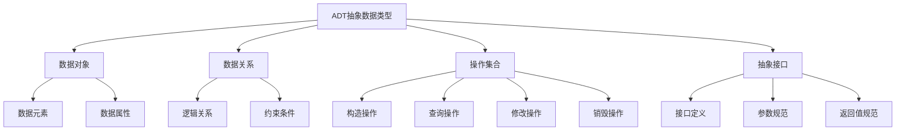
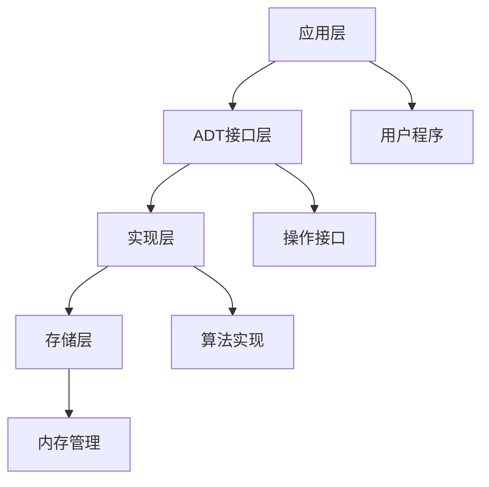

# 🎭 ADT概念与实现

## 🎯 核心定义

**抽象数据类型（ADT）**是一种数学模型，定义了数据对象、数据关系以及对这些数据对象的一组操作，而不考虑具体的实现细节。

### 🔍 本质理解
ADT = 数据对象 + 数据关系 + 操作集合 + 抽象接口



---

## 🏗️ ADT设计原则

### 📋 设计原则

| 原则 | 描述 | 重要性 | 示例 |
|------|------|--------|------|
| **封装性** | 隐藏内部实现细节 | ⭐⭐⭐⭐⭐ | 用户只需知道接口 |
| **抽象性** | 关注"做什么"而非"怎么做" | ⭐⭐⭐⭐⭐ | 定义操作语义 |
| **一致性** | 接口设计保持统一 | ⭐⭐⭐⭐ | 命名规范统一 |
| **完整性** | 提供完整的操作集合 | ⭐⭐⭐⭐ | 支持所有必要操作 |
| **安全性** | 防止非法操作 | ⭐⭐⭐⭐ | 参数验证、异常处理 |

### 🎭 抽象层次



#### 🔴 应用层
- **职责**：使用ADT解决问题
- **关注点**：业务逻辑、问题建模
- **示例**：学生管理系统使用栈实现撤销功能

#### 🟡 ADT接口层
- **职责**：定义数据结构和操作规范
- **关注点**：接口设计、语义定义
- **示例**：定义栈的push、pop、top操作

#### 🟢 实现层
- **职责**：具体实现ADT操作
- **关注点**：算法效率、代码质量
- **示例**：用数组或链表实现栈

#### 🔵 存储层
- **职责**：管理内存分配和释放
- **关注点**：内存效率、资源管理
- **示例**：动态内存分配、垃圾回收

---

## 📚 经典ADT示例

### 📚 栈（Stack）ADT

#### 🎯 定义
栈是一种后进先出（LIFO）的线性数据结构。

#### 📋 操作接口
```cpp
template<typename T>
class Stack {
public:
    // 构造操作
    Stack();                    // 创建空栈
    ~Stack();                   // 销毁栈
    
    // 查询操作
    bool isEmpty() const;       // 判断栈是否为空
    int size() const;           // 返回栈中元素个数
    T top() const;              // 返回栈顶元素
    
    // 修改操作
    void push(const T& item);   // 入栈
    void pop();                 // 出栈
    void clear();               // 清空栈
};
```

#### 🔍 操作语义
| 操作 | 前置条件 | 后置条件 | 异常情况 |
|------|----------|----------|----------|
| **push(x)** | 无 | 栈顶元素为x | 栈满时抛出异常 |
| **pop()** | 栈非空 | 移除栈顶元素 | 栈空时抛出异常 |
| **top()** | 栈非空 | 返回栈顶元素 | 栈空时抛出异常 |
| **isEmpty()** | 无 | 返回栈空状态 | 无 |

### 📚 队列（Queue）ADT

#### 🎯 定义
队列是一种先进先出（FIFO）的线性数据结构。

#### 📋 操作接口
```cpp
template<typename T>
class Queue {
public:
    // 构造操作
    Queue();                    // 创建空队列
    ~Queue();                   // 销毁队列
    
    // 查询操作
    bool isEmpty() const;       // 判断队列是否为空
    int size() const;           // 返回队列中元素个数
    T front() const;           // 返回队首元素
    T back() const;            // 返回队尾元素
    
    // 修改操作
    void enqueue(const T& item); // 入队
    void dequeue();             // 出队
    void clear();               // 清空队列
};
```

### 🌳 二叉搜索树（BST）ADT

#### 🎯 定义
二叉搜索树是一种特殊的二叉树，满足左子树所有节点值小于根节点，右子树所有节点值大于根节点。

#### 📋 操作接口
```cpp
template<typename T>
class BST {
public:
    // 构造操作
    BST();                      // 创建空树
    ~BST();                     // 销毁树
    
    // 查询操作
    bool isEmpty() const;       // 判断树是否为空
    int size() const;           // 返回树中节点个数
    bool contains(const T& item) const; // 查找元素
    T findMin() const;          // 找最小值
    T findMax() const;          // 找最大值
    
    // 修改操作
    void insert(const T& item); // 插入元素
    void remove(const T& item);  // 删除元素
    void clear();               // 清空树
    
    // 遍历操作
    void preOrder(void (*visit)(T&));    // 前序遍历
    void inOrder(void (*visit)(T&));     // 中序遍历
    void postOrder(void (*visit)(T&));   // 后序遍历
};
```

---

## 🔧 ADT实现策略

### 🎯 实现选择

#### 📊 实现方式对比

| 实现方式 | 优点 | 缺点 | 适用场景 |
|----------|------|------|----------|
| **数组实现** | 随机访问、空间效率高 | 大小固定、插入删除慢 | 大小已知、访问频繁 |
| **链表实现** | 动态大小、插入删除快 | 不支持随机访问 | 大小变化、插入删除频繁 |
| **树形实现** | 自动排序、查找高效 | 实现复杂、可能不平衡 | 需要排序、查找频繁 |
| **哈希实现** | 查找极快 | 空间开销大、无序 | 查找为主、空间充足 |

### 🔄 实现模式

#### 🏗️ 模板模式
```cpp
template<typename T>
class ADT {
private:
    // 内部数据结构
    T* data;
    int capacity;
    int size;
    
public:
    // 接口实现
    void operation(const T& item) {
        // 具体实现
    }
};
```

#### 🎭 策略模式
```cpp
template<typename T, typename Storage>
class ADT {
private:
    Storage storage;  // 存储策略
    
public:
    void operation(const T& item) {
        storage.performOperation(item);
    }
};
```

---

## 🎯 ADT设计实践

### 📋 设计步骤

#### 1️⃣ 需求分析
- **功能需求**：需要哪些操作
- **性能需求**：时间空间复杂度要求
- **使用场景**：典型应用场景
- **约束条件**：特殊限制条件

#### 2️⃣ 接口设计
- **操作命名**：清晰、一致的命名规范
- **参数设计**：合理的参数类型和顺序
- **返回值设计**：明确的返回值类型和含义
- **异常处理**：定义异常情况和处理方式

#### 3️⃣ 语义定义
- **前置条件**：操作执行前的状态要求
- **后置条件**：操作执行后的状态变化
- **不变量**：始终保持的性质
- **复杂度**：时间和空间复杂度分析

#### 4️⃣ 实现选择
- **数据结构选择**：根据操作特点选择
- **算法选择**：根据性能要求选择
- **优化策略**：考虑实际使用模式

### 🎯 设计示例：优先队列

#### 📋 需求分析
- **功能**：支持插入、删除最小元素、查看最小元素
- **性能**：插入O(log n)，删除O(log n)
- **应用**：任务调度、Dijkstra算法

#### 🎭 接口设计
```cpp
template<typename T, typename Compare = std::less<T>>
class PriorityQueue {
public:
    PriorityQueue();
    ~PriorityQueue();
    
    bool isEmpty() const;
    int size() const;
    const T& top() const;
    
    void push(const T& item);
    void pop();
    void clear();
};
```

#### 🔍 语义定义
- **push(x)**：将x插入队列，维护堆性质
- **pop()**：删除最小元素，维护堆性质
- **top()**：返回最小元素，不修改队列
- **不变量**：始终保持最小堆性质

---

## 🧠 学习策略

### 📚 理解层次

#### 🔴 认识层次
- 知道ADT的基本概念
- 了解封装和抽象的意义
- 识别常见ADT类型

#### 🟡 理解层次
- 理解ADT的设计原则
- 掌握接口设计方法
- 分析ADT的优缺点

#### 🟢 应用层次
- 能设计ADT接口
- 会选择合适的实现方式
- 能解决实际问题

#### 🔵 创新层次
- 能设计新的ADT
- 会优化现有ADT
- 能组合多个ADT

### 🎯 学习建议

1. **从简单到复杂**：栈 → 队列 → 树 → 图
2. **理论与实践结合**：接口设计 + 代码实现
3. **对比学习**：不同实现方式的优缺点
4. **应用驱动**：从实际问题出发设计ADT

---

## 🔗 相关链接

### 📖 深入学习
- [[02-接口设计原则|接口设计原则]]
- [[03-封装与抽象|封装与抽象]]
- [[04-代码示例集合|代码示例集合]]

### 🛠️ 实践应用
- [[02-线性世界/03-受限结构[栈队列]/01-栈Stack详解|栈实现]]
- [[02-线性世界/03-受限结构[栈队列]/02-队列Queue详解|队列实现]]
- [[03-层次宇宙/02-二叉树王国/02-二叉搜索树BST|BST实现]]

### 🎯 检测学习
- [[00-学习枢纽/📋-知识点检测清单|知识点检测清单]]
- [[00-学习枢纽/📊-学习进度跟踪|学习进度跟踪]]

---
*💡 ADT是面向对象设计的基础，良好的ADT设计是高质量软件的关键！*
