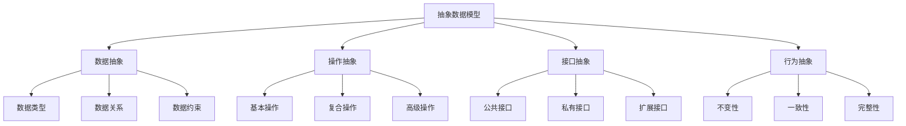

# 抽象数据模型

## 📖 核心概念

**抽象数据模型**是数据结构设计的理论基础。通过抽象数据模型，可以定义数据结构的接口和行为，而不关心具体的实现细节。

### 🏗️ 模型层次



## 🔧 数据抽象

### 数据类型抽象

```cpp
// 数据类型抽象的实现
class DataTypeAbstraction {
public:
    // 基本数据类型抽象
    class BasicDataType {
    public:
        virtual ~BasicDataType() = default;
        virtual void display() = 0;
        virtual bool equals(const BasicDataType& other) = 0;
        virtual BasicDataType* clone() = 0;
    };
    
    // 整数类型抽象
    class IntegerType : public BasicDataType {
    private:
        int value;
        
    public:
        IntegerType(int v) : value(v) {}
        
        void display() override {
            cout << "Integer: " << value << endl;
        }
        
        bool equals(const BasicDataType& other) override {
            const IntegerType* intOther = dynamic_cast<const IntegerType*>(&other);
            return intOther && this->value == intOther->value;
        }
        
        BasicDataType* clone() override {
            return new IntegerType(value);
        }
        
        int getValue() const { return value; }
        void setValue(int v) { value = v; }
    };
    
    // 字符串类型抽象
    class StringType : public BasicDataType {
    private:
        string value;
        
    public:
        StringType(const string& v) : value(v) {}
        
        void display() override {
            cout << "String: " << value << endl;
        }
        
        bool equals(const BasicDataType& other) override {
            const StringType* strOther = dynamic_cast<const StringType*>(&other);
            return strOther && this->value == strOther->value;
        }
        
        BasicDataType* clone() override {
            return new StringType(value);
        }
        
        string getValue() const { return value; }
        void setValue(const string& v) { value = v; }
    };
    
    // 复合数据类型抽象
    class CompositeDataType {
    private:
        vector<BasicDataType*> components;
        
    public:
        ~CompositeDataType() {
            for (BasicDataType* component : components) {
                delete component;
            }
        }
        
        void addComponent(BasicDataType* component) {
            components.push_back(component);
        }
        
        void display() {
            cout << "Composite Data Type:" << endl;
            for (size_t i = 0; i < components.size(); ++i) {
                cout << "Component " << i << ": ";
                components[i]->display();
            }
        }
        
        size_t getComponentCount() const {
            return components.size();
        }
        
        BasicDataType* getComponent(size_t index) {
            if (index < components.size()) {
                return components[index];
            }
            return nullptr;
        }
    };
};
```

### 数据关系抽象

```cpp
// 数据关系抽象的实现
class DataRelationshipAbstraction {
public:
    // 一对一关系
    class OneToOneRelation {
    private:
        map<int, int> relation;
        
    public:
        void addRelation(int key, int value) {
            relation[key] = value;
        }
        
        int getValue(int key) {
            auto it = relation.find(key);
            return (it != relation.end()) ? it->second : -1;
        }
        
        bool hasRelation(int key) {
            return relation.find(key) != relation.end();
        }
        
        void removeRelation(int key) {
            relation.erase(key);
        }
        
        void display() {
            cout << "One-to-One Relations:" << endl;
            for (const auto& pair : relation) {
                cout << pair.first << " -> " << pair.second << endl;
            }
        }
    };
    
    // 一对多关系
    class OneToManyRelation {
    private:
        map<int, vector<int>> relation;
        
    public:
        void addRelation(int key, int value) {
            relation[key].push_back(value);
        }
        
        vector<int> getValues(int key) {
            auto it = relation.find(key);
            return (it != relation.end()) ? it->second : vector<int>();
        }
        
        bool hasRelation(int key) {
            return relation.find(key) != relation.end();
        }
        
        void removeRelation(int key, int value) {
            auto it = relation.find(key);
            if (it != relation.end()) {
                auto& values = it->second;
                values.erase(remove(values.begin(), values.end(), value), values.end());
            }
        }
        
        void display() {
            cout << "One-to-Many Relations:" << endl;
            for (const auto& pair : relation) {
                cout << pair.first << " -> ";
                for (int value : pair.second) {
                    cout << value << " ";
                }
                cout << endl;
            }
        }
    };
    
    // 多对多关系
    class ManyToManyRelation {
    private:
        map<int, set<int>> relation;
        
    public:
        void addRelation(int key, int value) {
            relation[key].insert(value);
        }
        
        set<int> getValues(int key) {
            auto it = relation.find(key);
            return (it != relation.end()) ? it->second : set<int>();
        }
        
        bool hasRelation(int key, int value) {
            auto it = relation.find(key);
            return (it != relation.end()) && (it->second.find(value) != it->second.end());
        }
        
        void removeRelation(int key, int value) {
            auto it = relation.find(key);
            if (it != relation.end()) {
                it->second.erase(value);
            }
        }
        
        void display() {
            cout << "Many-to-Many Relations:" << endl;
            for (const auto& pair : relation) {
                cout << pair.first << " -> ";
                for (int value : pair.second) {
                    cout << value << " ";
                }
                cout << endl;
            }
        }
    };
};
```

## 🎯 操作抽象

### 基本操作抽象

```cpp
// 基本操作抽象的实现
class BasicOperationAbstraction {
public:
    // 创建操作抽象
    class CreateOperation {
    public:
        virtual ~CreateOperation() = default;
        virtual void create() = 0;
        virtual void initialize() = 0;
        virtual void reset() = 0;
    };
    
    // 访问操作抽象
    class AccessOperation {
    public:
        virtual ~AccessOperation() = default;
        virtual void insert() = 0;
        virtual void delete_() = 0;
        virtual void update() = 0;
        virtual void retrieve() = 0;
    };
    
    // 遍历操作抽象
    class TraversalOperation {
    public:
        virtual ~TraversalOperation() = default;
        virtual void traverse() = 0;
        virtual void search() = 0;
        virtual void sort() = 0;
        virtual void filter() = 0;
    };
    
    // 维护操作抽象
    class MaintenanceOperation {
    public:
        virtual ~MaintenanceOperation() = default;
        virtual void optimize() = 0;
        virtual void compact() = 0;
        virtual void validate() = 0;
        virtual void repair() = 0;
    };
};
```

### 复合操作抽象

```cpp
// 复合操作抽象的实现
class CompositeOperationAbstraction {
public:
    // 合并操作抽象
    class MergeOperation {
    public:
        virtual ~MergeOperation() = default;
        virtual void merge() = 0;
        virtual void union_() = 0;
        virtual void intersect() = 0;
        virtual void difference() = 0;
    };
    
    // 分割操作抽象
    class SplitOperation {
    public:
        virtual ~SplitOperation() = default;
        virtual void split() = 0;
        virtual void partition() = 0;
        virtual void divide() = 0;
        virtual void separate() = 0;
    };
    
    // 转换操作抽象
    class TransformOperation {
    public:
        virtual ~TransformOperation() = default;
        virtual void transform() = 0;
        virtual void convert() = 0;
        virtual void map() = 0;
        virtual void reduce() = 0;
    };
    
    // 分析操作抽象
    class AnalysisOperation {
    public:
        virtual ~AnalysisOperation() = default;
        virtual void analyze() = 0;
        virtual void statistics() = 0;
        virtual void pattern() = 0;
        virtual void correlation() = 0;
    };
};
```

## 📊 接口抽象

### 公共接口抽象

```cpp
// 公共接口抽象的实现
class PublicInterfaceAbstraction {
public:
    // 数据访问接口
    class DataAccessInterface {
    public:
        virtual ~DataAccessInterface() = default;
        virtual void insert(int value) = 0;
        virtual bool remove(int value) = 0;
        virtual bool contains(int value) = 0;
        virtual int size() = 0;
        virtual bool isEmpty() = 0;
    };
    
    // 数据遍历接口
    class DataTraversalInterface {
    public:
        virtual ~DataTraversalInterface() = default;
        virtual void traverse() = 0;
        virtual vector<int> toVector() = 0;
        virtual void display() = 0;
    };
    
    // 数据查询接口
    class DataQueryInterface {
    public:
        virtual ~DataQueryInterface() = default;
        virtual int find(int value) = 0;
        virtual vector<int> findAll(int value) = 0;
        virtual int getMin() = 0;
        virtual int getMax() = 0;
    };
    
    // 数据维护接口
    class DataMaintenanceInterface {
    public:
        virtual ~DataMaintenanceInterface() = default;
        virtual void clear() = 0;
        virtual void optimize() = 0;
        virtual bool validate() = 0;
    };
};
```

### 私有接口抽象

```cpp
// 私有接口抽象的实现
class PrivateInterfaceAbstraction {
public:
    // 内部操作接口
    class InternalOperationInterface {
    private:
        virtual void internalInsert(int value) = 0;
        virtual void internalRemove(int value) = 0;
        virtual void internalUpdate(int oldValue, int newValue) = 0;
        virtual void internalValidate() = 0;
        
    protected:
        // 子类可以访问
        void performInternalInsert(int value) {
            internalInsert(value);
        }
        
        void performInternalRemove(int value) {
            internalRemove(value);
        }
        
        void performInternalUpdate(int oldValue, int newValue) {
            internalUpdate(oldValue, newValue);
        }
        
        void performInternalValidate() {
            internalValidate();
        }
    };
    
    // 辅助操作接口
    class HelperOperationInterface {
    private:
        virtual int calculateHash(int value) = 0;
        virtual int calculateIndex(int value) = 0;
        virtual bool isValidValue(int value) = 0;
        virtual void logOperation(const string& operation) = 0;
        
    protected:
        int getHash(int value) {
            return calculateHash(value);
        }
        
        int getIndex(int value) {
            return calculateIndex(value);
        }
        
        bool checkValue(int value) {
            return isValidValue(value);
        }
        
        void log(const string& operation) {
            logOperation(operation);
        }
    };
};
```

## 🎮 行为抽象

### 不变性抽象

```cpp
// 不变性抽象的实现
class InvariantAbstraction {
public:
    // 数据不变性
    class DataInvariant {
    private:
        vector<int> data;
        int maxSize;
        
    public:
        DataInvariant(int size) : maxSize(size) {}
        
        void insert(int value) {
            if (data.size() < maxSize) {
                data.push_back(value);
            } else {
                throw runtime_error("Data invariant violated: size exceeded");
            }
        }
        
        bool remove(int value) {
            auto it = find(data.begin(), data.end(), value);
            if (it != data.end()) {
                data.erase(it);
                return true;
            }
            return false;
        }
        
        bool validateInvariant() {
            return data.size() <= maxSize;
        }
        
        void display() {
            cout << "Data: ";
            for (int value : data) {
                cout << value << " ";
            }
            cout << endl;
            cout << "Size: " << data.size() << "/" << maxSize << endl;
        }
    };
    
    // 结构不变性
    class StructureInvariant {
    private:
        map<int, int> structure;
        int maxElements;
        
    public:
        StructureInvariant(int max) : maxElements(max) {}
        
        void addElement(int key, int value) {
            if (structure.size() < maxElements) {
                structure[key] = value;
            } else {
                throw runtime_error("Structure invariant violated: max elements exceeded");
            }
        }
        
        bool removeElement(int key) {
            auto it = structure.find(key);
            if (it != structure.end()) {
                structure.erase(it);
                return true;
            }
            return false;
        }
        
        bool validateInvariant() {
            return structure.size() <= maxElements;
        }
        
        void display() {
            cout << "Structure: ";
            for (const auto& pair : structure) {
                cout << "(" << pair.first << "," << pair.second << ") ";
            }
            cout << endl;
            cout << "Elements: " << structure.size() << "/" << maxElements << endl;
        }
    };
};
```

### 一致性抽象

```cpp
// 一致性抽象的实现
class ConsistencyAbstraction {
public:
    // 数据一致性
    class DataConsistency {
    private:
        vector<int> primaryData;
        vector<int> backupData;
        
    public:
        void insert(int value) {
            primaryData.push_back(value);
            backupData.push_back(value);
        }
        
        bool remove(int value) {
            auto it1 = find(primaryData.begin(), primaryData.end(), value);
            auto it2 = find(backupData.begin(), backupData.end(), value);
            
            if (it1 != primaryData.end() && it2 != backupData.end()) {
                primaryData.erase(it1);
                backupData.erase(it2);
                return true;
            }
            return false;
        }
        
        bool checkConsistency() {
            if (primaryData.size() != backupData.size()) {
                return false;
            }
            
            for (size_t i = 0; i < primaryData.size(); ++i) {
                if (primaryData[i] != backupData[i]) {
                    return false;
                }
            }
            
            return true;
        }
        
        void repairConsistency() {
            if (!checkConsistency()) {
                backupData = primaryData;
            }
        }
        
        void display() {
            cout << "Primary Data: ";
            for (int value : primaryData) {
                cout << value << " ";
            }
            cout << endl;
            
            cout << "Backup Data: ";
            for (int value : backupData) {
                cout << value << " ";
            }
            cout << endl;
            
            cout << "Consistent: " << (checkConsistency() ? "Yes" : "No") << endl;
        }
    };
    
    // 状态一致性
    class StateConsistency {
    private:
        enum State { EMPTY, PARTIAL, FULL };
        State currentState;
        int currentSize;
        int maxSize;
        
    public:
        StateConsistency(int max) : currentState(EMPTY), currentSize(0), maxSize(max) {}
        
        void insert(int value) {
            if (currentState == FULL) {
                throw runtime_error("Cannot insert: structure is full");
            }
            
            currentSize++;
            updateState();
        }
        
        bool remove(int value) {
            if (currentState == EMPTY) {
                return false;
            }
            
            currentSize--;
            updateState();
            return true;
        }
        
        void updateState() {
            if (currentSize == 0) {
                currentState = EMPTY;
            } else if (currentSize < maxSize) {
                currentState = PARTIAL;
            } else {
                currentState = FULL;
            }
        }
        
        State getState() const {
            return currentState;
        }
        
        bool isConsistent() const {
            return (currentState == EMPTY && currentSize == 0) ||
                   (currentState == PARTIAL && currentSize > 0 && currentSize < maxSize) ||
                   (currentState == FULL && currentSize == maxSize);
        }
        
        void display() {
            cout << "Current State: ";
            switch (currentState) {
                case EMPTY: cout << "EMPTY"; break;
                case PARTIAL: cout << "PARTIAL"; break;
                case FULL: cout << "FULL"; break;
            }
            cout << endl;
            cout << "Size: " << currentSize << "/" << maxSize << endl;
            cout << "Consistent: " << (isConsistent() ? "Yes" : "No") << endl;
        }
    };
};
```

## 🔗 相关链接

- [[01-数据结构本质|数据结构本质]]
- [[03-复杂度分析|复杂度分析]]
- [[04-算法思想|算法思想]]

## 💡 抽象数据模型要点

1. **数据抽象**：定义数据的类型和关系
2. **操作抽象**：定义数据操作的行为
3. **接口抽象**：定义数据结构的接口
4. **行为抽象**：定义数据结构的约束和保证

---

*📝 模型提示：抽象数据模型是数据结构设计的核心，提供了清晰的接口和行为定义*
