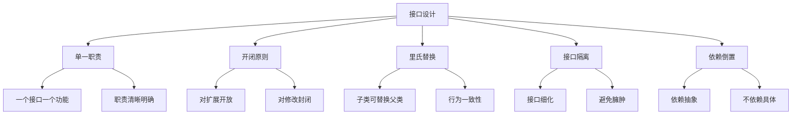

# 接口设计原则

## 📖 核心概念

**接口设计原则**是构建高质量数据结构的关键。良好的接口设计能够提升代码的可读性、可维护性和可扩展性。

### 🏗️ 接口设计框架



## 🎯 核心设计原则

### 1. 单一职责原则 (SRP)

```cpp
// 好的设计：职责单一
class Stack {
public:
    void push(int value);    // 只负责入栈
    int pop();              // 只负责出栈
    bool isEmpty();         // 只负责状态检查
};

// 不好的设计：职责混乱
class BadStack {
public:
    void push(int value);
    int pop();
    bool isEmpty();
    void sort();            // 违反单一职责
    void print();           // 违反单一职责
};
```

### 2. 开闭原则 (OCP)

```cpp
// 对扩展开放，对修改封闭
class Container {
public:
    virtual void add(int value) = 0;
    virtual void remove(int value) = 0;
    virtual bool contains(int value) = 0;
};

// 可以扩展新的容器类型
class ArrayContainer : public Container {
    // 实现数组容器
};

class ListContainer : public Container {
    // 实现链表容器
};
```

### 3. 里氏替换原则 (LSP)

```cpp
// 子类可以替换父类
class Shape {
public:
    virtual double area() = 0;
    virtual double perimeter() = 0;
};

class Rectangle : public Shape {
public:
    double area() override { return width * height; }
    double perimeter() override { return 2 * (width + height); }
};

class Circle : public Shape {
public:
    double area() override { return PI * radius * radius; }
    double perimeter() override { return 2 * PI * radius; }
};
```

## 🔧 接口设计模式

### 迭代器模式

```cpp
template<typename T>
class Iterator {
public:
    virtual bool hasNext() = 0;
    virtual T next() = 0;
    virtual void remove() = 0;
};

template<typename T>
class ListIterator : public Iterator<T> {
private:
    list<T>* data;
    typename list<T>::iterator current;
    
public:
    ListIterator(list<T>* list) : data(list), current(list->begin()) {}
    
    bool hasNext() override {
        return current != data->end();
    }
    
    T next() override {
        T value = *current;
        ++current;
        return value;
    }
    
    void remove() override {
        current = data->erase(current);
    }
};
```

### 工厂模式

```cpp
class ContainerFactory {
public:
    static unique_ptr<Container> createContainer(ContainerType type) {
        switch (type) {
            case ARRAY:
                return make_unique<ArrayContainer>();
            case LIST:
                return make_unique<ListContainer>();
            case HASH_TABLE:
                return make_unique<HashTableContainer>();
            default:
                throw invalid_argument("Unknown container type");
        }
    }
};
```

## 📋 接口设计规范

### 命名规范

| 操作类型 | 命名模式 | 示例 | 说明 |
|----------|----------|------|------|
| **查询操作** | is/has/can | isEmpty(), hasNext() | 返回布尔值 |
| **获取操作** | get/find | get(), find() | 返回数据 |
| **设置操作** | set/put/add | set(), put(), add() | 修改数据 |
| **删除操作** | remove/delete | remove(), delete() | 删除数据 |
| **转换操作** | to/convert | toString(), convert() | 类型转换 |

### 参数设计

```cpp
// 好的参数设计
class GoodInterface {
public:
    // 参数类型明确
    void insert(const T& value);
    void insert(T&& value);  // 移动语义
    
    // 参数验证
    bool remove(const T& value);
    
    // 返回值明确
    optional<T> find(const T& key) const;
    
    // 异常安全
    void clear() noexcept;
};

// 不好的参数设计
class BadInterface {
public:
    // 参数类型模糊
    void insert(void* value);
    
    // 没有参数验证
    void remove(int index);
    
    // 返回值不明确
    int find(const T& key);
    
    // 可能抛出异常
    void clear();
};
```

## 🛡️ 异常安全设计

### 异常安全级别

```cpp
class ExceptionSafeContainer {
public:
    // 基本保证：不泄露资源
    void basicGuarantee() {
        try {
            // 可能失败的操作
        } catch (...) {
            // 清理资源，保持对象有效状态
        }
    }
    
    // 强保证：要么成功，要么回滚
    void strongGuarantee() {
        auto backup = data;  // 备份
        try {
            // 可能失败的操作
        } catch (...) {
            data = backup;   // 回滚
            throw;
        }
    }
    
    // 无抛出保证：不抛出异常
    void noThrowGuarantee() noexcept {
        // 只使用不抛出异常的操作
    }
};
```

## 🔄 接口版本管理

### 版本兼容性

```cpp
// 版本1接口
class ContainerV1 {
public:
    virtual void add(int value) = 0;
    virtual void remove(int value) = 0;
};

// 版本2接口（向后兼容）
class ContainerV2 : public ContainerV1 {
public:
    virtual void add(int value) override = 0;
    virtual void remove(int value) override = 0;
    
    // 新增功能
    virtual void addAll(const vector<int>& values) = 0;
    virtual size_t size() const = 0;
};
```

## 📊 接口性能考虑

### 性能优化接口

```cpp
class PerformanceOptimizedContainer {
public:
    // 批量操作接口
    void addAll(const vector<T>& values) {
        reserve(size() + values.size());  // 预分配空间
        for (const auto& value : values) {
            add(value);
        }
    }
    
    // 移动语义接口
    void add(T&& value) {
        data.emplace_back(std::move(value));
    }
    
    // 预留空间接口
    void reserve(size_t capacity) {
        data.reserve(capacity);
    }
};
```

## 🔗 相关链接

- [[01-ADT概念与实现|ADT概念]]
- [[03-封装与抽象|封装抽象]]
- [[04-代码示例集合|代码示例]]

## 💡 设计原则总结

1. **单一职责**：一个接口一个功能
2. **开闭原则**：对扩展开放，对修改封闭
3. **里氏替换**：子类可替换父类
4. **接口隔离**：接口细化，避免臃肿
5. **依赖倒置**：依赖抽象，不依赖具体

---

*📝 设计提示：好的接口设计是软件质量的基石，遵循原则，注重实践*
