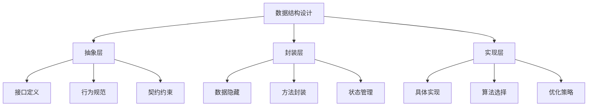

# 封装与抽象

## 📖 核心概念

**封装与抽象**是面向对象编程的核心概念，也是数据结构设计的重要原则。通过封装隐藏实现细节，通过抽象定义统一接口。

### 🏗️ 封装抽象层次



## 🔒 封装机制

### 访问控制

```cpp
class Stack {
private:
    vector<int> data;        // 私有数据
    size_t capacity;         // 私有状态
    
public:
    // 公有接口
    void push(int value);
    int pop();
    bool isEmpty() const;
    
protected:
    // 受保护接口（供派生类使用）
    void resize(size_t newCapacity);
    
private:
    // 私有辅助方法
    void validateCapacity();
};
```

### 数据封装

```cpp
class EncapsulatedList {
private:
    struct Node {
        int data;
        Node* next;
        Node(int value) : data(value), next(nullptr) {}
    };
    
    Node* head;
    size_t size;
    
public:
    EncapsulatedList() : head(nullptr), size(0) {}
    
    void add(int value) {
        Node* newNode = new Node(value);
        newNode->next = head;
        head = newNode;
        size++;
    }
    
    bool remove(int value) {
        if (!head) return false;
        
        if (head->data == value) {
            Node* temp = head;
            head = head->next;
            delete temp;
            size--;
            return true;
        }
        
        Node* current = head;
        while (current->next && current->next->data != value) {
            current = current->next;
        }
        
        if (current->next) {
            Node* temp = current->next;
            current->next = current->next->next;
            delete temp;
            size--;
            return true;
        }
        
        return false;
    }
    
    size_t getSize() const { return size; }
    bool isEmpty() const { return head == nullptr; }
};
```

## 🎭 抽象机制

### 接口抽象

```cpp
// 抽象接口
class Container {
public:
    virtual ~Container() = default;
    virtual void add(int value) = 0;
    virtual bool remove(int value) = 0;
    virtual bool contains(int value) const = 0;
    virtual size_t size() const = 0;
    virtual bool isEmpty() const = 0;
    virtual void clear() = 0;
};

// 具体实现
class ArrayContainer : public Container {
private:
    vector<int> data;
    
public:
    void add(int value) override {
        data.push_back(value);
    }
    
    bool remove(int value) override {
        auto it = find(data.begin(), data.end(), value);
        if (it != data.end()) {
            data.erase(it);
            return true;
        }
        return false;
    }
    
    bool contains(int value) const override {
        return find(data.begin(), data.end(), value) != data.end();
    }
    
    size_t size() const override {
        return data.size();
    }
    
    bool isEmpty() const override {
        return data.empty();
    }
    
    void clear() override {
        data.clear();
    }
};
```

### 模板抽象

```cpp
template<typename T>
class AbstractStack {
public:
    virtual ~AbstractStack() = default;
    virtual void push(const T& value) = 0;
    virtual T pop() = 0;
    virtual T top() const = 0;
    virtual bool isEmpty() const = 0;
    virtual size_t size() const = 0;
};

template<typename T>
class VectorStack : public AbstractStack<T> {
private:
    vector<T> data;
    
public:
    void push(const T& value) override {
        data.push_back(value);
    }
    
    T pop() override {
        if (data.empty()) {
            throw runtime_error("Stack is empty");
        }
        T value = data.back();
        data.pop_back();
        return value;
    }
    
    T top() const override {
        if (data.empty()) {
            throw runtime_error("Stack is empty");
        }
        return data.back();
    }
    
    bool isEmpty() const override {
        return data.empty();
    }
    
    size_t size() const override {
        return data.size();
    }
};
```

## 🏛️ 抽象层次设计

### 三层抽象架构

```cpp
// 第一层：基础抽象
class DataStructure {
public:
    virtual ~DataStructure() = default;
    virtual size_t size() const = 0;
    virtual bool isEmpty() const = 0;
    virtual void clear() = 0;
};

// 第二层：功能抽象
class SearchableContainer : public DataStructure {
public:
    virtual bool contains(int value) const = 0;
    virtual int find(int value) const = 0;
};

class MutableContainer : public DataStructure {
public:
    virtual void add(int value) = 0;
    virtual bool remove(int value) = 0;
};

// 第三层：具体实现
class HashTable : public SearchableContainer, public MutableContainer {
private:
    unordered_map<int, int> data;
    
public:
    size_t size() const override { return data.size(); }
    bool isEmpty() const override { return data.empty(); }
    void clear() override { data.clear(); }
    
    bool contains(int value) const override {
        return data.find(value) != data.end();
    }
    
    int find(int value) const override {
        auto it = data.find(value);
        return (it != data.end()) ? it->second : -1;
    }
    
    void add(int value) override {
        data[value] = value;
    }
    
    bool remove(int value) override {
        return data.erase(value) > 0;
    }
};
```

## 🔧 封装策略

### 信息隐藏

```cpp
class SecureContainer {
private:
    vector<int> data;
    mutable mutex mtx;  // 线程安全
    
    // 私有辅助方法
    void validateIndex(size_t index) const {
        if (index >= data.size()) {
            throw out_of_range("Index out of range");
        }
    }
    
    void ensureCapacity(size_t minCapacity) {
        if (data.capacity() < minCapacity) {
            data.reserve(minCapacity * 2);
        }
    }
    
public:
    // 公有接口
    void add(int value) {
        lock_guard<mutex> lock(mtx);
        data.push_back(value);
    }
    
    int get(size_t index) const {
        lock_guard<mutex> lock(mtx);
        validateIndex(index);
        return data[index];
    }
    
    void set(size_t index, int value) {
        lock_guard<mutex> lock(mtx);
        validateIndex(index);
        data[index] = value;
    }
    
    size_t size() const {
        lock_guard<mutex> lock(mtx);
        return data.size();
    }
};
```

### 状态封装

```cpp
class StatefulContainer {
private:
    enum class State { EMPTY, LOADING, LOADED, ERROR };
    State currentState;
    vector<int> data;
    string errorMessage;
    
    void setState(State newState) {
        currentState = newState;
    }
    
public:
    StatefulContainer() : currentState(State::EMPTY) {}
    
    void loadData(const vector<int>& newData) {
        setState(State::LOADING);
        try {
            data = newData;
            setState(State::LOADED);
        } catch (const exception& e) {
            errorMessage = e.what();
            setState(State::ERROR);
        }
    }
    
    bool isReady() const {
        return currentState == State::LOADED;
    }
    
    bool hasError() const {
        return currentState == State::ERROR;
    }
    
    string getError() const {
        return errorMessage;
    }
    
    const vector<int>& getData() const {
        if (currentState != State::LOADED) {
            throw runtime_error("Data not loaded");
        }
        return data;
    }
};
```

## 🎯 抽象设计模式

### 策略模式

```cpp
class SortingStrategy {
public:
    virtual ~SortingStrategy() = default;
    virtual void sort(vector<int>& data) = 0;
};

class QuickSortStrategy : public SortingStrategy {
public:
    void sort(vector<int>& data) override {
        sort(data.begin(), data.end());
    }
};

class MergeSortStrategy : public SortingStrategy {
public:
    void sort(vector<int>& data) override {
        mergeSort(data, 0, data.size() - 1);
    }
    
private:
    void mergeSort(vector<int>& data, int left, int right) {
        if (left < right) {
            int mid = left + (right - left) / 2;
            mergeSort(data, left, mid);
            mergeSort(data, mid + 1, right);
            merge(data, left, mid, right);
        }
    }
    
    void merge(vector<int>& data, int left, int mid, int right) {
        // 合并逻辑
    }
};

class SortableContainer {
private:
    unique_ptr<SortingStrategy> strategy;
    vector<int> data;
    
public:
    SortableContainer(unique_ptr<SortingStrategy> s) 
        : strategy(std::move(s)) {}
    
    void setStrategy(unique_ptr<SortingStrategy> s) {
        strategy = std::move(s);
    }
    
    void sort() {
        strategy->sort(data);
    }
    
    void add(int value) {
        data.push_back(value);
    }
    
    const vector<int>& getData() const {
        return data;
    }
};
```

## 🔗 相关链接

- [[01-ADT概念与实现|ADT概念]]
- [[02-接口设计原则|接口设计]]
- [[04-代码示例集合|代码示例]]

## 💡 封装抽象要点

1. **封装**：隐藏实现细节，暴露必要接口
2. **抽象**：定义统一接口，支持多种实现
3. **层次**：设计合理的抽象层次
4. **安全**：确保数据安全和状态一致

---

*📝 设计提示：好的封装抽象设计能够提升代码的可维护性和可扩展性*
