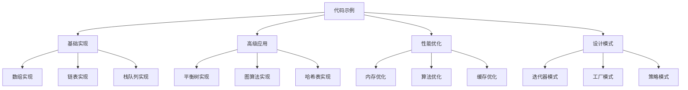

# 代码示例集合

## 📖 核心概念

**代码示例集合**是学习数据结构的重要实践资源。通过完整的代码示例，我们可以更好地理解数据结构的实现细节和设计思想。

### 🏗️ 代码示例分类



## 🔧 基础数据结构实现

### 动态数组实现

```cpp
template<typename T>
class DynamicArray {
private:
    T* data;
    size_t capacity;
    size_t size;
    
    void resize(size_t newCapacity) {
        T* newData = new T[newCapacity];
        for (size_t i = 0; i < size; ++i) {
            newData[i] = std::move(data[i]);
        }
        delete[] data;
        data = newData;
        capacity = newCapacity;
    }
    
public:
    DynamicArray() : data(nullptr), capacity(0), size(0) {}
    
    ~DynamicArray() {
        delete[] data;
    }
    
    void push_back(const T& value) {
        if (size >= capacity) {
            resize(capacity == 0 ? 1 : capacity * 2);
        }
        data[size++] = value;
    }
    
    void push_back(T&& value) {
        if (size >= capacity) {
            resize(capacity == 0 ? 1 : capacity * 2);
        }
        data[size++] = std::move(value);
    }
    
    T& operator[](size_t index) {
        return data[index];
    }
    
    const T& operator[](size_t index) const {
        return data[index];
    }
    
    size_t getSize() const { return size; }
    size_t getCapacity() const { return capacity; }
    bool isEmpty() const { return size == 0; }
    
    void clear() {
        size = 0;
    }
};
```

### 单链表实现

```cpp
template<typename T>
class LinkedList {
private:
    struct Node {
        T data;
        Node* next;
        Node(const T& value) : data(value), next(nullptr) {}
    };
    
    Node* head;
    size_t size;
    
public:
    LinkedList() : head(nullptr), size(0) {}
    
    ~LinkedList() {
        clear();
    }
    
    void push_front(const T& value) {
        Node* newNode = new Node(value);
        newNode->next = head;
        head = newNode;
        size++;
    }
    
    void push_back(const T& value) {
        Node* newNode = new Node(value);
        if (!head) {
            head = newNode;
        } else {
            Node* current = head;
            while (current->next) {
                current = current->next;
            }
            current->next = newNode;
        }
        size++;
    }
    
    bool remove(const T& value) {
        if (!head) return false;
        
        if (head->data == value) {
            Node* temp = head;
            head = head->next;
            delete temp;
            size--;
            return true;
        }
        
        Node* current = head;
        while (current->next && current->next->data != value) {
            current = current->next;
        }
        
        if (current->next) {
            Node* temp = current->next;
            current->next = current->next->next;
            delete temp;
            size--;
            return true;
        }
        
        return false;
    }
    
    bool contains(const T& value) const {
        Node* current = head;
        while (current) {
            if (current->data == value) {
                return true;
            }
            current = current->next;
        }
        return false;
    }
    
    size_t getSize() const { return size; }
    bool isEmpty() const { return head == nullptr; }
    
    void clear() {
        while (head) {
            Node* temp = head;
            head = head->next;
            delete temp;
        }
        size = 0;
    }
};
```

### 栈实现

```cpp
template<typename T>
class Stack {
private:
    vector<T> data;
    
public:
    void push(const T& value) {
        data.push_back(value);
    }
    
    void push(T&& value) {
        data.push_back(std::move(value));
    }
    
    T pop() {
        if (data.empty()) {
            throw runtime_error("Stack is empty");
        }
        T value = data.back();
        data.pop_back();
        return value;
    }
    
    T& top() {
        if (data.empty()) {
            throw runtime_error("Stack is empty");
        }
        return data.back();
    }
    
    const T& top() const {
        if (data.empty()) {
            throw runtime_error("Stack is empty");
        }
        return data.back();
    }
    
    bool isEmpty() const {
        return data.empty();
    }
    
    size_t size() const {
        return data.size();
    }
    
    void clear() {
        data.clear();
    }
};
```

## 🌳 高级数据结构实现

### 二叉搜索树实现

```cpp
template<typename T>
class BinarySearchTree {
private:
    struct Node {
        T data;
        Node* left;
        Node* right;
        Node(const T& value) : data(value), left(nullptr), right(nullptr) {}
    };
    
    Node* root;
    
    Node* insert(Node* node, const T& value) {
        if (!node) {
            return new Node(value);
        }
        
        if (value < node->data) {
            node->left = insert(node->left, value);
        } else if (value > node->data) {
            node->right = insert(node->right, value);
        }
        
        return node;
    }
    
    Node* findMin(Node* node) {
        while (node->left) {
            node = node->left;
        }
        return node;
    }
    
    Node* remove(Node* node, const T& value) {
        if (!node) return nullptr;
        
        if (value < node->data) {
            node->left = remove(node->left, value);
        } else if (value > node->data) {
            node->right = remove(node->right, value);
        } else {
            if (!node->left) {
                Node* temp = node->right;
                delete node;
                return temp;
            } else if (!node->right) {
                Node* temp = node->left;
                delete node;
                return temp;
            }
            
            Node* temp = findMin(node->right);
            node->data = temp->data;
            node->right = remove(node->right, temp->data);
        }
        
        return node;
    }
    
    bool contains(Node* node, const T& value) const {
        if (!node) return false;
        
        if (value == node->data) return true;
        if (value < node->data) return contains(node->left, value);
        return contains(node->right, value);
    }
    
    void inorder(Node* node, vector<T>& result) const {
        if (node) {
            inorder(node->left, result);
            result.push_back(node->data);
            inorder(node->right, result);
        }
    }
    
    void clear(Node* node) {
        if (node) {
            clear(node->left);
            clear(node->right);
            delete node;
        }
    }
    
public:
    BinarySearchTree() : root(nullptr) {}
    
    ~BinarySearchTree() {
        clear(root);
    }
    
    void insert(const T& value) {
        root = insert(root, value);
    }
    
    bool remove(const T& value) {
        if (!contains(value)) return false;
        root = remove(root, value);
        return true;
    }
    
    bool contains(const T& value) const {
        return contains(root, value);
    }
    
    vector<T> inorderTraversal() const {
        vector<T> result;
        inorder(root, result);
        return result;
    }
    
    bool isEmpty() const {
        return root == nullptr;
    }
    
    void clear() {
        clear(root);
        root = nullptr;
    }
};
```

### 哈希表实现

```cpp
template<typename K, typename V>
class HashTable {
private:
    struct HashNode {
        K key;
        V value;
        HashNode* next;
        HashNode(const K& k, const V& v) : key(k), value(v), next(nullptr) {}
    };
    
    vector<HashNode*> buckets;
    size_t bucketCount;
    size_t size;
    
    size_t hash(const K& key) const {
        return std::hash<K>{}(key) % bucketCount;
    }
    
    void resize() {
        size_t oldBucketCount = bucketCount;
        bucketCount *= 2;
        vector<HashNode*> newBuckets(bucketCount, nullptr);
        
        for (size_t i = 0; i < oldBucketCount; ++i) {
            HashNode* node = buckets[i];
            while (node) {
                HashNode* next = node->next;
                size_t newIndex = hash(node->key);
                node->next = newBuckets[newIndex];
                newBuckets[newIndex] = node;
                node = next;
            }
        }
        
        buckets = std::move(newBuckets);
    }
    
public:
    HashTable(size_t initialCapacity = 16) 
        : bucketCount(initialCapacity), size(0) {
        buckets.resize(bucketCount, nullptr);
    }
    
    ~HashTable() {
        clear();
    }
    
    void put(const K& key, const V& value) {
        if (size >= bucketCount * 0.75) {
            resize();
        }
        
        size_t index = hash(key);
        HashNode* node = buckets[index];
        
        while (node) {
            if (node->key == key) {
                node->value = value;
                return;
            }
            node = node->next;
        }
        
        HashNode* newNode = new HashNode(key, value);
        newNode->next = buckets[index];
        buckets[index] = newNode;
        size++;
    }
    
    bool get(const K& key, V& value) const {
        size_t index = hash(key);
        HashNode* node = buckets[index];
        
        while (node) {
            if (node->key == key) {
                value = node->value;
                return true;
            }
            node = node->next;
        }
        
        return false;
    }
    
    bool remove(const K& key) {
        size_t index = hash(key);
        HashNode* node = buckets[index];
        HashNode* prev = nullptr;
        
        while (node) {
            if (node->key == key) {
                if (prev) {
                    prev->next = node->next;
                } else {
                    buckets[index] = node->next;
                }
                delete node;
                size--;
                return true;
            }
            prev = node;
            node = node->next;
        }
        
        return false;
    }
    
    bool contains(const K& key) const {
        size_t index = hash(key);
        HashNode* node = buckets[index];
        
        while (node) {
            if (node->key == key) {
                return true;
            }
            node = node->next;
        }
        
        return false;
    }
    
    size_t getSize() const { return size; }
    bool isEmpty() const { return size == 0; }
    
    void clear() {
        for (size_t i = 0; i < bucketCount; ++i) {
            HashNode* node = buckets[i];
            while (node) {
                HashNode* next = node->next;
                delete node;
                node = next;
            }
            buckets[i] = nullptr;
        }
        size = 0;
    }
};
```

## 🎯 设计模式应用

### 迭代器模式

```cpp
template<typename T>
class Iterator {
public:
    virtual ~Iterator() = default;
    virtual bool hasNext() = 0;
    virtual T next() = 0;
    virtual void remove() = 0;
};

template<typename T>
class ListIterator : public Iterator<T> {
private:
    list<T>* data;
    typename list<T>::iterator current;
    
public:
    ListIterator(list<T>* list) : data(list), current(list->begin()) {}
    
    bool hasNext() override {
        return current != data->end();
    }
    
    T next() override {
        T value = *current;
        ++current;
        return value;
    }
    
    void remove() override {
        current = data->erase(current);
    }
};

template<typename T>
class IterableList {
private:
    list<T> data;
    
public:
    void add(const T& value) {
        data.push_back(value);
    }
    
    Iterator<T>* createIterator() {
        return new ListIterator<T>(&data);
    }
    
    size_t size() const {
        return data.size();
    }
};
```

## 🔗 相关链接

- [[01-ADT概念与实现|ADT概念]]
- [[02-接口设计原则|接口设计]]
- [[03-封装与抽象|封装抽象]]

## 💡 代码实现要点

1. **内存管理**：正确使用new/delete，避免内存泄漏
2. **异常安全**：处理边界情况，提供异常安全保证
3. **性能优化**：合理使用移动语义，减少不必要的拷贝
4. **代码复用**：使用模板和继承提高代码复用性

---

*📝 实践提示：通过完整的代码示例学习数据结构实现，注重细节和最佳实践*
