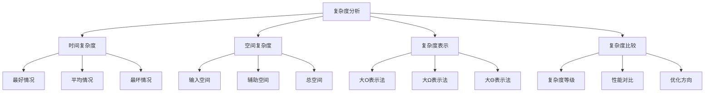

# 复杂度分析

## 📖 核心概念

**复杂度分析**是评估算法和数据结构性能的重要工具。通过复杂度分析，可以预测算法在不同规模数据下的表现，为算法选择提供科学依据。

### 🏗️ 复杂度类型



## 🔧 时间复杂度分析

### 基本复杂度

```cpp
// 时间复杂度分析示例
class TimeComplexityAnalysis {
public:
    // O(1) - 常数时间
    static int constantTime(int* arr, int index) {
        return arr[index];  // 直接访问，时间复杂度O(1)
    }
    
    // O(log n) - 对数时间
    static int binarySearch(const vector<int>& arr, int target) {
        int left = 0, right = arr.size() - 1;
        
        while (left <= right) {
            int mid = left + (right - left) / 2;
            
            if (arr[mid] == target) {
                return mid;
            } else if (arr[mid] < target) {
                left = mid + 1;
            } else {
                right = mid - 1;
            }
        }
        
        return -1;  // 每次循环减少一半搜索空间，时间复杂度O(log n)
    }
    
    // O(n) - 线性时间
    static int linearSearch(const vector<int>& arr, int target) {
        for (int i = 0; i < arr.size(); ++i) {
            if (arr[i] == target) {
                return i;
            }
        }
        return -1;  // 最多遍历整个数组，时间复杂度O(n)
    }
    
    // O(n log n) - 线性对数时间
    static void mergeSort(vector<int>& arr, int left, int right) {
        if (left < right) {
            int mid = left + (right - left) / 2;
            mergeSort(arr, left, mid);      // T(n/2)
            mergeSort(arr, mid + 1, right); // T(n/2)
            merge(arr, left, mid, right);   // O(n)
        }
        // 总时间复杂度: T(n) = 2T(n/2) + O(n) = O(n log n)
    }
    
    // O(n²) - 平方时间
    static void bubbleSort(vector<int>& arr) {
        int n = arr.size();
        for (int i = 0; i < n - 1; ++i) {
            for (int j = 0; j < n - i - 1; ++j) {
                if (arr[j] > arr[j + 1]) {
                    swap(arr[j], arr[j + 1]);
                }
            }
        }
        // 嵌套循环，时间复杂度O(n²)
    }
    
    // O(2^n) - 指数时间
    static int fibonacci(int n) {
        if (n <= 1) {
            return n;
        }
        return fibonacci(n - 1) + fibonacci(n - 2);
        // 递归树，时间复杂度O(2^n)
    }
    
    // O(n!) - 阶乘时间
    static void permute(vector<int>& arr, int start, int end) {
        if (start == end) {
            // 处理排列
            return;
        }
        
        for (int i = start; i <= end; ++i) {
            swap(arr[start], arr[i]);
            permute(arr, start + 1, end);
            swap(arr[start], arr[i]);
        }
        // 生成所有排列，时间复杂度O(n!)
    }
    
private:
    static void merge(vector<int>& arr, int left, int mid, int right) {
        vector<int> temp(right - left + 1);
        int i = left, j = mid + 1, k = 0;
        
        while (i <= mid && j <= right) {
            if (arr[i] <= arr[j]) {
                temp[k++] = arr[i++];
            } else {
                temp[k++] = arr[j++];
            }
        }
        
        while (i <= mid) {
            temp[k++] = arr[i++];
        }
        
        while (j <= right) {
            temp[k++] = arr[j++];
        }
        
        for (int i = 0; i < temp.size(); ++i) {
            arr[left + i] = temp[i];
        }
    }
};
```

### 复杂度计算

```cpp
// 复杂度计算方法
class ComplexityCalculation {
public:
    // 计算循环复杂度
    static int calculateLoopComplexity(int n) {
        int count = 0;
        
        // 单层循环 O(n)
        for (int i = 0; i < n; ++i) {
            count++;
        }
        
        // 嵌套循环 O(n²)
        for (int i = 0; i < n; ++i) {
            for (int j = 0; j < n; ++j) {
                count++;
            }
        }
        
        // 三层循环 O(n³)
        for (int i = 0; i < n; ++i) {
            for (int j = 0; j < n; ++j) {
                for (int k = 0; k < n; ++k) {
                    count++;
                }
            }
        }
        
        return count;
    }
    
    // 计算递归复杂度
    static int calculateRecursiveComplexity(int n) {
        if (n <= 1) {
            return 1;
        }
        
        // T(n) = 2T(n/2) + O(1)
        return calculateRecursiveComplexity(n / 2) + 
               calculateRecursiveComplexity(n / 2) + 1;
    }
    
    // 计算分治复杂度
    static int calculateDivideConquerComplexity(int n) {
        if (n <= 1) {
            return 1;
        }
        
        // T(n) = 2T(n/2) + O(n)
        int left = calculateDivideConquerComplexity(n / 2);
        int right = calculateDivideConquerComplexity(n / 2);
        int merge = n;  // O(n)的合并操作
        
        return left + right + merge;
    }
    
    // 复杂度测试
    static void testComplexity() {
        vector<int> sizes = {10, 100, 1000, 10000};
        
        for (int n : sizes) {
            cout << "Size: " << n << endl;
            
            // 测试线性复杂度
            auto start = chrono::high_resolution_clock::now();
            int linearResult = calculateLoopComplexity(n);
            auto end = chrono::high_resolution_clock::now();
            auto duration = chrono::duration_cast<chrono::microseconds>(end - start);
            cout << "Linear complexity: " << duration.count() << " microseconds" << endl;
            
            // 测试平方复杂度
            start = chrono::high_resolution_clock::now();
            int quadraticResult = calculateLoopComplexity(n);
            end = chrono::high_resolution_clock::now();
            duration = chrono::duration_cast<chrono::microseconds>(end - start);
            cout << "Quadratic complexity: " << duration.count() << " microseconds" << endl;
            
            cout << endl;
        }
    }
};
```

## 🎯 空间复杂度分析

### 基本空间复杂度

```cpp
// 空间复杂度分析示例
class SpaceComplexityAnalysis {
public:
    // O(1) - 常数空间
    static int constantSpace(int a, int b) {
        int result = a + b;  // 只使用常数个变量
        return result;
    }
    
    // O(n) - 线性空间
    static vector<int> linearSpace(const vector<int>& input) {
        vector<int> result(input.size());  // 创建与输入相同大小的数组
        
        for (size_t i = 0; i < input.size(); ++i) {
            result[i] = input[i] * 2;
        }
        
        return result;
    }
    
    // O(n²) - 平方空间
    static vector<vector<int>> squareSpace(int n) {
        vector<vector<int>> result(n, vector<int>(n));  // n×n的二维数组
        
        for (int i = 0; i < n; ++i) {
            for (int j = 0; j < n; ++j) {
                result[i][j] = i * j;
            }
        }
        
        return result;
    }
    
    // O(log n) - 对数空间
    static int recursiveSpace(int n) {
        if (n <= 1) {
            return 1;
        }
        
        // 递归调用栈深度为log n
        return recursiveSpace(n / 2) + recursiveSpace(n / 2);
    }
    
    // O(n) - 递归空间
    static int linearRecursiveSpace(int n) {
        if (n <= 1) {
            return 1;
        }
        
        // 递归调用栈深度为n
        return linearRecursiveSpace(n - 1) + 1;
    }
    
    // 空间优化示例
    static void spaceOptimization() {
        // 原地算法 - O(1)额外空间
        vector<int> arr = {1, 2, 3, 4, 5};
        
        // 原地反转
        int left = 0, right = arr.size() - 1;
        while (left < right) {
            swap(arr[left], arr[right]);
            left++;
            right--;
        }
        
        // 原地排序 - O(1)额外空间
        sort(arr.begin(), arr.end());
        
        cout << "Space-optimized array: ";
        for (int value : arr) {
            cout << value << " ";
        }
        cout << endl;
    }
    
    // 内存使用分析
    static void analyzeMemoryUsage() {
        vector<int> sizes = {1000, 10000, 100000};
        
        for (int size : sizes) {
            // 测试线性空间
            vector<int> linearArray(size);
            cout << "Linear array size " << size << ": " 
                 << linearArray.size() * sizeof(int) << " bytes" << endl;
            
            // 测试平方空间
            vector<vector<int>> squareArray(size, vector<int>(size));
            cout << "Square array size " << size << ": " 
                 << squareArray.size() * squareArray[0].size() * sizeof(int) << " bytes" << endl;
            
            cout << endl;
        }
    }
};
```

### 空间复杂度优化

```cpp
// 空间复杂度优化
class SpaceOptimization {
public:
    // 压缩存储
    static vector<int> compressArray(const vector<int>& arr) {
        vector<int> compressed;
        int count = 1;
        
        for (int i = 1; i < arr.size(); ++i) {
            if (arr[i] == arr[i-1]) {
                count++;
            } else {
                compressed.push_back(arr[i-1]);
                compressed.push_back(count);
                count = 1;
            }
        }
        
        compressed.push_back(arr.back());
        compressed.push_back(count);
        
        return compressed;
    }
    
    // 稀疏矩阵
    static map<pair<int, int>, int> sparseMatrix(const vector<vector<int>>& matrix) {
        map<pair<int, int>, int> sparse;
        
        for (int i = 0; i < matrix.size(); ++i) {
            for (int j = 0; j < matrix[i].size(); ++j) {
                if (matrix[i][j] != 0) {
                    sparse[{i, j}] = matrix[i][j];
                }
            }
        }
        
        return sparse;
    }
    
    // 位图压缩
    static vector<int> bitmapCompression(const vector<bool>& bits) {
        vector<int> compressed;
        int current = 0;
        int bitCount = 0;
        
        for (bool bit : bits) {
            if (bit) {
                current |= (1 << bitCount);
            }
            
            bitCount++;
            if (bitCount == 32) {
                compressed.push_back(current);
                current = 0;
                bitCount = 0;
            }
        }
        
        if (bitCount > 0) {
            compressed.push_back(current);
        }
        
        return compressed;
    }
    
    // 字符串压缩
    static string compressString(const string& str) {
        if (str.empty()) return "";
        
        string compressed;
        int count = 1;
        
        for (int i = 1; i < str.length(); ++i) {
            if (str[i] == str[i-1]) {
                count++;
            } else {
                compressed += str[i-1] + to_string(count);
                count = 1;
            }
        }
        
        compressed += str.back() + to_string(count);
        
        return compressed;
    }
};
```

## 📊 复杂度表示法

### 大O表示法

```cpp
// 大O表示法分析
class BigONotation {
public:
    // O(1) - 常数时间
    static int constantTime(int* arr, int index) {
        return arr[index];
    }
    
    // O(log n) - 对数时间
    static int logarithmicTime(int n) {
        int count = 0;
        while (n > 1) {
            n /= 2;
            count++;
        }
        return count;
    }
    
    // O(n) - 线性时间
    static int linearTime(int n) {
        int sum = 0;
        for (int i = 0; i < n; ++i) {
            sum += i;
        }
        return sum;
    }
    
    // O(n log n) - 线性对数时间
    static int linearLogarithmicTime(int n) {
        int count = 0;
        for (int i = 0; i < n; ++i) {
            int j = n;
            while (j > 1) {
                j /= 2;
                count++;
            }
        }
        return count;
    }
    
    // O(n²) - 平方时间
    static int quadraticTime(int n) {
        int count = 0;
        for (int i = 0; i < n; ++i) {
            for (int j = 0; j < n; ++j) {
                count++;
            }
        }
        return count;
    }
    
    // O(2^n) - 指数时间
    static int exponentialTime(int n) {
        if (n <= 1) {
            return 1;
        }
        return exponentialTime(n - 1) + exponentialTime(n - 1);
    }
    
    // 复杂度比较
    static void compareComplexities() {
        vector<int> sizes = {10, 100, 1000};
        
        for (int n : sizes) {
            cout << "Size: " << n << endl;
            
            cout << "O(1): " << constantTime(nullptr, 0) << endl;
            cout << "O(log n): " << logarithmicTime(n) << endl;
            cout << "O(n): " << linearTime(n) << endl;
            cout << "O(n log n): " << linearLogarithmicTime(n) << endl;
            cout << "O(n²): " << quadraticTime(n) << endl;
            
            if (n <= 20) {
                cout << "O(2^n): " << exponentialTime(n) << endl;
            }
            
            cout << endl;
        }
    }
};
```

### 复杂度等级

```cpp
// 复杂度等级分析
class ComplexityLevels {
public:
    // 复杂度等级定义
    enum ComplexityLevel {
        CONSTANT,      // O(1)
        LOGARITHMIC,   // O(log n)
        LINEAR,        // O(n)
        LINEAR_LOG,    // O(n log n)
        QUADRATIC,     // O(n²)
        CUBIC,         // O(n³)
        EXPONENTIAL,   // O(2^n)
        FACTORIAL      // O(n!)
    };
    
    // 获取复杂度等级
    static ComplexityLevel getComplexityLevel(int n, int operations) {
        if (operations <= 1) return CONSTANT;
        if (operations <= log2(n)) return LOGARITHMIC;
        if (operations <= n) return LINEAR;
        if (operations <= n * log2(n)) return LINEAR_LOG;
        if (operations <= n * n) return QUADRATIC;
        if (operations <= n * n * n) return CUBIC;
        if (operations <= pow(2, n)) return EXPONENTIAL;
        return FACTORIAL;
    }
    
    // 复杂度等级名称
    static string getComplexityName(ComplexityLevel level) {
        switch (level) {
            case CONSTANT: return "O(1) - Constant";
            case LOGARITHMIC: return "O(log n) - Logarithmic";
            case LINEAR: return "O(n) - Linear";
            case LINEAR_LOG: return "O(n log n) - Linear Logarithmic";
            case QUADRATIC: return "O(n²) - Quadratic";
            case CUBIC: return "O(n³) - Cubic";
            case EXPONENTIAL: return "O(2^n) - Exponential";
            case FACTORIAL: return "O(n!) - Factorial";
            default: return "Unknown";
        }
    }
    
    // 性能评估
    static void evaluatePerformance() {
        vector<int> sizes = {10, 100, 1000, 10000};
        
        for (int n : sizes) {
            cout << "Size: " << n << endl;
            
            // 评估不同复杂度等级的性能
            for (int level = 0; level <= 7; ++level) {
                ComplexityLevel compLevel = static_cast<ComplexityLevel>(level);
                string name = getComplexityName(compLevel);
                
                cout << name << ": ";
                
                // 简化的性能评估
                if (level == 0) {
                    cout << "Excellent" << endl;
                } else if (level <= 2) {
                    cout << "Good" << endl;
                } else if (level <= 4) {
                    cout << "Acceptable" << endl;
                } else if (level <= 6) {
                    cout << "Poor" << endl;
                } else {
                    cout << "Unacceptable" << endl;
                }
            }
            
            cout << endl;
        }
    }
};
```

## 🎮 实际应用

### 1. 算法选择

```cpp
// 基于复杂度的算法选择
class AlgorithmSelection {
public:
    // 根据数据规模选择排序算法
    static void selectSortingAlgorithm(int n) {
        cout << "Data size: " << n << endl;
        
        if (n <= 10) {
            cout << "Recommended: Insertion Sort O(n²)" << endl;
        } else if (n <= 100) {
            cout << "Recommended: Quick Sort O(n log n)" << endl;
        } else if (n <= 1000) {
            cout << "Recommended: Merge Sort O(n log n)" << endl;
        } else {
            cout << "Recommended: Heap Sort O(n log n)" << endl;
        }
    }
    
    // 根据查询频率选择搜索算法
    static void selectSearchAlgorithm(int n, int queries) {
        cout << "Data size: " << n << ", Queries: " << queries << endl;
        
        if (queries <= 1) {
            cout << "Recommended: Linear Search O(n)" << endl;
        } else if (queries <= log2(n)) {
            cout << "Recommended: Binary Search O(log n)" << endl;
        } else {
            cout << "Recommended: Hash Table O(1)" << endl;
        }
    }
    
    // 根据内存限制选择数据结构
    static void selectDataStructure(int n, int memoryLimit) {
        cout << "Data size: " << n << ", Memory limit: " << memoryLimit << endl;
        
        int arrayMemory = n * sizeof(int);
        int treeMemory = n * sizeof(int) * 2;  // 节点 + 指针
        int hashMemory = n * sizeof(int) * 1.5;  // 负载因子
        
        if (arrayMemory <= memoryLimit) {
            cout << "Recommended: Array" << endl;
        } else if (treeMemory <= memoryLimit) {
            cout << "Recommended: Binary Tree" << endl;
        } else if (hashMemory <= memoryLimit) {
            cout << "Recommended: Hash Table" << endl;
        } else {
            cout << "Recommended: External Storage" << endl;
        }
    }
};
```

### 2. 性能优化

```cpp
// 基于复杂度的性能优化
class PerformanceOptimization {
public:
    // 时间复杂度优化
    static void optimizeTimeComplexity() {
        vector<int> arr = {1, 2, 3, 4, 5, 6, 7, 8, 9, 10};
        
        // 原始算法 O(n²)
        cout << "Original algorithm O(n²):" << endl;
        for (int i = 0; i < arr.size(); ++i) {
            for (int j = 0; j < arr.size(); ++j) {
                if (arr[i] + arr[j] == 10) {
                    cout << "Pair: " << arr[i] << ", " << arr[j] << endl;
                }
            }
        }
        
        // 优化算法 O(n)
        cout << "Optimized algorithm O(n):" << endl;
        unordered_set<int> seen;
        for (int value : arr) {
            int complement = 10 - value;
            if (seen.find(complement) != seen.end()) {
                cout << "Pair: " << value << ", " << complement << endl;
            }
            seen.insert(value);
        }
    }
    
    // 空间复杂度优化
    static void optimizeSpaceComplexity() {
        vector<int> arr = {1, 2, 3, 4, 5};
        
        // 原始算法 O(n)额外空间
        cout << "Original algorithm O(n) space:" << endl;
        vector<int> result(arr.size());
        for (size_t i = 0; i < arr.size(); ++i) {
            result[i] = arr[i] * 2;
        }
        
        // 优化算法 O(1)额外空间
        cout << "Optimized algorithm O(1) space:" << endl;
        for (int& value : arr) {
            value *= 2;
        }
        
        cout << "Result: ";
        for (int value : arr) {
            cout << value << " ";
        }
        cout << endl;
    }
    
    // 综合优化
    static void comprehensiveOptimization() {
        vector<int> arr = {5, 2, 8, 1, 9, 3, 7, 4, 6};
        
        cout << "Original array: ";
        for (int value : arr) {
            cout << value << " ";
        }
        cout << endl;
        
        // 原地排序 O(1)空间
        sort(arr.begin(), arr.end());
        
        cout << "Sorted array: ";
        for (int value : arr) {
            cout << value << " ";
        }
        cout << endl;
        
        // 二分搜索 O(log n)时间
        int target = 7;
        int result = binary_search(arr.begin(), arr.end(), target);
        cout << "Search result for " << target << ": " 
             << (result ? "Found" : "Not found") << endl;
    }
    
private:
    static int binary_search(vector<int>::iterator begin, vector<int>::iterator end, int target) {
        auto it = lower_bound(begin, end, target);
        return (it != end && *it == target) ? 1 : 0;
    }
};
```

## 🔗 相关链接

- [[01-数据结构本质|数据结构本质]]
- [[02-抽象数据模型|抽象数据模型]]
- [[04-算法思想|算法思想]]

## 💡 复杂度分析要点

1. **时间复杂度**：分析算法执行时间随输入规模的变化
2. **空间复杂度**：分析算法内存使用随输入规模的变化
3. **复杂度表示**：使用大O、大Ω、大Θ表示法
4. **性能优化**：基于复杂度分析进行算法优化

---

*📝 分析提示：复杂度分析是算法设计的基础，有助于选择最优算法和数据结构*
