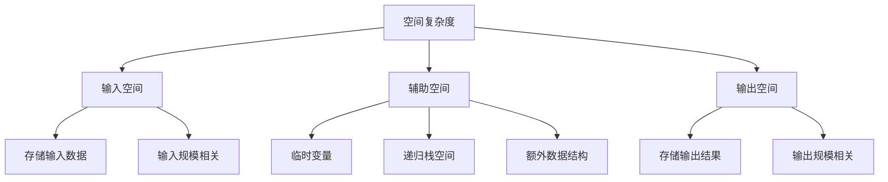

# 空间复杂度详解

## 📖 核心概念

**空间复杂度**是算法分析的重要组成部分，用于衡量算法在执行过程中所需的内存空间。理解空间复杂度有助于我们选择合适的数据结构和算法。

### 🏗️ 空间复杂度分析框架



## 🔍 空间复杂度分类

### 按空间使用方式分类

| 空间类型 | 描述 | 示例 | 复杂度 |
|----------|------|------|--------|
| **输入空间** | 存储输入数据 | 数组、链表 | O(n) |
| **辅助空间** | 算法执行所需额外空间 | 临时变量、递归栈 | O(1) - O(n) |
| **输出空间** | 存储输出结果 | 结果数组 | O(n) |

### 常见空间复杂度

```cpp
// O(1) - 常数空间
int sum(int a, int b) {
    return a + b;  // 只使用固定数量的变量
}

// O(n) - 线性空间
vector<int> copyArray(const vector<int>& arr) {
    vector<int> result(arr.size());  // 创建与输入相同大小的数组
    for (size_t i = 0; i < arr.size(); ++i) {
        result[i] = arr[i];
    }
    return result;
}

// O(log n) - 对数空间
int binarySearch(const vector<int>& arr, int target) {
    return binarySearchHelper(arr, target, 0, arr.size() - 1);
}

int binarySearchHelper(const vector<int>& arr, int target, int left, int right) {
    if (left > right) return -1;
    
    int mid = left + (right - left) / 2;
    if (arr[mid] == target) return mid;
    
    if (arr[mid] > target) {
        return binarySearchHelper(arr, target, left, mid - 1);  // 递归调用
    } else {
        return binarySearchHelper(arr, target, mid + 1, right);  // 递归调用
    }
}
```

## 📊 空间复杂度分析实例

### 排序算法的空间复杂度

| 排序算法 | 空间复杂度 | 原因 | 是否原地 |
|----------|------------|------|----------|
| **冒泡排序** | O(1) | 只使用常数个额外变量 | 是 |
| **选择排序** | O(1) | 只使用常数个额外变量 | 是 |
| **插入排序** | O(1) | 只使用常数个额外变量 | 是 |
| **快速排序** | O(log n) | 递归调用栈空间 | 是 |
| **归并排序** | O(n) | 需要额外数组存储 | 否 |
| **堆排序** | O(1) | 只使用常数个额外变量 | 是 |

### 具体实现分析

```cpp
// 冒泡排序 - O(1) 空间
void bubbleSort(vector<int>& arr) {
    int n = arr.size();
    for (int i = 0; i < n - 1; ++i) {
        for (int j = 0; j < n - i - 1; ++j) {
            if (arr[j] > arr[j + 1]) {
                swap(arr[j], arr[j + 1]);  // 只使用常数个变量
            }
        }
    }
}

// 归并排序 - O(n) 空间
void mergeSort(vector<int>& arr, int left, int right) {
    if (left < right) {
        int mid = left + (right - left) / 2;
        mergeSort(arr, left, mid);
        mergeSort(arr, mid + 1, right);
        merge(arr, left, mid, right);  // 需要额外数组
    }
}

void merge(vector<int>& arr, int left, int mid, int right) {
    vector<int> temp(right - left + 1);  // O(n) 额外空间
    int i = left, j = mid + 1, k = 0;
    
    while (i <= mid && j <= right) {
        if (arr[i] <= arr[j]) {
            temp[k++] = arr[i++];
        } else {
            temp[k++] = arr[j++];
        }
    }
    
    while (i <= mid) temp[k++] = arr[i++];
    while (j <= right) temp[k++] = arr[j++];
    
    for (int i = 0; i < k; ++i) {
        arr[left + i] = temp[i];
    }
}
```

## 🌳 递归算法的空间复杂度

### 递归栈空间分析

```cpp
// 斐波那契数列 - O(n) 空间
int fibonacci(int n) {
    if (n <= 1) return n;
    return fibonacci(n - 1) + fibonacci(n - 2);  // 递归调用
}

// 优化版本 - O(1) 空间
int fibonacciOptimized(int n) {
    if (n <= 1) return n;
    
    int prev2 = 0, prev1 = 1;
    for (int i = 2; i <= n; ++i) {
        int current = prev1 + prev2;
        prev2 = prev1;
        prev1 = current;
    }
    return prev1;
}

// 深度优先搜索 - O(h) 空间，h为树的高度
void dfs(TreeNode* root) {
    if (!root) return;
    
    // 处理当前节点
    process(root);
    
    // 递归遍历子树
    dfs(root->left);   // 递归调用
    dfs(root->right);  // 递归调用
}
```

### 递归空间复杂度计算

| 递归类型 | 空间复杂度 | 原因 |
|----------|------------|------|
| **线性递归** | O(n) | 递归深度等于输入规模 |
| **二分递归** | O(log n) | 递归深度为对数级别 |
| **树形递归** | O(h) | h为树的高度 |
| **尾递归** | O(1) | 编译器优化为循环 |

## 💾 内存优化策略

### 空间换时间

```cpp
// 使用哈希表加速查找 - O(n) 空间换 O(1) 时间
class TwoSum {
private:
    unordered_map<int, int> numCount;
    
public:
    void add(int number) {
        numCount[number]++;
    }
    
    bool find(int value) {
        for (auto& pair : numCount) {
            int complement = value - pair.first;
            if (complement == pair.first) {
                return pair.second > 1;  // 需要两个相同的数
            } else if (numCount.find(complement) != numCount.end()) {
                return true;
            }
        }
        return false;
    }
};
```

### 时间换空间

```cpp
// 不使用额外数组的归并排序 - O(1) 空间
void mergeSortInPlace(vector<int>& arr, int left, int right) {
    if (left < right) {
        int mid = left + (right - left) / 2;
        mergeSortInPlace(arr, left, mid);
        mergeSortInPlace(arr, mid + 1, right);
        mergeInPlace(arr, left, mid, right);  // 原地合并
    }
}

void mergeInPlace(vector<int>& arr, int left, int mid, int right) {
    // 使用插入排序的思想进行原地合并
    for (int i = mid + 1; i <= right; ++i) {
        int key = arr[i];
        int j = i - 1;
        
        while (j >= left && arr[j] > key) {
            arr[j + 1] = arr[j];
            j--;
        }
        arr[j + 1] = key;
    }
}
```

## 📈 空间复杂度优化技巧

### 1. 原地算法

```cpp
// 原地反转数组 - O(1) 空间
void reverseInPlace(vector<int>& arr) {
    int left = 0, right = arr.size() - 1;
    while (left < right) {
        swap(arr[left], arr[right]);
        left++;
        right--;
    }
}

// 原地删除重复元素 - O(1) 空间
int removeDuplicates(vector<int>& nums) {
    if (nums.empty()) return 0;
    
    int writeIndex = 1;
    for (int readIndex = 1; readIndex < nums.size(); ++readIndex) {
        if (nums[readIndex] != nums[readIndex - 1]) {
            nums[writeIndex++] = nums[readIndex];
        }
    }
    return writeIndex;
}
```

### 2. 滚动数组

```cpp
// 动态规划优化 - O(1) 空间
int fibonacciDP(int n) {
    if (n <= 1) return n;
    
    int prev2 = 0, prev1 = 1;
    for (int i = 2; i <= n; ++i) {
        int current = prev1 + prev2;
        prev2 = prev1;
        prev1 = current;
    }
    return prev1;
}

// 最长公共子序列 - O(min(m,n)) 空间
int longestCommonSubsequence(string text1, string text2) {
    if (text1.length() < text2.length()) {
        swap(text1, text2);
    }
    
    vector<int> prev(text2.length() + 1, 0);
    vector<int> curr(text2.length() + 1, 0);
    
    for (int i = 1; i <= text1.length(); ++i) {
        for (int j = 1; j <= text2.length(); ++j) {
            if (text1[i-1] == text2[j-1]) {
                curr[j] = prev[j-1] + 1;
            } else {
                curr[j] = max(prev[j], curr[j-1]);
            }
        }
        prev = curr;
    }
    
    return prev[text2.length()];
}
```

## 🔗 相关链接

- [[01-时间复杂度详解|时间复杂度]]
- [[03-最坏最好情况分析|情况分析]]
- [[04-大O记号详解|大O记号]]

## 💡 空间复杂度要点

1. **分析重点**：关注辅助空间，忽略输入输出空间
2. **递归考虑**：递归调用栈空间是重要因素
3. **优化策略**：在时间和空间之间找到平衡
4. **实际应用**：根据系统约束选择合适的算法

---

*📝 分析提示：空间复杂度分析有助于选择合适的数据结构和算法*
