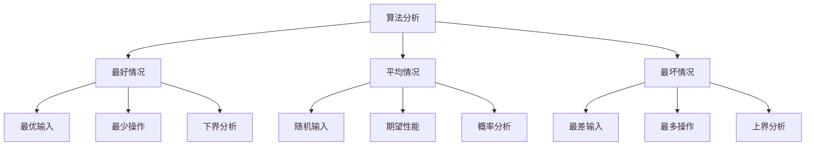

# 最坏最好情况分析

## 📖 核心概念

**最坏最好情况分析**是算法复杂度分析的重要组成部分。通过分析算法在不同输入情况下的性能表现，我们可以更好地理解算法的稳定性和适用场景。

### 🏗️ 情况分析框架



## 🔍 三种情况分析

### 情况对比表

| 情况类型 | 描述 | 分析方法 | 实际意义 | 示例 |
|----------|------|----------|----------|------|
| **最好情况** | 算法执行最少步骤 | 下界分析 | 理论最优性能 | 已排序数组的插入排序 |
| **平均情况** | 算法执行期望步骤 | 概率分析 | 实际性能预期 | 随机数组的快速排序 |
| **最坏情况** | 算法执行最多步骤 | 上界分析 | 性能保证 | 逆序数组的插入排序 |

### 具体算法分析

```cpp
// 插入排序的三种情况分析
void insertionSort(vector<int>& arr) {
    int n = arr.size();
    for (int i = 1; i < n; ++i) {
        int key = arr[i];
        int j = i - 1;
        
        // 内层循环的执行次数取决于数组的有序程度
        while (j >= 0 && arr[j] > key) {
            arr[j + 1] = arr[j];
            j--;
        }
        arr[j + 1] = key;
    }
}
```

## 📊 最好情况分析

### 最好情况特征

| 算法 | 最好情况 | 时间复杂度 | 空间复杂度 | 触发条件 |
|------|----------|------------|------------|----------|
| **插入排序** | 数组已排序 | O(n) | O(1) | 输入已有序 |
| **快速排序** | 每次划分平衡 | O(n log n) | O(log n) | 每次pivot为中位数 |
| **冒泡排序** | 数组已排序 | O(n) | O(1) | 输入已有序 |
| **归并排序** | 任意输入 | O(n log n) | O(n) | 总是稳定 |

### 最好情况示例

```cpp
// 线性搜索最好情况 - O(1)
int linearSearch(const vector<int>& arr, int target) {
    for (int i = 0; i < arr.size(); ++i) {
        if (arr[i] == target) {
            return i;  // 目标在第一个位置
        }
    }
    return -1;
}

// 二分搜索最好情况 - O(1)
int binarySearch(const vector<int>& arr, int target) {
    int left = 0, right = arr.size() - 1;
    
    while (left <= right) {
        int mid = left + (right - left) / 2;
        if (arr[mid] == target) {
            return mid;  // 目标在中间位置
        } else if (arr[mid] < target) {
            left = mid + 1;
        } else {
            right = mid - 1;
        }
    }
    return -1;
}
```

## 📈 平均情况分析

### 概率分析方法

```cpp
// 快速排序平均情况分析
class QuickSortAnalysis {
public:
    // 平均情况：O(n log n)
    void quickSort(vector<int>& arr, int left, int right) {
        if (left < right) {
            int pivotIndex = partition(arr, left, right);
            quickSort(arr, left, pivotIndex - 1);
            quickSort(arr, pivotIndex + 1, right);
        }
    }
    
private:
    int partition(vector<int>& arr, int left, int right) {
        int pivot = arr[right];
        int i = left - 1;
        
        for (int j = left; j < right; ++j) {
            if (arr[j] <= pivot) {
                i++;
                swap(arr[i], arr[j]);
            }
        }
        swap(arr[i + 1], arr[right]);
        return i + 1;
    }
};

// 哈希表平均情况分析
class HashTableAnalysis {
private:
    vector<list<pair<int, int>>> buckets;
    size_t bucketCount;
    
public:
    // 平均情况：O(1)
    void put(int key, int value) {
        size_t index = hash(key) % bucketCount;
        auto& bucket = buckets[index];
        
        // 平均情况下，每个桶的元素数量为 O(1)
        for (auto& pair : bucket) {
            if (pair.first == key) {
                pair.second = value;
                return;
            }
        }
        bucket.push_back({key, value});
    }
    
    // 平均情况：O(1)
    bool get(int key, int& value) {
        size_t index = hash(key) % bucketCount;
        auto& bucket = buckets[index];
        
        for (const auto& pair : bucket) {
            if (pair.first == key) {
                value = pair.second;
                return true;
            }
        }
        return false;
    }
};
```

### 期望值计算

```cpp
// 计算算法期望执行时间
class AlgorithmAnalysis {
public:
    // 线性搜索期望比较次数
    double expectedLinearSearchComparisons(int n) {
        // 期望比较次数 = (1 + 2 + ... + n) / n = (n + 1) / 2
        return (n + 1.0) / 2.0;
    }
    
    // 快速排序期望比较次数
    double expectedQuickSortComparisons(int n) {
        if (n <= 1) return 0;
        
        // 期望比较次数 = n * log(n) * 2 * ln(2)
        return n * log2(n) * 2 * log(2);
    }
    
    // 哈希表期望查找时间
    double expectedHashTableLookup(int n, int bucketCount) {
        // 期望查找时间 = 1 + n / (2 * bucketCount)
        return 1.0 + n / (2.0 * bucketCount);
    }
};
```

## 📉 最坏情况分析

### 最坏情况特征

| 算法 | 最坏情况 | 时间复杂度 | 空间复杂度 | 触发条件 |
|------|----------|------------|------------|----------|
| **插入排序** | 数组逆序 | O(n²) | O(1) | 输入完全逆序 |
| **快速排序** | 每次划分不平衡 | O(n²) | O(n) | 每次pivot为最值 |
| **冒泡排序** | 数组逆序 | O(n²) | O(1) | 输入完全逆序 |
| **归并排序** | 任意输入 | O(n log n) | O(n) | 总是稳定 |

### 最坏情况示例

```cpp
// 快速排序最坏情况 - O(n²)
class QuickSortWorstCase {
public:
    void quickSortWorstCase(vector<int>& arr, int left, int right) {
        if (left < right) {
            // 最坏情况：每次选择的pivot都是最大或最小值
            int pivotIndex = partition(arr, left, right);
            quickSortWorstCase(arr, left, pivotIndex - 1);
            quickSortWorstCase(arr, pivotIndex + 1, right);
        }
    }
    
private:
    int partition(vector<int>& arr, int left, int right) {
        // 选择最后一个元素作为pivot（可能造成最坏情况）
        int pivot = arr[right];
        int i = left - 1;
        
        for (int j = left; j < right; ++j) {
            if (arr[j] <= pivot) {
                i++;
                swap(arr[i], arr[j]);
            }
        }
        swap(arr[i + 1], arr[right]);
        return i + 1;
    }
};

// 哈希表最坏情况 - O(n)
class HashTableWorstCase {
private:
    vector<list<pair<int, int>>> buckets;
    size_t bucketCount;
    
public:
    // 最坏情况：所有元素都哈希到同一个桶
    void putWorstCase(int key, int value) {
        size_t index = hash(key) % bucketCount;
        auto& bucket = buckets[index];
        
        // 最坏情况：需要遍历整个链表
        for (auto& pair : bucket) {
            if (pair.first == key) {
                pair.second = value;
                return;
            }
        }
        bucket.push_back({key, value});
    }
};
```

## 🎯 情况分析应用

### 算法选择策略

```cpp
class AlgorithmSelector {
public:
    enum class InputType {
        RANDOM,      // 随机输入
        SORTED,      // 已排序输入
        REVERSE,     // 逆序输入
        PARTIAL      // 部分排序输入
    };
    
    string selectSortingAlgorithm(InputType inputType, size_t dataSize) {
        switch (inputType) {
            case InputType::SORTED:
                return "插入排序";  // 最好情况 O(n)
                
            case InputType::REVERSE:
                return "归并排序";  // 最坏情况 O(n log n)
                
            case InputType::RANDOM:
                if (dataSize < 50) {
                    return "插入排序";  // 小数据量
                } else {
                    return "快速排序";  // 平均情况 O(n log n)
                }
                
            case InputType::PARTIAL:
                return "归并排序";  // 稳定排序
                
            default:
                return "快速排序";
        }
    }
};
```

### 性能保证分析

```cpp
class PerformanceGuarantee {
public:
    // 分析算法性能保证
    struct PerformanceMetrics {
        double bestCase;
        double averageCase;
        double worstCase;
        double stability;  // 性能稳定性
    };
    
    PerformanceMetrics analyzeAlgorithm(const string& algorithmName) {
        PerformanceMetrics metrics;
        
        if (algorithmName == "插入排序") {
            metrics.bestCase = 1.0;      // O(n)
            metrics.averageCase = 0.5;   // O(n²)
            metrics.worstCase = 1.0;      // O(n²)
            metrics.stability = 0.8;      // 相对稳定
        } else if (algorithmName == "归并排序") {
            metrics.bestCase = 1.0;      // O(n log n)
            metrics.averageCase = 1.0;   // O(n log n)
            metrics.worstCase = 1.0;     // O(n log n)
            metrics.stability = 1.0;     // 完全稳定
        } else if (algorithmName == "快速排序") {
            metrics.bestCase = 0.8;      // O(n log n)
            metrics.averageCase = 0.9;   // O(n log n)
            metrics.worstCase = 0.3;      // O(n²)
            metrics.stability = 0.6;     // 不够稳定
        }
        
        return metrics;
    }
};
```

## 🔗 相关链接

- [[01-时间复杂度详解|时间复杂度]]
- [[02-空间复杂度详解|空间复杂度]]
- [[04-大O记号详解|大O记号]]

## 💡 情况分析要点

1. **最好情况**：提供算法性能下界
2. **平均情况**：反映实际使用性能
3. **最坏情况**：提供性能保证上界
4. **综合分析**：根据应用场景选择合适算法

---

*📝 分析提示：理解三种情况有助于选择最适合的算法和数据结构*
