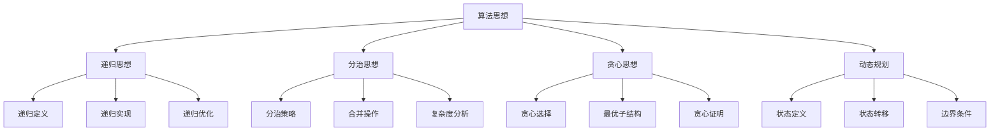

# 算法思想

## 📖 核心概念

**算法思想**是解决计算问题的基本方法和策略。掌握不同的算法思想，可以有效地解决各种复杂问题。

### 🏗️ 思想分类



## 🔧 递归思想

### 递归实现

```cpp
class RecursiveThinking {
public:
    // 阶乘递归
    static int factorial(int n) {
        if (n <= 1) return 1;
        return n * factorial(n - 1);
    }
    
    // 斐波那契递归
    static int fibonacci(int n) {
        if (n <= 1) return n;
        return fibonacci(n - 1) + fibonacci(n - 2);
    }
    
    // 汉诺塔递归
    static void hanoi(int n, char from, char to, char aux) {
        if (n == 1) {
            cout << "Move disk 1 from " << from << " to " << to << endl;
            return;
        }
        hanoi(n - 1, from, aux, to);
        cout << "Move disk " << n << " from " << from << " to " << to << endl;
        hanoi(n - 1, aux, to, from);
    }
    
    // 递归优化（记忆化）
    static int fibonacciMemo(int n, map<int, int>& memo) {
        if (n <= 1) return n;
        if (memo.find(n) != memo.end()) return memo[n];
        
        memo[n] = fibonacciMemo(n - 1, memo) + fibonacciMemo(n - 2, memo);
        return memo[n];
    }
};
```

## 🎯 分治思想

### 分治实现

```cpp
class DivideConquerThinking {
public:
    // 归并排序
    static void mergeSort(vector<int>& arr, int left, int right) {
        if (left < right) {
            int mid = left + (right - left) / 2;
            mergeSort(arr, left, mid);
            mergeSort(arr, mid + 1, right);
            merge(arr, left, mid, right);
        }
    }
    
    // 快速排序
    static void quickSort(vector<int>& arr, int low, int high) {
        if (low < high) {
            int pivotIndex = partition(arr, low, high);
            quickSort(arr, low, pivotIndex - 1);
            quickSort(arr, pivotIndex + 1, high);
        }
    }
    
    // 二分搜索
    static int binarySearch(const vector<int>& arr, int target, int left, int right) {
        if (left > right) return -1;
        
        int mid = left + (right - left) / 2;
        
        if (arr[mid] == target) return mid;
        if (arr[mid] > target) return binarySearch(arr, target, left, mid - 1);
        return binarySearch(arr, target, mid + 1, right);
    }
    
private:
    static void merge(vector<int>& arr, int left, int mid, int right) {
        vector<int> temp(right - left + 1);
        int i = left, j = mid + 1, k = 0;
        
        while (i <= mid && j <= right) {
            if (arr[i] <= arr[j]) {
                temp[k++] = arr[i++];
            } else {
                temp[k++] = arr[j++];
            }
        }
        
        while (i <= mid) temp[k++] = arr[i++];
        while (j <= right) temp[k++] = arr[j++];
        
        for (int i = 0; i < temp.size(); ++i) {
            arr[left + i] = temp[i];
        }
    }
    
    static int partition(vector<int>& arr, int low, int high) {
        int pivot = arr[high];
        int i = low - 1;
        
        for (int j = low; j < high; ++j) {
            if (arr[j] <= pivot) {
                swap(arr[++i], arr[j]);
            }
        }
        
        swap(arr[i + 1], arr[high]);
        return i + 1;
    }
};
```

## 📊 贪心思想

### 贪心实现

```cpp
class GreedyThinking {
public:
    // 活动选择问题
    static vector<pair<int, int>> activitySelection(vector<pair<int, int>>& activities) {
        sort(activities.begin(), activities.end(), 
             [](const pair<int, int>& a, const pair<int, int>& b) {
                 return a.second < b.second;
             });
        
        vector<pair<int, int>> result;
        int lastEnd = 0;
        
        for (const auto& activity : activities) {
            if (activity.first >= lastEnd) {
                result.push_back(activity);
                lastEnd = activity.second;
            }
        }
        
        return result;
    }
    
    // 硬币找零问题
    static vector<int> coinChange(vector<int>& coins, int amount) {
        sort(coins.rbegin(), coins.rend());
        vector<int> result;
        
        for (int coin : coins) {
            while (amount >= coin) {
                result.push_back(coin);
                amount -= coin;
            }
        }
        
        return amount == 0 ? result : vector<int>();
    }
    
    // 最小生成树（Kruskal）
    static vector<pair<int, int>> kruskalMST(vector<vector<int>>& edges, int n) {
        sort(edges.begin(), edges.end(), 
             [](const vector<int>& a, const vector<int>& b) {
                 return a[2] < b[2];
             });
        
        vector<int> parent(n);
        iota(parent.begin(), parent.end(), 0);
        
        vector<pair<int, int>> result;
        
        for (const auto& edge : edges) {
            int u = edge[0], v = edge[1];
            int rootU = findRoot(parent, u);
            int rootV = findRoot(parent, v);
            
            if (rootU != rootV) {
                result.push_back({u, v});
                parent[rootU] = rootV;
            }
        }
        
        return result;
    }
    
private:
    static int findRoot(vector<int>& parent, int x) {
        if (parent[x] != x) {
            parent[x] = findRoot(parent, parent[x]);
        }
        return parent[x];
    }
};
```

## 🎮 动态规划

### 动态规划实现

```cpp
class DynamicProgrammingThinking {
public:
    // 斐波那契数列
    static int fibonacciDP(int n) {
        if (n <= 1) return n;
        
        vector<int> dp(n + 1);
        dp[0] = 0;
        dp[1] = 1;
        
        for (int i = 2; i <= n; ++i) {
            dp[i] = dp[i - 1] + dp[i - 2];
        }
        
        return dp[n];
    }
    
    // 最长公共子序列
    static int longestCommonSubsequence(string text1, string text2) {
        int m = text1.length(), n = text2.length();
        vector<vector<int>> dp(m + 1, vector<int>(n + 1));
        
        for (int i = 1; i <= m; ++i) {
            for (int j = 1; j <= n; ++j) {
                if (text1[i - 1] == text2[j - 1]) {
                    dp[i][j] = dp[i - 1][j - 1] + 1;
                } else {
                    dp[i][j] = max(dp[i - 1][j], dp[i][j - 1]);
                }
            }
        }
        
        return dp[m][n];
    }
    
    // 0-1背包问题
    static int knapsack(vector<int>& weights, vector<int>& values, int capacity) {
        int n = weights.size();
        vector<vector<int>> dp(n + 1, vector<int>(capacity + 1));
        
        for (int i = 1; i <= n; ++i) {
            for (int w = 1; w <= capacity; ++w) {
                if (weights[i - 1] <= w) {
                    dp[i][w] = max(dp[i - 1][w], 
                                  dp[i - 1][w - weights[i - 1]] + values[i - 1]);
                } else {
                    dp[i][w] = dp[i - 1][w];
                }
            }
        }
        
        return dp[n][capacity];
    }
    
    // 最长递增子序列
    static int longestIncreasingSubsequence(vector<int>& nums) {
        vector<int> dp(nums.size(), 1);
        
        for (int i = 1; i < nums.size(); ++i) {
            for (int j = 0; j < i; ++j) {
                if (nums[j] < nums[i]) {
                    dp[i] = max(dp[i], dp[j] + 1);
                }
            }
        }
        
        return *max_element(dp.begin(), dp.end());
    }
};
```

## 🔗 相关链接

- [[01-数据结构本质|数据结构本质]]
- [[02-抽象数据模型|抽象数据模型]]
- [[03-复杂度分析|复杂度分析]]

## 💡 算法思想要点

1. **递归思想**：将问题分解为相同类型的子问题
2. **分治思想**：将问题分解为独立的子问题
3. **贪心思想**：每一步都做出局部最优选择
4. **动态规划**：通过状态转移解决重叠子问题

---

*📝 思想提示：掌握算法思想是解决复杂问题的关键，需要多练习和思考*
