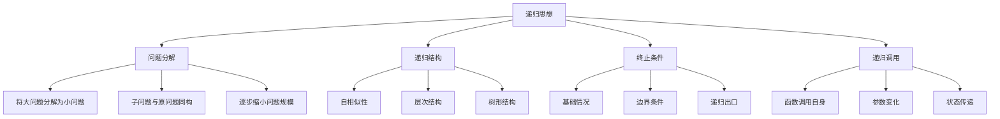

# 递归思想

## 📖 核心概念

**递归思想**是计算机科学中的核心概念，通过将复杂问题分解为相同类型的子问题来解决。递归是函数式编程和算法设计的重要基础。

### 🏗️ 递归思维框架



## 🔍 递归的基本要素

### 递归三要素

| 要素 | 描述 | 作用 | 示例 |
|------|------|------|------|
| **递归关系** | 问题与子问题的关系 | 定义如何分解问题 | f(n) = f(n-1) + f(n-2) |
| **基础情况** | 递归的终止条件 | 防止无限递归 | f(0) = 0, f(1) = 1 |
| **递归调用** | 函数调用自身 | 实现问题分解 | return fibonacci(n-1) + fibonacci(n-2) |

### 递归模板

```cpp
// 递归函数模板
ReturnType recursiveFunction(Parameters params) {
    // 1. 基础情况（终止条件）
    if (baseCase(params)) {
        return baseResult;
    }
    
    // 2. 递归关系（问题分解）
    // 将问题分解为更小的子问题
    SubProblem subProblem = decompose(params);
    
    // 3. 递归调用
    ReturnType subResult = recursiveFunction(subProblem);
    
    // 4. 结果合并
    return combineResult(subResult, params);
}
```

## 📊 经典递归问题

### 1. 斐波那契数列

```cpp
// 基础递归实现 - O(2^n)
int fibonacci(int n) {
    // 基础情况
    if (n <= 1) {
        return n;
    }
    
    // 递归关系
    return fibonacci(n - 1) + fibonacci(n - 2);
}

// 优化版本 - O(n)
int fibonacciOptimized(int n) {
    if (n <= 1) return n;
    
    int prev2 = 0, prev1 = 1;
    for (int i = 2; i <= n; ++i) {
        int current = prev1 + prev2;
        prev2 = prev1;
        prev1 = current;
    }
    return prev1;
}

// 记忆化递归 - O(n)
class FibonacciMemo {
private:
    unordered_map<int, int> memo;
    
public:
    int fibonacci(int n) {
        if (n <= 1) return n;
        
        if (memo.find(n) != memo.end()) {
            return memo[n];
        }
        
        memo[n] = fibonacci(n - 1) + fibonacci(n - 2);
        return memo[n];
    }
};
```

### 2. 阶乘计算

```cpp
// 递归实现
int factorial(int n) {
    // 基础情况
    if (n <= 1) {
        return 1;
    }
    
    // 递归关系
    return n * factorial(n - 1);
}

// 尾递归优化
int factorialTailRecursive(int n, int accumulator = 1) {
    if (n <= 1) {
        return accumulator;
    }
    
    return factorialTailRecursive(n - 1, n * accumulator);
}
```

### 3. 汉诺塔问题

```cpp
class HanoiTower {
public:
    void hanoi(int n, char from, char to, char aux) {
        // 基础情况
        if (n == 1) {
            cout << "Move disk 1 from " << from << " to " << to << endl;
            return;
        }
        
        // 递归关系
        // 1. 将n-1个盘子从from移动到aux
        hanoi(n - 1, from, aux, to);
        
        // 2. 将最大的盘子从from移动到to
        cout << "Move disk " << n << " from " << from << " to " << to << endl;
        
        // 3. 将n-1个盘子从aux移动到to
        hanoi(n - 1, aux, to, from);
    }
    
    void solve(int n) {
        hanoi(n, 'A', 'C', 'B');
    }
};
```

## 🌳 递归在数据结构中的应用

### 1. 树的遍历

```cpp
struct TreeNode {
    int val;
    TreeNode* left;
    TreeNode* right;
    TreeNode(int x) : val(x), left(nullptr), right(nullptr) {}
};

class TreeTraversal {
public:
    // 前序遍历 - 根左右
    void preorderTraversal(TreeNode* root) {
        if (root == nullptr) return;
        
        cout << root->val << " ";  // 访问根节点
        preorderTraversal(root->left);   // 遍历左子树
        preorderTraversal(root->right);  // 遍历右子树
    }
    
    // 中序遍历 - 左根右
    void inorderTraversal(TreeNode* root) {
        if (root == nullptr) return;
        
        inorderTraversal(root->left);     // 遍历左子树
        cout << root->val << " ";        // 访问根节点
        inorderTraversal(root->right);   // 遍历右子树
    }
    
    // 后序遍历 - 左右根
    void postorderTraversal(TreeNode* root) {
        if (root == nullptr) return;
        
        postorderTraversal(root->left);   // 遍历左子树
        postorderTraversal(root->right);  // 遍历右子树
        cout << root->val << " ";         // 访问根节点
    }
    
    // 计算树的高度
    int getHeight(TreeNode* root) {
        if (root == nullptr) return 0;
        
        int leftHeight = getHeight(root->left);
        int rightHeight = getHeight(root->right);
        
        return max(leftHeight, rightHeight) + 1;
    }
};
```

### 2. 链表操作

```cpp
struct ListNode {
    int val;
    ListNode* next;
    ListNode(int x) : val(x), next(nullptr) {}
};

class LinkedListRecursion {
public:
    // 递归反转链表
    ListNode* reverseList(ListNode* head) {
        // 基础情况
        if (head == nullptr || head->next == nullptr) {
            return head;
        }
        
        // 递归反转剩余部分
        ListNode* newHead = reverseList(head->next);
        
        // 反转当前节点
        head->next->next = head;
        head->next = nullptr;
        
        return newHead;
    }
    
    // 递归删除节点
    ListNode* removeElements(ListNode* head, int val) {
        if (head == nullptr) return nullptr;
        
        head->next = removeElements(head->next, val);
        
        if (head->val == val) {
            ListNode* next = head->next;
            delete head;
            return next;
        }
        
        return head;
    }
    
    // 递归查找节点
    ListNode* findNode(ListNode* head, int val) {
        if (head == nullptr) return nullptr;
        
        if (head->val == val) return head;
        
        return findNode(head->next, val);
    }
};
```

## 🎯 递归优化策略

### 1. 记忆化递归

```cpp
class Memoization {
private:
    unordered_map<int, int> memo;
    
public:
    // 记忆化斐波那契
    int fibonacci(int n) {
        if (n <= 1) return n;
        
        if (memo.find(n) != memo.end()) {
            return memo[n];
        }
        
        memo[n] = fibonacci(n - 1) + fibonacci(n - 2);
        return memo[n];
    }
    
    // 记忆化爬楼梯
    int climbStairs(int n) {
        if (n <= 2) return n;
        
        if (memo.find(n) != memo.end()) {
            return memo[n];
        }
        
        memo[n] = climbStairs(n - 1) + climbStairs(n - 2);
        return memo[n];
    }
};
```

### 2. 尾递归优化

```cpp
class TailRecursion {
public:
    // 尾递归阶乘
    int factorial(int n, int accumulator = 1) {
        if (n <= 1) return accumulator;
        return factorial(n - 1, n * accumulator);
    }
    
    // 尾递归求和
    int sum(int n, int accumulator = 0) {
        if (n <= 0) return accumulator;
        return sum(n - 1, accumulator + n);
    }
    
    // 尾递归数组求和
    int arraySum(const vector<int>& arr, int index = 0, int sum = 0) {
        if (index >= arr.size()) return sum;
        return arraySum(arr, index + 1, sum + arr[index]);
    }
};
```

### 3. 递归转迭代

```cpp
class RecursionToIteration {
public:
    // 递归转迭代 - 斐波那契
    int fibonacciIterative(int n) {
        if (n <= 1) return n;
        
        int prev2 = 0, prev1 = 1;
        for (int i = 2; i <= n; ++i) {
            int current = prev1 + prev2;
            prev2 = prev1;
            prev1 = current;
        }
        return prev1;
    }
    
    // 递归转迭代 - 阶乘
    int factorialIterative(int n) {
        int result = 1;
        for (int i = 2; i <= n; ++i) {
            result *= i;
        }
        return result;
    }
    
    // 递归转迭代 - 树遍历
    void preorderIterative(TreeNode* root) {
        if (root == nullptr) return;
        
        stack<TreeNode*> stk;
        stk.push(root);
        
        while (!stk.empty()) {
            TreeNode* node = stk.top();
            stk.pop();
            
            cout << node->val << " ";
            
            if (node->right) stk.push(node->right);
            if (node->left) stk.push(node->left);
        }
    }
};
```

## 🔗 相关链接

- [[02-分治策略|分治策略]]
- [[03-贪心算法|贪心算法]]
- [[04-动态规划思想|动态规划]]

## 💡 递归思想要点

1. **问题分解**：将复杂问题分解为相同类型的子问题
2. **基础情况**：定义递归的终止条件
3. **递归关系**：建立问题与子问题的关系
4. **优化策略**：使用记忆化、尾递归等优化技术

---

*📝 思维提示：递归是分治算法的基础，掌握递归思维有助于解决复杂问题*