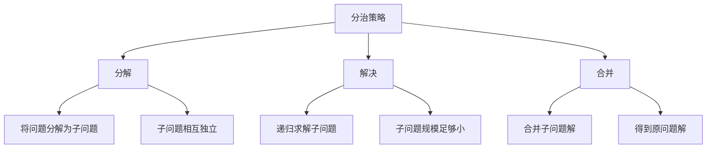

# 分治策略

## 📖 核心概念

**分治策略**是一种重要的算法设计思想，通过将复杂问题分解为更小的子问题，递归求解，然后将子问题的解合并得到原问题的解。

### 🏗️ 分治策略特征



## 🔧 分治算法实现

### 归并排序

```cpp
class MergeSort {
private:
    void merge(vector<int>& arr, int left, int mid, int right) {
        int n1 = mid - left + 1;
        int n2 = right - mid;
        
        vector<int> leftArr(n1), rightArr(n2);
        
        for (int i = 0; i < n1; ++i) {
            leftArr[i] = arr[left + i];
        }
        for (int j = 0; j < n2; ++j) {
            rightArr[j] = arr[mid + 1 + j];
        }
        
        int i = 0, j = 0, k = left;
        
        while (i < n1 && j < n2) {
            if (leftArr[i] <= rightArr[j]) {
                arr[k] = leftArr[i];
                i++;
            } else {
                arr[k] = rightArr[j];
                j++;
            }
            k++;
        }
        
        while (i < n1) {
            arr[k] = leftArr[i];
            i++;
            k++;
        }
        
        while (j < n2) {
            arr[k] = rightArr[j];
            j++;
            k++;
        }
    }
    
public:
    void mergeSort(vector<int>& arr, int left, int right) {
        if (left < right) {
            int mid = left + (right - left) / 2;
            
            mergeSort(arr, left, mid);
            mergeSort(arr, mid + 1, right);
            
            merge(arr, left, mid, right);
        }
    }
    
    void sort(vector<int>& arr) {
        mergeSort(arr, 0, arr.size() - 1);
    }
};
```

### 快速排序

```cpp
class QuickSort {
private:
    int partition(vector<int>& arr, int low, int high) {
        int pivot = arr[high];
        int i = low - 1;
        
        for (int j = low; j < high; ++j) {
            if (arr[j] < pivot) {
                i++;
                swap(arr[i], arr[j]);
            }
        }
        
        swap(arr[i + 1], arr[high]);
        return i + 1;
    }
    
public:
    void quickSort(vector<int>& arr, int low, int high) {
        if (low < high) {
            int pivotIndex = partition(arr, low, high);
            
            quickSort(arr, low, pivotIndex - 1);
            quickSort(arr, pivotIndex + 1, high);
        }
    }
    
    void sort(vector<int>& arr) {
        quickSort(arr, 0, arr.size() - 1);
    }
};
```

### 二分搜索

```cpp
class BinarySearch {
public:
    int binarySearch(vector<int>& arr, int target) {
        int left = 0, right = arr.size() - 1;
        
        while (left <= right) {
            int mid = left + (right - left) / 2;
            
            if (arr[mid] == target) {
                return mid;
            } else if (arr[mid] < target) {
                left = mid + 1;
            } else {
                right = mid - 1;
            }
        }
        
        return -1;
    }
    
    int binarySearchRecursive(vector<int>& arr, int target, int left, int right) {
        if (left > right) {
            return -1;
        }
        
        int mid = left + (right - left) / 2;
        
        if (arr[mid] == target) {
            return mid;
        } else if (arr[mid] < target) {
            return binarySearchRecursive(arr, target, mid + 1, right);
        } else {
            return binarySearchRecursive(arr, target, left, mid - 1);
        }
    }
};
```

## 🎯 分治算法应用

### 最大子数组和

```cpp
class MaximumSubarray {
private:
    struct SubarrayResult {
        int sum;
        int start;
        int end;
        
        SubarrayResult(int s, int st, int e) : sum(s), start(st), end(e) {}
    };
    
    SubarrayResult maxCrossingSubarray(vector<int>& arr, int low, int mid, int high) {
        int leftSum = INT_MIN;
        int sum = 0;
        int maxLeft = mid;
        
        for (int i = mid; i >= low; --i) {
            sum += arr[i];
            if (sum > leftSum) {
                leftSum = sum;
                maxLeft = i;
            }
        }
        
        int rightSum = INT_MIN;
        sum = 0;
        int maxRight = mid + 1;
        
        for (int j = mid + 1; j <= high; ++j) {
            sum += arr[j];
            if (sum > rightSum) {
                rightSum = sum;
                maxRight = j;
            }
        }
        
        return SubarrayResult(leftSum + rightSum, maxLeft, maxRight);
    }
    
    SubarrayResult maxSubarray(vector<int>& arr, int low, int high) {
        if (low == high) {
            return SubarrayResult(arr[low], low, high);
        }
        
        int mid = low + (high - low) / 2;
        
        SubarrayResult left = maxSubarray(arr, low, mid);
        SubarrayResult right = maxSubarray(arr, mid + 1, high);
        SubarrayResult cross = maxCrossingSubarray(arr, low, mid, high);
        
        if (left.sum >= right.sum && left.sum >= cross.sum) {
            return left;
        } else if (right.sum >= left.sum && right.sum >= cross.sum) {
            return right;
        } else {
            return cross;
        }
    }
    
public:
    int findMaximumSubarray(vector<int>& arr) {
        SubarrayResult result = maxSubarray(arr, 0, arr.size() - 1);
        return result.sum;
    }
};
```

### 最近点对问题

```cpp
class ClosestPair {
private:
    struct Point {
        double x, y;
        
        Point(double x, double y) : x(x), y(y) {}
        
        double distance(const Point& other) const {
            return sqrt((x - other.x) * (x - other.x) + (y - other.y) * (y - other.y));
        }
    };
    
    double bruteForce(vector<Point>& points, int start, int end) {
        double minDist = DBL_MAX;
        
        for (int i = start; i < end; ++i) {
            for (int j = i + 1; j < end; ++j) {
                minDist = min(minDist, points[i].distance(points[j]));
            }
        }
        
        return minDist;
    }
    
    double closestInStrip(vector<Point>& strip, double minDist) {
        sort(strip.begin(), strip.end(), [](const Point& a, const Point& b) {
            return a.y < b.y;
        });
        
        for (int i = 0; i < strip.size(); ++i) {
            for (int j = i + 1; j < strip.size() && (strip[j].y - strip[i].y) < minDist; ++j) {
                minDist = min(minDist, strip[i].distance(strip[j]));
            }
        }
        
        return minDist;
    }
    
    double closestUtil(vector<Point>& points, int start, int end) {
        if (end - start <= 3) {
            return bruteForce(points, start, end);
        }
        
        int mid = start + (end - start) / 2;
        Point midPoint = points[mid];
        
        double leftDist = closestUtil(points, start, mid);
        double rightDist = closestUtil(points, mid, end);
        
        double minDist = min(leftDist, rightDist);
        
        vector<Point> strip;
        for (int i = start; i < end; ++i) {
            if (abs(points[i].x - midPoint.x) < minDist) {
                strip.push_back(points[i]);
            }
        }
        
        return min(minDist, closestInStrip(strip, minDist));
    }
    
public:
    double findClosestPair(vector<Point>& points) {
        sort(points.begin(), points.end(), [](const Point& a, const Point& b) {
            return a.x < b.x;
        });
        
        return closestUtil(points, 0, points.size());
    }
};
```

## 📊 分治算法分析

### 时间复杂度分析

```cpp
class DivideConquerAnalysis {
public:
    static void analyzeTimeComplexity() {
        cout << "Divide and Conquer Time Complexity Analysis:" << endl;
        cout << "==========================================" << endl;
        
        cout << "1. Merge Sort:" << endl;
        cout << "   - Recurrence: T(n) = 2T(n/2) + O(n)" << endl;
        cout << "   - Time Complexity: O(n log n)" << endl;
        cout << "   - Space Complexity: O(n)" << endl;
        
        cout << "2. Quick Sort:" << endl;
        cout << "   - Average Case: T(n) = 2T(n/2) + O(n)" << endl;
        cout << "   - Time Complexity: O(n log n)" << endl;
        cout << "   - Worst Case: O(n²)" << endl;
        
        cout << "3. Binary Search:" << endl;
        cout << "   - Recurrence: T(n) = T(n/2) + O(1)" << endl;
        cout << "   - Time Complexity: O(log n)" << endl;
        
        cout << "4. Maximum Subarray:" << endl;
        cout << "   - Recurrence: T(n) = 2T(n/2) + O(n)" << endl;
        cout << "   - Time Complexity: O(n log n)" << endl;
        
        cout << "5. Closest Pair:" << endl;
        cout << "   - Recurrence: T(n) = 2T(n/2) + O(n)" << endl;
        cout << "   - Time Complexity: O(n log n)" << endl;
    }
    
    static void analyzeSpaceComplexity() {
        cout << "Divide and Conquer Space Complexity Analysis:" << endl;
        cout << "=============================================" << endl;
        
        cout << "1. Merge Sort:" << endl;
        cout << "   - Space Complexity: O(n)" << endl;
        cout << "   - Reason: Need temporary arrays for merging" << endl;
        
        cout << "2. Quick Sort:" << endl;
        cout << "   - Space Complexity: O(log n)" << endl;
        cout << "   - Reason: Recursion stack depth" << endl;
        
        cout << "3. Binary Search:" << endl;
        cout << "   - Space Complexity: O(log n)" << endl;
        cout << "   - Reason: Recursion stack depth" << endl;
        
        cout << "4. Maximum Subarray:" << endl;
        cout << "   - Space Complexity: O(log n)" << endl;
        cout << "   - Reason: Recursion stack depth" << endl;
        
        cout << "5. Closest Pair:" << endl;
        cout << "   - Space Complexity: O(n)" << endl;
        cout << "   - Reason: Need to store strip points" << endl;
    }
};
```

### 分治策略优化

```cpp
class DivideConquerOptimization {
public:
    static void optimizeMergeSort(vector<int>& arr) {
        // 小数组使用插入排序
        if (arr.size() <= 10) {
            insertionSort(arr);
            return;
        }
        
        // 使用归并排序
        MergeSort mergeSort;
        mergeSort.sort(arr);
    }
    
    static void insertionSort(vector<int>& arr) {
        for (int i = 1; i < arr.size(); ++i) {
            int key = arr[i];
            int j = i - 1;
            
            while (j >= 0 && arr[j] > key) {
                arr[j + 1] = arr[j];
                j--;
            }
            
            arr[j + 1] = key;
        }
    }
    
    static void optimizeQuickSort(vector<int>& arr) {
        // 三数取中法选择基准
        if (arr.size() <= 1) return;
        
        int low = 0, high = arr.size() - 1;
        int mid = low + (high - low) / 2;
        
        // 选择中位数作为基准
        if (arr[low] > arr[mid]) swap(arr[low], arr[mid]);
        if (arr[low] > arr[high]) swap(arr[low], arr[high]);
        if (arr[mid] > arr[high]) swap(arr[mid], arr[high]);
        
        swap(arr[mid], arr[high]);
        
        QuickSort quickSort;
        quickSort.sort(arr);
    }
    
    static void optimizeBinarySearch(vector<int>& arr, int target) {
        // 插值搜索优化
        int left = 0, right = arr.size() - 1;
        
        while (left <= right && target >= arr[left] && target <= arr[right]) {
            if (left == right) {
                if (arr[left] == target) {
                    cout << "Found at index: " << left << endl;
                    return;
                }
                break;
            }
            
            int pos = left + ((target - arr[left]) * (right - left)) / (arr[right] - arr[left]);
            
            if (arr[pos] == target) {
                cout << "Found at index: " << pos << endl;
                return;
            } else if (arr[pos] < target) {
                left = pos + 1;
            } else {
                right = pos - 1;
            }
        }
        
        cout << "Target not found" << endl;
    }
};
```

## 🎮 分治算法应用

### 1. 分治算法测试

```cpp
class DivideConquerTest {
public:
    static void testMergeSort() {
        cout << "Testing Merge Sort:" << endl;
        cout << "==================" << endl;
        
        vector<int> arr = {64, 34, 25, 12, 22, 11, 90};
        cout << "Original array: ";
        for (int num : arr) cout << num << " ";
        cout << endl;
        
        MergeSort mergeSort;
        mergeSort.sort(arr);
        
        cout << "Sorted array: ";
        for (int num : arr) cout << num << " ";
        cout << endl;
    }
    
    static void testQuickSort() {
        cout << "Testing Quick Sort:" << endl;
        cout << "==================" << endl;
        
        vector<int> arr = {64, 34, 25, 12, 22, 11, 90};
        cout << "Original array: ";
        for (int num : arr) cout << num << " ";
        cout << endl;
        
        QuickSort quickSort;
        quickSort.sort(arr);
        
        cout << "Sorted array: ";
        for (int num : arr) cout << num << " ";
        cout << endl;
    }
    
    static void testBinarySearch() {
        cout << "Testing Binary Search:" << endl;
        cout << "=====================" << endl;
        
        vector<int> arr = {1, 3, 5, 7, 9, 11, 13, 15};
        cout << "Array: ";
        for (int num : arr) cout << num << " ";
        cout << endl;
        
        BinarySearch binarySearch;
        int target = 7;
        int result = binarySearch.binarySearch(arr, target);
        
        if (result != -1) {
            cout << "Target " << target << " found at index: " << result << endl;
        } else {
            cout << "Target " << target << " not found" << endl;
        }
    }
    
    static void testMaximumSubarray() {
        cout << "Testing Maximum Subarray:" << endl;
        cout << "========================" << endl;
        
        vector<int> arr = {-2, 1, -3, 4, -1, 2, 1, -5, 4};
        cout << "Array: ";
        for (int num : arr) cout << num << " ";
        cout << endl;
        
        MaximumSubarray maxSubarray;
        int result = maxSubarray.findMaximumSubarray(arr);
        
        cout << "Maximum subarray sum: " << result << endl;
    }
    
    static void testClosestPair() {
        cout << "Testing Closest Pair:" << endl;
        cout << "====================" << endl;
        
        vector<ClosestPair::Point> points = {
            {2, 3}, {12, 30}, {40, 50}, {5, 1}, {12, 10}, {3, 4}
        };
        
        cout << "Points: ";
        for (const auto& point : points) {
            cout << "(" << point.x << ", " << point.y << ") ";
        }
        cout << endl;
        
        ClosestPair closestPair;
        double result = closestPair.findClosestPair(points);
        
        cout << "Closest pair distance: " << result << endl;
    }
};
```

### 2. 分治算法性能测试

```cpp
class DivideConquerPerformanceTest {
public:
    static void performanceTest() {
        cout << "Divide and Conquer Performance Test:" << endl;
        cout << "===================================" << endl;
        
        vector<int> sizes = {1000, 10000, 100000};
        
        for (int size : sizes) {
            cout << "Testing with " << size << " elements:" << endl;
            
            vector<int> arr(size);
            for (int i = 0; i < size; ++i) {
                arr[i] = rand() % 1000;
            }
            
            // 测试归并排序
            vector<int> arr1 = arr;
            auto start = chrono::high_resolution_clock::now();
            MergeSort mergeSort;
            mergeSort.sort(arr1);
            auto end = chrono::high_resolution_clock::now();
            auto duration = chrono::duration_cast<chrono::milliseconds>(end - start);
            cout << "Merge Sort: " << duration.count() << " ms" << endl;
            
            // 测试快速排序
            vector<int> arr2 = arr;
            start = chrono::high_resolution_clock::now();
            QuickSort quickSort;
            quickSort.sort(arr2);
            end = chrono::high_resolution_clock::now();
            duration = chrono::duration_cast<chrono::milliseconds>(end - start);
            cout << "Quick Sort: " << duration.count() << " ms" << endl;
            
            cout << endl;
        }
    }
};
```

## 🔗 相关链接

- [[01-算法思想|算法思想]]
- [[03-贪心算法|贪心算法]]
- [[04-动态规划思想|动态规划思想]]

## 💡 分治策略要点

1. **分解**: 将问题分解为更小的子问题
2. **解决**: 递归求解子问题
3. **合并**: 将子问题的解合并得到原问题的解
4. **优化**: 通过优化减少递归开销

---

*📝 分治提示：分治策略是解决复杂问题的重要方法，掌握分治思想对算法设计很重要*
